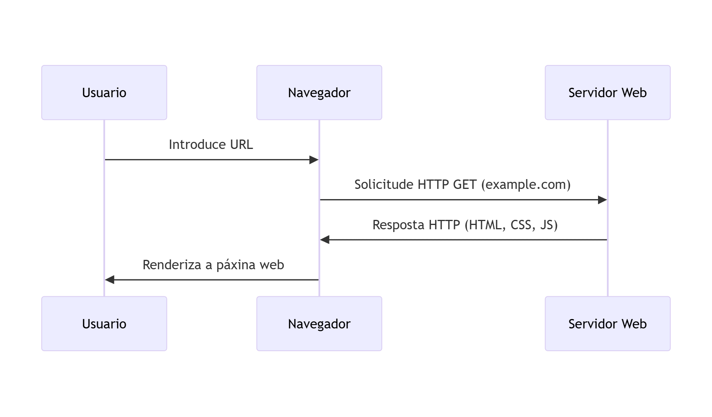
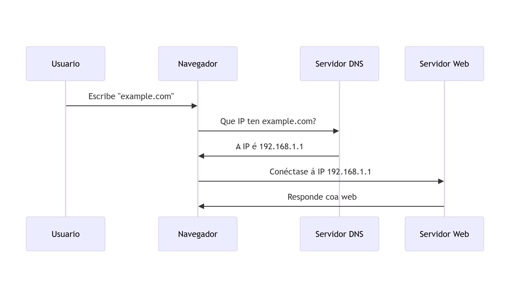
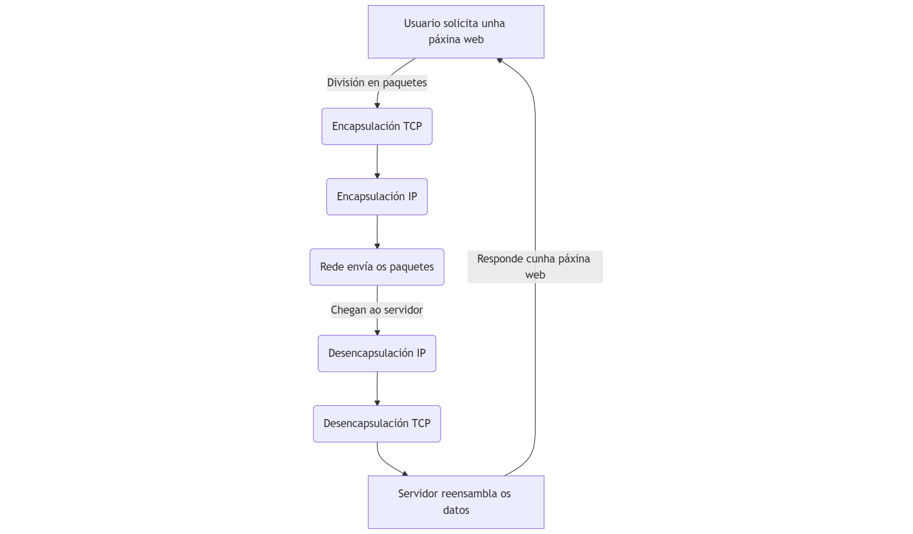
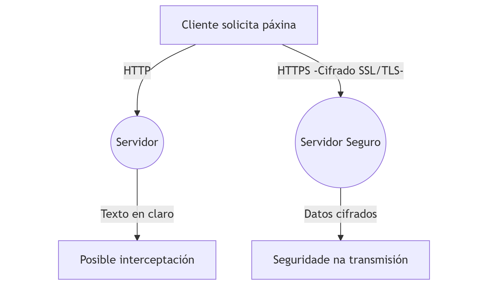

# {{ $frontmatter.title }}

> Internet non é só unha rede de comunicación, senón un **sistema distribuído a gran escala**, deseñado para ser descentralizado, tolerante a fallos e escalable. O seu funcionamento baséase na interconexión de múltiples redes autónomas (AS – *Autonomous Systems*) que cooperan mediante protocolos estandarizados

## 1. Internet: A infraestrutura global de comunicación

Internet é unha **rede global de redes interconectadas** que permite a comunicación entre dispositivos de todo o mundo. Para comprender como funciona unha páxina web —e como isto condiciona o traballo dun deseñador ou desenvolvedor web— é necesario coñecer os elementos básicos que fan posible esta comunicación.

### Arquitectura e modelos de comunicación

Internet é unha infraestrutura distribuída de comunicación, baseada na interconexión de redes autónomas que empregan un conxunto común de protocolos. Non existe un control central: o seu funcionamento depende de acordos entre provedores de servizo, mecanismos de routing dinámico e estándares abertos.

Desde o punto de vista do desenvolvemento web, é fundamental entender esta arquitectura para deseñar aplicacións eficientes, escalables e seguras.

As compoñentes principais de Internet son:

- **Servidores e clientes**: Internet está baseada nun modelo **cliente-servidor**[^1]. O cliente (normalmente un navegador web ou unha aplicación) realiza unha solicitude, e o servidor encárgase de procesala e devolver unha resposta.
- **Protocolos de comunicación**: Internet funciona grazas a un conxunto de normas chamadas **protocolos**. A transmisión de datos realízase seguindo dito conxunto de normas ou protocolos, que permiten que dispositivos moi diferentes poidan entenderse entre si. Os protocolos máis relevantes para o desenvolvemento web son:
  - **HTTP/HTTPS**: Para a transferencia de recursos web (contidos que fornecen o despregue de paxinas web).
  - **DNS**: Para traducir nomes de dominio en direccións IP.
  - **TCP/IP**: Para o transporte, o control da comunicación e o enrutamento dos datos entre dispositivos.
- **Redes de transporte**: Internet está formada por redes interconectadas, onde os datos divídense en paquetes que viaxan a través de rutas dinámicas ata chegar ao seu destino.

## 2. Como viaxan os datos por Internet

Cando un usuario introduce un enderezo web no navegador, poñense en marcha unha serie de procesos encadeados:

1. **Resolución DNS**: O nome de dominio (por exemplo, `example.com`) tradúcese nunha dirección IP grazas a un servidor DNS.
2. **Establecemento de conexión**: O navegador envía unha solicitude - inicia unha conexión- ao servidor correspondente, empregando o protocolo TCP/IP.
3. **Solicitude e resposta HTTP/HTTPS**: A solicitude HTTP (ou HTTPS, no caso dunha conexión segura) viaxa ao servidor, que responde enviando os recursos necesarios (HTML, CSS, JavaScript, imaxes...) ao cliente.
4. **Procesamento no cliente**: O navegador interpreta o código dos arquivos recibidos e *renderiza* - representa- a páxina na pantalla do usuario.

## 3. Condicionantes para o desenvolvemento e deseño web

O funcionamento de Internet inflúe directamente no traballo dun deseñador e desenvolvedor web en varios aspectos:

- **Optimización do rendemento**: Como os datos viaxan en paquetes a través da rede, unha web mal optimizada pode provocar tempos de carga elevados e esa web pode tardar máis en cargarse. Por iso empréganse técnicas como a minificación de arquivos, o uso de caché ou a carga diferida de recursos.
- **Seguridade**: Internet é unha rede aberta, polo que a seguridade resulta fundamental. O uso de HTTPS, políticas de seguridade de contidos (CSP) ou a validación de datos do lado do servidor son prácticas imprescindibles.
- **Compatibilidade e accesibilidade**: Como os usuarios poden acceder desde dispositivos e conexións moi diversas, o deseño web debe ser responsivo e accesible, garantindo unha boa experiencia a todas as persoas.
- **SEO e indexación**: Para que un sitio web sexa atopado e sexa visible nos motores de busca, debe estar optimizado para motores de busca, o que require coñecer como os bots percorren, analizan e indexan os contidos.

## 4. Resumo

Internet condiciona a práctica do desenvolvemento web en múltiples niveis, desde a elección de tecnoloxías ata a forma en que se optimiza a carga e a seguridade das páxinas. Comprender como funciona Internet permite tomar mellores decisións técnicas e de deseño, mellorar o rendemento e a seguridade das aplicacións web e crear produtos máis eficientes e accesibles. Estes coñecementos constitúen a base sobre a que se constrúe todo o desenvolvemento web moderno.

---

A continuación se mostran algúns esquemas que poden axudarche a entender, de xeito resumido, como funciona Internet:

------

### 1️⃣ Modelo Cliente-Servidor

<!--```mermaid
sequenceDiagram
    participant Usuario
    participant Navegador
    participant Servidor Web

    Usuario>>Navegador: Introduce URL
    Navegador>Servidor Web: Solicitude HTTP GET (example.com)
    Servidor Web>Navegador: Resposta HTTP (HTML, CSS, JS)
    Navegador>Usuario: Renderiza a páxina web
```-->


**Explicación**: O usuario introduce unha URL, o navegador fai unha solicitude ao servidor, este responde con contido, e finalmente o navegador mostra a páxina.

------

### 2️⃣ Resolución DNS (conversión de nome de dominio en IP)

<!--```mermaid
sequenceDiagram
    participant Usuario
    participant Navegador
    participant Servidor DNS
    participant Servidor Web

    Usuario->>Navegador: Escribe "example.com"
    Navegador->>Servidor DNS: Que IP ten example.com?
    Servidor DNS->>Navegador: A IP é 192.168.1.1
    Navegador->>Servidor Web: Conéctase á IP 192.168.1.1
    Servidor Web->>Navegador: Responde coa web
```-->


**Explicación**: O navegador primeiro precisa saber a IP asociada ao dominio e consulta un servidor DNS antes de establecer conexión co servidor web.

------

### 3️⃣ Como viaxan os datos en paquetes TCP/IP

<!--```mermaid
graph TD
    A[Usuario solicita unha páxina web] ->|División en paquetes| B(Encapsulación TCP)
    B -> C(Encapsulación IP)
    C -> D(Rede envía os paquetes)
    D ->|Chegan ao servidor| E(Desencapsulación IP)
    E -> F(Desencapsulación TCP)
    F -> G[Servidor reensambla os datos]
    G ->|Responde cunha páxina web| A
```-->



**Explicación**: Os datos divídense en paquetes, viaxan pola rede encapsulados segundo os protocolos (estándares de transporte) TCP/IP e despois son recompostos polo servidor.

------

### 4️⃣ HTTP vs. HTTPS (Seguridade na web)

<!--```mermaid
graph TD
    A[Cliente solicita páxina] ->|HTTP| B((Servidor))
    B ->|Texto en claro| C[Posible interceptación]
    A ->|HTTPS -Cifrado SSL/TLS-| D((Servidor Seguro))
    D ->|Datos cifrados| E[Seguridade na transmisión]
```-->


**Explicación**: HTTP envía datos en cru, mentres que HTTPS cifra as comunicacións, evitando ataques como o "[Man-in-the-Middle](https://www.incibe.es/empresas/blog/el-ataque-del-man-middle-empresa-riesgos-y-formas-evitarlo)".

------

[^1]: Debido a evolución do medio, este modelo foi evoluindo e introducindo novas variantes como as arquitecturas baseadas en **APIs**, **microservizos** e **edge computing**. Ao tempo tamén aumentaron os tipos de ***clientes***, agora xa non limitados ao navegador, como: *SPAs*, aplicacións móbiles, IoT, etc.

------

DAW🧊2026