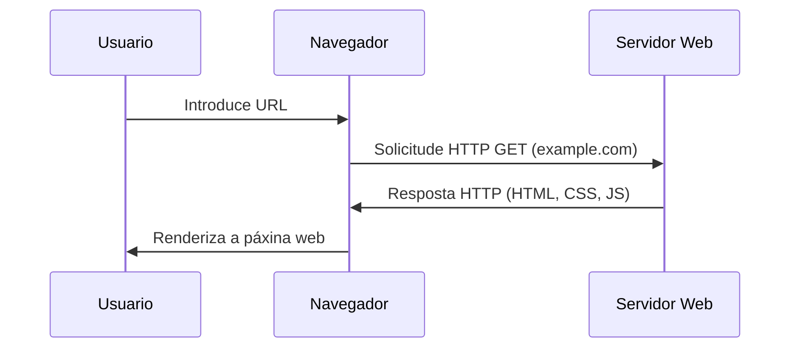
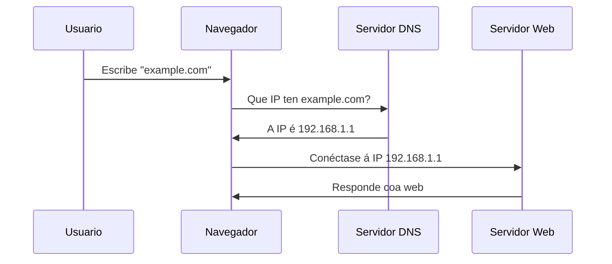
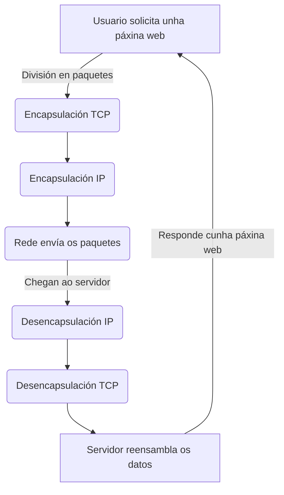
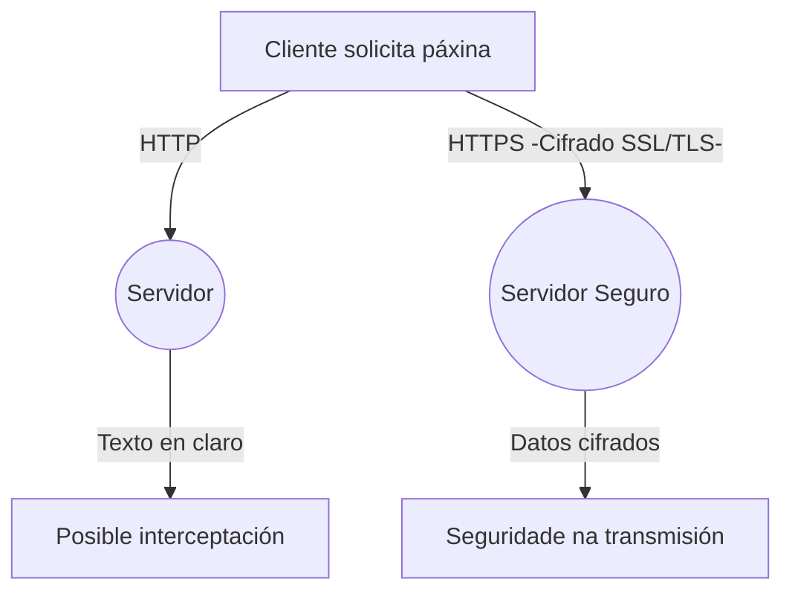

# {{ $frontmatter.title }}

## 1. Internet: A infraestrutura global de comunicación

Internet é unha rede global de redes interconectadas que permite a comunicación entre dispositivos de todo o mundo. Para entender como funciona e como condiciona o traballo dun deseñador e desenvolvedor web, é fundamental comprender os seus compoñentes principais:

- **Servidores e clientes**: Internet está baseada nun modelo **cliente-servidor**. O cliente (o navegador web ou outra aplicación) solicita información a un servidor, que a procesa e devolve unha resposta.
- **Protocolos de comunicación**: Internet funciona grazas a un conxunto de normas chamadas **protocolos**, que permiten a transmisión de datos de forma estandarizada. Os máis relevantes para o desenvolvemento web son:
  - **HTTP/HTTPS**: Para a transferencia de páxinas web.
  - **DNS**: Para traducir nomes de dominio en direccións IP.
  - **TCP/IP**: Para o *enrutamento* e transmisión de datos entre dispositivos.
- **Redes de transporte**: Internet está formada por redes interconectadas, onde os datos viaxan en paquetes a través de rutas dinámicas para chegar ao seu destino.

## 2. Como viaxan os datos por Internet

Cando un usuario introduce un enderezo web no navegador, ocorren varios procesos:

1. **Resolución DNS**: O nome de dominio (por exemplo, `example.com`) tradúcese nunha dirección IP mediante un servidor DNS.
2. **Establecemento de conexión**: O navegador envía unha solicitude ao servidor correspondente, establecendo unha conexión TCP/IP.
3. **Solicitude e resposta HTTP/HTTPS**: A solicitude HTTP (ou HTTPS, que é segura) viaxa ao servidor, que responde enviando os arquivos necesarios (HTML, CSS, JavaScript, imaxes...).
4. **Procesamento no cliente**: O navegador interpreta o código recibido e renderiza a páxina na pantalla.

## 3. Condicionantes para o desenvolvemento e deseño web

O funcionamento de Internet inflúe directamente no traballo dun deseñador e desenvolvedor web en varios aspectos:

- **Optimización do rendemento**: Como os datos viaxan en paquetes, un sitio web mal optimizado pode tardar máis en cargarse. Isto implica empregar técnicas como a minificación de arquivos, a caché ou a carga diferida de imaxes.
- **Seguridade**: Como Internet é unha rede aberta, a seguridade é clave. O uso de HTTPS, políticas de seguridade de contidos (CSP) e prácticas como a validación do lado do servidor son fundamentais.
- **Compatibilidade e accesibilidade**: Como os usuarios poden acceder desde diferentes dispositivos e conexións, o deseño web debe ser responsivo e accesible, garantindo unha boa experiencia para todos.
- **SEO e indexación**: Para que un sitio web sexa atopado, debe estar optimizado para motores de busca, o que require coñecer como os bots de Google percorren e indexan a web.

## 4. Resumo

Internet condiciona a práctica do desenvolvemento web en múltiples niveis, desde a elección de tecnoloxías ata a forma en que se optimiza a carga e seguridade das páxinas. Coñecer os fundamentos do seu funcionamento axuda a tomar decisións máis eficientes e a crear produtos mellor adaptados ás necesidades dos usuarios.

---

A continuación se mostran algúns esquemas que poden axudarche a entender, de xeito resumido, como funciona Internet:

------

### 1️⃣ Modelo Cliente-Servidor

**Explicación**: O usuario introduce unha URL, o navegador fai unha solicitude ao servidor, este responde con contido, e finalmente o navegador mostra a páxina.

------

### 2️⃣ Resolución DNS (conversión de nome de dominio en IP)

**Explicación**: O navegador primeiro precisa saber a IP asociada ao dominio e consulta un servidor DNS antes de establecer conexión co servidor web.

------

### 3️⃣ Como viaxan os datos en paquetes TCP/IP

**Explicación**: Os datos divídense en paquetes, viaxan pola rede encapsulados segundo os protocolos (estándares de transporte) TCP/IP e despois son recompostos polo servidor.

------

### 4️⃣ HTTP vs. HTTPS (Seguridade na web)

**Explicación**: HTTP envía datos en cru, mentres que HTTPS cifra as comunicacións, evitando ataques como o "[Man-in-the-Middle](https://www.incibe.es/empresas/blog/el-ataque-del-man-middle-empresa-riesgos-y-formas-evitarlo)".

------

DAW🧊2025