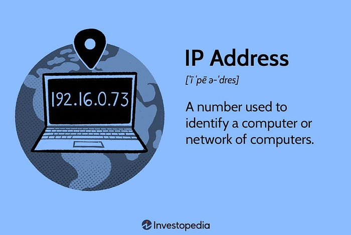
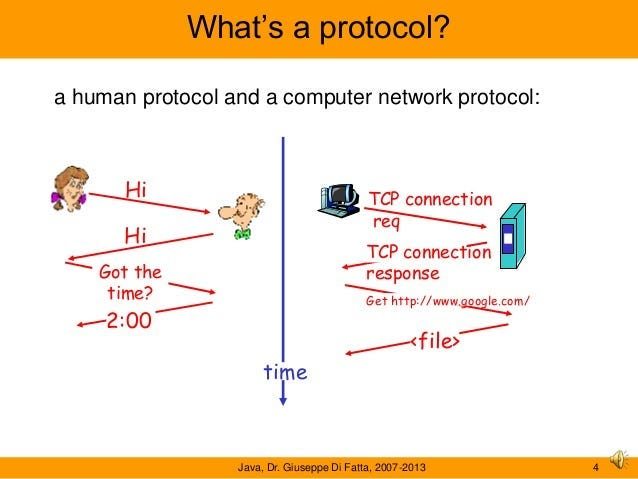
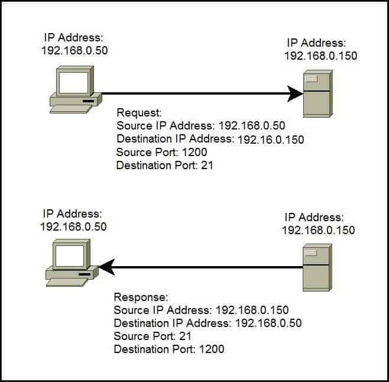
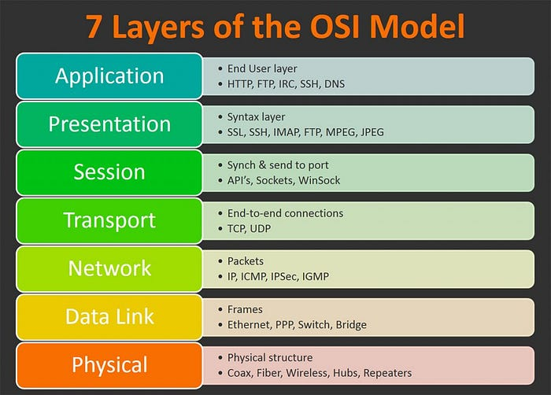
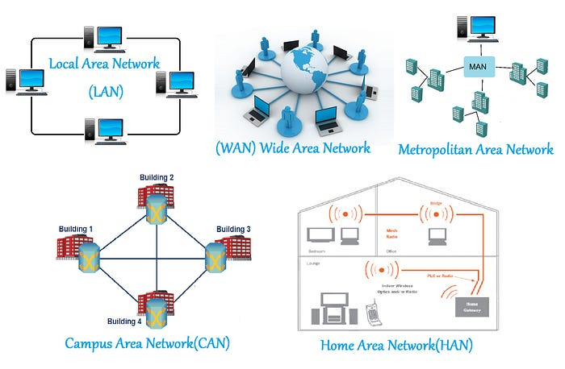
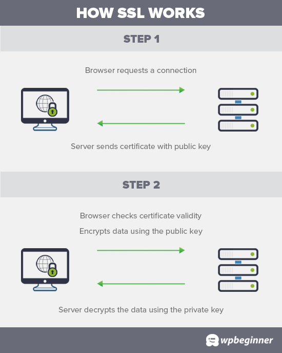

# {{ $frontmatter.title }}

No ámbito dinámico do desenvolvemento full-stack, é indispensable comprender os fundamentos da rede. ***A rede constitúe a columna vertebral de calquera interacción dixital, permitindo unha comunicación perfecta entre dispositivos, servidores e aplicacións\*** . Tanto se es un programador incipiente como un programador experimentado, comprender os conceptos básicos da rede é primordial. Esta publicación de blog ten como obxectivo desmitificar os elementos esenciais da rede para desenvolvedores de pila completa, proporcionando unha base sólida para a súa viaxe no panorama dixital.

REDES

## **1. Comprensión dos conceptos básicos:**

Na súa esencia, a rede implica **o intercambio de datos entre dispositivos a través dun medio común**. Engloba diversos conceptos, como:

**Enderezos IP:** cada dispositivo conectado a unha rede ten un identificador único chamado enderezo IP, que permite que os datos sexan encamiñados ao destino correcto.

Enderezo IP

**Protocolos:** os protocolos de rede como TCP/IP (Transmission Control Protocol/Internet Protocol) definen regras para a transmisión de datos, garantindo unha comunicación fiable entre as redes.

Protocolo

**Portos:** os portos actúan como puntos finais para a comunicación nunha rede. Son esenciais para identificar servizos específicos que se executan nun dispositivo.

Portos

## **2. O modelo OSI:**

O modelo OSI (Open Systems Interconnection) é un **marco conceptual usado para comprender as interaccións de rede** . Divídese en sete capas, cada unha delas cumpre funcións específicas:

Capas OSI

- **Capa física**: Ocúpase de conexións físicas e dispositivos de hardware. 
- **Capa de enlace de datos**: garante a transmisión sen erros entre os nodos adxacentes dunha rede.
- **Capa de rede**: Xestiona o enrutamento e o enderezo lóxico, permitindo que os datos se transfiran desde a orixe ao destino a través de diferentes redes. 
- **Capa de transporte**: céntrase na comunicación de extremo a extremo, garantindo a integridade dos datos e a recuperación de erros.
- **Capa de sesión**: establece, mantén e finaliza conexións entre aplicacións en diferentes dispositivos. *
- **Capa de presentación**: Responsable da tradución, cifrado e compresión dos datos, garantindo a compatibilidade entre os distintos sistemas.
- **Capa de aplicación**: ofrece servizos de rede directamente aos usuarios finais ou ás aplicacións.

---

## **3. Tipos de Redes:**

Comprender os diferentes tipos de redes é fundamental para os desenvolvedores de pila completa. Estes inclúen:

Tipos de Redes

- **LAN (Rede de área local):** limitada a unha pequena área xeográfica, como unha casa, oficina ou campus.
- **WAN (Wide Area Network):** Abarca unha gran área xeográfica e a miúdo conecta varias LAN.
- **MAN (Metropolitan Area Network):** conecta varias redes de área local dentro dunha cidade ou campus específico, permitindo comunicacións de alta velocidade nunha ampla área xeográfica.
- **CAN (Campus Area Network):** conecta redes de área local dentro dunha área xeográfica específica, permitindo unha comunicación eficiente e compartir recursos.
- **HAN (Home Area Network):** conecta dispositivos dixitais dentro dunha casa, permitindo a comunicación e compartir recursos como acceso a Internet, impresoras e arquivos multimedia entre varios dispositivos.
- **Internet:** unha rede global que conecta millóns de dispositivos en todo o mundo.
- **Intranet:** rede privada dentro dunha organización, accesible só para usuarios autorizados.

## **4. Protocolos web:**

Os desenvolvedores de pila completa - full-stack- traballan con frecuencia con protocolos web como **HTTP (Protocolo de transferencia de hipertexto) e HTTPS (HTTP Secure)** . Estes protocolos permiten o intercambio de datos na World Wide Web e son vitais para crear aplicacións web sensibles e seguras.

## **5. Problemas de seguridade:**

Comprender a seguridade da rede é primordial. Conceptos como **os cortalumes, o cifrado e os protocolos de capa de sockets seguros (SSL)** xogan un papel importante na protección dos datos durante a transmisión.

Capa SSL

> ***Lembra**:*
>
> *No multifacético mundo do desenvolvemento full-stack, as redes constitúen a base sobre a que se constrúen aplicacións innovadoras. Ao comprender os conceptos básicos de enderezos IP, protocolos, modelo OSI, tipos de redes, protocolos web e medidas de seguridade, os desenvolvedores poden crear aplicacións robustas, seguras e escadables. A medida que afondas nas complexidades do desenvolvemento full-stack, recorda que unha boa comprensión das redes sempre será a túa luz orientadora no panorama dixital.*

---

<small>*Tradución aproximada do artigo publicado por [Kalai](https://medium.com/@kalaiaravinth5555?source=post_page---byline--3a7f78934b13--------------------------------) para [Medium](https://medium.com/@kalaiaravinth5555/demystifying-networking-basics-for-full-stack-development-3a7f78934b13)*</small>  