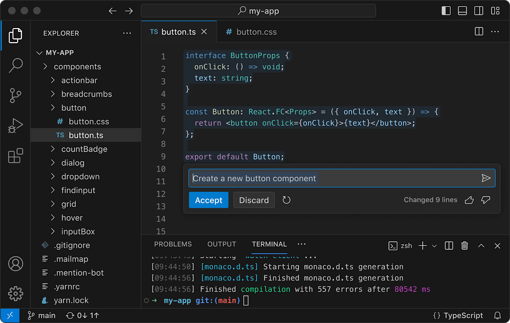
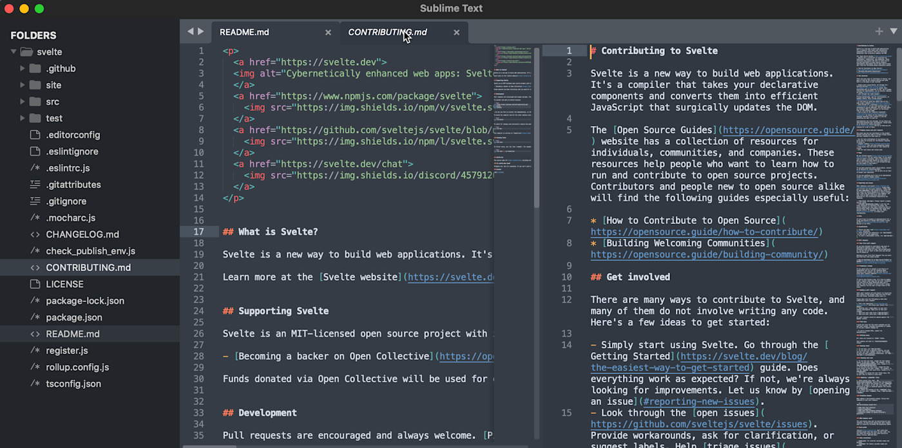
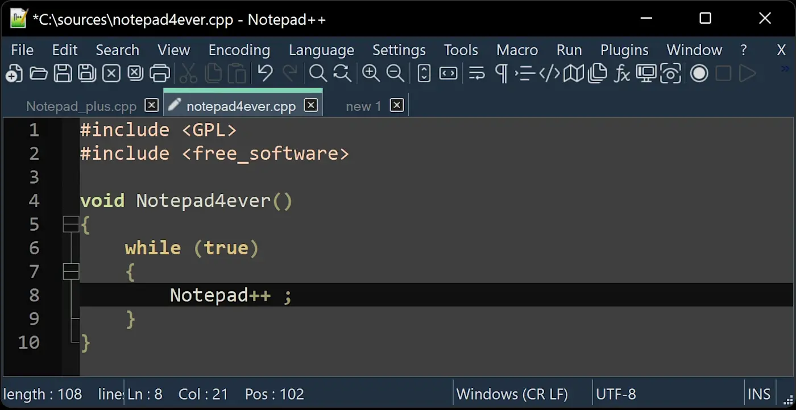
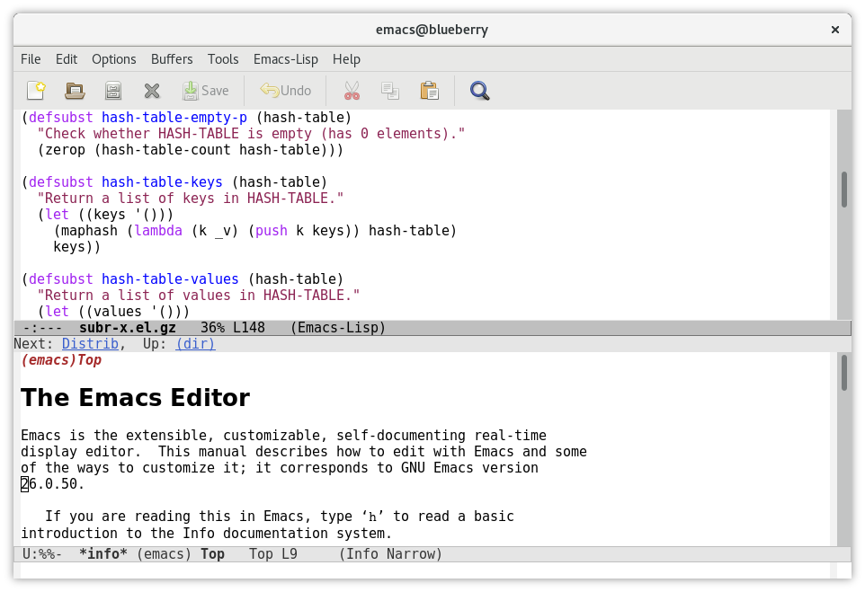
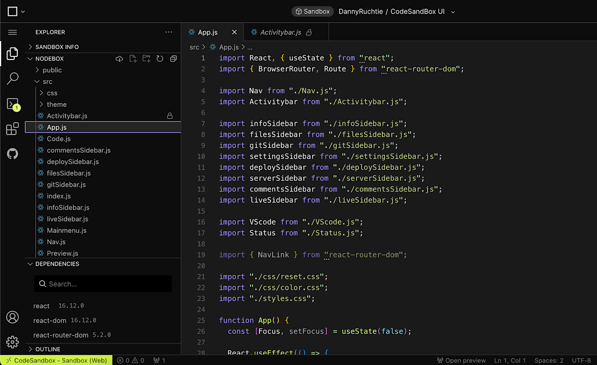
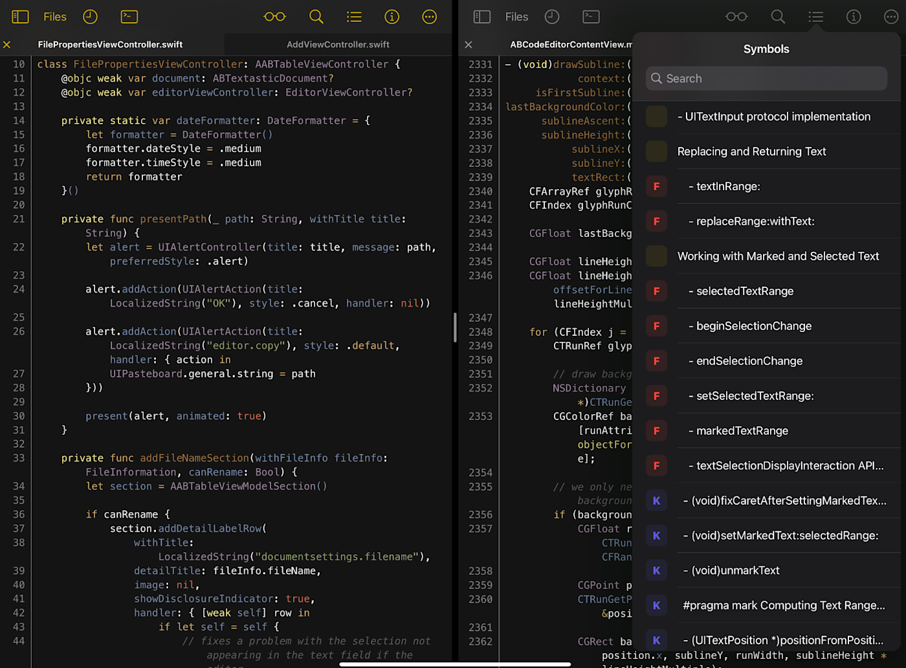
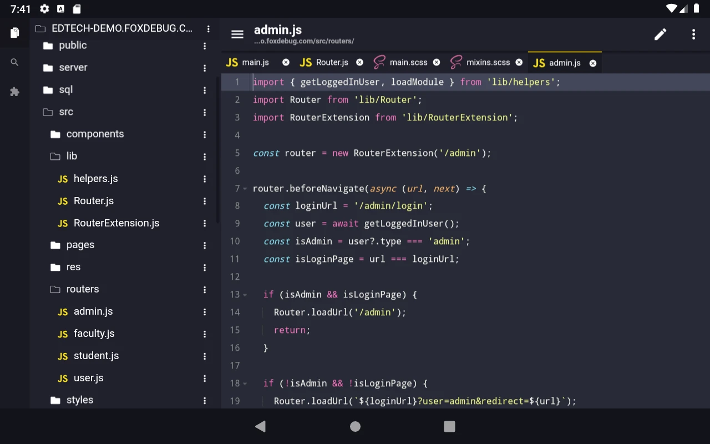
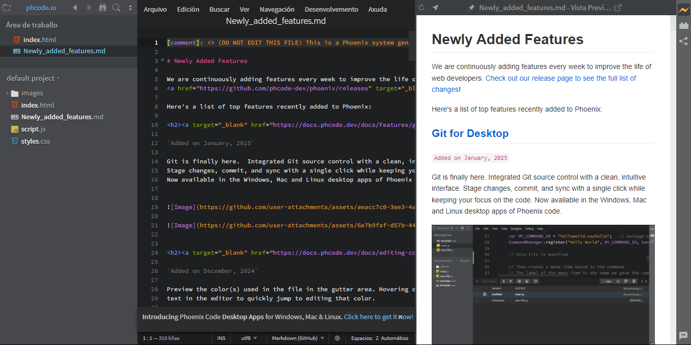

# {{ $frontmatter.title }}

Os editores de código son ferramentas que os programadores e desenvolvedores web empregan para escribir e editar código.

En realidade estes editores son editores de texto non enriquecido, o que permite que poidamos escribir neles calquera tipo de código, na linguaxe que queiramos - html, css, js, php, sass, c,...-. Co paso do tempo estes editores melloraron a forma de editar código e ampliaron espectacularmente as súas capacidades. Aínda así se diferencian de entornas de desenvolvemento do tipo IDE en que son máis persoalizables e ofrecen maior liberdade nos modelos de configuración.

## Funcións para buscar nun editor de código gratuíto

Cando se trata de escoller un editor de código, hai aproximadamente tantas opcións para escoller como linguaxes de programación. Ao seleccionar un editor de código gratuíto, é importante ter en conta un conxunto de funcións que mellorarán a súa eficiencia e experiencia de codificación. Aquí tes **as características clave para buscar** :

- **Resaltado de sintaxe**: esta función mostra o seu código en diferentes cores e fontes segundo a categoría de termos. Isto é esencial xa que fai que ler e escribir código sexa máis intuitivo e axuda a identificar erros máis rapidamente.
- **Autocompletado**: a miúdo denominado IntelliSense, o autocompletado predice os nomes de funcións, variables e outros identificadores mentres escribes, aforrando tempo e reducindo os erros tipográficos.
- **Detección de erros**: a detección de erros en tempo real axúdache a atopar e corrixir problemas no teu código mentres escribes, acelerando significativamente o proceso de depuración.
- **Integración de control de versións**: a compatibilidade con sistemas de control de versións como Git permítelle xestionar os cambios de código directamente no editor, simplificando o fluxo de traballo.
- **Personalizabilidade**: un bo editor de código debe ser altamente personalizable, o que lle permite axustar a interface, os atallos e a funcionalidade para adaptarse ás súas preferencias.
- **Extensibilidade**: busca un editor cun ecosistema vibrante de complementos ou extensións. Isto permítelle engadir novas funcionalidades e integrarse con outras ferramentas e linguaxes.
- **Compatibilidade con varios linguaxes**: asegúrate de que o editor admita as linguaxes de programación que utilizas agora ou planeas usar no futuro.
- **Compatibilidade entre plataformas**: considera se o editor de código é compatible con diferentes sistemas operativos se pensas traballar en Windows, macOS ou Linux.
- **Características do entorno de desenvolvemento integrado (IDE)**: algúns editores de código gratuíto inclúen funcións similares aos IDE, como ferramentas de depuración e un explorador de arquivos, que poden ser beneficiosos para os teus proxectos.
- **Comunidade e soporte**: unha comunidade forte pode proporcionar soporte adicional, complementos e actualizacións que garanten a lonxevidade e a mellora continua do editor.

Ao priorizar estas funcións, podes escoller un editor de código gratuíto que non só se adapte ás túas necesidades actuais, senón que tamén apoie o teu crecemento como programador.

## Ferramentas de edición de código a considerar

- [Visual Studio Code](https://code.visualstudio.com/) considerado o mellor e máis completo editor de código
- [PhoenixCode](https://phcode.io/#/home) o substituto de Brackets, sinxelo e poderoso. ideal para iniciarte na edición de código 
- [SublimeText](https://www.sublimetext.com/) para un rendemento lixeiro
- [Notepad++](https://notepad-plus-plus.org/) para tarefas básicas de codificación
- [GNU Emacs](https://www.gnu.org/software/emacs/) para unha ampla funcionalidade
- [CodeSandbox](https://codesandbox.io/) para a edición de código baseada no navegador
- [Textastic](https://www.textasticapp.com/) para codificar en dispositivos iOS
- [Acode](https://acode.app/) para codificar en dispositivos Android

### [Código de Visual Studio](https://code.visualstudio.com/) (Windows, macOS, Debian)

*Fonte da imaxe: [VS Code](https://code.visualstudio.com/)*

**Pros de Visual Studio Code:**

- Pode ser tan complexo como necesites
- Ampla gama de extensións
- Ferramentas de depuración e Git integradas

**Contras de Visual Studio Code:**

- Pode ser abrumador para os principiantes de codificación
- O rendemento sofre coas extensións en execución

Visual Studio Code (VS Code para abreviar) é un editor de código *moi* popular desenvolvido por Microsoft. É gratuíto, [de código aberto](https://zapier.com/blog/what-is-open-source-software/) , e hai moitas posibilidades de que os teus amigos programadores cho recomenden. 

A versatilidade é o forte de VS Code. Funcionará en case calquera cousa e pode manexar todas as principais linguaxes de programación. Aínda que hai certos editores de código deseñados especificamente para unha linguaxe (por exemplo, Java ou [Python](https://zapier.com/blog/python-automation/) ), VS Code é un cabalo de batalla completo que pode afrontar calquera tipo de tarefas. Se o teu ambiente de desenvolvemento é variable, este tipo de versatilidade é recomendable. 

Aínda que VS Code pode ser tan complexo como queiras, é un paquete bastante compacto listo para usar: ten soporte integrado para JavaScript, TypeScript, CSS e HTML, ademais de Git e ferramentas de depuración. Podes engadir máis linguaxes e funcións a través dos miles de extensións dispoñibles no [Visual Studio Marketplace](https://marketplace.visualstudio.com/vscode) (como o AI Copilot de GitHub, por exemplo, que completa o código automaticamente e ofrece suxestións baseadas en preguntas de linguaxe natural). 

Os principiantes beneficiaranse de VS Code IntelliSense, unha ferramenta de completado de código integrada que tamén ofrece información sobre parámetros e listas de membros. Pero debido á súa natureza altamente configurable, VS Code pode ser abrumador para os novatos en codificación en comparación cos editores depurados. Tamén require bastante RAM e almacenamento, especialmente se  activas varias das súas extensións ao tempo. Se buscas unha ferramenta con poucas necesidades de procesamento podes considerar [Notepad++](https://zapier.com/blog/best-code-editor/#notepad) ou [Sublime Text](https://zapier.com/blog/best-code-editor/#sublime) no seu lugar.

**Prezo de Visual Studio Code:** gratuíto

### [Sublime Text](https://www.sublimetext.com/) (Windows, macOS, Linux)

*Fonte da imaxe: [Sublime Text](https://www.sublimetext.com/)*

**Pros do texto sublime:**

- Rendemento rápido e lixeiro
- Codificación de cores para cada elemento do código
- Funcionalidade de busca

**Contras do texto sublime:**

- Conxunto limitado de funcións predeterminadas 
- A versión gratuíta ten anuncios emerxentes

Sublime Text é moi lixeiro. Executase moi rápido, funciona sen problemas e non consume moitos recursos do teu ordenador. Posúe tamén un rico ecosistema de complementos. Entón, aínda que é máis pequeno e lixeiro que VS Code, non é menos capaz ou simple. 

En realidade é un editor de código moi veloz. Incluso se traballas con arquivos grandes, queres un software que poida abrilos sen quedar atascado, iso é algo que Sublime Text fai perfectamente. 

Pero para equipar a Sublime Text coa funcionalidade de depuración, a integración de GitHub, a vista previa de Markdown e practicamente todas as outras funcións avanzadas que se te ocorran, terás que buscar complementos. Este conxunto de funcións predeterminado non é necesariamente un inconveniente, pero debes ter en conta que comezarás cos conceptos básicos. Afortunadamente, os complementos son fáciles de atopar e instalar co [Control de paquetes](https://packagecontrol.io/) .

Aínda que Sublime Text é tecnicamente gratuíto, solicitarache que compres unha licenza de tres anos por 99 dólares. Non hai límite de tempo para o plan "gratuíto", pero se non compras a licenza, prepárate para que un anuncio apareza unha e outra vez, cando menos o esperes, pedíndoche que compres unha licenza ou que actualices a unha nova versión.

**Prezos Sublime Text:** ofrece plan gratuíto; A licenza de 3 anos pódese mercar por 99 dólares

### [Notepad++](https://notepad-plus-plus.org/) (Windows)

*Fonte da imaxe: [Notepad++](https://notepad-plus-plus.org/)*

**Pros de Notepad++:**

- Abre arquivos inmediatamente
- Admite unha ampla gama de tipos de arquivos e linguaxes de programación
- A función de gardado automático evita que perdas traballo

**Contras de Notepad++:**

- Non hai funcións de detección de erros nin de formato de código
- Interface de usuario datada

Notepad++ é un editor de código exclusivo de Windows que foi gratuíto desde o seu lanzamento en 2003. Agora, millóns de descargas despois, aínda é unha ferramenta útil para tarefas básicas de codificación ou [para escribir notas rápidas](https://zapier.com/blog/automate-note-taking/) . (Despois de todo chámase Bloc de notas). 

Se Sublime Text se considera lixeiro, Notepad++ é practicamente ingrávido. A última versión, a 8.7.6, pesa moi pouco e o seu uso da CPU tamén é impresionantemente baixo. A compensación aquí é que ten funcións bastante rudimentarias e menos opcións de extensión que ferramentas máis completas como VS Code ou SublimeText. Tampouco poderás abrir arquivos de texto de máis de 2 GB, algo que debes ter en conta se traballas con bases de código moi pesadas. 

A pesar de carecer dalgunhas *campás e asubíos*, Notepad++ aínda admite uns 90 linguaxes de programación, xunto co resaltado de sintaxe, o dobramento de sintaxe e o autocompletado para cada un deles. E se o teu linguaxe non é compatible, podes engadilo ti mesmo. Notepad ++ tamén é eloxiado pola súa función de gardado automático, que garda todos os arquivos e pestanas que abres automaticamente aínda que pechas a xanela (ou se o teu dispositivo falla). 

Notepad++ probablemente non será a túa primeira opción para traballos de desenvolvemento complexos, pero é unha ferramenta imprescindible para editar códigos rápidos, tomar notas e abrir pequenos arquivos. Desafortunadamente, só funciona de forma nativa en Windows.

**Prezo de Notepad++:** gratuíto

### [GNU Emacs](https://www.gnu.org/software/emacs/) (Windows, macOS, Linux)

*Fonte da imaxe: [GNU](https://www.gnu.org/software/emacs/)*

**Pros de GNU Emacs:**

- Pódese usar como editor de texto, rastreador de proxectos e ferramenta organizativa
- Altamente configurable
- Amplo apoio e recursos comunitarios

**Contras de GNU Emacs:**

- Curva de aprendizaxe moi pronunciada
- Interface obsoleta

No mundo da codificación, GNU Emacs é coñecido por ser incriblemente personalizable e incriblemente difícil de aprender. Algúns usuarios mesmo din que dominar Emacs é un proceso de por vida. Pero aqueles que estean dispostos a dar o paso acceden a un poderoso marco de edición de código cunha gran variedade de casos de uso. 

GNU Emacs pode ser un editor de código, pero tamén pode ser un IDE (entorno de desenvolvemento integrado), unha ferramenta de xestión de proxectos, un sistema operativo, un cliente de correo electrónico, un navegador de bases de datos… Parece un cliché, pero Emacs é realmente o que se codifique para que sexa. Isto requirirá unha comprensión firme da linguaxe de programación Lisp e *moito* tempo dedicado á lectura de documentación. Pode ser unha ferramenta marabillosamente versátil se tes tempo para aprender os seus pormenores, ou tamén podes optar por usalo só para editar código.

Emacs existe desde mediados dos anos 70, e GNU Emacs é a versión máis popular (que aínda recibe actualizacións na actualidade). Así, aínda que a curva de aprendizaxe é pronunciada, hai moitas guías de usuario e recursos dispoñibles en liña para axudarche. Probablemente, os principiantes aínda queiran evitalo, xa que está dirixido a veteranos da programación que queren sacar o máximo proveito do seu editor de texto.

**Prezo de GNU Emacs:** gratuíto

### [CodeSandbox](https://codesandbox.io/) (Web)

*Fonte da imaxe: [CodeSandbox](https://codesandbox.io/)*

**Pros de CodeSandbox:**

- Facilita a codificación en directo colaborativa
- Ofrece modelos de código para deseño web
- Non se precisa instalación nin configuración

**Contras de CodeSandbox:**

- É máis lento que os editores que non son na nube
- A versión gratuíta ten funcións limitadas

A maioría dos editores de código son programas que descargas no teu ordenador ou dispositivo móbil. CodeSandbox ofrece unha alternativa: un editor de navegador baseado na nube deseñado para codificación en directo e colaborativa. Pense niso como Google Docs para desenvolvedores. Calquera código no que traballes pódese compartir cos teus compañeiros de traballo e poden revisalo, editalo e comentalo sen descargar ningún software. 

CodeSandbox tamén conta cunha función de vista previa en directo moi útil, que che mostra a ti (e aos teus colaboradores) as actualizacións da aplicación ou do sitio web no que estás a traballar en tempo real. Isto convérteo nunha ferramenta ideal para, por exemplo, instrutores de programación que queren avaliar o código dos seus estudantes en tempo real ou un xestor de contratación que avalía o traballo dun candidato.

Ademais, CodeSandbox ofrece unha variedade de modelos de código para darche unha vantaxe no deseño web e outros proxectos. Se ningún dos modelos oficiais che gusta, podes crear outros personalizados e compartilos cos membros do equipo.

O modelo baseado na nube carga máis lentamente que os editores de código locais e non podes usalo sen conexión a Internet. Os programadores que necesitan un ambiente de desenvolvemento altamente configurable probablemente queiran seguir usando opcións locais como VS Code ou GNU Emacs, pero CodeSandbox segue sendo unha opción sólida para os equipos que valoran a colaboración.

**Prezos de CodeSandbox:** ofrece un plan gratuíto; desde $ 12/mes/espazo de traballo para o plan Pro

### [Textastic](https://www.textasticapp.com/iphone.html) (iOS, iPadOS, macOS)

*Fonte da imaxe: [Textastic](https://www.textasticapp.com/)*

**Pros de Textatic:**

- Sincroniza arquivos entre iPhone, iPad e Mac
- Resaltado de sintaxe para máis de 80 linguaxes
- Intégrase con Git a través da aplicación Working Copy

**Contras de Textatic:**

- As versións de macOS e iOS son compras separadas
- Funcionalidade limitada en comparación cos editores de código de escritorio

Ás veces, cómpre facer un pouco de codificación en calquera lugar e é posible que non teñas sempre o teu portátil a man. Se es un usuario de iPhone, Textastic pode ser o que estás a buscar para xestionar tarefas básicas de codificación. 

Digo básico, pero esta aplicación ten un gran conxunto de funcións, incluíndo o resaltado de sintaxe para máis de 80 linguaxes, o autocompletado de código, un terminal SSH integrado e soporte para teclados externos. Aínda que non competirá cos editores de código completos que se executan en Windows, macOS ou Linux, conseguirache polo menos unha parte do camiño (e creo que é bastante impresionante para unha aplicación para iPhone).

Podes usar Textastic coa aplicación cliente Git Working Copy para traballar con repositorios Git locais ou usar a aplicación arquivos para acceder a cartafoles doutros dispositivos iOS ou macOS e Dropbox. Non poderá abrir todos os formatos de arquivo (arquivos Twee e SugarCube, por exemplo), pero é compatible con case outros 100. 

Teña en conta que, a diferenza de moitos editores de código en PC e Mac, Textastic non ofrece unha versión gratuíta nin de proba. Podes descargalo para iPhone ou iPad por 9,99 dólares na App Store e, se queres sincronizar cun dispositivo macOS, esa versión custaráche 8,99 dólares adicionais. Só asegúrate de que Textastic se adapte aos teus casos de uso antes de abrir a túa carteira.

**Prezo de Textastic:** 9,99 dólares para a versión para iPhone ou iPad; 8,99 dólares para a versión para Mac

### [Acode](https://acode.app/) (Android)

*Fonte da imaxe: [Acode](https://acode.app/)*

**Pros de Acode:**

- Altamente extensible con 144 complementos 
- Resaltado de sintaxe para máis de 100 linguaxes
- Explorador de arquivos na aplicación 

**Acode contra:**

- Pode ter erros despois das actualizacións
- A versión gratuíta móstrache anuncios

Se queres o máis parecido a VS Code no teu dispositivo Android, considera Acode. Gañou máis dun millón de descargas desde o seu lanzamento en 2019 e aínda hoxe recibe actualizacións completas. 

Aínda que non competirá en todas as métricas co software de escritorio, Acode ten unha extensa biblioteca de complementos con case 150 opcións (e contando). Estes complementos permítenche facer cousas como activar un modo de vista previa en directo, integrarse con GitHub, emular un terminal ou interactuar cun asistente de IA. 

Extensións aparte, Acode ten o que todo editor de código necesita, móbil ou non: resaltado de sintaxe para máis de 100 linguaxes de programación, compatibilidade con FTP/SFTP, interface e atallos personalizables e ferramentas de depuración. Incluso ten un navegador de arquivos integrado para que non teñas que abrir unha aplicación separada. 

As novas funcións engádense regularmente, pero vale a pena mencionar que algúns usuarios experimentan erros e fallos despois de descargar actualizacións. Aínda que os erros poden frear os teus plans de codificación móbiles, a aplicación segue recibindo axustes e correccións regulares. (A versión máis recente publicouse só uns días antes de escribir isto.) 

Podes descargar unha versión gratuíta de Acode para o teu teléfono, tableta ou Chromebook Android, pero mostraranse anuncios que che solicitan que actualices á versión Pro, o que che custará 3,99 dólares. 

**Prezo de Acode:** versión gratuíta dispoñible; 3,99 $ para a versión Pro

#### [Phoenix Code](https://phcode.io/#/home) (Windows, Mac, ChromeOS, Linux x64)

Phoenix Code é un editor de texto deseñado para facer a codificación tan intuitiva e divertida como xogar a un videoxogo, especialmente pensado para desenvolvedores web, deseñadores e estudantes. 

**Pros de Phoenix Code**

 ✅ **Vista previa en tempo real** → Ideal para aprender HTML e CSS con cambios instantáneos.
 ✅ **Interfaz sinxela e intuitiva** → Axeitado para principiantes no desenvolvemento web.
 ✅ **Compatible con múltiples plataformas** → Windows, macOS, Linux e versión web.
 ✅ **Extensible con complementos** → Personalización e automatización de tarefas.
 ✅ **Lixeiro e rápido** → Non require moitos recursos para funcionar de maneira eficiente.

**Contras de Phoenix Code**

 ❌ **Menos extensións ca outros editores** → Non ten a mesma variedade que VS Code ou JetBrains.
 ❌ **Foco en web, menos soporte para outras tecnoloxías** → Menos axeitado para linguaxes de backend ou proxectos complexos.
 ❌ **Menos popularidade e comunidade pequena** → Pode ser difícil atopar axuda en comparación con outras opcións máis establecidas.
 ❌ **Non substitúe un IDE completo** → Útil para aprender e proxectos pequenos, pero limitado para desenvolvemento avanzado.

**Características principais:**

- **Vista previa en tempo real:** Permite ver instantaneamente os cambios no código HTML e CSS sen necesidade de recargar a páxina, facilitando o desenvolvemento web e reducindo o estrés. 
- **Compatibilidade multiplataforma:** Está dispoñible de forma nativa para macOS, Windows e Linux. Ademais, ofrece unha versión web accesible desde calquera dispositivo con navegador, ideal para usuarios de ChromeOS ou outras plataformas alternativas.
- **Extensións e temas:** Conta cunha ampla biblioteca de extensións e temas que permiten personalizar a funcionalidade e a aparencia do editor. Os usuarios tamén poden crear as súas propias extensións para automatizar tarefas, asegurando un fluxo de traballo máis eficiente.
- **Resaltado de sintaxe e autocompletado intelixente:** Ofrece un resaltado de sintaxe robusto e unha autocompletación de código intelixente, mellorando a produtividade e facilitando a organización de proxectos.

**Vantaxes para aprendices de desenvolvemento web:**

- **Interface intuitiva:** A súa interface limpa e intuitiva permite aos estudantes concentrarse en escribir e perfeccionar o seu código sen distraccións.
- **Aprendizaxe visual:** A vista previa en tempo real axuda aos aprendices a comprender mellor como os cambios no código afectan o resultado final, reforzando a aprendizaxe práctica.
- **Accesibilidade:** A dispoñibilidade en múltiples plataformas e a opción de usar a versión web fan que sexa facilmente accesible para estudantes con diferentes dispositivos.

En resumo, Phoenix Code é unha ferramenta poderosa e versátil que pode facilitar a aprendizaxe e mellorar a experiencia dos estudantes no desenvolvemento web.

## Que software editor de código deberías usar?

Aínda que algúns editores de código (CodeSandbox ou PhoenixCode por exemplo) son independentes da plataforma, a túa elección probablemente estará limitada polo sistema operativo e o tipo de dispositivo que esteas a usar. 

Debes escoller un editor de código que se adapte ao teu ambiente de desenvolvemento e nivel de habilidade. Non podo tomar esa decisión por ti, pero espero que esta lista che dea unha mellor idea do que hai aí fóra (e facilite un pouco a decisión). E dado que a maioría destas aplicacións ofrecen versións gratuítas, non estará de máis probar un puñado antes de decidirse por un en concreto. 

---

A lista de editores de código é interminable e aumenta sobre todo agora que se comezan a ver alternativas que integran sistemas de IA para amplificar os fluxos de traballo.

Seguir atentos á web!

---

DAW🧊2025