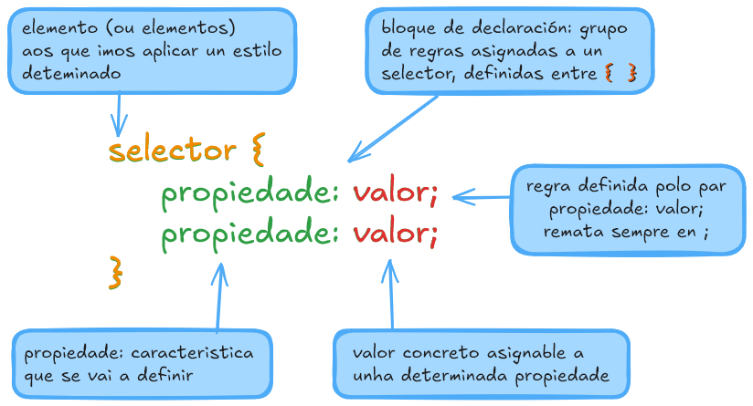
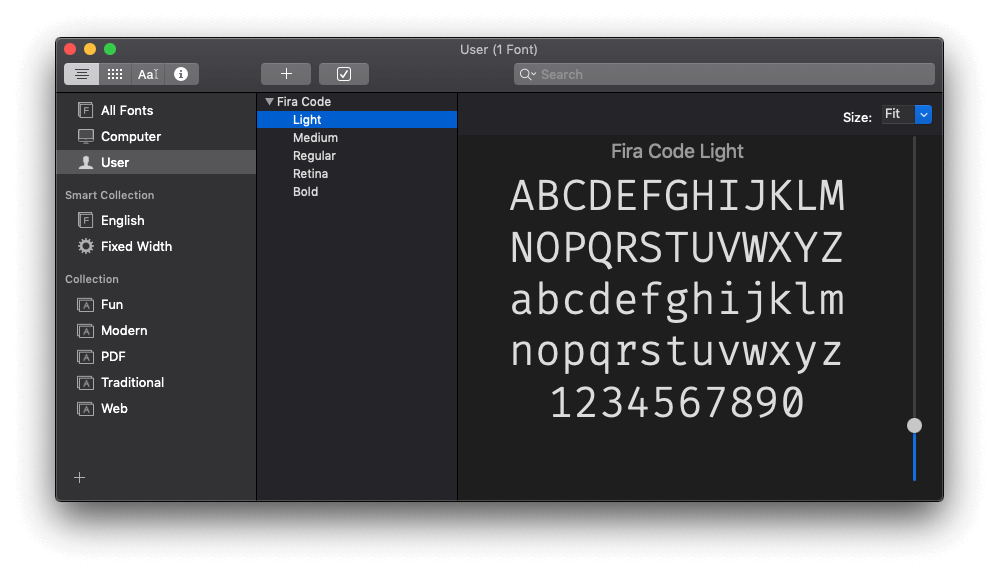
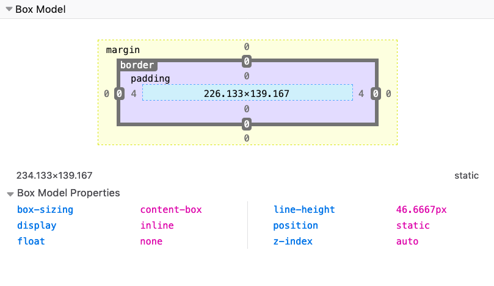

# {{ $frontmatter.title }}

CSS, abreviatura de **Cascading Style Sheets** - follas de estilo en cascada-, é un dos principais bloques de construción da web. A súa historia remóntase aos anos 90 e xunto co HTML cambiou moito dende a súa aparición.

CSS é unha ferramenta que non deixa de medrar. Algo que se notou máis nos últimos anos, introducindo moitas funcións fantásticas como CSS Grid, Flexbox e CSS Custom Properties... e máis.

Este manual breve non pretende ser un tratado sobre CSS senón un achegamento que poida servir, tanto a novizos como a expertos ou a simplemente curiosos.**

Aínda que non escribas CSS para gañar a vida, saber como funciona CSS pode axudarche a aforrarche algúns dores de cabeza cando necesites entendelo (de cando en vez), por exemplo mentres modificas unha páxina web.

A miúdo considérase CSS como unha cousa secundaria. Algúns desenvolvedores acostumados a linguaxes de guión, como Javascript ou PHP, pensan que CSS non é unha linguaxe de programación real. E poden pensar que como programadores non deberían molestarse en aprender CSS da forma correcta. 

Ao longo desta guía irei explicando CSS dunha forma breve pero completa, para que poidas usalo para aprender CSS dende cero ou como ferramenta de consulta.

**CSS mellorou moito nos últimos anos e está a evolucionar rapidamente**.

**CSS** é a linguaxe que usamos para dar estilo a un arquivo HTML[^1] e indicarlle ao navegador como debe representar os elementos da páxina.

Un arquivo CSS contén (varias) regras CSS.

Cada regra está composta por dúas partes:

- o **selector**
- o **bloque de declaración**



O selector é unha cadea que identifica un ou máis elementos da páxina, adoptando unha sintaxe especial da que pronto falaremos extensamente.

O **bloque de declaración** contén unha ou máis **regras**, á súa vez compostas por o par **propiedade**: **valor**;

Eses son os elementos sintácticos que temos en CSS.

O cometido do desenvolvedor web é organizar coidadosamente as propiedades, asociándoas con valores e anexalas a elementos específicos da páxina mediante un selector.

## 2. Introdución ao CSS

### 2.1. Como se ve o CSS

Un **conxunto de regras** CSS ten unha parte chamada **selector**, e a outra parte chamada **declaración** . A declaración contén varias **regras**, cada unha composta por unha **propiedade** e un **valor** .

Neste exemplo, `p` é o selector e aplica unha regra que establece o valor `20px` da propiedade `font-size`:

```css
p {
 font-size: 20px;
}
```

Un selector pode declarar unha ou varias regras á vez.

```css
p {
 font-size: 20px;
 color: red;
}
```

Nunha folla de estilo podemos reunir varios conxuntos de regras un tralo outro:

```css
p {
 font-size: 20px;
}

a {
 color: blue;
}
```

Cada selector declarado nunha folla de estilo pode apuntar a un ou máis elementos:

```css
p, a {
 font-size: 20px;
}
```

e pode orientarse

- a etiquetas HTML, coincidentes coa etiqueta HTML referida na declaración , 

- a elementos HTML que conteñan un determinado atributo de clase: `class="the-class"`, declarado en CSS como `.the-class { propiedade: valor; }`

- a elementos HTML que teñan un atributo `id` específico: `id="an-id"`, declarado en CSS como   

  `.an-id { propiedade: valor; }` 

Outros selectores máis avanzados permiten escoller elementos cuxo atributo coincida cun valor específico, ou que respondan a determinadas pseudo-clases (algo que veremos máis adiante).

### 2.2. Punto e coma

Cada regra CSS remata cun punto e coma. **Os puntos e coma non son opcionais**, excepto despois da última regra, pero suxiro que os uses sempre para coherencia e para evitar erros se engades outra propiedade e esquezas engadir o punto e coma na liña anterior.

### 2.3. Formato e sangría

Non hai ningunha regra fixa para o formato. Este CSS é válido:

```css
p 
{
      font-size:           20px;
                        }

a{color: blue;
}
```

pero velo é unha dor!. Aínda así, en xeral os desenvolvedores soen cumprir con algunhas **convencións**, como as que verás nos exemplos aquí referidos: os selectores pegados á esquerda; na mesma liña do selector, separado por un espazo, o corchete de apertura; na seguinte liña unha sangría de dous espazos para cada regra, unha regra en cada liña; e ao fin da declaración o corchete de peche nunha última liña do selector.

O uso correcto e coherente do espazado e da sangría é unha axuda visual para navegar e comprender o código.

## 3. Unha breve historia do CSS

Antes de continuar, fagamos un breve resumo da historia de CSS.

CSS naceu pola necesidade de dar estilo ás páxinas web. Antes de que se presentase CSS, a xente quería un xeito de dar estilo ás súas páxinas web, que no seu día parecían moi similares unhas a outras, e ríxidas e  "académicas". Daquela pouco se podía facer en termos de persoalización.

HTML 3.2 introduciu a opción de definir como atributos dos elementos HTML cores en liña e etiquetas de presentación como `center` e `font`, pero pronto se veu que non era unha solución idónea.

CSS permite mover todo o relacionado coa presentación do HTML ao CSS, para que HTML poida volver ser o formato que define a estrutura do documento, e despreocuparse de como se deben ver as cousas no navegador.

O CSS está a evolucionar continuamente e o CSS que usaches hai 5 anos quizais estea desactualizado, xa que xurdiron novas técnicas na linguaxe CSS e os navegadores tamén cambiaron significativamente.

Resulta difícil imaxinar os tempos nos que naceu CSS e o diferente que era entón a web.

Daquela tiñamos varios navegadores competidores, sendo os principais Internet Explorer ou Netscape Navigator.

As páxinas se deseñaban usando HTML, con etiquetas de presentación especiais como `bold` e atributos especiais - a maioría dos cales agora están en desuso-, o que significaba que tiñas unha cantidade limitada de oportunidades de persoalización.

A maior parte das decisións de estilo deixáronse ao navegador.

Ademais, para dar máis cobertura e oportunidades ao sitio, construíase un deseño especifico para cada un dos navegadores, porque cada un introducía etiquetas diferentes e non estandarizadas.

Pronto a xente se deu conta da necesidade de crear unha forma autónoma de dar estilo ás páxinas, de xeito que funcionase en todos os navegadores.

Despois da idea inicial proposta en 1994, CSS obtivo o seu primeiro lanzamento en 1996, cando se publicou a recomendación *CSS Level 1* ("CSS 1").

*CSS Level 2* ("CSS 2") publicouse en 1998.

Desde entón, comezouse a traballar no *CSS Level 3*. O grupo de traballo de CSS decidiu dividir cada función e traballar nela por separado, en módulos.

Os navegadores non foron especialmente rápidos á hora de implementar CSS. Tivemos que esperar ata 2002 para que o primeiro navegador implementase a especificación CSS completa: IE para Mac, como se describe ben nesta publicación de CSS-Tricks: [https://css-tricks.com/look-back-history-css/](https://css-tricks.com/look-back-history-css/)

Internet Explorer implementou o modelo de caixa de forma incorrecta dende o principio, o que provocou anos de dor tentando aplicar o mesmo estilo de forma consistente en todos os navegadores. Había que usar varios trucos e trampas para que os navegadores renderizaran as cousas como se quería.

Hoxe as cousas están moito mellor. Podemos simplemente usar os estándares CSS, a maioría das veces, sen pensar en peculiaridades. E CSS nunca foi máis poderoso.

Xa non temos números de versión oficiais para CSS, pero o Grupo de Traballo CSS publica unha "instantánea" dos módulos que actualmente se consideran estables e listos para ser incluídos nos navegadores. Esta é a última instantánea, de 2023: [https://www.w3.org/TR/css-2023/](https://www.w3.org/TR/css-2023/)

*CSS Level 2* segue sendo a base para o CSS que escribimos hoxe, e temos moitas máis funcións construídas sobre el. Aínda que a sintaxe do CSS Level 3 xa está moi avanzada e se van introducindo novos cambios cada pouco tempo, e a nivel coloquial xa todos falamos de CSS3.

## 4. Engadir CSS a unha páxina HTML

CSS se pode anexar a unha páxina HTML de distintos xeitos.

### 4.1.1: Usando a etiqueta `link`

A etiqueta `link` é a forma máis común de incluír un arquivo CSS. Esta é a forma preferida de usar CSS tal e como se pretende empregar: todas as páxinas do teu sitio inclúen un arquivo CSS e cambiar unha liña nese arquivo afecta á presentación de todas as páxinas do sitio.

Para usar este método, engadese unha etiqueta `link` co atributo `href` apuntando ao arquivo CSS que se quere incluír. Este enlace se inclúe dentro da etiqueta `head` do documento (nunca dentro da etiqueta `body`):

```css
<link rel="stylesheet" href="myfile.css">
```

O atributos `rel` é obrigatorio, xa que indica ao navegador a que tipo de arquivo nos estamos enlazando.

### 4.2.2: usando a etiqueta `style`

En lugar de usar a etiqueta `link` para apuntar a folla de estilo externa que contén o noso CSS, podemos engadir o CSS directamente, tamén na `head` do documento HTML, dentro dunha etiqueta `style`, coa seguinte sintaxe:

```html
<style>
 //o noso CSS
</style>
```

Usando este método podemos evitar crear un arquivo CSS separado. Creo que esta é unha boa forma de experimentar antes de "formalizar" CSS nun arquivo separado ou de engadir unha liña especial de CSS só a un arquivo.

### 4.3.3: estilos en liña

Os estilos en liña son a terceira forma de engadir CSS a unha páxina. Podemos engadir un atributo `style` a calquera etiqueta HTML e engadirlle CSS.

```html
<div style="">...</div>
```

Exemplo:

```html
<div style="background-color: yellow">...</div>
```

Aínda que esta é unha práctica pouco recomendada xa que degrada de forma evidente a utilidade do noso código HTML.

## 5. Selectores

Un selector permítenos asociar unha ou máis declaracións a un ou máis elementos da páxina.

### 5.1. Selectores básicos

Supoñamos que temos un elemento `p` na páxina e queremos mostrar as palabras nel usando a cor amarela.

Podemos **apuntar** a ese elemento usando o selector `p`, que apunta a todos os elementos da páxina que usan a etiqueta `p`. Unha regra CSS simple para conseguilo sería:

```css
p {
 color: yellow;
}
```

Cada etiqueta HTML ten un selector correspondente, por exemplo: `div`, `span`, `img`.

Se un selector coincide con varios elementos, todos os elementos da páxina veranse afectados polo cambio.

Os elementos HTML teñen 2 atributos que se usan moi habitualmente dentro de CSS para asociar estilos a un elemento específico da páxina: `class` e `id`.

Hai unha gran diferenza entre estes dous atributos: dentro dun documento HTML pódese repetir o mesmo valor `class` en tantos elementos como se queira, pero só se pode usar un `id` unha vez. Do mesmo xeito, pódese seleccionar un elemento con un ou máis nomes de clase específicos, algo que non se pode facer usando ids.

As clases identifícanse mediante o símbolo `.`, mentres que os identificadores utilizan o símbolo `#`.

Exemplo usando unha clase:

```html
<p class="dog-name">Sil</p>
```

```css
.dog-name {
	color: yellow;
}
```

Exemplo usando un ID:

```html
<p id="dog-name">Sil</p>
```

```css
#dog-name {
	color: yellow;
}
```

### 5.2. Combinación de selectores

Ata agora vimos como apuntar a un elemento, cunha clase ou cun id. Agora imos introducir selectores máis potentes.

#### 5.2.1. Orientación a un elemento cunha clase ou id

Podes apuntar a un elemento específico que teña unha clase ou identificador adxunto.

Exemplo usando unha clase:

```html
<p class="dog-name">Sil</p>
```

```css
p.dog-name {
	color: yellow;
}
```

Exemplo usando un ID:

```html
<p id="dog-name">Sil</p>
```

```css
p#dog-name {
	color: yellow;
}
```

Por que queres facelo, se a clase ou o identificador xa proporciona unha forma de apuntar a ese elemento? Pode que teñas que facelo para ter máis **especificidade**. Veremos que significa iso máis adiante.

#### 5.2.2. Orientado a varias clases

Podes apuntar a un elemento cunha clase específica usando `.nome-clase`, como viches anteriormente. Podes apuntar a un elemento con 2 (ou máis) clases combinando os nomes de clases separados cun punto, sen espazos.

Exemplo:

```html
<p class="dog-name sil">Sil</p>
```

```css
.dog-name.sil {
	color: yellow;
}
```

#### 5.2.3. Combinando clases e identificadores

Do mesmo xeito, podes combinar unha clase e unha identificación.

Exemplo:

```html
<p class="dog-name" id="sil">Sil</p>
```

```css
.dog-name#sil {
 color: yellow;
}
```

### 5.3. Agrupación de selectores

Para aplicar as mesmas declaracións a varios selectores, pódense combinar selectores na declaración de estilos, separándoos cunha coma.

Exemplo:

```html
<p>O nome do meu can é:</p>
<span class="dog-name"> Sil </span>
```

```css
p, .dog-name {
	color: yellow;
}
```

Podes engadir espazado a esas declaracións para que sexan máis claras:

```css
p,
.dog-name {
	color: yellow;
}
```

### 5.4. Seguir a árbore do documento cos selectores

Vimos como apuntar a un elemento da páxina mediante un nome de etiqueta, unha clase ou un identificador.

Podes crear un selector máis específico combinando varios elementos para seguir a estrutura de árbore do documento. Por exemplo, se tes unha etiqueta `span` aniñada dentro dunha etiqueta `p`, podes apuntar a ese elemento sen afectar nin aplicar o estilo a unha etiqueta `span` non incluída nunha etiqueta `p`:

```html
<span> Benvido! </span>
<p>
 O nome do meu can é:
 <span class="dog-name"> Sil </span>
</p>
```

```css
p span {
 color: yellow;
}
```

Mira como usamos un espazo entre as dúas marcas `p` e `span`.

Isto funciona aínda que o elemento da dereita teña varios niveis de profundidade.

Para facer a dependencia estrita no primeiro nivel, podes usar o `>` símbolo entre as dúas marcas:

```css
p > span {
 color: yellow;
}
```

Neste caso, se a etiqueta `span` non é un primeiro fillo do elemento `p`, non se lle aplicará este estilo.

Os fillos directos terán o estilo aplicado:

```html
<p>
 <span> Isto é amarelo </span>
 <strong>
  <span> Isto non é amarelo </span>
 </strong>
</p>
```

Os selectores de irmáns adxacentes permítennos estilizar un elemento só se está precedido dun elemento específico. Facémolo usando o operador `+`:

Exemplo:

```css
p + span {
 color: yellow;
}
```

Isto asignará a cor amarela a todos os elementos ``span`` precedidos dun elemento `p`:

```html
<p>Isto é un parágrafo</p>
<span>Isto é un span amarelo</span>
```

Temos moitos máis selectores que podemos usar:

- selectores de atributos
- pseudo selectores de clases
- selectores de pseudo elementos

Descubriremos todo sobre eles nas seguintes seccións.

## 6. Fervenza

**_Cascade_** é un concepto fundamental de CSS. Despois de todo, está no mesmo nome: o C de CSS - *Cascade Style Sheets* - debe ser algo importante.

Que significa?

**_Cascade_** é o proceso, ou algoritmo, que determina as propiedades aplicadas a cada elemento da páxina. Tentando converxer de xeito acertado dende unha lista de regras CSS que se definen en varios lugares.

Este algoritmo decide que regra concreta aplicar tendo en conta:

- a especificidade
- a importancia
- a herdanza
- a orde no arquivo

E tamén se ocupa de resolver conflitos.

Dúas ou máis regras CSS competidoras para mesma propiedade aplicada ao mesmo elemento deben elaborarse segundo a especificación CSS, para poder determinar cal hai que aplicar.

Aínda que só teñas un arquivo CSS cargado pola túa páxina, hai outro CSS que formará parte do proceso: o CSS do navegador (ou axente de usuario). Os navegadores dispoñen dun conxunto predeterminado de regras, todas diferentes entre os distintos navegadores.

Logo, o teu CSS entra en xogo.

Mais, a continuación, o navegador aplica calquera folla de estilo de usuario, que tamén se pode aplicar mediante extensións do navegador.

Todas esas regras entran en xogo ao renderizar a páxina. E o algoritmo de CSS debe entón facer o seu traballo.

Vexamos agora os conceptos de **especificidade** e **herdanza**.

## 7. Especificidade

Que ocorre cando varias regras teñen como obxectivo un elemento, con selectores diferentes, que afectan á mesma propiedade?

Por exemplo, imos falar deste elemento:

```html
<p class="dog-name">Sil</p>
```

Podemos ter

```css
.dog-name {
	color: yellow;
}
```

e outra regra que se dirixe a `p`, que establece a cor noutro valor:

```css
p {
 color: red;
}
```

E outra norma que apunta a `p.dog-name`. Cal é a regra que vai ter prioridade sobre as outras, e por que?

Aquí é onde entra en xogo a especificidade. **A regra máis específica gañará**. Se dúas ou máis regras teñen a **mesma especificidade, gaña a última que aparece** .

Ás veces, é algo confuso o que é máis específico na práctica. Incluso para os expertos que non miran en detalle as regras, ou simplemente as ignoran, e con frecuencia se esquecen desta regra básica.

### 7.1. Como calcular a especificidade

A especificidade calcúlase mediante unha convención.

Temos 4 slots, e cada un deles comeza en 0: `0 0 0 0`. A primeira posición da esquerda é a máis importante e a máis dereita é a menos importante.

Igual que funciona para números do sistema decimal: `1 0 0 0` é maior que `0 1 0 0`…

#### 7.1.1. Slot 1

A primeira ranura, a máis dereita, é a menos importante.

Aumentamos este valor cando temos un **selector de elementos**. Un elemento é un nome de etiqueta. Se tes máis dun selector de elementos na regra, incrementas en consecuencia o valor almacenado neste espazo.

Exemplos:

```css
p {
} /* 0 0 0 1 */
span {
} /* 0 0 0 1 */
p span {
} /* 0 0 0 2 */
p > span {
} /* 0 0 0 2 */
div p > span {
} /* 0 0 0 3 */
```

#### 7.1.2. Slot 2

O segundo slot increméntase en 3 cousas:

- selectores de clases
- selectores de pseudo-clase
- selectores de atributos

Cada vez que unha regra cumpre unha destas, incrementamos o valor da segunda columna desde a dereita.

Exemplos:

```css
.name {
} /* 0 0 1 0 */
.users .name {
} /* 0 0 2 0 */
[href$='.pdf'] {
} /* 0 0 1 0 */
:hover {
} /* 0 0 1 0 */
```

Por suposto, os selectores do slot 2 pódense combinar cos selectores do slot 1:

```css
div .name {
} /* 0 0 1 1 */
a[href$='.pdf'] {
} /* 0 0 1 1 */
.pictures img:hover {
} /* 0 0 2 1 */
```

Un bo truco coas clases é que podes repetir a mesma clase e aumentar a especificidade. Por exemplo:

```css
.name {
} /* 0 0 1 0 */
.name.name {
} /* 0 0 2 0 */
.name.name.name {
} /* 0 0 3 0 */
```

#### 7.1.3. Slot 3

O slot 3 contén o máis importante que pode afectar a súa especificidade CSS nun arquivo CSS: o `id`.

Cada elemento pode ter un atributo `id` asignado, e podemos usalo na nosa folla de estilo para apuntar ao elemento.

Exemplos:

```css
#name {
} /* 0 1 0 0 */
.user #name {
} /* 0 1 1 0 */
#name span {
} /* 0 1 0 1 */
```

#### 7.1.4. Slot 4

O slot 4 está afectado polos estilos en liña. Calquera estilo en liña terá prioridade sobre calquera regra definida nun arquivo CSS externo ou dentro da etiqueta `style` na cabeceira da páxina.

Exemplo:

```html
<p style="color: red">Proba</p> /* 1 0 0 0 */
```

Aínda que calquera outra regra do CSS defina a cor para este elemento, esta regra de estilo en liña aplicarase. Excepto nun caso: si se usa `!important`, que ocuparía o slot 5.

### 7.2. `!important`

A especificidade non importa se unha regra remata con `!important`:

```css
p {
	font-size: 20px !important;
}
```

Esa regra primará sobre calquera norma con máis especificidade.

Engadir unha regra CSS `!important` vai facer que esa regra sexa máis importante que calquera outra regra, segundo as regras de especificidade. A única forma en que outra regra pode ter prioridade é ter `!important` tamén, e ter maior especificidade nos outros slots menos importantes.

Por regra xeral desaconséllase o uso de ``!important``, xa que ao fin esa necesidade denota un uso pouco efectivo da **herdanza** e a **especificidade**.

### 7.3. Consellos

En xeral, debes usar a cantidade de especificidade que necesites, pero non máis. Deste xeito, podes crear outros selectores para sobrescribir as regras establecidas polas regras anteriores sen enloquecer.

`!important` é unha ferramenta moi debatida que nos ofrece CSS. Moitos expertos en CSS defenden o seu uso. Pero eu son partidario de evitalo. Como moito atoparasme usándoo cando estou probando algún estilo e unha regra CSS ten tanta especificidade que me obriga e usar `!important` para facer que o navegador aplique o meu novo CSS. Pero enseguida busco unha mellor alternativa.

Xeralmente, `!important` non debería ter espazo nos teus arquivos CSS.

Tamén se debate moito o uso do atributo `id` para aplicar estilos CSS, xa que ten unha especificidade moi alta. Unha boa alternativa é usar clases, que teñen menos especificidade, polo que son máis fáciles de traballar e son máis potentes (podes ter varias clases para un elemento e unha clase pódese reutilizar varias veces).

### 7.4. Ferramentas para calcular a especificidade

Podes usar o sitio [https://specificity.keegan.st/](https://specificity.keegan.st/) para realizar o cálculo da especificidade automaticamente.

É útil especialmente se estás tentando descubrir cousas, xa que pode ser unha boa ferramenta de comentarios.

## 8. Herdanza

Cando estableces algunhas propiedades nun selector en CSS, hérdanas todos os fillos dese selector.

E dixen *algúns*, xa que non todas as propiedades mostran este comportamento.

Isto ocorre porque ten sentido que algunhas propiedades poidan ser herdadas. Así podemos escribir CSS de xeito máis conciso, xa que non temos que establecer explicitamente esa propiedade de novo en todos os fillos.

Noutras propiedades ten máis sentido que non poidan ser herdadas.

Pensa nos tipos de letra: non é necesario aplicar o `font-family` a cada etiqueta da túa páxina. Estableces o tipo de letra na etiqueta `body` e todos os fillos herdan ese estilo.

Mentres, a propiedade `background-color`, ten pouco sentido que poida ser herdada.

### 8.1. Propiedades que herdan

Aquí tes unha lista das propiedades que herdan. A lista non é completa, pero estas regras son as que probablemente usarás máis a miúdo:

- border-collapse
- border-spacing
- caption-side
- color
- cursor
- direction
- empty-cells
- font-family
- font-size
- font-style
- font-variant
- font-weight
- font-size-adjust
- font-stretch
- font
- letter-spacing
- line-height
- list-style-image
- list-style-position
- list-style-type
- list-style
- orphans
- quotes
- tab-size
- text-align
- text-align-last
- text-decoration-color
- text-indent
- text-justify
- text-shadow
- text-transform
- visibility
- white-space
- widows
- word-break
- word-spacing

### 8.2. Obrigando a herdar propiedades

E se tes unha propiedade que non se herda por defecto, e queres que sexa herdada nun fillo?

Nos fillos, establece o valor da propiedade coa palabra clave especial `inherit`.

Exemplo:

```css
body {
 background-color: yellow;
}

p {
 background-color: inherit;
}
```

### 8.3. Forzando a NON herdar propiedades

Pola contra, podes ter unha propiedade herdada e querer evitalo.

Podes usar a palabra clave `revert`  para reverter a herdanza. Neste caso, o valor volve ao valor orixinal que lle deu o navegador na folla de estilo predeterminada.

Na práctica, isto úsase raramente, e a maioría das veces só establecerás outro valor para a propiedade para sobrescribir ese valor herdado.

### 8.4. Outros valores especiais

Ademais das palabras clave `inherit` e  `revert`, tamén podes establecer calquera propiedade para:

- `initial`: usa a folla de estilo predeterminada do navegador se está dispoñible. Se non, e se a propiedade herda por defecto, herda o valor. En caso contrario non fai nada.
- `unset`: se a propiedade herda por defecto, logo: herda. En caso contrario non fai nada.

## 9. Importación

Desde calquera arquivo CSS podes importar outro arquivo CSS mediante a directiva `@import`.

Aquí tes como usalo:

```css
@import url(arquivo.css);
```

``url()`` pode xestionar URL absolutos ou relativos.

Unha cousa importante que debes saber é que as directivas `@import` deben colocarse antes que calquera outro CSS no arquivo, ou serán ignoradas.

Podes usar descritores multimedia para cargar só un arquivo CSS no medio específico:

```css
@import url(arquivo.css) all;
@import url(arquivo-screen.css) screen;
@import url(arquivo-print.css) print;
```

## 10. Selectores de atributos

Xa introducimos varios dos selectores de CSS básicos: usar selectores de elementos, clase, id, como combinalos, como orientar varias clases, como crear varios selectores na mesma regra, como seguir a xerarquía de páxinas con selectores descendentes (fillo) e descendentes directos (fillo directo), e irmáns adxacentes.

Nesta sección analizaremos os selectores de atributos, e nas seguintes dúas seccións falaremos de **pseudoclases** e **pseudoelementos** .

### 10.1. Selectores de atributos presentes

O primeiro tipo de selector é o selector atributos presentes.

Podemos comprobar se un elemento **ten** un atributo mediante a sintaxe `[]`. `p[id]` seleccionará todas as etiquetas `p` da páxina que teñan un atributo `id`, independentemente do seu valor:

```css
p[id] {
 /* ... */
}
```

### 10.2. Selectores de valores de atributo exactos

Dentro dos corchetes podes comprobar o valor do atributo usando `=`, e o CSS só se aplicará se o atributo coincide co valor exacto especificado:

```css
p[id='meu-id'] {
 /* ... */
}
```

### 10.3. Coincidir cunha parte do valor do atributo

Aínda que `=` comproba o valor exacto, temos outros operadores:

- `*=` comproba se o atributo contén unha parte
- `^=` comproba se o atributo comeza cunha parte
- `$=` comproba se o atributo remata cunha parte
- `|=` comproba se o atributo comeza cunha parte e vai seguido dun guión (común nas clases), ou só contén unha parte
- `~=` comproba se a parte está contida no atributo, pero separado por espazos do resto

Todas as comprobacións que mencionamos distinguen entre **maiúsculas e minúsculas** .

Se engades un `i` xusto antes do corchete de peche, a verificación non distingue entre maiúsculas e minúsculas. É compatible con moitos navegadores, pero non en todos, consulta [https://caniuse.com/#feat=css-case-insensitive](https://caniuse.com/%23feat%3Dcss-case-insensitive) .

## 11. Pseudoclases

As pseudoclases son palabras clave predefinidas que se usan para seleccionar un elemento en función do seu **estado**, ou para apuntar a un fillo específico.

Comezan con `:` , **só dous puntos** .

Pódense usar como parte dun selector e son moi útiles para crear, por exemplo, un estilo de ligazóns activas ou visitadas, cambiar o estilo ao pasar o cursor, enfocar ou apuntar ao primeiro fillo ou só a filas pares ou só impares. Moi útil en moitos casos.

Estas son as pseudoclases máis populares que probablemente usarás:

| Pseudo clase    | Obxectivos                          |
| ------------------- | ------------------------------------------------------------ |
| `:active`      | un elemento activado polo usuario (por exemplo, no que se fai clic). Usado principalmente en ligazóns ou botóns |
| `:checked`     | unha caixa de verificación, opción ou tipos de entrada de radio que estean activados |
| `:default`     | o predeterminado nun conxunto de opcións (como, opción nunha selección ou botóns de opción) |
| `:disabled`     | un elemento desactivado                   |
| `:empty`      | un elemento sen fillos                    |
| `:enabled`     | un elemento que está activado (oposto a `:disabled`)     |
| `:first-child`   | o primeiro fillo dun grupo de irmáns             |
| `:focus`      | o elemento con foco                     |
| `:hover`      | un elemento pasou co rato                  |
| `:last-child`    | o último fillo dun grupo de irmáns              |
| `:link`       | unha ligazón que non foi visitada              |
| `:not()`      | pasou calquera elemento que non coincida co selector. Ex`:not(span)` |
| `:nth-child()`   | un elemento que coincida coa posición especificada      |
| `:nth-last-child()` | un elemento que coincida coa posición específica, comezando polo final |
| `:only-child`    | un elemento sen irmáns                    |
| `:required`     | un elemento de formulario co conxunto de atributos `required` |
| `:root`       | representa o elemento `html`. É como orientar `html`, pero é máis específico. Útil en [variables CSS](https://flaviocopes.com/css-variables/) . |
| `:target`      | o elemento que coincide co fragmento de URL actual (para a navegación interna na páxina) |
| `:valid`      | elementos de formulario que validaron correctamente no lado do cliente |
| `:visited`     | unha ligazón que foi visitada                |

Imos facer un exemplo. Un común, en realidade. Quere crear un estilo nunha ligazón, polo que debe crear unha regra CSS para orientar o elemento `a`:

```css
a {
 color: yellow;
}
```

As cousas parecen funcionar ben, ata que fas clic nunha ligazón. A ligazón volve á cor predefinida (azul). Despois, cando abres a ligazón e volves á páxina, agora a ligazón é azul.

Por que ocorre iso?

Porque a ligazón cando se fai clic cambia de estado e pasa ao estado `:active`. E cando foi visitado, está no estado `:visited`. Para sempre, ata que o usuario borre o historial de navegación.

Entón, para que a ligazón sexa amarela correctamente en todos os estados, cómpre escribir

```css
a,
a:visited,
a:active {
 color: yellow;
}
```

Deste xeito tamén se pode asignar unha cor a cada estado.

`:nth-child()` merece unha mención especial. Pódese usar para apuntar a fillos ou descendentes pares ou impares con `:nth-child(odd)` e `:nth-child(even)`.

Úsase habitualmente nas listas para colorear as liñas impares de forma diferente ás pares:

```css
ul:nth-child(odd) {
 color: white;
 background-color: black;
}
```

Tamén podes usalo para apuntar aos 3 primeiros fillos dun elemento con `:nth-child(-n+3)`. Ou podes darlle estilo a 1 de cada 5 elementos con `:nth-child(5n)`.

Algunhas pseudoclases só se usan para imprimir, como `:first`, `:left`, `:right`, polo que pode apuntar á primeira páxina, todas as páxinas da esquerda e todas as páxinas da dereita, que normalmente teñen un estilo lixeiramente diferente.

## 12. Pseudoelementos

Os pseudoelementos utilízanse para estilizar unha parte específica dun elemento.

Comezan con dous dous puntos `::`.

> Ás veces, os detectará en estado salvaxe cun só dous puntos, pero esta é só unha sintaxe compatible por razóns de compatibilidade con versións anteriores. Debes usar dous dous puntos para distinguilos das pseudoclases.

`::before`e `::after`son probablemente os pseudoelementos máis utilizados. Utilízanse para engadir contido antes ou despois dun elemento, como iconas, por exemplo.

Aquí está a lista dos pseudoelementos:

| Pseudoelemento  | Obxectivos                          |
| ---------------- | ------------------------------------------------------------ |
| `::after`    | crea un pseudoelemento despois do elemento          |
| `::before`    | crea un pseudoelemento antes do elemento           |
| `::first-letter` | pódese usar para estilizar a primeira letra dun bloque de texto |
| `::first-line`  | pódese usar para estilizar a primeira liña dun bloque de texto |
| `::selection`  | apunta ao texto seleccionado polo usuario          |

Imos facer un exemplo. Digamos que quere facer que a primeira liña dun parágrafo sexa lixeiramente maior en tamaño de letra, algo común na tipografía:

```css
p::first-line {
 font-size: 2rem;
}
```

Ou quizais queres que a primeira letra sexa máis ousada:

```css
p::first-letter {
 font-weight: bolder;
}
```

`::after` e `::before` son un pouco menos intuitivos. Lembro que os usei cando tiña que engadir iconas usando CSS.

Especifica a propiedade `content` para inserir calquera tipo de contido despois ou antes dun elemento:

```css
p::before {
 content: url(/myimage.png);
}

.myElement::before {
 content: 'Hey Hey!';
}
```

## 13. Cores

Por defecto, unha páxina HTML é representada polos navegadores web, por desgraza, en canto ás cores utilizadas.

Temos un fondo branco, cor negra e ligazóns azuis. Iso é.

Afortunadamente CSS dános a posibilidade de engadir cores aos nosos deseños.

Temos estas propiedades:

- `color`
- `background-color`
- `border-color`

Todos eles aceptan un **valor de cor**, que pode ter diferentes formas.

### 13.1. Cores con nome

En primeiro lugar, temos palabras clave CSS que definen cores. CSS comezou con 16, pero hoxe hai un gran número de nomes de cores:

- `aliceblue`
- `antiquewhite`
- `aqua`
- `aquamarine`
- `azure`
- `beige`
- `bisque`
- `black`
- `blanchedalmond`
- `blue`
- `blueviolet`
- `brown`
- `burlywood`
- `cadetblue`
- `chartreuse`
- `chocolate`
- `coral`
- `cornflowerblue`
- `cornsilk`
- `crimson`
- `cyan`
- `darkblue`
- `darkcyan`
- `darkgoldenrod`
- `darkgray`
- `darkgreen`
- `darkgrey`
- `darkkhaki`
- `darkmagenta`
- `darkolivegreen`
- `darkorange`
- `darkorchid`
- `darkred`
- `darksalmon`
- `darkseagreen`
- `darkslateblue`
- `darkslategray`
- `darkslategrey`
- `darkturquoise`
- `darkviolet`
- `deeppink`
- `deepskyblue`
- `dimgray`
- `dimgrey`
- `dodgerblue`
- `firebrick`
- `floralwhite`
- `forestgreen`
- `fuchsia`
- `gainsboro`
- `ghostwhite`
- `gold`
- `goldenrod`
- `gray`
- `green`
- `greenyellow`
- `grey`
- `honeydew`
- `hotpink`
- `indianred`
- `indigo`
- `ivory`
- `khaki`
- `lavender`
- `lavenderblush`
- `lawngreen`
- `lemonchiffon`
- `lightblue`
- `lightcoral`
- `lightcyan`
- `lightgoldenrodyellow`
- `lightgray`
- `lightgreen`
- `lightgrey`
- `lightpink`
- `lightsalmon`
- `lightseagreen`
- `lightskyblue`
- `lightslategray`
- `lightslategrey`
- `lightsteelblue`
- `lightyellow`
- `lime`
- `limegreen`
- `linen`
- `magenta`
- `maroon`
- `mediumaquamarine`
- `mediumblue`
- `mediumorchid`
- `mediumpurple`
- `mediumseagreen`
- `mediumslateblue`
- `mediumspringgreen`
- `mediumturquoise`
- `mediumvioletred`
- `midnightblue`
- `mintcream`
- `mistyrose`
- `moccasin`
- `navajowhite`
- `navy`
- `oldlace`
- `olive`
- `olivedrab`
- `orange`
- `orangered`
- `orchid`
- `palegoldenrod`
- `palegreen`
- `paleturquoise`
- `palevioletred`
- `papayawhip`
- `peachpuff`
- `peru`
- `pink`
- `plum`
- `powderblue`
- `purple`
- `rebeccapurple`
- `red`
- `rosybrown`
- `royalblue`
- `saddlebrown`
- `salmon`
- `sandybrown`
- `seagreen`
- `seashell`
- `sienna`
- `silver`
- `skyblue`
- `slateblue`
- `slategray`
- `slategrey`
- `snow`
- `springgreen`
- `steelblue`
- `tan`
- `teal`
- `thistle`
- `tomato`
- `turquoise`
- `violet`
- `wheat`
- `white`
- `whitesmoke`
- `yellow`
- `yellowgreen`

ademais pódese empregar  `tranparent`, e `currentColor` que apuntan á propiedade `color`, por exemplo útil para que se herde `border-color`.

Están definidos no [Módulo de cor CSS, Nivel 4](https://www.w3.org/TR/css-color-4/) . Non distinguen entre maiúsculas e minúsculas.

A Wikipedia ten unha [bonita táboa](https://en.wikipedia.org/wiki/Web_colors) que che permite escoller a cor perfecta polo seu nome.

As cores con nome non son a única opción.

### 13.2. RGB e RGBa

Podes usar a función `rgb()` para calcular unha cor a partir da súa notación RGB, que define a cor en función das súas compoñentes vermello-verde-azul. De 0 a 255:

```css
p {
 color: rgb(255, 255, 255); /* branco */
 background-color: rgb(0, 0, 0); /* negro */
}
```

`rgba()` permite engadir a canle alfa para engadir transparencia. Pode ser un número do 0 ao 1:

```css
p {
 background-color: rgba(0, 0, 0, 0.5);
}
```

### 13.3. Notación hexadecimal

Outra opción é expresar as partes RGB das cores na notación hexadecimal, que está composta por 3 bloques.

Negro  `rgb(0,0,0)`, que se expresa como `#000000` ou `#000` (podemos atallar os 2 números a 1 se son iguais).

Branco `rgb(255,255,255)`, pódese expresar como `#ffffff` ou `#fff`.

A notación hexadecimal permite expresar un número de 0 a 255 en só 2 díxitos, xa que poden ir de 0 a "15" (f).

Podemos engadir a canle alfa engadindo 1 ou 2 díxitos máis ao final, por exemplo `#00000033`. Non todos os navegadores admiten a notación acurtada, polo que utiliza os 6 díxitos para expresar a parte RGB.

### 13.4. HSL e HSLa

Esta é unha incorporación máis recente a CSS.

HSL = Hue Saturation Lightness.

Nesta notación, o negro é `hsl(0, 0%, 0%)` e o branco é `hsl(0, 0%, 100%)`.

Se estás máis familiarizado co HSL que co RGB debido aos teus coñecementos pasados, definitivamente podes usalo.

Tamén tes `hsla()` que engade a canle alfa á mestura, de novo un número do 0 ao 1:`hsl(0, 0%, 0%, 0.5)`

## 14. Unidades

Unha das cousas que usarás todos os días en CSS son as unidades. Utilízanse para establecer lonxitudes, recheos, marxes, aliñar elementos, etc.

Cousas como `px`, `em`, `rem`, ou porcentaxes.

Están en todas partes. Tamén hai algúns puntos escuros. Imos repasar cada un deles nesta sección.

### 14.1. Píxels

A unidade de medida máis utilizada. En realidade, un píxel non se corresponde cun píxel físico da túa pantalla, xa que iso varía moito segundo o dispositivo (pensa nos dispositivos de alta resolución DPI fronte aos dispositivos que non son retina).

Hai unha convención que fai que esta unidade funcione de forma consistente en todos os dispositivos.

### 14.2. Porcentaxes

Outra medida moi útil, as porcentaxes permítenche especificar valores en porcentaxes da propiedade correspondente a ese elemento pai.

Exemplo:

```css
.parent {
 width: 400px;
}

.child {
 width: 50%; /* = 200px */
}
```

### 14.3. Unidades de medida do mundo real

Temos esas unidades de medida que se traducen do mundo exterior. A maioría inútiles na pantalla, poden ser útiles para follas de estilo para imprimir. Eles son:

- `cm` un centímetro (mapa a 37,8 píxeles)
- `mm` un milímetro (0,1 cm)
- `q` un cuarto de milímetro
- `in` unha polgada (mapa a 96 píxeles)
- `pt` un punto (1 polgada = 72 puntos)
- `pc` a pica (1 pica = 12 puntos)

### 14.4. Unidades relativas

- `em` é o valor `font-size` asignado a ese elemento, polo que o seu valor exacto cambia entre elementos. Non cambia dependendo da fonte utilizada, só polo tamaño da fonte. En tipografía isto mide o ancho da letra `m`.
- `rem` é semellante a `em`, pero en lugar de variar o tamaño da fonte do elemento actual, usa o tamaño da fonte do elemento raíz (`html`). Estableces ese tamaño de letra unha vez e `rem` será unha medida coherente en toda a páxina.
- `ex` é como `em`, pero no canto de medir o ancho de `m`, mide a altura da letra `x`. Pode cambiar dependendo da fonte utilizada e do tamaño da fonte.
- `ch` é como `ex` pero en vez de medir a altura de `x` mide o ancho de `0`(cero).

### 14.5. Unidades de visualización

- `vw` a **unidade de ancho da vista** representa unha porcentaxe do ancho da vista. `50vw` significa o 50% do ancho da vista.
- `vh` a **unidade de altura da vista** representa unha porcentaxe da altura da vista. `50vh` significa o 50% da altura da vista.
- `vmin` a **unidade mínima da vista** representa o mínimo entre a altura ou o ancho en termos de porcentaxe. `30vmin` é o 30% do ancho ou alto actual, dependendo de cal sexa máis pequeno
- `vmax` a **unidade máxima da ventana gráfica** representa o máximo entre a altura ou o ancho en termos de porcentaxe. `30vmax` é o 30% do ancho ou alto actual, dependendo de cal sexa máis grande

### 14.6. Unidades de fracción

`fr` son unidades de fracción e úsanse en CSS Grid para dividir o espazo en fraccións.

Falaremos deles no contexto de **CSS Grid** máis adiante.

## 15.`url()`

Cando falamos de imaxes de fondo usamos a función `url()` para cargar un recurso:

```css
div {
 background-image: url(test.png);
}
```

Neste caso usei un URL relativo, que busca o arquivo no cartafol onde se define o arquivo CSS.

Podería retroceder un nivel

```css
div {
 background-image: url(../test.png);
}
```

ou entrar nun cartafol

```css
div {
 background-image: url(subfolder/test.png);
}
```

Ou podería cargar un arquivo a partir da raíz do dominio onde está aloxado o CSS:

```css
div {
 background-image: url(/test.png);
}
```

Ou podería usar un URL absoluto para cargar un recurso externo:

```css
div {
 background-image: url(https://mysite.com/test.png);
}
```

## 16.`calc()`

A `calc()`función permíteche realizar operacións matemáticas básicas sobre valores, e é especialmente útil cando precisas sumar ou restar un valor de lonxitude dunha porcentaxe.

Así é como funciona:

```css
div {
 max-width: calc(80% - 100px);
}
```

Devolve un valor de lonxitude, polo que se pode usar en calquera lugar que espere un valor de píxel.

Podes realizar

- adicións utilizando`+`
- resta utilizando`-`
- multiplicación usando`*`
- división usando`/`

> Unha advertencia: coa suma e a resta, o espazo ao redor do operador é obrigatorio, se non, non funciona como se esperaba.

Exemplos:

```css
div {
 max-width: calc(50% / 3);
}
div {
 max-width: calc(50% + 3px);
}
```

## 17. Fondos

O fondo dun elemento pódese cambiar usando varias propiedades CSS:

- `background-color`
- `background-image`
- `background-clip`
- `background-position`
- `background-origin`
- `background-repeat`
- `background-attachment`
- `background-size`

e a propiedade taquigrafía `background`, que permite acurtar definicións e agrupalas nunha soa liña.

```css
background-color`acepta un valor de cor, que pode ser unha das palabras clave de cor, ou un valor `rgb`ou :`hsl
p {
 background-color: yellow;
}

div {
 background-color: #333;
}
```

En lugar de usar unha cor, podes usar unha imaxe como fondo dun elemento, especificando o URL da localización da imaxe:

```css
div {
 background-image: url(image.png);
}
```

`background-clip`permítelle determinar a área utilizada pola imaxe de fondo ou a cor. O valor predeterminado é `border-box`, que se estende ata o bordo exterior do bordo.

Outros valores son

- `padding-box`para estender o fondo ata o bordo de recheo, sen o bordo
- `content-box`para estender o fondo ata o bordo do contido, sen o recheo
- `inherit`para aplicar o valor do pai

Cando use unha imaxe como fondo, quererá establecer a posición da colocación da imaxe usando a propiedade `background-position`: `left`, `right`, `center` son todos valores válidos para o eixe X e `top`, `bottom` para o eixe Y:

```css
div {
 background-position: top right;
}
```

Se a imaxe é máis pequena que o fondo, debes configurar o comportamento usando `background-repeat`. Debería `repeat-x`, `repeat-y`ou `repeat`en todos os eixos? Este último é o valor predeterminado. Outro valor é `no-repeat`.

`background-origin`permítelle escoller onde se debe aplicar o fondo: a todo o elemento incluíndo o recheo (predeterminado) usando `padding-box`, a todo o elemento incluído o bordo usando `border-box`, ao elemento sen o recheo usando `content-box`.

Con `background-attachment` podemos engadir o fondo á vista, para que o desprazamento non afecte ao fondo:

```css
div {
 background-attachment: fixed;
}
```

Por defecto o valor é `scroll`. Hai outro valor, `local`. A mellor forma de visualizar o seu comportamento é [este Codepen](https://codepen.io/BernLeech/pen/mMNKJV) .

A última propiedade de fondo é `background-size`. Podemos usar 3 palabras clave: `auto`, `cover` e `contain`. `auto` é o predeterminado.

`cover`expande a imaxe ata que todo o elemento quede cuberto polo fondo.

`contain`deixa de expandir a imaxe de fondo cando unha dimensión (x ou y) cobre todo o bordo máis pequeno da imaxe, polo que está totalmente contida no elemento.

Tamén pode especificar un valor de lonxitude e, se é así, establece o ancho da imaxe de fondo (e a altura defínese automaticamente):

```css
div {
 background-size: 100%;
}
```

Se especificas dous valores, un é o ancho e o segundo é a altura:

```css
div {
 background-size: 800px 600px;
}
```

A propiedade taquigrafía `background`permite acurtar definicións e agrupalas nunha soa liña.

Este é un exemplo:

```css
div {
 background: url(bg.png) top left no-repeat;
}
```

Se usas unha imaxe e non se puido cargar, podes establecer unha cor alternativa:

```css
div {
 background: url(image.png) yellow;
}
```

Tamén podes establecer un degradado como fondo:

```css
div {
 background: linear-gradient(#fff, #333);
}
```

## 18. Comentarios

CSS ofrécelle a posibilidade de escribir comentarios nun arquivo CSS ou na etiqueta `style` na cabeceira (`head`) da páxina

O formato dos comentarios é do estilo C (ou estilo JavaScript, se o prefires): `/* this is a comment */`.

Este é un comentario de varias liñas. Ata que engades a marca de peche `*/`, comentaranse todas as liñas que se atopan despois da de apertura.

Exemplo:

```css
#name {
 display: block;
} /* Nice rule! */

/* #name { display: block; } */

#name {
 display: block; /*
  color: red;
  */
}
```

CSS non ten comentarios en liña, como `//` en C ou JavaScript.

Pero preste atención: se engades `//` antes dunha regra, a regra non se aplicará, parecendo que o comentario funcionou. En realidade, CSS detectou un erro de sintaxe e debido ao seu funcionamento ignorou a liña co erro e pasou directamente á seguinte liña.

Coñecer este enfoque permíteche escribir comentarios en liña a propósito, aínda que tes que ter coidado porque non podes engadir texto aleatorio como se pode facer nun comentario de bloque.

Por exemplo:

```css
// Nice rule
#name {
 display: block;
}
```

Neste caso, debido a como funciona CSS, a regra `#name` é realmente comentada. Podes atopar máis detalles [aquí](https://www.xanthir.com/b4U10) se che parece interesante. Para evitar dispararte no pé, simplemente evita usar comentarios en liña e confía nos comentarios bloqueados.

## 19. Propiedades personalizadas

Nos últimos anos os preprocesadores CSS tiveron moito éxito. Era moi común que os proxectos greenfield comezasen con Less ou Sass. E aínda é unha tecnoloxía moi popular.

Os principais beneficios destas tecnoloxías son, na miña opinión:

- Permiten aniñar selectores
- Ofrece unha funcionalidade de importación sinxela
- Danche variables

CSS moderno ten unha función nova e poderosa chamada **CSS Custom Properties**, tamén coñecida como **CSS Variables** .

CSS non é unha linguaxe de programación como [JavaScript](https://flaviocopes.com/javascript/), Python, PHP, Ruby ou Go onde as variables son clave para facer algo útil. CSS é moi limitado no que pode facer, e é principalmente unha sintaxe declarativa para indicar aos navegadores como deben mostrar unha páxina HTML.

Pero unha variable é unha variable: un nome que fai referencia a un valor e as variables en CSS axudan a reducir a repetición e as inconsistencias no teu CSS, ao centralizar a definición de valores.

E introduce unha característica única que os preprocesadores CSS nunca terán: **pode acceder e cambiar o valor dunha Variable CSS mediante programación mediante JavaScript** .

### 19.1. Conceptos básicos de uso de variables

Unha variable CSS defínese cunha sintaxe especial, antepoñendo **dous guións** a un nome ( `--variable-name`), despois dous puntos e un valor. Como isto:

```css
:root {
 --primary-color: yellow;
}
```

(máis `:root`tarde)

Podes acceder ao valor da variable usando `var()`:

```css
p {
 color: var(--primary-color);
}
```

O valor da variable pode ser calquera valor CSS válido, por exemplo:

```css
:root {
 --default-padding: 30px 30px 20px 20px;
 --default-color: red;
 --default-background: #fff;
}
```

### 19.2. Crea variables dentro de calquera elemento

As variables CSS pódense definir dentro de calquera elemento. Algúns exemplos:

```css
:root {
 --default-color: red;
}

body {
 --default-color: red;
}

main {
 --default-color: red;
}

p {
 --default-color: red;
}

span {
 --default-color: red;
}

a:hover {
 --default-color: red;
}
```

O que cambia neses exemplos diferentes é o **alcance** .

### 19.3. Ámbito das variables

Engadir variables a un selector fai que estes dispoñibles para todos os fillos do mesmo.

No exemplo anterior viu o uso de `:root`cando se define unha variable CSS:

```css
:root {
 --primary-color: yellow;
}
```

`:root` é unha pseudoclase CSS que identifica o elemento raíz dunha árbore.

No contexto dun documento HTML, usar o selector `:root` apunta ao elemento `html`, agás que `:root` ten maior especificidade (ten prioridade).

No contexto dunha imaxe SVG, `:root`sinala a etiqueta `svg`.

Engadir unha propiedade personalizada CSS para que `:root` estea dispoñible para todos os elementos da páxina.

Se engades unha variable dentro dun selector `.container` , só estará dispoñible para os fillos de `.container`:

```css
.container {
 --secondary-color: yellow;
}
```

e usalo fóra deste elemento non vai funcionar.

As variables pódense **reasignar** :

```css
:root {
 --primary-color: yellow;
}

.container {
 --primary-color: blue;
}
```

Por fóra `.container`, `--primary-color`será *amarelo*, pero por dentro será *azul* .

Tamén pode asignar ou sobrescribir unha variable dentro do HTML usando **estilos en liña** :

```html
<main style="--primary-color: orange;">
 <!-- ... -->
</main>
```

> As variables CSS seguen as regras normais de cascada CSS, con prioridade establecida segundo a especificidade

### 19.4. Interactuar cun valor de variable CSS usando JavaScript

O máis interesante das variables CSS é a posibilidade de acceder a elas e editalas mediante JavaScript.

Así é como estableces un valor variable usando JavaScript simple:

```js
const element = document.getElementById('my-element')
element.style.setProperty('--variable-name', 'a-value')
```

Este código a continuación pódese usar para acceder a un valor de variable, no caso de que a variable estea definida en `:root`:

```js
const styles = getComputedStyle(document.documentElement)
const value = String(styles.getPropertyValue('--variable-name')).trim()
```

Ou, para aplicar o estilo a un elemento específico, no caso de establecer variables cun ámbito diferente:

```js
const element = document.getElementById('my-element')
const styles = getComputedStyle(element)
const value = String(styles.getPropertyValue('--variable-name')).trim()
```

### 19.5. Xestionando valores non válidos

Se se asigna unha variable a unha propiedade que non acepta o valor da variable, considérase non válida.

Por exemplo, pode pasar un valor de píxel a unha propiedade `position` ou un valor rem a unha propiedade de cor.

Neste caso, a liña considérase non válida e ignórase.

### 19.6. Soporte de navegador

O soporte do navegador para as variables CSS é **moi bo**, [segundo Can I Use](https://www.caniuse.com/%23feat%3Dcss-variables) .

As variables CSS están aquí para quedarse, e podes usalas hoxe se non precisas admitir Internet Explorer e as versións antigas dos outros navegadores.

Se precisas admitir navegadores máis antigos, podes usar bibliotecas como [PostCSS](https://flaviocopes.com/postcss/) ou [Myth](http://www.myth.io/), pero perderás a capacidade de interactuar coas variables a través de JavaScript ou as ferramentas para desenvolvedores do navegador, xa que se transfiren a un bo CSS antigo sen variables (e como tal, perde a maior parte do poder das variables CSS).

### 19.7. As variables CSS distinguen entre maiúsculas e minúsculas

Esta variable:

```css
--width: 100px;
```

é diferente de:

```css
--Width: 100px;
```

### 19.8. Matemáticas en variables CSS

Para facer matemáticas en Variables CSS, cómpre usar `calc()`, por exemplo:

```css
:root {
 --default-left-padding: calc(10px * 2);
}
```

### 19.9. Consultas de medios con variables CSS

Nada especial aquí. As variables CSS normalmente aplícanse ás consultas multimedia:

```css
body {
 --width: 500px;
}

@media screen and (max-width: 1000px) and (min-width: 700px) {
 --width: 800px;
}

.container {
 width: var(--width);
}
```

### 19.10. Establecendo un valor alternativo para var()

`var()` acepta un segundo parámetro, que é o valor alternativo predeterminado cando o valor da variable non está definido:

```css
.container {
 margin: var(--default-margin, 30px);
}
```

## 20. Tipos de letra

Nos albores da web só tiñas un puñado de fontes das que podías escoller.

Afortunadamente hoxe podes cargar calquera tipo de letra nas túas páxinas.

CSS gañou moitas boas capacidades ao longo dos anos no que se refire ás fontes.

A propiedade `font` é a abreviatura de varias propiedades:

- `font-family`
- `font-weight`
- `font-stretch`
- `font-style`
- `font-size`

Vexamos cada un deles e despois trataremos `font`.

Despois falaremos de como cargar fontes personalizadas, usando `@import`ou `@font-face`, ou cargando unha folla de estilo de fonte.

### 20.1.`font-family`

Establece a *familia* de fontes que utilizará o elemento.

Por que "familia"? Porque o que coñecemos como tipo de letra está composto en realidade por varios subtipos de letra. que proporcionan todo o estilo (negrita, cursiva, lixeiro..) que precisamos.

Aquí tes un exemplo da aplicación Font Book do meu Mac: a familia de fontes Fira Code alberga varias fontes dedicadas debaixo:



Esta propiedade permítelle seleccionar un tipo de letra específico, por exemplo:

```css
body {
 font-family: Helvetica;
}
```

Podes establecer varios valores, polo que se utilizará a segunda opción se a primeira non se pode usar por algún motivo (se non se atopa na máquina ou fallou a conexión de rede para descargar a fonte, por exemplo):

```css
body {
 font-family: Helvetica, Arial;
}
```

Usei ata agora algunhas fontes específicas, as que chamamos **Web Safe Fonts**, xa que están preinstaladas en diferentes sistemas operativos.

Dividímolos en fontes Serif, Sans-Serif e Monospace. Aquí tes unha lista dalgúns dos máis populares:

#### Serif

- Georgia
- Palatino
- Times New Roman
- Times

#### Sans Serif

- Arial
- Helvetica
- Verdana
- Genebra
- Tahoma
- Lucida
- Impact
- Trebuchet MS
- Arial Black

#### Monospace

- Courier New
- Courier
- Lucida Console
- Mónaco

Podes usar todas esas propiedades `font-family`, pero non se garante que estean aí para todos os sistemas. Tamén existen outros con diferentes niveis de apoio.

Tamén podes usar nomes xenéricos:

- `sans-serif` unha fonte sen ligaduras
- `serif` unha fonte con ligaduras
- `monospace` unha fonte especialmente boa para o código
- `cursive` usado para simular pezas manuscritas
- `fantasy` o nome o di todo

Estes úsanse normalmente ao final dunha definición `font-family`, para proporcionar un valor alternativo no caso de que non se poida aplicar nada máis:

```css
body {
 font-family: Helvetica, Arial, sans-serif;
}
```

### 20.2.`font-weight`

Esta propiedade define o ancho dunha fonte. Podes usar eses valores predefinidos:

- normal
- negriña
- máis grosa (relativo ao elemento pai)
- máis fina (relativo ao elemento principal)

Ou usando as palabras clave numéricas

- 100
- 200
- 300
- 400 asignado a `normal`
- 500
- 600
- 700 asignado a `bold`
- 800
- 900

onde 100 é a fonte máis fina e 900 é a máis grosa.

Algúns deses valores numéricos poden non corresponder a unha fonte, porque debe proporcionarse na familia de fontes. Cando falta un, CSS fai que ese número sexa polo menos tan en negra como o anterior, polo que pode ter números que apunten á mesma fonte.

### 20.3.`font-stretch`

Permite escoller unha cara estreita ou ancha da fonte, se está dispoñible.

Isto é importante: a fonte debe estar equipada con diferentes caras.

Os valores permitidos son, de máis estreito a máis amplo:

- `ultra-condensed`
- `extra-condensed`
- `condensed`
- `semi-condensed`
- `normal`
- `semi-expanded`
- `expanded`
- `extra-expanded`
- `ultra-expanded`

### 20.4.`font-style`

Permite aplicar un estilo cursiva a unha fonte:

```css
p {
 font-style: italic;
}
```

Esta propiedade tamén permite os valores `oblique` e `normal`. Hai moi pouca diferenza, ou ningunha, entre usar `italic` e `oblique`. O primeiro é máis fácil para min, xa que HTML xa ofrece un elemento `i` que significa cursiva.

### 20.5.`font-size`

Esta propiedade úsase para determinar o tamaño das fontes.

Podes pasar 2 tipos de valores:

1. un valor de lonxitude, como `px`, `em`, `rem`, etc. ou unha porcentaxe
2. unha palabra clave de valor predefinido

No segundo caso, os valores que podes usar son:

- xx-pequeno
- x-pequeno
- pequena
- medio
- grande
- x-grande
- xx-grande
- menor (relativo ao elemento pai)
- maior (relativo ao elemento pai)

Uso:

```css
p {
 font-size: 20px;
}

li {
 font-size: medium;
}
```

### 20.6.`font-variant`

Esta propiedade utilizouse orixinalmente para cambiar o texto en maiúsculas e só tiña 3 valores válidos:

- `normal`
- `inherit`
- `small-caps`

Maiúsculas significa que o texto aparece en "maiúsculas" xunto ás súas letras maiúsculas.

### 20.7.`font`

A propiedade `font` permítelle aplicar diferentes propiedades de tipo de letra nunha única, reducindo o desorde.

Debemos establecer polo menos 2 propiedades, `font-size` e `font-family` as outras son opcionais:

```css
body {
 font: 20px Helvetica;
}
```

Se engadimos outras propiedades, hai que poñelas na orde correcta.

Esta é a orde:

```css
font: <font-stretch> <font-style> <font-variant> <font-weight> <font-size>
 <line-height> <font-family>;
```

Exemplo:

```css
body {
 font: italic bold 20px Helvetica;
}

section {
 font: small-caps bold 20px Helvetica;
}
```

### 20.8. Cargando fontes personalizadas usando`@font-face`

`@font-face`permítelle engadir un novo nome de familia de fontes e asignalo a un arquivo que contén unha fonte.

Este tipo de letra será descargado polo navegador e usado na páxina, e foi un cambio tan fundamental na tipografía na web: agora podemos usar calquera tipo de letra que queiramos.

Podemos engadir `@font-face`declaracións directamente ao noso CSS, ou enlazar a un CSS dedicado a importar o tipo de letra.

No noso arquivo CSS tamén podemos usar `@import`para cargar ese arquivo CSS.

Unha `@font-face`declaración contén varias propiedades que usamos para definir o tipo de letra, incluíndo `src`, o URI (un ou máis URI) do tipo de letra. Isto segue a política da mesma orixe, o que significa que as fontes só se poden descargar desde a orixe actual (dominio + porto + protocolo).

As fontes adoitan estar nos formatos

- `woff`(Formato de fonte aberta web)
- `woff2`(Web Open Font Format 2.0)
- `eot`(Tipo aberto incorporado)
- `otf`(Tipo de letra OpenType)
- `ttf`(Tipo de letra TrueType)

As seguintes propiedades permítennos definir as propiedades do tipo de letra que imos cargar, como vimos anteriormente:

- `font-family`
- `font-weight`
- `font-style`
- `font-stretch`

### 20.9. Unha nota sobre o rendemento

Por suposto, cargar unha fonte ten implicacións de rendemento que debes ter en conta ao crear o deseño da túa páxina.

## 21. Tipografía

Xa falamos dos tipos de letra, pero hai máis sobre estilos de texto.

Nesta sección falaremos das seguintes propiedades:

- `text-transform`
- `text-decoration`
- `text-align`
- `vertical-align`
- `line-height`
- `text-indent`
- `text-align-last`
- `word-spacing`
- `letter-spacing`
- `text-shadow`
- `white-space`
- `tab-size`
- `writing-mode`
- `hyphens`
- `text-orientation`
- `direction`
- `line-break`
- `word-break`
- `overflow-wrap`

### 21.1.`text-transform`

Esta propiedade pode transformar o caso dun elemento.

Hai 4 valores válidos:

- `capitalize`para poñer en maiúscula a primeira letra de cada palabra
- `uppercase`para todo o texto en maiúscula
- `lowercase`para minúsculas todo o texto
- `none`para desactivar a transformación do texto, usado para evitar herdar a propiedade

Exemplo:

```css
p {
 text-transform: uppercase;
}
```

### 21.2.`text-decoration`

Esta propiedade está destinada a engadir decoración ao texto, incluíndo

- `underline`
- `overline`
- `line-through`
- `blink`
- `none`

Exemplo:

```css
p {
 text-decoration: underline;
}
```

Tamén pode definir o estilo da decoración e a cor.

Exemplo:

```css
p {
 text-decoration: underline dashed yellow;
}
```

Os valores de estilo válidos son `solid`, `double`, `dotted`, .`dashed``wavy`

Podes facer todo nunha liña ou usar as propiedades específicas:

- `text-decoration-line`
- `text-decoration-color`
- `text-decoration-style`

Exemplo:

```css
p {
 text-decoration-line: underline;
 text-decoration-color: yellow;
 text-decoration-style: dashed;
}
```

### 21.3.`text-align`

Por defecto, aliñar texto ten o `start`valor, é dicir, o texto comeza no "inicio", orixe 0, 0 da caixa que o contén. Isto significa que a parte superior esquerda nos idiomas de esquerda a dereita e a parte superior dereita nos idiomas de dereita a esquerda.

Os valores posibles son `start`, `end`, `left`, `right`, `center`, `justify`(boa ter un espazo coherente nos extremos das liñas):

```css
p {
 text-align: right;
}
```

### 21.4.`vertical-align`

Determina como se aliñan verticalmente os elementos en liña.

Temos varios valores para esta propiedade. Primeiro podemos asignar un valor de lonxitude ou porcentaxe. Eses utilízanse para aliñar o texto nunha posición superior ou inferior (usando valores negativos) que a liña base do elemento pai.

Despois temos as palabras clave:

- `baseline` (o predeterminado), aliña a liña base coa liña base do elemento pai
- `sub` fai un elemento subíndice, simulando o resultado `sub` do elemento HTML
- `super` fai un elemento superíndice, simulando o resultado `sup` do elemento HTML
- `top` aliña a parte superior do elemento coa parte superior da liña
- `text-top` aliña a parte superior do elemento coa parte superior da fonte do elemento pai
- `middle` aliña o medio do elemento co medio da liña do pai
- `bottom` aliña a parte inferior do elemento coa parte inferior da liña
- `text-bottom` aliña a parte inferior do elemento coa parte inferior da fonte do elemento pai

### 21.5.`line-height`

Isto permítelle cambiar a altura dunha liña. Cada liña de texto ten unha certa altura de fonte, pero despois hai un espazo adicional vertical entre as liñas. Esta é a altura da liña:

```css
p {
 line-height: 0.9rem;
}
```

### 21.6.`text-indent`

Sangrar a primeira liña dun parágrafo por unha lonxitude definida ou unha porcentaxe do ancho do parágrafo:

```css
p {
 text-indent: -10px;
}
```

### 21.7.`text-align-last`

Por defecto, a última liña dun parágrafo está aliñada seguindo o valor `text-align`. Usa esta propiedade para cambiar ese comportamento:

```css
p {
 text-align-last: right;
}
```

### 21.8.`word-spacing`

Modifica o espazo entre cada palabra.

Podes usar a `normal`palabra clave para restablecer os valores herdados ou usar un valor de lonxitude:

```css
p {
 word-spacing: 2px;
}

span {
 word-spacing: -0.2em;
}
```

### 21.9.`letter-spacing`

Modifica o espazo entre cada letra.

Podes usar a `normal`palabra clave para restablecer os valores herdados ou usar un valor de lonxitude:

```css
p {
 letter-spacing: 0.2px;
}

span {
 letter-spacing: -0.2em;
}
```

### 21.10.`text-shadow`

Aplicar unha sombra ao texto. Por defecto, o texto agora ten sombra.

Esta propiedade acepta unha cor opcional e un conxunto de valores que se establecen

- a compensación X da sombra do texto
- a compensación Y da sombra do texto
- o raio de desenfoque

Se non se especifica a cor, a sombra usará a cor do texto.

Exemplos:

```css
p {
 text-shadow: 0.2px 2px;
}

span {
 text-shadow: yellow 0.2px 2px 3px;
}
```

### 21.11.`white-space`

Establece como CSS xestiona o espazo en branco, as liñas novas e as pestanas dentro dun elemento.

Os valores válidos que contraen espazos en branco son:

- `normal`colapsa o espazo en branco. Engade liñas novas cando é necesario cando o texto chega ao final do contedor
- `nowrap`colapsa o espazo en branco. Non engade unha liña nova cando o texto chega ao final do contedor e suprime calquera salto de liña engadido ao texto
- `pre-line`colapsa o espazo en branco. Engade liñas novas cando é necesario cando o texto chega ao final do contedor

Os valores válidos que conservan espazos en branco son:

- `pre`preserva o espazo en branco. Non engade unha liña nova cando o texto chega ao final do contedor, pero conserva o salto de liña engadido ao texto
- `pre-wrap`preserva o espazo en branco. Engade liñas novas cando é necesario cando o texto chega ao final do contedor

### 21/12.`tab-size`

Establece o ancho do carácter de tabulación. De forma predeterminada, é 8, e podes establecer un valor enteiro que estableza os espazos de caracteres que necesita ou un valor de lonxitude:

```css
p {
 tab-size: 2;
}

span {
 tab-size: 4px;
}
```

### 21/13.`writing-mode`

Define se as liñas de texto se dispoñen horizontal ou verticalmente e a dirección na que avanzan os bloques.

Os valores que podes usar son

- `horizontal-tb`(predeterminado)
- `vertical-rl`o contido está disposto verticalmente. As novas liñas colócanse á esquerda das anteriores
- `vertical-lr`o contido está disposto verticalmente. Póñense novas liñas á dereita da anterior

### 21/14.`hyphens`

Determina se os guións deben engadirse automaticamente ao ir a unha nova liña.

Os valores válidos son

- `none`(predeterminado)
- `manual`só engade un guión cando xa hai un guión visible ou un guión oculto (un carácter especial)
- `auto`engadir guións cando se determine o texto pode ter un guión.

### 21.15.`text-orientation`

Cando `writing-mode`está en modo vertical, determina a orientación do texto.

Os valores válidos son

- `mixed`é o predeterminado, e se un idioma é vertical (como o xaponés) conserva esa orientación, mentres xira o texto escrito en linguas occidentais
- `upright`fai que todo o texto estea orientado verticalmente
- `sideways`fai todo o texto orientado horizontalmente

### 21/16.`direction`

Establece a dirección do texto. Os valores válidos son `ltr`e `rtl`:

```css
p {
 direction: rtl;
}
```

### 21/17.`word-break`

Esta propiedade especifica como romper liñas dentro das palabras.

- `normal`(predeterminado) significa que o texto só se divide entre palabras, non dentro dunha palabra
- `break-all`o navegador pode romper unha palabra (pero non se engaden guións)
- `keep-all`suprimir o envoltorio suave. Usado principalmente para texto CJK (chinés/xaponés/coreano).

Falando de texto CJK, a propiedade `line-break` úsase para determinar como se rompen as liñas de texto. Non son un experto neses idiomas, así que evitarei cubrilo.

### 21.18.`overflow-wrap`

Se unha palabra é demasiado longa para caber nunha liña, pode desbordarse fóra do recipiente.

> Esta propiedade tamén se coñece como `word-wrap`, aínda que non é estándar (pero aínda funciona como un alias)

Este é o comportamento predeterminado ( `overflow-wrap: normal;`).

Podemos usar:

```css
p {
 overflow-wrap: break-word;
}
```

para rompelo na lonxitude exacta da liña, ou

```css
p {
 overflow-wrap: anywhere;
}
```

se o navegador ve que hai unha oportunidade de envoltura suave nalgún lugar antes. Non se engaden guións, en ningún caso.

Esta propiedade é moi semellante a `word-break`. Quizais queiramos escoller este para as linguas occidentais, mentres que `word-break` ten un tratamento especial para as linguas non occidentais.

## 22. Modelo de caixa

Cada elemento CSS é esencialmente unha caixa. Cada elemento é unha caixa xenérica.

O modelo de caixa explica o tamaño dos elementos baseándose nunhas poucas propiedades CSS.

De dentro a fóra temos:

- a área de contido
- acolchado
- fronteira
- marxe

A mellor forma de visualizar o modelo de caixa é abrir o navegador DevTools e comprobar como se mostra:



Aquí podes ver como Firefox indica as propiedades dun elemento `span` que se destaca. Se fas clic co botón dereito nel, premes _Inspeccionar elemento_ e vas ao panel _Deseño_ de DevTools (ferramentas do desenvolvedor).

Mira, o espazo azul claro é a área de contido. Rodeándoo hai o acolchado, despois o borde e finalmente a marxe.

Por defecto, se establece un ancho (ou alto) no elemento, aplicarase á **área de contido** . Todos os cálculos de recheo, bordos e marxes realízanse fóra do valor, polo que tes que telo en conta cando fagas o teu cálculo.

Podes cambiar este comportamento usando Box Sizing.

## 23. Fronteira

O bordo é unha capa fina entre o recheo e a marxe. Editando o bordo podes facer que os elementos debuxen o seu perímetro na pantalla.

Podes traballar en bordos usando estas propiedades:

- `border-style`
- `border-color`
- `border-width`

A propiedade `border` pódese usar como abreviatura para todas esas propiedades.

`border-radius`úsase para crear esquinas redondeadas.

Tamén tes a capacidade de usar imaxes como bordos, unha capacidade que che proporciona `border-image` e as súas propiedades específicas separadas:

- `border-image-source`
- `border-image-slice`
- `border-image-width`
- `border-image-outset`
- `border-image-repeat`

Comecemos por `border-style`.

### 23.1. O estilo de fronteira

A propiedade `border-style` permíte escoller o estilo do bordo. As opcións que podes usar son:

- `dotted`
- `dashed`
- `solid`
- `double`
- `groove`
- `ridge`
- `inset`
- `outset`
- `none`
- `hidden`


Consulta [este Codepen](https://codepen.io/flaviocopes/pen/yraaxq) para ver un exemplo en directo

O estilo predeterminado é `none`, polo que para que o bordo apareza en absoluto, cómpre cambialo por outra cousa. `solid`é unha boa opción a maioría das veces.

Podes establecer un estilo diferente para cada bordo usando as propiedades

- `border-top-style`
- `border-right-style`
- `border-bottom-style`
- `border-left-style`

ou pode usalos `border-style`con varios valores para definilos, usando a orde habitual Arriba-Dereita-Abaixo-Esquerda:

```css
p {
 border-style: solid dotted solid dotted;
}
```

### 23.2. O ancho do bordo

`border-width`úsase para definir o ancho do bordo.

Podes usar un dos valores predefinidos:

- `thin`
- `medium`(valor predeterminado)
- `thick`

ou expresar un valor en píxeles, em ou rem ou calquera outro valor de lonxitude válido.

Exemplo:

```css
p {
 border-width: 2px;
}
```

Podes establecer o ancho de cada bordo (arriba-dereita-inferior-esquerda) por separado usando 4 valores:

```css
p {
 border-width: 2px 1px 2px 1px;
}
```

ou pode usar as propiedades de bordo específicas `border-top-width`, `border-right-width`, `border-bottom-width`, `border-left-width`.

### 23.3. A cor do bordo

`border-color`úsase para definir a cor do bordo.

Se non estableces unha cor, o bordo por defecto está coloreado usando a cor do texto do elemento.

Podes pasar calquera valor de cor válido a `border-color`.

Exemplo:

```css
p {
 border-color: yellow;
}
```

Podes establecer a cor de cada bordo (arriba-dereita-inferior-esquerda) por separado usando 4 valores:

```css
p {
 border-color: black red yellow blue;
}
```

ou podes usar as propiedades de bordo específicas `border-top-color`, `border-right-color`, `border-bottom-color`, `border-left-color`.

### 23.4. A propiedade en taquigrafía abreviada

Esas 3 propiedades mencionadas, `border-width`, `border-style`e `border-color` pódense definir usando a propiedade abreviatura `border`.

Exemplo:

```css
p {
 border: 2px black solid;
}
```

Tamén pode usar as propiedades específicas do bordo `border-top`, `border-right`, `border-bottom`, `border-left`.

Exemplo:

```css
p {
 border-left: 2px black solid;
 border-right: 3px red dashed;
}
```

### 23.5. O radio da fronteira

`border-radius`úsase para establecer cantos redondeados ao bordo. Debes pasar un valor que se utilizará como raio do círculo que se utilizará para redondear o bordo.

Uso:

```css
p {
 border-radius: 3px;
}
```

Tamén pode usar as propiedades específicas do bordo `border-top-left-radius`, `border-top-right-radius`, `border-bottom-left-radius`, `border-bottom-right-radius`.

### 23.6. Usando imaxes como bordos

Unha cousa moi interesante cos bordos é a posibilidade de usar imaxes para peinalas. Isto permíteche ser moi creativo coas fronteiras.

Temos 5 propiedades:

- `border-image-source`
- `border-image-slice`
- `border-image-width`
- `border-image-outset`
- `border-image-repeat`

e a taquigrafía `border-image`. Non vou entrar en moitos detalles aquí xa que as imaxes como bordes necesitarían unha cobertura máis profunda como a que podo facer neste pequeno capítulo. Recomendo ler a [entrada do almanaque CSS Trucos sobre border-image](https://css-tricks.com/almanac/properties/b/border-image/) para obter máis información.

## 24. Acolchado

A propiedade `padding` CSS úsase habitualmente en CSS para engadir espazo no lado interior dun elemento.

Lembra:

- `margin` engade espazo fóra do bordo dun elemento
- `padding` engade espazo dentro do bordo dun elemento

### 24.1. Propiedades específicas do acolchado

`padding` ten 4 propiedades relacionadas que alteran o recheo dun único bordo á vez:

- `padding-top`
- `padding-right`
- `padding-bottom`
- `padding-left`

O uso destes é moi sinxelo e non se pode confundir, por exemplo:

```css
padding-left: 30px;
padding-right: 3em;
```

### 24.2. Usando a `padding`taquigrafía

`padding`é unha abreviatura para especificar varios valores de recheo ao mesmo tempo e, dependendo do número de valores introducidos, compórtase de forma diferente.

#### 24.2.1. 1 valor

Usar un único valor aplícase a **todos** os recheos: arriba, dereita, inferior, esquerda.

```css
padding: 20px;
```

#### 24.2.2. 2 valores

Usando 2 valores aplícase o primeiro á **parte inferior e superior**, e o segundo á **esquerda e á dereita** .

```css
padding: 20px 10px;
```

#### 24.2.3. 3 valores

Usando 3 valores aplícase o primeiro á **parte superior**, o segundo á **esquerda e á dereita**, o terceiro á **parte inferior** .

```css
padding: 20px 10px 30px;
```

#### 24.2.4. 4 valores

Usando 4 valores aplícase o primeiro á **parte superior**, o segundo á **dereita**, o terceiro á **parte inferior** e o cuarto á **esquerda** .

```css
padding: 20px 10px 5px 0px;
```

Polo tanto, a orde é *arriba-dereita-abaixo-esquerda* .

### 24.3. Valores aceptados

`padding` acepta valores expresados en calquera tipo de unidade de lonxitude, os máis comúns son px, em, rem, pero [existen moitos outros](https://developer.mozilla.org/en-US/docs/Web/CSS/length) .

## 25. Marxe

A propiedade `margin` CSS úsase habitualmente en CSS para engadir espazo ao redor dun elemento.

**Lembra**:

- `margin` engade espazo fóra do bordo dun elemento
- `padding` engade espazo dentro do bordo dun elemento

### 25.1. Propiedades específicas da marxe

`margin` ten 4 propiedades relacionadas que alteran a marxe dunha única aresta á vez:

- `margin-top`
- `margin-right`
- `margin-bottom`
- `margin-left`

O uso destes é moi sinxelo e non se pode confundir, por exemplo:

```css
margin-left: 30px;
margin-right: 3em;
```

### 25.2. Usando a `margin`taquigrafía

`margin`é unha abreviatura para especificar varias marxes ao mesmo tempo e, dependendo do número de valores introducidos, compórtase de forma diferente.

#### 25.2.1. 1 valor

Usar un único valor aplícase a **todas** as marxes: arriba, dereita, inferior, esquerda.

```css
margin: 20px;
```

#### 25.2.2. 2 valores

Usando 2 valores aplícase o primeiro á **parte inferior e superior**, e o segundo á **esquerda e á dereita** .

```css
margin: 20px 10px;
```

#### 25.2.3. 3 valores

Usando 3 valores aplícase o primeiro á **parte superior**, o segundo á **esquerda e á dereita**, o terceiro á **parte inferior** .

```css
margin: 20px 10px 30px;
```

#### 25.2.4. 4 valores

Usando 4 valores aplícase o primeiro á **parte superior**, o segundo á **dereita**, o terceiro á **parte inferior** e o cuarto á **esquerda** .

```css
margin: 20px 10px 5px 0px;
```

Polo tanto, a orde é *arriba-dereita-abaixo-esquerda* .

### 25.3. Valores aceptados

`margin`acepta valores expresados en calquera tipo de unidade de lonxitude, os máis comúns son px, em, rem, pero [existen moitos outros](https://developer.mozilla.org/en-US/docs/Web/CSS/length) .

Tamén acepta valores porcentuais e o valor especial `auto`.

### 25.4. Usando `auto` para centrar elementos

`auto` pódese usar para indicarlle ao navegador que seleccione automaticamente unha marxe, e úsase máis habitualmente para centrar un elemento deste xeito:

```css
margin: 0 auto;
```

Como se dixo anteriormente, usar 2 valores aplícase o primeiro á **parte inferior e superior** e o segundo á **esquerda e á dereita** .

A forma moderna de centrar elementos é usar [Flexbox](https://flaviocopes.com/flexbox/) e a súa directiva `justify-content: center;`.

Os navegadores máis antigos, por suposto, non implementan Flexbox, e se o precisas, admitir `margin: 0 auto;` aínda é unha boa opción.

### 25.5. Usando unha marxe negativa

`margin` é a única propiedade relacionada co tamaño que pode ter un valor negativo. Tamén é moi útil. Establecer unha marxe superior negativa fai que un elemento se mova sobre os elementos anteriores.
Unha marxe inferior negativa move cara arriba os elementos despois dela.

Unha marxe dereita negativa fai que o contido do elemento se expanda máis aló do seu tamaño de contido permitido.

Unha marxe esquerda negativa move o elemento que queda sobre os elementos que o preceden e, dado un valor negativo suficiente, sairá da páxina.

## 26. Tamaño da caixa

O comportamento predeterminado dos navegadores ao calcular o ancho dun elemento é aplicar o ancho e o alto calculados á **área de contido**, sen ter en conta o recheo, o bordo e a marxe.

Este enfoque demostrou ser bastante complicado de traballar.

Podes cambiar este comportamento configurando a propiedade `box-sizing`.

A propiedade `box-sizing` é unha gran axuda. Ten 2 valores:

- `border-box`
- `content-box`

`content-box`é o predeterminado, o que tiñamos durante séculos antes de `box-sizing`converterse nunha cousa.

`border-box`é o novo e xenial que buscamos. Se o configuras nun elemento:

```css
.my-div {
 box-sizing: border-box;
}
```

o cálculo de ancho e alto inclúe o recheo e o bordo. Só se deixa fóra a marxe, o que é razoable xa que na nosa mente tamén adoitamos ver iso como algo separado: a marxe está fóra da caixa.

Esta propiedade é un pequeno cambio pero ten un gran impacto. CSS Tricks incluso declarou un [día internacional de concienciación sobre o tamaño das caixas](https://css-tricks.com/international-box-sizing-awareness-day/), só dicindo, e recoméndase aplicalo a todos os elementos da páxina, fóra da caixa, con isto:

```css
*,
*:before,
*:after {
 box-sizing: border-box;
}
```
---

[cont.](./follasdeestiloencascada_ii)