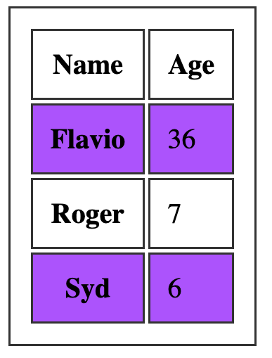

# {{ $frontmatter.title }}

## 27. Exhibición

A propiedade `display` dun obxecto determina como é renderizado polo navegador.

É unha propiedade moi importante, e probablemente a que teña o maior número de valores que pode usar.

Eses valores inclúen:

- `block`
- `inline`
- `none`
- `contents`
- `flow`
- `flow-root`
- `table`(e todas `table-*`)
- `flex`
- `grid`
- `list-item`
- `inline-block`
- `inline-table`
- `inline-flex`
- `inline-grid`
- `inline-list-item`

ademais doutros que probablemente non uses, como `ruby`.

A elección de calquera destes alterará considerablemente o comportamento do navegador co elemento e os seus fillos.

Nesta sección analizaremos os máis importantes non tratados noutro lugar:

- `block`
- `inline`
- `inline-block`
- `none`

Veremos algúns dos outros en capítulos posteriores, incluíndo a cobertura de `table`, `flex`e `grid`.

### 27.1.`inline`

Inline é o valor de visualización predeterminado para cada elemento en CSS.

Todas as etiquetas HTML móstranse en liña fóra da caixa excepto algúns elementos como `div`, `p`e `section`, que son definidos `block`polo axente de usuario (o navegador).

Os elementos en liña non teñen ningunha marxe nin recheo aplicado.

O mesmo para o alto e o ancho.

Podes *engadilos*, pero o aspecto na páxina non cambiará: o navegador calcúlaos e aplicalos automaticamente.

### 27.2.`inline-block`

Similar a `inline`, pero con `inline-block` `width`e `height`aplícanse como especificaches.

### 27.3.`block`

Como se mencionou, normalmente os elementos móstranse en liña, con excepción dalgúns elementos, incluíndo

- `div`
- `p`
- `section`
- `ul`

que son configurados `block`polo navegador.

Con `display: block`, os elementos apílanse un detrás do outro, verticalmente, e cada elemento ocupa o 100 % da páxina.

Os valores asignados ás propiedades `width` e `height` son respectados, se os establece, xunto con `margin` e `padding`.

### 27.4.`none`

Usar `display: none` fai desaparecer un elemento. Aínda está alí no HTML, pero non é visible no navegador.

## 28. Posicionamento

O posicionamento é o que nos fai determinar onde aparecen os elementos na pantalla e como aparecen.

Podes mover elementos e situalos exactamente onde queiras.

Nesta sección tamén veremos como cambian as cousas nunha páxina en función de como `position`interactúan elementos diferentes entre si.

Temos unha propiedade CSS principal: `position`.

Pode ter eses 5 valores:

- `static`
- `relative`
- `absolute`
- `fixed`
- `sticky`

### 28.1. Posicionamento estático

Este é o valor predeterminado dun elemento. Os elementos posicionados estáticos móstranse no fluxo de páxina normal.

### 28.2. Posicionamento relativo

Se estableces un elemento `position: relative`, agora podes posicionalo cun desfase, usando as propiedades

- top
- right
- bottom
- left

que se denominan **propiedades de compensación** . Aceptan un valor de lonxitude ou unha porcentaxe.

Tome [este exemplo que fixen en Codepen](https://codepen.io/flaviocopes/pen/WWGgrR) . Creo un contenedor principal, un contenedor fillo e unha caixa interior con algún texto:

```html
<div class="parent">
 <div class="child">
  <div class="box">
   <p>Test</p>
  </div>
 </div>
</div>
```

con algúns CSS para dar algunhas cores e recheo, pero non afecta o posicionamento:

```css
.parent {
 background-color: #af47ff;
 padding: 30px;
 width: 300px;
}

.child {
 background-color: #ff4797;
 padding: 30px;
}

.box {
 background-color: #f3ff47;
 padding: 30px;
 border: 2px solid #333;
 border-style: dotted;
 font-family: courier;
 text-align: center;
 font-size: 2rem;
}
```

aquí está o resultado:


Podes tentar engadir calquera das propiedades que mencionei antes ( `top`, `right`, `bottom`, `left`) a `.box`, e non pasará nada. A posición é `static`.

Agora, se nos poñemos na caixa `position: relative`, ao principio ao parecer nada cambia. Pero o elemento agora pode moverse usando as propiedades `top`, `right`, `bottom` e `left` podes alterar a súa posición en relación ao elemento que o contén.

Por exemplo:

```css
.box {
 /* ... */
 position: relative;
 top: -60px;
}
```


Un valor negativo de `top` fará que a caixa se mova en relación ao seu contedor.

Ou

```css
.box {
 /* ... */
 position: relative;
 top: -60px;
 left: 180px;
}
```


Fíxate como o espazo que ocupa a caixa permanece conservado no recipiente, coma se aínda estivese no seu sitio.

Outra propiedade que agora funcionará é alterar a colocación do eixe z: `z-index`. Xa falaremos diso máis adiante.

### 28.3. Posicionamento absoluto

Ao configurar un elemento `position: absolute` eliminarase do fluxo do documento e xa non seguirá o fluxo de posicionamento da páxina orixinal.

Lembras que no posicionamento relativo observamos que se conservaba o espazo que ocupaba orixinalmente un elemento aínda que se movese?

Co posicionamento absoluto, tan pronto como poñemos `.box` en `position: absolute`, o seu espazo orixinal está agora colapsado e só a orixe (coordenadas x, y) permanece igual.

```css
.box {
 /* ... */
 position: absolute;
}
```


Agora podemos mover a caixa como queiramos, usando as propiedades `top`, `right`, `bottom`, `left`:

```css
.box {
 /* ... */
 position: absolute;
 top: 0px;
 left: 0px;
}
```


ou

```css
.box {
 /* ... */
 position: absolute;
 top: 140px;
 left: 50px;
}
```


As coordenadas son relativas ao contedor máis próximo que non é `static`.

Isto significa que se engadimos `position: relative` ao elemento `.child` e poñemos `top` e `left` a 0, a caixa non se situará na marxe superior esquerda da *xanela*, senón que se situará nas coordenadas 0, 0 de `.child`:

```css
.child {
 /* ... */
 position: relative;
}

.box {
 /* ... */
 position: absolute;
 top: 0px;
 left: 0px;
}
```


Isto é o que ocorre se `.child`é estático (o predeterminado):

```css
.child {
 /* ... */
 position: static;
}

.box {
 /* ... */
 position: absolute;
 top: 0px;
 left: 0px;
}
```


Do mesmo xeito que para o posicionamento relativo, pode usar `z-index`para alterar a colocación do eixe z.

### 28.4. Posicionamento fixo

Do mesmo xeito que co posicionamento absoluto, cando se asigna `position: fixed` a un elemento, este elimínase do fluxo da páxina.

A diferenza co posicionamento absoluto é a seguinte: agora os elementos sempre se sitúan en relación á xanela, en lugar do primeiro contedor non estático.

```css
.box {
 /* ... */
 position: fixed;
}
```


```css
.box {
 /* ... */
 position: fixed;
 top: 0;
 left: 0;
}
```


Outra gran diferenza é que os elementos non se ven afectados polo desprazamento. Unha vez que coloque un elemento pegajoso nalgún lugar, desprazarse pola páxina non o elimina da parte visible da páxina.

### 28.5. Posicionamento pegajoso

Aínda que os valores anteriores existen desde hai moito tempo, este introduciuse recentemente e aínda non se admite ( [ver caniuse.com](https://caniuse.com/%23feat%3Dcss-sticky) )

O compoñente UITableView iOS é o que se me ocorre cando penso en `position: sticky`. Sabes cando te desprazas pola lista de contactos e a primeira letra está pegada na parte superior, para indicarche que estás a ver os contactos desa carta en particular?

Usamos JavaScript para emular iso, pero este é o enfoque adoptado por CSS para permitilo de forma nativa.

## 29. Flotando e despexando

Flotar foi un tema moi importante no pasado.

Utilizouse en moitos hacks e usos creativos porque era unha das poucas formas en que, xunto coas táboas, podíamos realmente implementar algúns deseños. No pasado adoitabamos facer flotar a barra lateral cara á esquerda, por exemplo, para mostrala no lado esquerdo da pantalla e engadimos algunha marxe ao contido principal.

Afortunadamente os tempos cambiaron e hoxe temos Flexbox e Grid para axudarnos coa maquetación, e float volveu ao seu ámbito orixinal: colocar contido nun lado do elemento contenedor e facer que os seus irmáns aparezan ao seu redor.

A propiedade `float` admite 3 valores:

- `left`
- `right`
- `none`(por defecto)

Digamos que temos un cadro que contén un parágrafo con algún texto e que o parágrafo tamén contén unha imaxe.

Aquí tes algún código:

```html
<div class="parent">
 <div class="child">
  <div class="box">
   <p>
    This is some random paragraph and an image.
     The image is in the
    middle of the text. The image is in the middle of the text. The image is
    in the middle of the text. The image is in the middle of the text. The
    image is in the middle of the text. The image is in the middle of the
    text. The image is in the middle of the text. The image is in the middle
    of the text. The image is in the middle of the text.
   </p>
  </div>
 </div>
</div>
```

```css
.parent {
 background-color: #af47ff;
 padding: 30px;
 width: 500px;
}

.child {
 background-color: #ff4797;
 padding: 30px;
}

.box {
 background-color: #f3ff47;
 padding: 30px;
 border: 2px solid #333;
 border-style: dotted;
 font-family: courier;
 text-align: justify;
 font-size: 1rem;
}
```

e a aparencia visual:


Como podes ver, o fluxo normal por defecto considera a imaxe en liña e fai espazo para ela na propia liña.

Se engadimos `float: left`á imaxe, e algún recheo:

```css
img {
 float: left;
 padding: 20px 20px 0px 0px;
}
```

este é o resultado:


e isto é o que obtemos aplicando un flotador: correcto, axustando o recheo en consecuencia:

```css
img {
 float: right;
 padding: 20px 0px 20px 20px;
}
```


Un elemento flotante elimínase do fluxo normal da páxina e o outro contido flúe ao seu redor.

[Mira o exemplo en Codepen](https://codepen.io/flaviocopes/pen/WWGqPr?editors%3D1100)

Non está limitado a imaxes flotantes, tamén. Aquí cambiamos a imaxe cun elemento `span`:

```html
<div class="parent">
 <div class="child">
  <div class="box">
   <p>
    This is some random paragraph and an image.
    <span>Some text to float</span> The image is in the middle of the text.
    The image is in the middle of the text. The image is in the middle of
    the text. The image is in the middle of the text. The image is in the
    middle of the text. The image is in the middle of the text. The image is
    in the middle of the text. The image is in the middle of the text. The
    image is in the middle of the text.
   </p>
  </div>
 </div>
</div>
```

```css
span {
 float: right;
 margin: 20px 0px 20px 20px;
 padding: 10px;
 border: 1px solid black;
}
```

e este é o resultado:


### 29.1. Limpeza

Que pasa cando flotas máis dun elemento?

Se ao flotar atopan outra imaxe flotante, por defecto están apiladas unha á beira da outra, horizontalmente. Ata que non haxa sitio, e comezarán a apilarse nunha nova liña.

Digamos que tiñamos 3 imaxes en liña dentro dunha  etiqueta `p`:


Se a esas imaxes engadimos `float: left`:

```css
img {
 float: left;
 padding: 20px 20px 0px 0px;
}
```

isto é o que teremos:


se engades `clear: left`imaxes, estas vanse apilar verticalmente e non horizontalmente:


Usando o valor `left` para `clear`.
Se permite:

- `left` para limpar os flotadores esquerdos
- `right` para limpar flotadores dereita
- `both` para limpar os flotadores esquerdo e dereito
- `none` (predeterminado) desactiva o borrado

## 30. z-index

Cando falamos de posicionamento, mencionei que pode usar a propiedade `z-index` para controlar o posicionamento do eixe Z dos elementos.

É moi útil cando tes varios elementos que se solapan entre si, e tes que decidir cal é visible, o máis próximo ao usuario e cal debes ocultar detrás del.

Esta propiedade toma un número (sen decimais) e utiliza ese número para calcular que elementos aparecen máis preto do usuario, no eixe Z.

Canto maior sexa o valor do índice z, máis se colocará un elemento máis preto do usuario.

Ao decidir que elemento debe ser visible e cal debe colocarse detrás del, o navegador fai un cálculo sobre o valor do índice z.

O valor predeterminado é `auto`, unha palabra clave especial. Usando `auto`, a orde do eixe Z determínase pola posición do elemento HTML na páxina; o último irmán aparece primeiro, xa que se define o último.

Por defecto, os elementos teñen o valor `static` da propiedade `position`. Neste caso, a propiedade `z-index` non fai ningunha diferenza: debe configurarse en `absolute`, `relative` ou `fixed` para funcionar.

Exemplo:

```css
.my-first-div {
 position: absolute;
 top: 0;
 left: 0;
 width: 600px;
 height: 600px;
 z-index: 10;
}

.my-second-div {
 position: absolute;
 top: 0;
 left: 0;
 width: 500px;
 height: 500px;
 z-index: 20;
}
```

Mostrarase o elemento con clase `.my-second-div`, e detrás del `.my-first-div`.

Aquí usamos 10 e 20, pero podes usar calquera número. Tamén os números negativos. É habitual escoller números non consecutivos, polo que podes colocar elementos no medio. Se usa números consecutivos no seu lugar, necesitaría volver calcular o índice z de cada elemento implicado no posicionamento.

## 31. Reixa CSS

CSS Grid é o novo neno da cidade CSS e, aínda que aínda non é totalmente compatible con todos os navegadores, será o futuro sistema de deseños.

CSS Grid é un enfoque fundamentalmente novo para construír esquemas usando CSS.

Manteña un ollo na páxina CSS Grid Layout en caniuse.com ( [https://caniuse.com/#feat=css-grid](https://caniuse.com/%23feat%3Dcss-grid) ) para descubrir que navegadores o admiten actualmente. No momento de escribir este artigo, abril de 2019, todos os principais navegadores (agás IE, que nunca terá soporte para iso) xa admiten esta tecnoloxía, cubrindo o 92% de todos os usuarios.

CSS Grid non é un competidor de Flexbox. Interoperan e colaboran en deseños complexos, porque CSS Grid funciona en 2 dimensións (filas E columnas) mentres que Flexbox funciona nunha única dimensión (filas OU columnas).

Construír deseños para a web foi tradicionalmente un tema complicado.

Non vou afondar nas razóns desta complexidade, que é un tema complexo por si só, pero podes considerarte un ser humano moi afortunado porque hoxe en día tes 2 ferramentas moi potentes e ben apoiadas á túa disposición:

- **CSS Flexbox**
- **Reixa CSS**

Estas 2 son as ferramentas para construír os deseños web do futuro.

A menos que necesites admitir navegadores antigos como IE8 e IE9, non hai motivos para xogar con cousas como:

- Disposicións de táboas
- Flotadores
- hacks clearfix
- `display: table`hacks

Nesta guía tes todo o que necesitas saber para pasar dun coñecemento cero de CSS Grid a ser un usuario competente.

### 31.1. O básico

O deseño da grade CSS actívase nun elemento contenedor (que pode ser unha etiqueta `div` ou calquera outra) configurando `display: grid`.

Do mesmo xeito que con flexbox, pode definir algunhas propiedades no contedor e algunhas propiedades en cada elemento individual da grade.

Estas propiedades combinadas determinarán o aspecto final da reixa.

As propiedades máis básicas do recipiente son `grid-template-columns` e `grid-template-rows`.

#### 31.1.1. columnas de modelos de cuadrícula e filas de modelos de grade

Esas propiedades definen o número de columnas e filas da grade e tamén definen o ancho de cada columna/fila.

O seguinte fragmento define unha grade con 4 columnas de 200 píxeles de ancho cada unha e 2 filas cunha altura de 300 píxeles cada unha.

```css
.container {
 display: grid;
 grid-template-columns: 200px 200px 200px 200px;
 grid-template-rows: 300px 300px;
}
```


Aquí tes outro exemplo de grade con 2 columnas e 2 filas:

```css
.container {
 display: grid;
 grid-template-columns: 200px 200px;
 grid-template-rows: 100px 100px;
}
```


#### 31.1.2. Dimensións automáticas

Moitas veces pode ter un tamaño de cabeceira fixo, un tamaño de pé de páxina fixo e o contido principal que é flexible en altura, dependendo da súa lonxitude. Neste caso pode usar a `auto`palabra clave:

```css
.container {
 display: grid;
 grid-template-rows: 100px auto 100px;
}
```

#### 31.1.3. Diferentes dimensións de columnas e filas

Nos exemplos anteriores fixemos cuadrículas regulares usando os mesmos valores para as filas e os mesmos valores para as columnas.

Podes especificar calquera valor para cada fila/columna, para crear moitos deseños diferentes:

```css
.container {
 display: grid;
 grid-template-columns: 100px 200px;
 grid-template-rows: 100px 50px;
}
```


Outro exemplo:

```css
.container {
 display: grid;
 grid-template-columns: 10px 100px;
 grid-template-rows: 100px 10px;
}
```


#### 31.1.4. Engadindo espazo entre as celas

A menos que se especifique, non hai espazo entre as celas.

Podes engadir espazos usando estas propiedades:

- `grid-column-gap`
- `grid-row-gap`

ou a sintaxe taquigráfica `grid-gap`.

Exemplo:

```css
.container {
 display: grid;
 grid-template-columns: 100px 200px;
 grid-template-rows: 100px 50px;
 grid-column-gap: 25px;
 grid-row-gap: 25px;
}
```


O mesmo esquema usando a taquigrafía:

```css
.container {
 display: grid;
 grid-template-columns: 100px 200px;
 grid-template-rows: 100px 50px;
 grid-gap: 25px;
}
```

#### 31.1.5. Generando elementos en varias columnas e/ou filas

Cada elemento da cela ten a opción de ocupar máis dunha caixa na fila e expandirse horizontal ou verticalmente para obter máis espazo, respectando as proporcións da grade establecidas no contedor.

Estas son as propiedades que usaremos para iso:

- `grid-column-start`
- `grid-column-end`
- `grid-row-start`
- `grid-row-end`

Exemplo:

```css
.container {
 display: grid;
 grid-template-columns: 200px 200px 200px 200px;
 grid-template-rows: 300px 300px;
}
.item1 {
 grid-column-start: 2;
 grid-column-end: 4;
}
.item6 {
 grid-column-start: 3;
 grid-column-end: 5;
}
```


Os números corresponden á liña vertical que separa cada columna, comezando por 1:


O mesmo principio aplícase a `grid-row-start`e `grid-row-end`, excepto que esta vez en vez de tomar máis columnas, unha cela leva máis filas.

##### 31.1.5.1. Sintaxe taquigráfica

Esas propiedades teñen unha sintaxe abreviada proporcionada por:

- `grid-column`
- `grid-row`

O uso é sinxelo, aquí tes como replicar o deseño anterior:

```css
.container {
 display: grid;
 grid-template-columns: 200px 200px 200px 200px;
 grid-template-rows: 300px 300px;
}
.item1 {
 grid-column: 2 / 4;
}
.item6 {
 grid-column: 3 / 5;
}
```

Outro enfoque é establecer a columna/fila de inicio e establecer cantas debería ocupar usando `span`:

```css
.container {
 display: grid;
 grid-template-columns: 200px 200px 200px 200px;
 grid-template-rows: 300px 300px;
}
.item1 {
 grid-column: 2 / span 2;
}
.item6 {
 grid-column: 3 / span 2;
}
```

### 31.2. Máis configuración de reixa

#### 31.2.1. Usando fraccións

Especificar o ancho exacto de cada columna ou fila non é ideal en todos os casos.

Unha fracción é unha unidade de espazo.

O seguinte exemplo divide unha grade en 3 columnas co mesmo ancho, 1/3 do espazo dispoñible cada unha.

```css
.container {
 grid-template-columns: 1fr 1fr 1fr;
}
```

#### 31.2.2. Usando porcentaxes e rem

Tamén podes usar porcentaxes e mesturar e combinar fraccións, píxeles, rem e porcentaxes:

```css
.container {
 grid-template-columns: 3rem 15% 1fr 2fr;
}
```

#### 31.2.3. Usando`repeat()`

`repeat()`é unha función especial que leva un número que indica o número de veces que se repetirá unha fila/columna e a lonxitude de cada unha.

Se todas as columnas teñen o mesmo ancho, pode especificar o deseño usando esta sintaxe:

```css
.container {
 grid-template-columns: repeat(4, 100px);
}
```

Isto crea 4 columnas co mesmo ancho.

Ou usando fraccións:

```css
.container {
 grid-template-columns: repeat(4, 1fr);
}
```

#### 31.2.4. Especifique un ancho mínimo para unha fila

Caso de uso común: ten unha barra lateral que nunca se contrae máis que unha determinada cantidade de píxeles cando redimensiona a xanela.

Aquí tes un exemplo no que a barra lateral ocupa 1/4 da pantalla e nunca leva menos de 200 píxeles:

```css
.container {
 grid-template-columns: minmax(200px, 3fr) 9fr;
}
```

Tamén pode establecer só un valor máximo usando a `auto`palabra clave:

```css
.container {
 grid-template-columns: minmax(auto, 50%) 9fr;
}
```

ou só un valor mínimo:

```css
.container {
 grid-template-columns: minmax(100px, auto) 9fr;
}
```

#### 31.2.5. Colocando elementos utilizando`grid-template-areas`

Por defecto, os elementos colócanse na grade utilizando a súa orde na estrutura HTML.

Usando `grid-template-areas` pódense definir áreas de modelo para movelas na grade e tamén para xerar un elemento en varias filas/columnas en lugar de usar `grid-column`.

Aquí tes un exemplo:

```html
<div class="container">
 <main>...</main>
 <aside>...</aside>
 <header>...</header>
 <footer>...</footer>
</div>
```

```css
.container {
 display: grid;
 grid-template-columns: 200px 200px 200px 200px;
 grid-template-rows: 300px 300px;
 grid-template-areas:
  'header header header header'
  'sidebar main main main'
  'footer footer footer footer';
}
main {
 grid-area: main;
}
aside {
 grid-area: sidebar;
}
header {
 grid-area: header;
}
footer {
 grid-area: footer;
}
```

A pesar da súa orde orixinal, os elementos colócanse onde se definen `grid-template-areas`, dependendo da propiedade `grid-area` asociada a eles.

##### 31.2.5.1. Engadindo celas baleiras nas áreas do modelo

Podes establecer unha cela baleira usando o punto `.` en lugar do nome da área en `grid-template-areas`:

```css
.container {
 display: grid;
 grid-template-columns: 200px 200px 200px 200px;
 grid-template-rows: 300px 300px;
 grid-template-areas:
  '. header header .'
  'sidebar . main main'
  '. footer footer .';
}
```

### 31.3. Enche unha páxina cunha cuadrícula

Podes facer que unha grella estenda para encher a páxina usando `fr`:

```css
.container {
 display: grid;
 height: 100vh;
 grid-template-columns: 1fr 1fr 1fr 1fr;
 grid-template-rows: 1fr 1fr;
}
```

### 31.4. Un exemplo: cabeceira, barra lateral, contido e pé de páxina

Aquí tes un exemplo sinxelo de usar CSS Grid para crear un deseño do sitio que fornece un encabezado, unha parte principal con barra lateral á esquerda e contido á dereita e un pé de páxina despois.


Aquí está o marcado:

```html
<div class="wrapper">
 <header>Header</header>
 <article>
  <h1>Welcome</h1>
  <p>Hi!</p>
 </article>
 <aside>
  <ul>
   <li>Sidebar</li>
  </ul>
 </aside>
 <footer>Footer</footer>
</div>
```

e aquí está o CSS:

```css
header {
 grid-area: header;
 background-color: #fed330;
 padding: 20px;
}
article {
 grid-area: content;
 background-color: #20bf6b;
 padding: 20px;
}
aside {
 grid-area: sidebar;
 background-color: #45aaf2;
}
footer {
 padding: 20px;
 grid-area: footer;
 background-color: #fd9644;
}
.wrapper {
 display: grid;
 grid-gap: 20px;
 grid-template-columns: 1fr 3fr;
 grid-template-areas:
  'header header'
  'sidebar content'
  'footer footer';
}
```

Engadín algunhas cores para facelo máis bonito, pero basicamente asigna un `grid-area`nome a cada etiqueta diferente, que se usa na propiedade `grid-template-areas` en `.wrapper`.

Cando o deseño é máis pequeno podemos poñer a barra lateral debaixo do contido mediante unha consulta multimedia:

```css
@media (max-width: 500px) {
 .wrapper {
  grid-template-columns: 4fr;
  grid-template-areas:
   'header'
   'content'
   'sidebar'
   'footer';
 }
}
```

[Ver en CodePen](https://codepen.io/flaviocopes/pen/JZWOEK)

### 31.5. Envolvendo

Estes son os conceptos básicos de CSS Grid. Hai moitas cousas que non incluín nesta introdución, pero quería facelo moi sinxelo, comezar a usar este novo sistema de deseño sen facer que se sinta abrumador.

## 32. Flexbox

Flexbox, tamén chamado Flexible Box Module, é un dos dous sistemas de deseño modernos, xunto con CSS Grid.

En comparación con CSS Grid (que é bidimensional), flexbox é un **modelo de deseño unidimensional** . Controlará o deseño baseado nunha fila ou nunha columna, pero non xuntos ao mesmo tempo.

O obxectivo principal de flexbox é permitir que os elementos enchen todo o espazo que ofrece o seu recipiente, dependendo dalgunhas regras que estableza.

A non ser que necesites admitir navegadores antigos como IE8 e IE9, Flexbox é a ferramenta que che permite esquecerche de usar

- Disposicións de táboas
- Floats
- hacks clearfix
- hacks `display: table`

Mergullémonos no flexbox e convertámonos en mestres del, levarache pouco tempo.

### 32.1. Soporte de navegador

No momento traducir este artigo (xaneiro 2023), é compatible co 99,23% dos usuarios, e xa todos os navegadores máis importantes implementárono desde fai anos:


Aínda que debemos esperar uns anos para que os usuarios se poñan ao día de CSS Grid, Flexbox é unha tecnoloxía máis antiga e pódese usar agora mesmo.

### 32.2. Activa Flexbox

Un deseño de caixa flexible aplícase a un contedor mediante a configuración

```css
display: flex;
```

ou

```css
display: inline-flex;
```

o contido **dentro do contedor** aliñarase mediante flexbox.

### 32.3. Propiedades do recipiente

Algunhas propiedades de flexbox aplícanse ao contedor, que establece as regras xerais para os seus elementos. Eles son

- `flex-direction`
- `justify-content`
- `align-items`
- `flex-wrap`
- `flex-flow`

#### 32.3.1. Aliñar filas ou columnas

A primeira propiedade que vemos, **`flex-direction`**, determina se o contedor debe aliñar os seus elementos como filas ou como columnas:

- `flex-direction: row` coloca os elementos como unha **fila**, na dirección do texto (de esquerda a dereita para os países occidentais)
- `flex-direction: row-reverse` coloca os elementos igual pero na dirección `row` oposta
- `flex-direction: column`coloca os elementos nunha **columna**, ordenando de arriba abaixo
- `flex-direction: column-reverse`coloca elementos nunha columna, igual que pero na dirección `column` oposta
- 

#### 32.3.2. Aliñación vertical e horizontal

De xeito predeterminado, os elementos comezan pola esquerda se é unha fila `flex-direction` e dende a parte superior se é unha columna `flex-direction`.


Pode cambiar este comportamento usando `justify-content` para cambiar o aliñamento horizontal e `align-items` para cambiar o aliñamento vertical.

##### 32.3.2.1. Cambia a aliñación horizontal

**`justify-content`**ten 5 valores posibles:

- `flex-start`: aliñar ao lado esquerdo do recipiente.
- `flex-end`: aliñar ao lado dereito do recipiente.
- `center`: aliñar no centro do recipiente.
- `space-between`: visualización con igual espazo entre eles.
- `space-around`: visualización con igual espazo ao seu redor


##### 32.3.2.2. Cambia a aliñación vertical

**`align-items`**ten 5 valores posibles:

- `flex-start`: aliñar coa parte superior do recipiente.
- `flex-end`: aliñar ao fondo do recipiente.
- `center`: aliñar no centro vertical do recipiente.
- `baseline`: visualización na liña base do recipiente.
- `stretch`: os elementos están estirados para adaptarse ao recipiente.


##### 32.3.2.3. Unha nota sobre`baseline`

`baseline`parece semellante ao `flex-start`deste exemplo, debido a que as miñas caixas son demasiado sinxelas. Consulte [este Codepen](https://codepen.io/flaviocopes/pen/oExoJR) para ter un exemplo máis útil, que tirei dun Pen creado orixinalmente por [Martin Michálek](https://twitter.com/machal) . Como podes ver alí, as dimensións dos elementos están aliñadas.

#### 32.3.3. Envolver

De forma predeterminada, os elementos dun contenedor flexbox mantéñense nunha soa liña, reducindo-os para que caian no contenedor.

Para forzar que os elementos se estendan en varias liñas, use `flex-wrap: wrap`. Isto distribuirá os elementos segundo a orde establecida en `flex-direction`. Usa `flex-wrap: wrap-reverse`para inverter esta orde.

Unha propiedade abreviada chamada `flex-flow` permítelle especificar `flex-direction` e `flex-wrap` nunha soa liña, engadindo primeiro o valor `flex-direction`, seguido do valor `flex-wrap`, por exemplo: `flex-flow: row wrap`.

### 32.4. Propiedades que se aplican a cada elemento

Desde agora, vimos as propiedades que podes aplicar ao contedor.

Os elementos individuais poden ter certa independencia e flexibilidade, e podes modificar o seu aspecto usando estas propiedades:

- `order`
- `align-self`
- `flex-grow`
- `flex-shrink`
- `flex-basis`
- `flex`

Vémolos en detalle.

#### 32.4.1. Mover elementos antes/despois doutro usando orde

Os elementos son ordenados en función da orde que se lles asigna. Por defecto, cada elemento ten orde `0` e a aparición no HTML determina a orde final.

Podes anular esta propiedade usando `order` en cada elemento separado. Esta é unha propiedade que defines no elemento, non no contedor. Podes facer que un elemento apareza antes que todos os demais establecendo un valor negativo.


#### 32.4.2. Aliñación vertical mediante align-self

Un elemento pode optar por **anular** a configuración `align-items` do recipiente mediante **`align-self`**, que ten os mesmos 5 valores posibles de `align-items`:

- `flex-start`: aliñar coa parte superior do recipiente.
- `flex-end`: aliñar ao fondo do recipiente.
- `center`: aliñar no centro vertical do recipiente.
- `baseline`: visualización na liña base do recipiente.
- `stretch`: os elementos están estirados para adaptarse ao recipiente.


#### 32.4.3. Crece ou encolle un elemento se é necesario

##### 32.4.3.1. crecemento flexible

O valor predeterminado para calquera elemento é 0.

Se todos os elementos se definen como 1 e un defínese como 2, o elemento máis grande ocupará o espazo de dous elementos "1".

##### 32.4.3.2. flex-retráctil

O valor predeterminado para calquera elemento é 1.

Se todos os elementos se definen como 1 e un como 3, o elemento máis grande reducirase 3 veces os outros. Cando hai menos espazo dispoñible, ocupará 3 veces menos.

##### 32.4.3.3. base flexible

Se se define como `auto`, dimensiona un elemento segundo o seu ancho ou alto e engade espazo adicional en función da propiedade `flex-grow`.

Se se establece en 0, non engade ningún espazo adicional para o elemento ao calcular o deseño.

Se especificas un valor de número de píxel, usarao como valor de lonxitude (o ancho ou o alto depende de se é unha fila ou un elemento de columna)

##### 32.4.3.4. dobrar

Esta propiedade combina as 3 propiedades anteriores:

- `flex-grow`
- `flex-shrink`
- `flex-basis`

e proporciona unha sintaxe abreviada:`flex: 0 1 auto`

## 33. Táboas

As táboas no pasado utilizábanse moito en CSS, xa que eran unha das únicas formas de crear un deseño de páxina elegante.

Hoxe con Grid e Flexbox podemos mover as táboas de novo ao traballo que estaban destinados a facer: decorar táboas.

Imos comezar polo HTML. Esta é unha táboa básica:

```html
<table>
 <thead>
  <tr>
   <th scope="col">Name</th>
   <th scope="col">Age</th>
  </tr>
 </thead>
 <tbody>
  <tr>
   <th scope="row">Flavio</th>
   <td>36</td>
  </tr>
  <tr>
   <th scope="row">Sil</th>
   <td>7</td>
  </tr>
 </tbody>
</table>
```

Por defecto non é moi atractivo. O navegador ofrece algúns estilos estándar, e iso é todo:


Podemos usar CSS para estilizar todos os elementos da táboa, por suposto.

Comecemos pola fronteira. Unha bonita fronteira pode percorrer un longo camiño.

Podemos aplicalo no elemento `table`, e tamén nos elementos internos, como `th` e `td`:

```css
table,
th,
td {
 border: 1px solid #333;
}
```

Se o combinamos con algunha marxe, obtemos un bo resultado:


Unha cousa común coas táboas é a posibilidade de engadir unha cor a unha fila e unha cor diferente a outra. Isto é posible usando o selector `:nth-child(odd)`ou `:nth-child(even)`:

```css
tbody tr:nth-child(odd) {
 background-color: #af47ff;
}
```

Isto dános:



Se engades `border-collapse: collapse;` ao elemento da táboa, todos os bordos colapsanse nun só:


## 34. Centrado

Centrar cousas en CSS é unha tarefa moi diferente se necesitas centrar horizontal ou verticalmente.

Neste post explico os escenarios máis habituais e como resolvelos. [Se Flexbox](https://flaviocopes.com/flexbox/) proporciona unha nova solución, ignoro as técnicas antigas porque hai que avanzar, e Flexbox é compatible con navegadores dende hai anos, incluído IE10.

### 34.1. Centrar horizontalmente

#### 34.1.1. Texto

O texto é moi sinxelo de centrar horizontalmente usando a propiedade `text-align` definida en `center`:

```css
p {
 text-align: center;
}
```

#### 34.1.2. Bloques

A forma moderna de centrar calquera cousa que non sexa texto é usar Flexbox:

```css
#mysection {
 display: flex;
 justify-content: center;
}
```

calquera elemento `#mysection` do seu interior estará centrado horizontalmente.


Aquí tes o enfoque alternativo se non queres usar Flexbox.

Calquera cousa que non sexa texto pódese centrar aplicando unha marxe automática á esquerda e á dereita e configurando o ancho do elemento:

```css
section {
 margin: 0 auto;
 width: 50%;
}
```

o anterior `margin: 0 auto;`é unha abreviatura de:

```css
section {
 margin-top: 0;
 margin-bottom: 0;
 margin-left: auto;
 margin-right: auto;
}
```

Lembra establecer o elemento en `display: block` se é un elemento en liña.

### 34.2. Centrar verticalmente

Tradicionalmente esta sempre foi unha tarefa difícil. Agora Flexbox ofrécenos unha boa forma de facelo do xeito máis sinxelo posible:

```css
#mysection {
 display: flex;
 align-items: center;
}
```

calquera elemento do seu interior `#mysection`estará centrado verticalmente.


### 34.3. Centrar tanto vertical como horizontalmente

As técnicas de Flexbox para centrar vertical e horizontalmente pódense combinar para centrar completamente un elemento na páxina.

```css
#mysection {
 display: flex;
 align-items: center;
 justify-content: center;
}
```


O mesmo pódese facer usando [CSS Grid](https://flaviocopes.com/css-grid/) :

```css
body {
 display: grid;
 place-items: center;
 height: 100vh;
}
```

## 35. Listas

As listas son unha parte moi importante de moitas páxinas web.

CSS pode estilolos usando varias propiedades.

`list-style-type`úsase para establecer un marcador predefinido para ser usado pola lista:

```css
li {
 list-style-type: square;
}
```

Temos moitos valores posibles, que podes ver aquí [https://developer.mozilla.org/en-US/docs/Web/CSS/list-style-type](https://developer.mozilla.org/en-US/docs/Web/CSS/list-style-type) con exemplos da súa aparencia. Algúns dos máis populares son `disc`, `circle`, `square`e `none`.

`list-style-image`úsase para usar un marcador personalizado cando un marcador predefinido non é apropiado:

```css
li {
 list-style-image: url(list-image.png);
}
```

`list-style-position`permítelle engadir o marcador `outside`(o predeterminado) ou `inside`do contido da lista, no fluxo da páxina e non fóra dela

```css
li {
 list-style-position: inside;
}
```

A propiedade `list-style` abreviada permítenos especificar todas esas propiedades na mesma liña:

```css
li {
 list-style: url(list-image.png) inside;
}
```

## 36. Consultas de medios e deseño responsive

Nesta sección, primeiro imos presentar os tipos de medios e os descritores de funcións multimedia, despois explicaremos as consultas de medios.

### 36.1. Tipos de medios

Usados en consultas de medios e declaracións @import, os tipos de medios permítennos determinar en que medios se carga un arquivo CSS ou unha peza de CSS.

Temos os seguintes **tipos de medios**

- `all`significa todos os medios
- `print`usado ao imprimir
- `screen`usado cando a páxina se presenta nunha pantalla
- `speech`usado para lectores de pantalla

`screen`é o predeterminado.

No pasado tiñamos máis deles, pero a maioría están obsoletos porque demostraron que non son unha forma eficaz de determinar as necesidades do dispositivo.

Podemos usalos en declaracións @import como esta:

```css
@import url(myfile.css) screen;
@import url(myfile-print.css) print;
```

Podemos cargar un arquivo CSS en varios tipos de medios separando cada un cunha coma:

```css
@import url(myfile.css) screen, print;
```

O mesmo funciona para a `link`etiqueta en HTML:

```html
<link rel="stylesheet" type="text/css" href="myfile.css" media="screen" />
<link
 rel="stylesheet"
 type="text/css"
 href="another.css"
 media="screen, print"
/>
```

Non nos limitamos só a usar tipos de medios no `media`atributo e na `@import`declaración. Hai máis

### 36.2. Descriptores de funcións multimedia

En primeiro lugar, imos presentar **os descritores de funcións multimedia** . Son palabras clave adicionais que podemos engadir ao `media`atributo de `link`ou á `@import`declaración, para expresar máis condicionais sobre a carga do CSS.

Aquí está a lista deles:

- `width`
- `height`
- `device-width`
- `device-height`
- `aspect-ratio`
- `device-aspect-ratio`
- `color`
- `color-index`
- `monochrome`
- `resolution`
- `orientation`
- `scan`
- `grid`

Cada un deles ten un min-\_ e un max-\_ correspondentes, por exemplo:

- `min-width`,`max-width`
- `min-device-width`,`max-device-width`

etcétera.

Algúns deles aceptan un valor de lonxitude que se pode expresar en `px`ou `rem`ou calquera valor de lonxitude. É o caso de `width`, `height`, `device-width`, `device-height`.

Por exemplo:

```css
@import url(myfile.css) screen and (max-width: 800px);
```

Ter en conta que envolvemos cada bloque usando descritores de funcións multimedia entre parénteses.

Algúns aceptan un valor fixo. `orientation`, usado para detectar a orientación do dispositivo, acepta `portrait`ou `landscape`.

Exemplo:

```html
<link rel="stylesheet" type="text/css" href="myfile.css" media="screen and (orientation: portrait)" />
```

`scan`, usado para determinar o tipo de pantalla, acepta `progressive`(para pantallas modernas) ou `interlace`(para dispositivos CRT máis antigos)

Algúns outros queren un número enteiro.

Como `color`que inspecciona o número de bits por compoñente de cor utilizado polo dispositivo. Moi baixo nivel, pero só precisas saber que está aí para o teu uso (como `grid`, `color-index`, `monochrome`).

`aspect-ratio`e `device-aspect-ratio`acepte un valor de proporción que represente a relación entre ancho e alto da ventana gráfica, que se expresa como unha fracción.

Exemplo:

```css
@import url(myfile.css) screen and (aspect-ratio: 4/3);
```

`resolution`representa a densidade de píxeles do dispositivo, expresada nun [tipo de datos de resolución](https://developer.mozilla.org/en-US/docs/Web/CSS/resolution) como `dpi`.

Exemplo:

```css
@import url(myfile.css) screen and (min-resolution: 100dpi);
```

### 36.3. Operadores lóxicos

Podemos combinar regras usando `and`:

```html
<link rel="stylesheet" type="text/css" href="myfile.css" media="screen and (max-width: 800px)" />
```

Podemos realizar un tipo de operación lóxica "ou" usando comas, que combina varias consultas multimedia:

```css
@import url(myfile.css) screen, print;
```

Podemos usar `not`para negar unha consulta de medios:

```css
@import url(myfile.css) not screen;
```

> Importante: `not`só se pode usar para negar unha consulta multimedia completa, polo que debe colocarse ao principio da mesma (ou despois dunha coma)

### 36.4. Consultas de medios

Todas as regras anteriores que vimos aplicadas a @import ou á `link`etiqueta HTML tamén se poden aplicar dentro do CSS.

Debes envolvelos nunha `@media () {}`estrutura.

Exemplo:

```css
@media screen and (max-width: 800px) {
 /* enter some CSS */
}
```

e esta é a base para **o deseño responsive** .

As consultas de medios poden ser bastante complexas. Este exemplo só aplica o CSS se é un dispositivo de pantalla, a anchura está entre 600 e 800 píxeles e a orientación é horizontal:

```css
@media screen and (max-width: 800px) and (min-width: 600px) and (orientation: landscape) {
 /* enter some CSS */
}
```

## 37. Consultas de características

As consultas de funcións son unha habilidade recente e relativamente descoñecida de CSS, pero [ben admitida](https://caniuse.com/%23feat%3Dcss-featurequeries) .

Podemos usalo para comprobar se unha función é compatible co navegador mediante a `@supports`palabra clave.

Por exemplo, creo que isto é especialmente útil, no momento de escribir, para comprobar se un navegador admite a grella CSS, por exemplo, o que se pode facer usando:

```css
@supports (display: grid) {
 /* apply this CSS */
}
```

Comprobamos se o navegador admite o valor `grid` da propiedade `display`.

Podemos usalo `@supports` para calquera propiedade CSS, para comprobar calquera valor.

Tamén podemos usar os operadores lóxicos `and`, `or` e `not` para construír consultas de características complexas:

```css
@supports (display: grid) and (display: flex) {
 /* apply this CSS */
}
```

## 38. Filtros

Os filtros permítennos realizar operacións sobre elementos.

Cousas que normalmente fas con Photoshop ou outro software de edición de fotos, como cambiar a opacidade ou o brillo, etc.

Vostede usa a propiedade `filter`. Aquí tes un exemplo aplicado a unha imaxe, pero esta propiedade pódese usar en *calquera* elemento:

```css
img {
 filter: <something>;
}
```

Podes usar varios valores aquí:

- `blur()`
- `brightness()`
- `contrast()`
- `drop-shadow()`
- `grayscale()`
- `hue-rotate()`
- `invert()`
- `opacity()`
- `sepia()`
- `saturate()`
- `url()`

Observe as parénteses despois de cada opción, porque todas requiren un parámetro.

Por exemplo:

```css
img {
 filter: opacity(0.5);
}
```

significa que a imaxe será 50 % transparente, porque `opacity()`toma un valor de 0 a 1 ou unha porcentaxe.

Tamén podes aplicar varios filtros á vez:

```css
img {
 filter: opacity(0.5) blur(2px);
}
```

Falemos agora de cada filtro en detalles.

### 38.0.1.`blur()`

Desenfoca o contido dun elemento. Pásalle un valor, expresado en `px`ou `em`ou `rem`que se utilizará para determinar o raio de desenfoque.

Exemplo:

```css
img {
 filter: blur(4px);
}
```

#### 38.0.2.`opacity()`

`opacity()`toma un valor de 0 a 1, ou unha porcentaxe, e determina a transparencia da imaxe en función del.

`0`, ou `0%`, significa totalmente transparente. `1`, ou `100%`, ou superior, significa totalmente visible.

Exemplo:

```css
img {
 filter: opacity(0.5);
}
```

CSS tamén ten unha propiedade `opacity`. `filter`non obstante, pódese acelerar por hardware, dependendo da implementación, polo que este debería ser o método preferido.

#### 38.0.3.`drop-shadow()`

`drop-shadow()`mostra unha sombra detrás do elemento, que segue a canle alfa. Isto significa que se ten unha imaxe transparente, aplícase unha sombra á forma da imaxe, non á caixa da imaxe. Se a imaxe non ten unha canle alfa, a sombra aplicarase a toda a caixa da imaxe.

Acepta un mínimo de 2 parámetros, ata 5:

- *offset-x* establece a compensación horizontal. Pode ser negativo.
- *offset-y* establece a compensación vertical. Pode ser negativo.
- *blur-radius*, opcional, establece o raio de desenfoque para a sombra. O valor predeterminado é 0, sen desenfoque.
- *spread-radius*, opcional, establece o raio de propagación. Expresado en `px`, `rem`ou`em`
- *cor*, opcional, establece a cor da sombra.

Podes establecer a cor sen establecer o raio de propagación ou o raio de desenfoque. CSS entende que o valor é unha cor e non un valor de lonxitude.

Exemplo:

```css
img {
 filter: drop-shadow(10px 10px 5px orange);
}
img {
 filter: drop-shadow(10px 10px orange);
}
img {
 filter: drop-shadow(10px 10px 5px 5px #333);
}
```

#### 38.0.4.`grayscale()`

Fai que o elemento teña unha cor gris.

Pasa un valor de 0 a 1 ou de 0% a 100%, onde 1 e 100% significan completamente gris, e 0 ou 0% significan que a imaxe non se toca e que permanecen as cores orixinais.

Exemplo:

```css
img {
 filter: grayscale(50%);
}
```

#### 38.0.5.`sepia()`

Fai que o elemento teña unha cor sepia.

Pasa un valor de 0 a 1 ou de 0% a 100%, onde 1 e 100% significan completamente sepia, e 0 ou 0% significan que a imaxe non se toca e que permanecen as cores orixinais.

Exemplo:

```css
img {
 filter: sepia(50%);
}
```

#### 38.0.6.`invert()`

Inverte as cores dun elemento. Inverter unha cor significa buscar o oposto dunha cor na roda de cores HSL. Só tes que buscar "roda de cores" en Google se non tes idea de que significa iso. Por exemplo, o oposto do amarelo é azul, o oposto do vermello é cian. Cada cor ten un oposto.

Pasa un número, do 0 ao 1 ou do 0% ao 100%, que determina a cantidade de inversión. 1 ou 100% significa inversión total, 0 ou 0% significa ningunha inversión.

O 0,5 ou o 50% sempre representará unha cor gris ao 50%, porque sempre acabas no medio da roda.

Exemplo:

```css
img {
 filter: invert(50%);
}
```

#### 38.0.7.`hue-rotate()`

A roda de cores HSL represéntase en graos. Usando `hue-rotate()`pode xirar a cor usando unha rotación positiva ou negativa.

A función acepta un `deg`valor.

Exemplo:

```css
img {
 filter: hue-rotate(90deg);
}
```

#### 38.0.8.`brightness()`

Altera o brillo dun elemento.

0 ou 0% dá un elemento negro total. 1 ou 100% dá unha imaxe sen cambios

Os valores superiores ao 1 ou ao 100 % fan que a imaxe sexa máis brillante ata chegar a un elemento branco total.

Exemplo:

```css
img {
 filter: brightness(50%);
}
```

#### 38.0.9.`contrast()`

Altera o contraste dun elemento.

0 ou 0% dá un elemento gris total. 1 ou 100% dá unha imaxe sen cambios

Valores superiores a 1 ou 100% dan máis contraste.

Exemplo:

```css
img {
 filter: contrast(150%);
}
```

#### 38.0.10.`saturate()`

Altera a saturación dun elemento.

0 ou 0% dá un elemento en escala de grises total (con menos saturación). 1 ou 100% dá unha imaxe sen cambios

Valores superiores a 1 ou 100% dan máis saturación.

Exemplo:

```css
img {
 filter: saturate();
}
```

#### 38.0.11.`url()`

Este filtro permite aplicar un filtro definido nun arquivo SVG. Apuntas á localización do arquivo SVG.

Exemplo:

```css
img {
 filter: url(filter.svg);
}
```

Os filtros SVG están fóra do alcance deste libro, pero podes ler máis nesta publicación de Smashing Magazine: [https://www.smashingmagazine.com/2015/05/why-the-svg-filter-is-awesome/](https://www.smashingmagazine.com/2015/05/why-the-svg-filter-is-awesome/)

## 39. Transforma

As transformacións permítenche traducir, xirar, escalar e sesgar elementos no espazo 2D ou 3D. Son unha característica CSS moi interesante, especialmente cando se combinan con animacións.

### 39.1. Transformacións 2D

A propiedade `transform` acepta estas funcións:

- `translate()` para mover elementos
- `rotate()` para xirar elementos
- `scale()` para escalar elementos en tamaño
- `skew()` torcer ou inclinar un elemento
- `matrix()` unha forma de realizar calquera das operacións anteriores usando unha matriz de 6 elementos, unha sintaxe menos amigable pero menos detallada

Tamén temos funcións específicas de eixes:

- `translateX()` mover elementos no eixe X
- `translateY()` para mover elementos no eixe Y
- `scaleX()` para escalar elementos en tamaño no eixe X
- `scaleY()` para escalar elementos en tamaño no eixe Y
- `skewX()` para torcer ou inclinar un elemento no eixe X
- `skewY()` para torcer ou inclinar un elemento no eixe Y

Aquí tes un exemplo de transformación que cambia o ancho do elemento `.box` en 2 (duplicándoo) e a altura en 0,5 (reducíndoo á metade):

```css
.box {
 transform: scale(2, 0.5);
}
```

[`transform-origin`](https://developer.mozilla.org/en-US/docs/Web/CSS/transform-origin)permítenos establecer a orixe (as `(0, 0)`coordenadas) para a transformación, deixándonos cambiar o centro de rotación.

### 39.2. Combinando varias transformacións

Podes combinar varias transformacións separando cada función cun espazo.

Por exemplo:

```css
transform: rotateY(20deg) scaleX(3) translateY(100px);
```

### 39.3. Transformacións 3D

Podemos dar un paso máis e mover os nosos elementos nun espazo 3D en lugar de nun espazo 2D. Con 3D, estamos engadindo outro eixe, Z, que engade profundidade ás imaxes.

Usando a propiedade `perspective` podes especificar a que distancia está o obxecto 3D do visor.

Exemplo:

```css
.3delement {
 perspective: 100px;
}
```

`perspective-origin`determina o aspecto da posición do espectador, como a miramos nos eixes X e Y.

Agora podemos usar funcións adicionais que controlan o eixe Z, que se suman ás outras transformacións do eixe X e Y:

- `translateZ()`
- `rotateZ()`
- `scaleZ()`

e as abreviaturas correspondentes `translate3d()`, `rotate3d()`e `scale3d()`como abreviaturas para usar as funcións `translateX()`, `translateY()`e `translateZ()`etc.

As transformacións 3D son demasiado avanzadas para este manual, pero son un gran tema para explorar por conta propia.

## 40. Transicións

As transicións CSS son a forma máis sinxela de crear unha animación en CSS.

Nunha transición, cambias o valor dunha propiedade e dis a CSS que o cambie lentamente segundo algúns parámetros, cara a un estado final.

As transicións CSS están definidas por estas propiedades:

| Propiedade          | Descrición                          |
| ---------------------------- | ------------------------------------------------------------ |
| `transition-property`    | a propiedade CSS que debería realizar a transición      |
| `transition-duration`    | a duración da transición                   |
| `transition-timing-function` | a función de temporización utilizada pola animación (valores comúns: lineal, facilidade). Por defecto: facilidade |
| `transition-delay`      | número opcional de segundos para esperar antes de iniciar a animación |

A propiedade `transition` ten unha abreviatura útil:

```css
.container {
 transition: property duration timing-function delay;
}
```

### 40.1. Exemplo de transición CSS

Este código implementa unha transición CSS:

```css
.one,
.three {
 background: rgba(142, 92, 205, 0.75);
 transition: background 1s ease-in;
}

.two,
.four {
 background: rgba(236, 252, 100, 0.75);
}

.circle:hover {
 background: rgba(142, 92, 205, 0.25); /* lighter */
}
```

Mira o exemplo en Glitch [https://flavio-css-transitions-example.glitch.me](https://flavio-css-transitions-example.glitch.me)

Ao pasar os elementos `.one` e `.three`, os círculos roxos, hai unha animación de transición que facilita o cambio de fondo, mentres que os círculos amarelos non, porque non teñen a propiedade `transition` definida.

### 40.2. Valores da función de temporización de transición

`transition-timing-function`permite especificar a curva de aceleración da transición.

Hai algúns valores sinxelos que podes usar:

- `linear`
- `ease`
- `ease-in`
- `ease-out`
- `ease-in-out`

[Este Glitch](https://flavio-css-transitions-easings.glitch.me) mostra como funcionan na práctica.

Podes crear unha función de cronometraxe completamente personalizada usando [curvas de Bezier cúbicas](https://developer.mozilla.org/en-US/docs/Web/CSS/single-transition-timing-function) . Isto é bastante avanzado, pero basicamente calquera destas funcións anteriores está construída usando curvas bezier. Temos nomes útiles xa que son comúns.

### 40.3. Transicións CSS en Browser DevTools

As [ferramentas de desenvolvemento do navegador](https://flaviocopes.com/browser-devtools/) ofrecen unha boa forma de visualizar as transicións.

Isto é Chrome:


Isto é Firefox:


Desde eses paneis podes editar en directo a transición e experimentar directamente na páxina sen volver cargar o teu código.

### 40.4. Que propiedades podes animar usando animacións CSS

Unha morea! Son os mesmos que podes animar usando CSS Transitions, tamén.

Aquí está a lista completa:

- `background`
- `background-color`
- `background-position`
- `background-size`
- `border`
- `border-color`
- `border-width`
- `border-bottom`
- `border-bottom-color`
- `border-bottom-left-radius`
- `border-bottom-right-radius`
- `border-bottom-width`
- `border-left`
- `border-left-color`
- `border-left-width`
- `border-radius`
- `border-right`
- `border-right-color`
- `border-right-width`
- `border-spacing`
- `border-top`
- `border-top-color`
- `border-top-left-radius`
- `border-top-right-radius`
- `border-top-width`
- `bottom`
- `box-shadow`
- `caret-color`
- `clip`
- `color`
- `column-count`
- `column-gap`
- `column-rule`
- `column-rule-color`
- `column-rule-width`
- `column-width`
- `columns`
- `content`
- `filter`
- `flex`
- `flex-basis`
- `flex-grow`
- `flex-shrink`
- `font`
- `font-size`
- `font-size-adjust`
- `font-stretch`
- `font-weight`
- `grid-area`
- `grid-auto-columns`
- `grid-auto-flow`
- `grid-auto-rows`
- `grid-column-end`
- `grid-column-gap`
- `grid-column-start`
- `grid-column`
- `grid-gap`
- `grid-row-end`
- `grid-row-gap`
- `grid-row-start`
- `grid-row`
- `grid-template-areas`
- `grid-template-columns`
- `grid-template-rows`
- `grid-template`
- `grid`
- `height`
- `left`
- `letter-spacing`
- `line-height`
- `margin`
- `margin-bottom`
- `margin-left`
- `margin-right`
- `margin-top`
- `max-height`
- `max-width`
- `min-height`
- `min-width`
- `opacity`
- `order`
- `outline`
- `outline-color`
- `outline-offset`
- `outline-width`
- `padding`
- `padding-bottom`
- `padding-left`
- `padding-right`
- `padding-top`
- `perspective`
- `perspective-origin`
- `quotes`
- `right`
- `tab-size`
- `text-decoration`
- `text-decoration-color`
- `text-indent`
- `text-shadow`
- `top`
- `transform.`
- `vertical-align`
- `visibility`
- `width`
- `word-spacing`
- `z-index`

## 41. Animacións

As animacións CSS son unha boa forma de crear animacións visuais, non limitadas a un só movemento como CSS Transitions, senón moito máis articuladas.

Aplícase unha animación a un elemento mediante a propiedade `animation`.

```css
.container {
 animation: spin 10s linear infinite;
}
```

`spin`é o nome da animación, que debemos definir por separado. Tamén lle indicamos a CSS que faga que a animación dure 10 segundos, que a realice de forma lineal (sen aceleración nin ningunha diferenza na súa velocidade) e que a repita infinitamente.

Debes **definir como funciona a túa animación** usando **fotogramas clave** . Exemplo de animación que xira un elemento:

```css
@keyframes spin {
 0% {
  transform: rotateZ(0);
 }
 100% {
  transform: rotateZ(360deg);
 }
}
```

Dentro da definición `@keyframes` podes ter tantos *waypoints* intermedios como queiras.

Neste caso, se lle indica a CSS que faga que a propiedade de transformación xire o eixe Z de 0 a 360 graos, completando o ciclo completo.

Se pode usar calquera transformación CSS aquí.

Observar como isto non dita nada sobre o intervalo temporal que debe tomar a animación. Isto defínese cando o usas mediante `animation`.

### 41.1. Un exemplo de animacións CSS

Quero debuxar catro círculos, todos cun punto de partida en común, todos a 90 graos de distancia entre si.

```html
<div class="container">
 <div class="circle one"></div>
 <div class="circle two"></div>
 <div class="circle three"></div>
 <div class="circle four"></div>
</div>
```

```css
body {
 display: grid;
 place-items: center;
 height: 100vh;
}

.circle {
 border-radius: 50%;
 left: calc(50% - 6.25em);
 top: calc(50% - 12.5em);
 transform-origin: 50% 12.5em;
 width: 12.5em;
 height: 12.5em;
 position: absolute;
 box-shadow: 0 1em 2em rgba(0, 0, 0, 0.5);
}

.one,
.three {
 background: rgba(142, 92, 205, 0.75);
}

.two,
.four {
 background: rgba(236, 252, 100, 0.75);
}

.one {
 transform: rotateZ(0);
}

.two {
 transform: rotateZ(90deg);
}

.three {
 transform: rotateZ(180deg);
}

.four {
 transform: rotateZ(-90deg);
}
```

Podes velos neste Glitch: [https://flavio-css-circles.glitch.me](https://flavio-css-circles.glitch.me)

Imos facer que esta estrutura (todos os círculos xuntos) xire. Para iso, aplicamos unha animación no contedor e definimos esa animación como unha rotación de 360 graos:

```css
@keyframes spin {
 0% {
  transform: rotateZ(0);
 }
 100% {
  transform: rotateZ(360deg);
 }
}

.container {
 animation: spin 10s linear infinite;
}
```

Mírao en [https://flavio-css-animations-tutorial.glitch.me](https://flavio-css-animations-tutorial.glitch.me)

Podes engadir máis fotogramas clave para ter animacións máis divertidas:

```css
@keyframes spin {
 0% {
  transform: rotateZ(0);
 }
 25% {
  transform: rotateZ(30deg);
 }
 50% {
  transform: rotateZ(270deg);
 }
 75% {
  transform: rotateZ(180deg);
 }
 100% {
  transform: rotateZ(360deg);
 }
}
```

Mira o exemplo en [https://flavio-css-animations-four-steps.glitch.me](https://flavio-css-animations-four-steps.glitch.me)

### 41.2. As propiedades de animación CSS

As animacións CSS ofrecen moitos parámetros diferentes que podes modificar:

| Propiedade         | Descrición                          |
| --------------------------- | ------------------------------------------------------------ |
| `animation-name`      | o nome da animación, fai referencia a unha animación creada usando`@keyframes` |
| `animation-duration`    | canto tempo debe durar a animación, en segundos       |
| `animation-timing-function` | a función de temporización utilizada pola animación (valores comúns: `linear`, `ease`). Por defecto:`ease` |
| `animation-delay`      | número opcional de segundos para esperar antes de iniciar a animación |
| `animation-iteration-count` | cantas veces se debe realizar a animación. Espera un número, ou `infinite`. Por defecto: 1 |
| `animation-direction`    | a dirección da animación. Pode ser `normal`, `reverse`, `alternate` ou `alternate-reverse`. Nos últimos 2, vaise alternando cara adiante e despois cara atrás |
| `animation-fill-mode`    | define como darlle estilo ao elemento cando remate a animación, despois de que remate o seu número de conta de iteracións. `none` ou `backwards` volver aos primeiros estilos de fotogramas clave. `forwards` e `both` usa o estilo definido no último fotograma clave |
| `animation-play-state`   | se se establece en `paused`, interrompe a animación. O predeterminado é `running` |

A propiedade `animation` é unha abreviatura de todas estas propiedades, nesta orde:

```css
.container {
 animation: name duration timing-function delay iteration-count direction
  fill-mode play-state;
}
```

Este é o exemplo que usamos anteriormente:

```css
.container {
 animation: spin 10s linear infinite;
}
```

### 41.3. Eventos de JavaScript para animacións CSS

Usando JavaScript podes escoitar os seguintes eventos:

- `animationstart`
- `animationend`
- `animationiteration`

Ter coidado con `animationstart`, porque se a animación comeza coa carga da páxina, o código JavaScript sempre se executa despois de procesar o CSS, polo que a animación xa está iniciada e non podes interceptar o evento.

```js
const container = document.querySelector('.container')

container.addEventListener(
 'animationstart',
 (e) => {
  //do something
 },
 false
)

container.addEventListener(
 'animationend',
 (e) => {
  //do something
 },
 false
)

container.addEventListener(
 'animationiteration',
 (e) => {
  //do something
 },
 false
)
```

### 41.4. Que propiedades podes animar usando animacións CSS

Unha morea! Son os mesmos que podes animar usando CSS Transitions, tamén.

Aquí está a lista completa:

- `background`
- `background-color`
- `background-position`
- `background-size`
- `border`
- `border-color`
- `border-width`
- `border-bottom`
- `border-bottom-color`
- `border-bottom-left-radius`
- `border-bottom-right-radius`
- `border-bottom-width`
- `border-left`
- `border-left-color`
- `border-left-width`
- `border-radius`
- `border-right`
- `border-right-color`
- `border-right-width`
- `border-spacing`
- `border-top`
- `border-top-color`
- `border-top-left-radius`
- `border-top-right-radius`
- `border-top-width`
- `bottom`
- `box-shadow`
- `caret-color`
- `clip`
- `color`
- `column-count`
- `column-gap`
- `column-rule`
- `column-rule-color`
- `column-rule-width`
- `column-width`
- `columns`
- `content`
- `filter`
- `flex`
- `flex-basis`
- `flex-grow`
- `flex-shrink`
- `font`
- `font-size`
- `font-size-adjust`
- `font-stretch`
- `font-weight`
- `grid-area`
- `grid-auto-columns`
- `grid-auto-flow`
- `grid-auto-rows`
- `grid-column-end`
- `grid-column-gap`
- `grid-column-start`
- `grid-column`
- `grid-gap`
- `grid-row-end`
- `grid-row-gap`
- `grid-row-start`
- `grid-row`
- `grid-template-areas`
- `grid-template-columns`
- `grid-template-rows`
- `grid-template`
- `grid`
- `height`
- `left`
- `letter-spacing`
- `line-height`
- `margin`
- `margin-bottom`
- `margin-left`
- `margin-right`
- `margin-top`
- `max-height`
- `max-width`
- `min-height`
- `min-width`
- `opacity`
- `order`
- `outline`
- `outline-color`
- `outline-offset`
- `outline-width`
- `padding`
- `padding-bottom`
- `padding-left`
- `padding-right`
- `padding-top`
- `perspective`
- `perspective-origin`
- `quotes`
- `right`
- `tab-size`
- `text-decoration`
- `text-decoration-color`
- `text-indent`
- `text-shadow`
- `top`
- `transform.`
- `vertical-align`
- `visibility`
- `width`
- `word-spacing`
- `z-index`

## 42. Normalización de CSS

A folla de estilo do navegador predeterminada é o conxunto de regras que ten o navegador para aplicar un estilo mínimo aos elementos.

A maioría das veces eses estilos son moi útiles.

Dado que cada navegador ten o seu propio conxunto, é común atopar un terreo común.

En lugar de eliminar todos os valores predeterminados, como fai un dos enfoques **de restablecemento de CSS**, o proceso de normalización elimina as incoherencias do navegador, mantendo un conxunto básico de regras nas que pode confiar.

Normalize.css [http://necolas.github.io/normalize.css](https://necolas.github.io/normalize.css) é a solución máis utilizada para este problema.

Debes cargar o arquivo CSS normalizador antes que calquera outro CSS.

## 43. Tratamento de erros

CSS é resistente. Cando atopa un erro, non actúa como JavaScript que empaqueta todas as súas cousas e desaparece por completo, e omite toda a execución do script se atopa un erro.

CSS tenta facer o que pode.

Se unha liña ten un erro, se sáltara a súa aplicación pero se aplicará a seguinte liña sen erro.

Se esqueces o punto e coma nunha liña, como neste exemplo:

```css
p {
 font-size: 20px
 color: black;
 border: 1px solid black;
}
```

**non** se aplicará a liña co erro nin a seguinte, pero a terceira regra aplicarase con éxito na páxina. Basicamente, CSS escanea todo ata que atopa un punto e coma, pero cando chega a el, a regra é agora `font-size: 20px color: black;`, que non é válida, polo que o salta.

Ás veces é complicado darse conta de que hai un erro nalgún lugar e onde está ese erro, porque o navegador non nolo indicará.

É por iso que existen ferramentas como [CSS Lint](http://csslint.net/) .

## 44. Prefixos de provedores

Os prefixos de provedores son unha das formas que usan os navegadores para ofrecernos aos desenvolvedores CSS acceso a funcións máis novas que aínda non se consideran estables.

Antes de continuar, ten en conta que este enfoque está a diminuír en popularidade, a favor do uso de **bandeiras experimentais**, que deben estar activadas de forma explícita no navegador do usuario.

Por que? Porque os desenvolvedores en lugar de considerar os prefixos de provedores como unha forma de previsualizar as funcións, enviáronos en produción, algo que o Grupo de Traballo CSS considera prexudicial.

Principalmente porque unha vez que engades unha bandeira e os desenvolvedores comezan a usala en produción, os navegadores están nunha mala posición se se dan conta de que algo debe cambiar. Con bandeiras, non podes enviar unha función a menos que poidas presionar a todos os teus visitantes para que habiliten esa bandeira no seu navegador (só bromeando, non o intentes).

Dito isto, vexamos cales son os prefixos de provedores.

Lémbroos especificamente por traballar con CSS Transitions no pasado. En lugar de só usar a propiedade `transition`, tiñas que facer isto:

```css
.myClass {
 -webkit-transition: all 1s linear;
 -moz-transition: all 1s linear;
 -ms-transition: all 1s linear;
 -o-transition: all 1s linear;
 transition: all 1s linear;
}
```

Agora só usas

```css
.myClass {
 transition: all 1s linear;
}
```

xa que a propiedade está agora ben soportada por todos os navegadores modernos.

Os prefixos empregados son:

- `-webkit-`(Chrome, Safari, iOS Safari / iOS WebView, Android)
- `-moz-`(Safari)
- `-ms-`(Edge, Internet Explorer)

- `-o-`(Opera, Opera Mini)

Dado que Opera está baseado en Chromium e Edge tamén o estará, `-o-`e `-ms-`probablemente pasará de moda en breve. Pero como dixemos, os prefixos de provedores no seu conxunto tamén están pasando de moda.

Escribir prefixos é difícil, principalmente pola incerteza. Necesitas un prefixo para unha propiedade? Varios recursos en liña tamén están desactualizados, o que dificulta aínda máis facelo ben. Proxectos como [Autoprefixer](https://github.com/postcss/autoprefixer) poden automatizar o proceso na súa totalidade sen que teñamos que descubrir se se necesita máis un prefixo ou se a función agora é estable e o prefixo debe ser eliminado. Utiliza datos de caniuse.com, un sitio de referencia moi bo para todo o relacionado co soporte do navegador.

Se usas React ou Vue, proxectos como `create-react-app`e Vue CLI, dúas formas habituais de comezar a construír unha aplicación, úsao `autoprefixer`fóra da caixa, para que nin sequera teñas que preocuparte por iso.

## 45. CSS para imprimir

Aínda que cada vez miramos máis as nosas pantallas, a impresión segue sendo unha cousa.

Incluso con publicacións no blog. Lembro que unha vez en 2009 coñecín a unha persoa que me dixo que facía que o seu asistente persoal imprimise todas as publicacións do blog que publicaba (si, mirei en branco un pouco). Definitivamente inesperado.

O meu caso de uso principal para mirar a impresión adoita ser imprimir nun PDF. Podería crear algo dentro do navegador e quero facelo dispoñible como PDF.

Os navegadores fan isto moi sinxelo, xa que Chrome predeterminado como "Gardar" cando se intenta imprimir un documento e unha impresora non está dispoñible, e Safari ten un botón dedicado na barra de menú:


### 45.1. Imprimir CSS

Algunhas cousas comúns que pode querer facer ao imprimir é ocultar algunhas partes do documento, quizais o pé de páxina, algo na cabeceira, a barra lateral.

Quizais queiras usar un tipo de letra diferente para imprimir, que é totalmente lexítimo.

Se tes un CSS grande para imprimir, é mellor que uses un arquivo separado para iso. Os navegadores só o descargarán ao imprimir:

```html
<link rel="stylesheet" src="print.css" type="text/css" media="print" />
```

### 45.2. CSS @media print

Unha alternativa ao enfoque anterior son as consultas de medios. Calquera cousa que engadas dentro deste bloque:

```css
@media print {
 /* ... */
}
```

só se aplicará aos documentos impresos.

### 45.3. Ligazóns

HTML é xenial debido ás ligazóns. Chámase HyperText por unha boa razón. Ao imprimir é posible que perdamos moita información, dependendo do contido.

CSS ofrece unha boa forma de resolver este problema editando o contido, engadindo a ligazón despois do `<a>`texto da etiqueta, usando:

```css
@media print {
 a[href*='//']:after
 {
  content: ' (' attr(href) ') ';
  color: $primary;
 }
}
```

Pretende `a[href*='//']`facelo só para ligazóns externas. Podería ter ligazóns internas para fins de navegación e indexación interna, que serían inútiles na maioría dos meus casos de uso. Se tamén queres que se impriman ligazóns internas, só tes que facer:

```css
@media print {
 a:after {
  content: ' (' attr(href) ') ';
  color: $primary;
 }
}
```

### 45.4. Marxes das páxinas

Podes engadir marxes a cada páxina. `cm`ou `in`é unha boa unidade para a impresión en papel.

```css
@page {
 margin-top: 2cm;
 margin-bottom: 2cm;
 margin-left: 2cm;
 margin-right: 2cm;
}
```

`@page`tamén se pode usar para apuntar só á primeira páxina, usando `@page :first`, ou só ás páxinas esquerda e dereita usando `@page :left` e `@page: right`.

### 45.5. Saltos de páxina

Quizais queira engadir un salto de páxina despois dalgúns elementos ou antes deles. Usa `page-break-after` e `page-break-before`:

```css
.book-date {
 page-break-after: always;
}

.post-content {
 page-break-before: always;
}
```

Esas propiedades [aceptan unha gran variedade de valores](https://developer.mozilla.org/en-US/docs/Web/CSS/page-break-after) .

### 45.6. Evite romper imaxes no medio

Eu experimentei isto con Firefox: as imaxes por defecto córtanse no medio e continúan na páxina seguinte. Tamén pode ocorrer co texto.

Usa

```css
p {
 page-break-inside: avoid;
}
```

e envolve as túas imaxes nunha etiqueta `p`. A orientación `img` directa non funcionou nas miñas probas.

Isto aplícase tamén a outros contidos, non só ás imaxes. Se notas que algo está cortado cando non queres, usa esta propiedade.

### 45.7. Depurar a presentación de impresión

As ferramentas de desenvolvemento de Chrome ofrecen formas de emular o deseño de impresión:


Unha vez que se abra o panel, cambia a emulación de renderizado a `print`:


...

\* *in progress*

- [State of CSS](https://2023.stateofcss.com/gl-ES/)
- [CSS: 2023](https://developer.chrome.com/blog/css-wrapped-2023?hl=es-419)
- [Open-Source UI elements](https://uiverse.io/)

  

---

[^1]: Aínda que CSS tamén se pode usar para estilizar outras cousas, aquí imos falar exclusivamente sobre estilos nos documentos HTML.