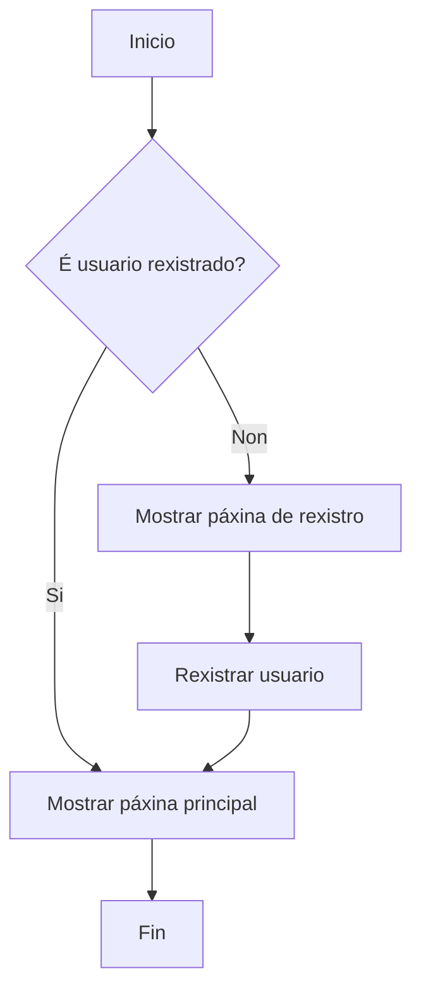
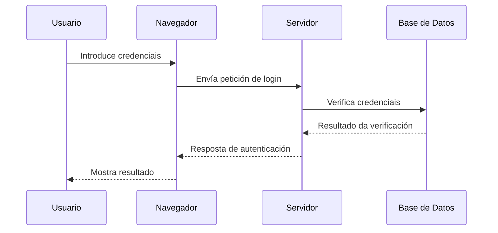
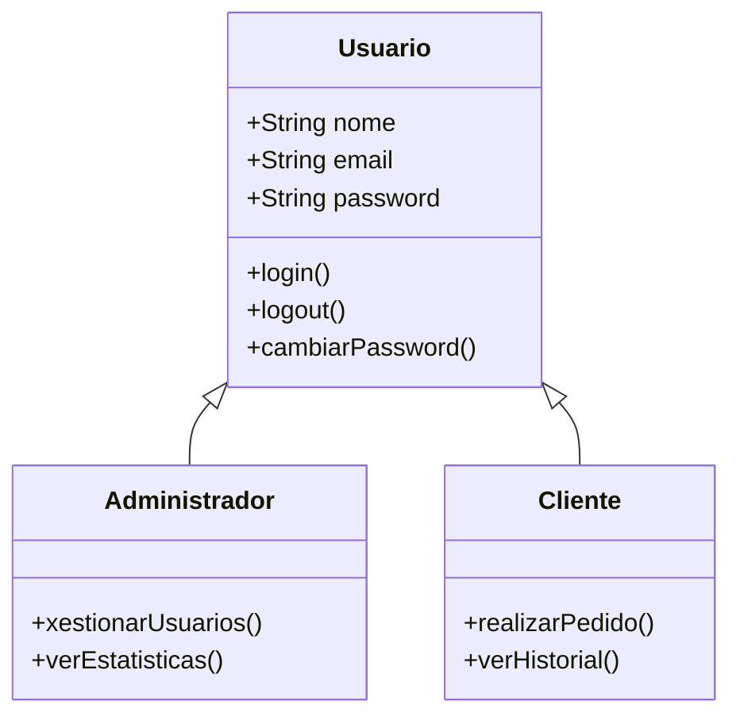
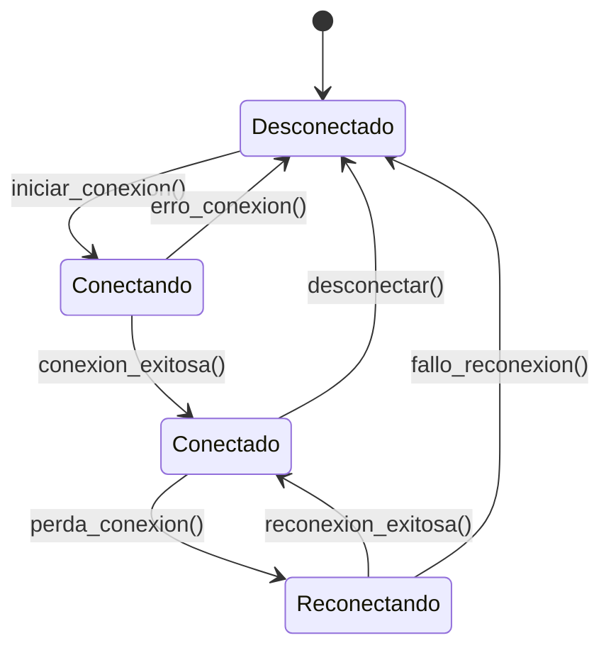
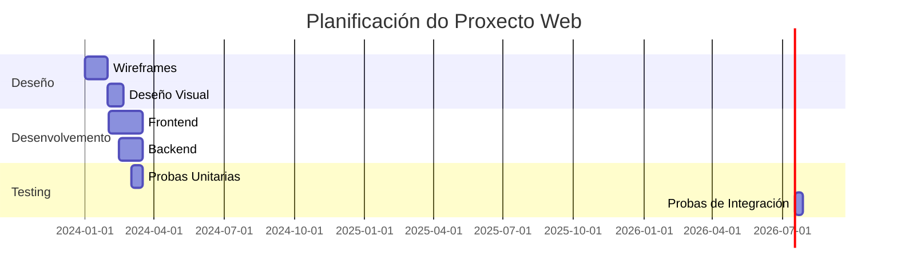
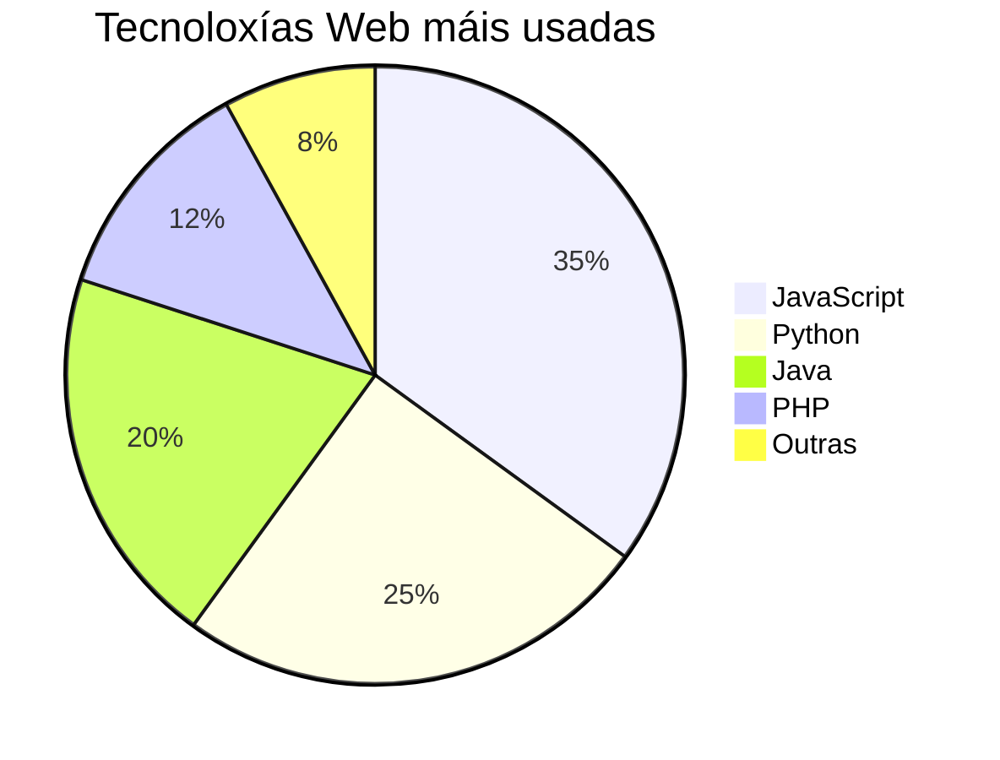
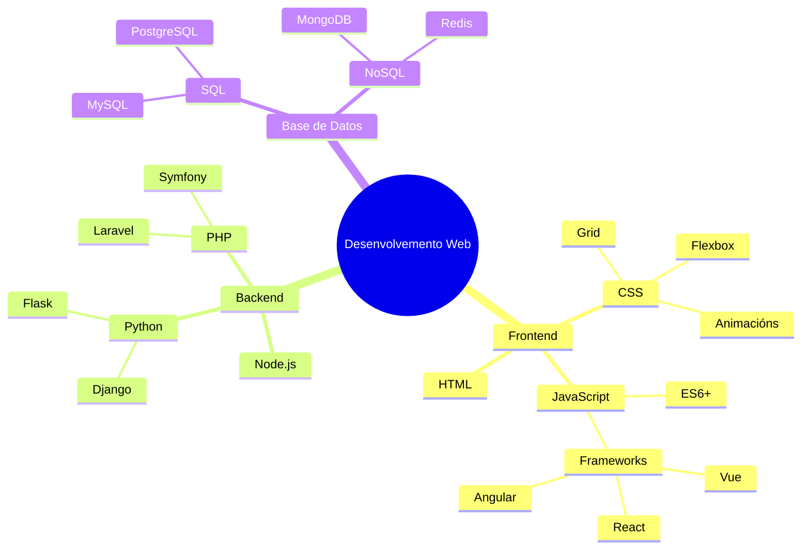

# Mermaid - Diagramas e Gráficos

Mermaid é unha ferramenta que permite crear diagramas e gráficos usando sintaxe de texto simple. É moi útil para documentación técnica, fluxogramas, diagramas de secuencia e moito máis.

## Tipos de Diagramas

### 1. Fluxogramas (Flowcharts)

Os fluxogramas son perfectos para mostrar procesos e decisións:



### 2. Diagramas de Secuencia

Ideais para mostrar interaccións entre diferentes actores:



### 3. Diagramas de Clases

Perfectos para mostrar estruturas de programación orientada a obxectos:



### 4. Diagramas de Estado

Mostran os diferentes estados dun sistema:



### 5. Diagramas de Gantt

Para planificación de proxectos:



### 6. Diagramas de Pastel (Pie Charts)



### 7. Mapas Mentais



## Configuración de Temas

Podes configurar diferentes temas para os teus diagramas:

- `default` - Tema por defecto
- `dark` - Tema escuro
- `forest` - Tema verde
- `neutral` - Tema neutral

## Sintaxe Básica

Para crear un diagrama Mermaid, simplemente usa un bloque de código con `mermaid` como linguaxe:

````markdown
```mermaid
// O teu código de diagrama aquí
```
````

## Recursos Adicionais

- [Documentación oficial de Mermaid](https://mermaid.js.org/)
- [Editor en liña de Mermaid](https://mermaid.live/)
- [Exemplos de diagramas](https://mermaid.js.org/syntax/examples.html)

## Vantaxes de usar Mermaid

1. **Sintaxe simple**: Fácil de aprender e usar
2. **Control de versións**: Os diagramas están en texto plano
3. **Integración**: Funciona perfectamente con VitePress
4. **Responsive**: Os diagramas adáptanse a diferentes tamaños de pantalla
5. **Temas**: Soporte para temas claros e escuros
6. **Exportación**: Podes exportar como SVG ou PNG