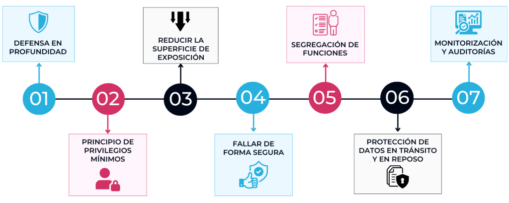

# {{ $frontmatter.title }}

## **1. Introdución**  
> A seguridade web é fundamental para protexer tanto os datos dos usuarios como a infraestrutura do servidor. Cando se publica unha páxina web, é necesario implementar medidas que prevñan ataques como inxeccións SQL, XSS, roubo de datos ou denegación de servizo (DDoS). 

### **Protección integral para aplicacións e infraestruturas**

A seguridade web constitúe un pilar fundamental no desenvolvemento de aplicacións e sitios web, xa que garante a protección tanto da información dos usuarios como dos sistemas que a aloxan. Nun contexto digital cada vez máis complexo e ameazado por ciberriscos, a implementación de estratexias de seguridade robustas convértese en obrigatoria para calquera proxecto en liña.

**Principais ameazas e contramedidas:**

1. **Inxección SQL**: 
   - *Risco*: Permite a execución de código malicioso en bases de datos mediante consultas non validadas.
   - *Solución*: Uso de consultas parametrizadas, ORMs e ferramentas como *[prepared statements](https://www.ionos.es/digitalguide/paginas-web/desarrollo-web/prepared-statements/)*. Validación estrita de inputs.

2. **Cross-Site Scripting (XSS)**:
   - *Risco*: Inxección de scripts maliciosos que se executan no navegador do usuario.
   - *Solución*: Sanitización de datos, implementación de Content Security Policy (CSP) e uso de librarías seguras como DOMPurify.

3. **Ataques DDoS**:
   - *Risco*: Sobrecarga dos servidores mediante tráfico malicioso.
   - *Solución*: Configuración de firewalls, uso de CDNs e servizos especializados como Cloudflare.

4. **Roubo de Datos**:
   - *Risco*: Compromiso de información sensible como credenciais ou datos persoais.
   - *Solución*: Encriptación forte (TLS 1.3), hash con sal para contrasinais e autenticación multifactor.

**Boas Prácticas Adicionais:**
- Actualizacións periódicas de sistemas e dependencias
- Auditorías de seguridade e pentesting regular
- Configuración adecuada de cabeceiras HTTP de seguridade
- Principio de mínimo privilexio en permisos
- Backups cifrados e plan de recuperación ante desastres

A seguridade web non é un produto senón un proceso continuo que require manterse actualizado ante as novas vulnerabilidades e técnicas de ataque. Invertir nunha arquitectura segura dende o deseño ([Security by Design](https://aodatacloud.es/blog/security-by-design-principios-ventajas-y-mejores-practicas/)) aforrará custos e danos reputacionais a medio-longo prazo.



<center><small>*Os 7 principios de Security by Design*</small></center>

*Nota*: Recoméndase seguir os estándares [OWASP](https://owasp.org/www-project-top-ten/) e contar con especialistas en ciberseguridade para proxectos críticos.

---

## **2. Principais características de seguridade**  
A seguridade web é crucial para protexer tanto os teus datos como os dos teus usuarios. 

### **🔒 2.1. Uso de HTTPS (SSL/TLS)**

- **Obxectivo**: Cifrar a comunicación entre o cliente e o servidor.  

#### **Protección de datos en tránsito: Implementación de HTTPS con SSL/TLS**

##### **Obxectivo**

Garantir a **confidencialidade e integridade** dos datos transmitidos entre o cliente e o servidor mediante cifrado forte, evitando ataques como *Man-in-the-Middle (MITM)*, espionaxe ou manipulación de información sensible (credenciais, datos persoais, pagos, etc.).

---

##### **Como implementalo correctamente**

1. **Obtención dun certificado SSL/TLS**  
   - **Opcións gratuítas**:  
     - **Let’s Encrypt** (automatizado con Certbot, renovación automática).  
     - **Cloudflare** (SSL flexible/full/strict en combinación co seu CDN).  
   - **Opcións comerciais** (recomendable para eCommerce, banca, etc.):  
     - **DigiCert**, **Sectigo**, **GlobalSign** (certificados EV con validación estendida).  
   - **Certificados wildcard** (*.dominio.com) para subdominios.  

2. **Configuración do Servidor Web**  
   - **Apache**:  
     ```apache
     <VirtualHost *:80>
         ServerName teudominio.com
         Redirect permanent / https://teudominio.com/
     </VirtualHost>
     <VirtualHost *:443>
         SSLEngine on
         SSLCertificateFile /ruta/certificado.crt
         SSLCertificateKeyFile /ruta/chave-privada.key
         SSLCertificateChainFile /ruta/cadea.crt
     </VirtualHost>
     ```
   - **Nginx**:  
     ```nginx
     server {
         listen 80;
         server_name teudominio.com;
         return 301 https://$server_name$request_uri;
     }
     server {
         listen 443 ssl;
         ssl_certificate /ruta/certificado.pem;
         ssl_certificate_key /ruta/chave-privada.key;
         ssl_protocols TLSv1.2 TLSv1.3;
         ssl_prefer_server_ciphers on;
     }
     ```

3. **Forzar redirección HTTP → HTTPS**  
   - Configurar **HSTS (HTTP Strict Transport Security)** para evitar downgrade attacks:  
     ```http
     Strict-Transport-Security: max-age=63072000; includeSubDomains; preload
     ```
   - Eliminar contido mixto (*mixed content*) con ferramentas como **Why No Padlock?**.

4. **Validación e optimización**  
   - **SSL Labs** (https://www.ssllabs.com/ssltest/): Verificar cualificación *A+*, soporte para TLS 1.3 e cifrados seguros (AES-GCM, ChaCha20).  
   - **Security Headers** (https://securityheaders.com/): Asegurar cabeceiras como `Content-Security-Policy`.  
   - **Renovación automática** (cron jobs para Let’s Encrypt).  

5. **Boas prácticas adicionais**  
   - **OCSP Stapling**: Redución da latencia na validación de certificados.  
   - **Cifrado moderno**: Deshabilitar SSLv3, TLS 1.0/1.1 e cifrados obsoletos (RC4, DES).  
   - **HPKP (deprecado) → Usar Certificate Transparency** (CT logs).  

##### **Impacto**

- ✅ **SEO**: Google prioriza sitios HTTPS no ranking.  
- ✅ **UX**: Indicador de cadeado verde no navegador (confianza do usuario).  
- ✅ **Legal**: Cumpre regulacións como **GDPR**.  

*Nota*: A seguridade non é estática. Revisar anualmente a configuración e estar atento a vulnerabilidades como **Heartbleed** ou **POODLE*.

#### **Como implementalo**:  

- Obter un certificado SSL/TLS (gratuíto con Let’s Encrypt ou de pago con Comodo, Symantec, etc.).  
- Configurar o servidor (Apache, Nginx) para redirixir HTTP → HTTPS.  
- Validar a correcta instalación con ferramentas como [SSL Labs](https://www.ssllabs.com/ssltest/).  

### **🛡️ 2.2. Validación de datos (Input Sanitization)**

- **Obxectivo**: Evitar ataques como **SQL Injection** ou **XSS**.  

#### **Validación e sanitización de datos: Protección contra inxeccións e ataques maliciosos**

##### **Obxectivo**

Garantir que **todos os datos** proporcionados polos usuarios (formularios, URLs, API requests, etc.) sexan **validados, filtrados e sanitizados** antes do seu procesamento, prevenindo vulnerabilidades críticas como:  
- **SQL Injection** (execución de código malicioso en bases de datos).  
- **Cross-Site Scripting (XSS)** (inxección de scripts no navegador das vítimas).  
- **Command Injection** (execución arbitraria de comandos no servidor).  

---

#### **Estratexias de implementación**

##### **1. Validación de entradas (Input Validation)**

- **Definir regras estritas** por tipo de dato:  
  - **Textos**: Lonxitude máxima/mínima, caracteres permitidos (ex.: `^[a-zA-Z0-9_-]+$`).  
  - **Números**: Rangos válidos (ex.: `0-100` para porcentaxes).  
  - **Emails**: Usar funcións nativas (`filter_var($email, FILTER_VALIDATE_EMAIL)` en PHP) ou regex estándar.  
  - **URLs**: Validar estrutura e protocolos permitidos (`http://`, `https://`).  

- **Ferramentas**:  
  - **Librarías**: `Validator.js` (JavaScript), `class-validator` (TypeScript), `OWASP ESAPI`.  
  - **Frameworks**: Validadores integrados en Laravel, Django, Spring Boot.  

##### **2. Sanitización de datos (Input Sanitization)**

- **Eliminar/escapar caracteres perigosos**:  
  - **Bases de datos**: Usar **consultas parametrizadas** (prepared statements):  
    ```php
    // PHP con PDO (evita SQL Injection)
    $stmt = $pdo->prepare("SELECT * FROM usuarios WHERE email = :email");
    $stmt->execute(['email' => $email]);
    ```
  - **HTML/JavaScript**: Sanitizar con `DOMPurify` (XSS prevention):  
    ```javascript
    import DOMPurify from 'dompurify';
    const cleanHTML = DOMPurify.sanitize(userInput);
    ```
  - **Sistemas de templates**: Auto-escaping en Twig (Symfony), Jinja2 (Python), ou React (`dangerouslySetInnerHTML` só en casos excepcionais).  

##### **3. Boas prácticas avanzadas**

- **Principio do mínimo privilexio**:  
  - As consultas á BD deben executarse con usuarios con permisos restritivos (nunca como `root`).  
- **Capa de validación en frontend e backend**:  
  - **Non confiar só no JavaScript** (pode ser deshabilitado). Validar sempre no servidor.  
- **Logging e monitorización**:  
  - Rexistrar intentos de inxección (ferramentas como **OWASP ModSecurity**).  
- **Actualizacións**:  
  - Mantén as librarías de sanitización ([`DOMPurify`](https://github.com/cure53/DOMPurify) (+[1](https://www.incibe.es/incibe-cert/alerta-temprana/vulnerabilidades/cve-2024-45801)), [`html-escaper`](https://github.com/WebReflection/html-escaper)) actualizadas.  

---

#### **Exemplos prácticos por linguaxe**

##### **PHP**

```php
// Validación + Sanitización
$email = filter_var($_POST['email'], FILTER_VALIDATE_EMAIL);
$username = htmlspecialchars($_POST['username'], ENT_QUOTES, 'UTF-8');
```

##### **Python (Django)**

```python
from django.core.validators import validate_email
from django.utils.html import escape

email = validate_email(request.POST['email'])  # Lanza excepción si non é válido
safe_text = escape(request.POST['comentario'])
```

##### **JavaScript (Node.js)**

```javascript
const validator = require('validator');
const cleanInput = validator.escape(maliciousInput);
```

---

#### **Ferramentas recomendadas**

- **OWASP Cheat Sheets**: Guías de validación/sanitización por tecnoloxía.  
- **SonarQube**: Análise estático de código para detectar vulnerabilidades.  
- **Burp Suite**: Testeo manual de inputs en aplicacións web.  

> 🔐 **Lembra**: A validación e sanitización son **esenciais** tanto en aplicacións novas como en proxectos herdados. Inclúe estas prácticas no teu **SDLC** (Ciclo de Vida de Desenvolvemento de Software) dende o deseño inicial.

#### **Boas prácticas**:

- - Usar consultas parametrizadas (prepared statements) en bases de datos.  
  - Filtrado de entradas con librarías como `OWASP ESAPI` ou `DOMPurify` (para JavaScript).  
  - Validar datos con regex ou funcións específicas (ex.: [`filter_var()`](https://www.w3schools.com/php/func_filter_var.asp) en PHP).  

### **🔐 2.3. Xestión segura de contrasinais**

#### **Xestión segura de contrasinais: mellores prácticas e estratexias avanzadas**

##### **🔐 Obxectivo**

Protexer as credenciais dos usuarios mediante técnicas de **almacenamento seguro**, **autenticación robusta** e **protección contra ataques**, garantindo a privacidade e integridade dos datos.  

---

#### **📌 Recomendacións clave**

##### **1. Almacenamento seguro de contrasinais**

✅ **Usar algoritmos de hash modernos e lentos**:  
   - **Bcrypt** (recomendado para a maioría dos casos, xa que inclúe *salt* automático e é resistente a GPU/ASIC).  
   - **Argon2** (gañador do *Password Hashing Competition*, ideal para sistemas que requiren máxima seguridade).  
   - **PBKDF2** (útil en sistemas legados, pero menos eficiente que Bcrypt/Argon2).  

🚫 **Evitar métodos inseguros**:  
   - **MD5, SHA-1, SHA-256** (son rápidos e vulnerables a ataques de forza bruta).  
   - **Encriptación simétrica** (AES, DES) → Os contrasinais deben **hashearse**, non cifrarse.  

📌 **Exemplo de implementación (Node.js con bcrypt)**:  
```javascript
const bcrypt = require('bcrypt');  
const saltRounds = 12; // Coste computacional (recomendado >= 10)  

const hashPassword = async (password) => {  
  return await bcrypt.hash(password, saltRounds);  
};  

const checkPassword = async (password, hash) => {  
  return await bcrypt.compare(password, hash);  
};  
```

---

##### **2. Autenticación en dous factores (2FA)**

✅ **Métodos recomendados**:  
   - **Aplicacións de autenticación** (Google Authenticator, Authy, Microsoft Authenticator).  
   - **Chaves físicas U2F** (YubiKey, Titan Security Key).  
   - **SMS ou correo electrónico** (menos seguro, pero mellor que nada).  

📌 **Exemplo con Node.js e Speakeasy (TOTP)**:  
```javascript
const speakeasy = require('speakeasy');  

// Xerar secreto 2FA  
const secret = speakeasy.generateSecret({ length: 20 });  

// Verificar código  
const verified = speakeasy.totp.verify({  
  secret: secret.base32,  
  encoding: 'base32',  
  token: userProvidedToken  
});  
```

---

##### **3. Protección contra ataques de forza bruta**

✅ **Estratexias de mitigación**:  
   - **Límite de intentos** (bloquear tras 3-5 intentos fallidos).  
   - **Retardos exponenciais** (ex.: 1s, 2s, 4s, 8s…).  
   - **CAPTCHA** (reCAPTCHA v3 para evitar bots).  
   - **Listas negras de IPs** (usando fail2ban ou Cloudflare WAF).  

📌 **Exemplo en PHP con bloqueo temporal**:  
```php
session_start();  
if ($_SESSION['login_attempts'] >= 5) {  
  die("Demasiados intentos. Espera 10 minutos.");  
}  

if (!password_verify($input_password, $stored_hash)) {  
  $_SESSION['login_attempts']++;  
  sleep($_SESSION['login_attempts']); // Retardo exponencial  
}  
```

---

##### **🔧 Boas prácticas adicionais**

- **Requisitos de complexidade**:  
  - Mínimo **12 caracteres** (letras, números, símbolos).  
  - Evitar contrasinais comúns (`123456`, `password`).  
- **Renovación periódica** (cada 3-6 meses en sistemas críticos).  
- **Notificacións de acceso sospeitoso** (email/alerta por novo dispositivo).  

---

##### **📊 Comparativa de algoritmos de ``hash``**

| Algoritmo  | Resistencia a GPU/ASIC | Salt automático | Velocidade  |
| ---------- | ---------------------- | --------------- | ----------- |
| **Bcrypt** | ✅ Alta                 | ✅ Si            | ⏳ Lento     |
| **Argon2** | ✅ Moi Alta             | ✅ Si            | ⏳ Moi Lento |
| **PBKDF2** | ❌ Moderada             | ❌ Non           | 🏎️ Rápido    |

---

##### **🚀 Conclusión**

Unha **xestión segura de contrasinais** require:  
1. **Hash robusto** (Bcrypt/Argon2).  
2. **2FA** para autenticación adicional.  
3. **Protección contra forza bruta**.  
4. **Monitorización continua** para detectar intentos de compromiso.  

🔗 **Recursos recomendados**:  
- [OWASP Password Storage Cheat Sheet](https://cheatsheetseries.owasp.org/cheatsheets/Password_Storage_Cheat_Sheet.html)  
- [Have I Been Pwned?](https://haveibeenpwned.com/) (para verificar contrasinais comprometidos).  

Implementar estas medidas reducirá drasticamente o risco de **fuga de credenciais** e **ataques a contas de usuario**.

- **Recomendacións**:  
  - Almacenar contrasinais con **hash seguro** (bcrypt, Argon2).  
  - Implementar autenticación en dous factores (2FA).  
  - Limitar intentos de inicio de sesión para evitar **forza bruta**.  

### **🚫 2.4. Protección contra CSRF (Cross-Site Request Forgery). Estratexias Avanzadas**

#### **🔐 Obxectivo**

Prevenir que un atacante engane a usuarios autenticados para realizar accións non desexadas nunha aplicación web, garantindo que todas as peticións legítimas proveñan do sitio web orixinal.

---

#### **📌 Solucións efectivas**

##### **1. Tokens CSRF (Synchronizer Token Pattern)**

✅ **Como funciona**:
   - O servidor xera un token único e aleatorio para cada sesión de usuario.
   - O token inclúese en formularios ou peticións AJAX como campo oculto.
   - O servidor valida o token en cada petición POST/PUT/DELETE.

✅ **Implementación**:
   - **En formularios**:
     ```html
     <form action="/transferencia" method="POST">
       <input type="hidden" name="_csrf" value="token-xerado-polo-servidor">
       <!-- Outros campos -->
     </form>
     ```
   - **En APIs REST** (cabeceira HTTP):
     ```http
     X-CSRF-Token: token-xerado-polo-servidor
     ```

   - **Exemplo en Express.js**:
     ```javascript
     const csrf = require('csurf');
     app.use(csrf({ cookie: true }));
     ```

##### **2. Configuración segura de *cookies***

✅ **Cabeceira `SameSite`**:
   - `SameSite=Strict`: A cookie só se envía en solicitudes do mesmo sitio (máis seguro).
   - `SameSite=Lax` (recomendado): Permite algunhas solicitudes cruzadas (ex.: navegación básica).
   - `SameSite=None`: Só se usa con `Secure` (HTTPS obrigatorio).

   - **Exemplo de configuración**:
     ```http
     Set-Cookie: sessionId=123; SameSite=Lax; Secure; HttpOnly
     ```

##### **3. Dobre envío de cookies (Double Submit Cookie)**

✅ **Alternativa sen almacenamento no servidor**:
   - O servidor envía un token como cookie e espera o mesmo valor nun campo de formulario.
   - Útil para arquitecturas sen estado (stateless).

---

#### **🔧 Boas prácticas adicionais**

##### **4. Validación de orixe (Origin/Referer Headers)**

   - Rexeitar peticións con cabeceiras `Origin` ou `Referer` sospeitosas:
     ```javascript
     app.use((req, res, next) => {
       const origin = req.get('Origin');
       if (!allowedOrigins.includes(origin)) {
         return res.status(403).send('Prohibido');
       }
       next();
     });
     ```

##### **5. Limitación temporal de *tokens***

   - Invalidar tokens CSRF despois dun tempo ou despois do primeiro uso (para operacións críticas).

##### **6. CAPTCHA para accións críticas**

   - Engadir CAPTCHA en operacións sensibles (transferencias, cambios de contrasinal).

---

#### **📊 Comparativa de métodos CSRF**

| Método               | Vantaxes                  | Desvantaxes                            |
| -------------------- | ------------------------- | -------------------------------------- |
| **Tokens CSRF**      | Alta seguridade           | Require almacenamento no servidor      |
| **SameSite Cookies** | Sinxelo de implementar    | Compatibilidade con navegadores vellos |
| **Double Submit**    | Ideal para APIs stateless | Menos seguro que tokens tradicionais   |

---

#### **🚀 Conclusión**

Unha defensa completa contra CSRF require:
1. **Tokens CSRF** para formularios e APIs.
2. **Cookies con `SameSite=Lax`** como capa adicional.
3. **Validación de cabeceiras** `Origin/Referer`.
4. **CAPTCHA** para operacións de alto risco.

🔗 **Recursos recomendados**:
- [OWASP CSRF Cheat Sheet](https://cheatsheetseries.owasp.org/cheatsheets/Cross-Site_Request_Forgery_Prevention_Cheat_Sheet.html)
- [Guía de SameSite Cookies de Google](https://web.dev/samesite-cookies-explained/)

Implementar estas medidas reducirá drasticamente o risco de ataques CSRF na túa aplicación web.

- **Solucións**:  
  - Uso de **tokens CSRF** en formularios.  
  - Configurar a cabeceira `SameSite` en cookies.  

### **📁 2.5. Configuración segura do servidor**  

##### **🔐 Obxectivo**

Garantir que o servidor web estea configurado con medidas de seguridade robustas para previr ataques, fuga de información e vulnerabilidades críticas.

---

#### **📌 Medidas clave de seguridade**

##### **1. Xestión de actualizacións**

✅ **Mellor práctica**:
   - **Actualizacións automáticas** (cando sexa posible):
     ```bash
     # Ubuntu/Debian (actualizacións de seguridade automáticas)
     sudo apt-get install unattended-upgrades
     sudo dpkg-reconfigure --priority=low unattended-upgrades
     ```
   - **Versións LTS** (Long-Term Support) para software crítico (Ubuntu Server, Nginx Stable).
   - **CMS**: Usar plugins de actualización automática para WordPress/Drupal (ex.: "Easy Updates Manager").

⚠️ **Comprobación manual mensual** para:
   - Servidor web (Apache/Nginx)
   - Linguaxes (PHP, Python, Node.js)
   - Bases de datos (MySQL, PostgreSQL)
   - CMS e plugins

##### **2. Xestión de permisos de arquivos**

✅ **Estrutura recomendada**:
   - `chmod 644` para arquivos (lectura/escrita para propietario, só lectura para outros).
   - `chmod 755` para directorios (execución necesaria para navegar).
   - `chown www-data:www-data` (usuario específico do servidor web).

🚫 **Permisos perigosos a evitar**:
   - `777` (acceso total para todos)
   - `666` (escrita aberta)

📌 **Exemplo de fixura masiva**:
```bash
# Arxivos
find /var/www/html -type f -exec chmod 644 {} \;

# Directorios
find /var/www/html -type d -exec chmod 755 {} \;

# Propiedade
chown -R www-data:www-data /var/www/html
```

##### **3. Configuración segura do servidor web**

🔧 **Apache**:
   - Desactivar listaxe de directorios:
     ```apache
     Options -Indexes
     ```
   - Deshabilitar assinatura do servidor:
     ```apache
     ServerSignature Off
     ServerTokens Prod
     ```

🔧 **Nginx**:
   - Ocultar versión:
     ```nginx
     server_tokens off;
     ```
   - Desactivar métodos inseguros:
     ```nginx
     if ($request_method !~ ^(GET|HEAD|POST)$ ) {
         return 405;
     }
     ```

##### **4. Configuración adicional crítica**

✅ **PHP (php.ini)**:
   ```ini
   expose_php = Off
   disable_functions = exec,passthru,shell_exec,system
   allow_url_fopen = Off
   ```

✅ **Protección contra ataques DDoS**:
   - Limitar conexións simultáneas:
     ```nginx
     limit_conn_zone $binary_remote_addr zone=conn_limit:10m;
     limit_conn conn_limit 20;
     ```

✅ **Firewall (UFW)**:
   ```bash
   sudo ufw allow 80/tcp
   sudo ufw allow 443/tcp
   sudo ufw enable
   ```

---

#### **🔧 Ferramentas recomendadas**

- **Lynis**: Auditoría de seguridade do servidor
  ```bash
  sudo apt-get install lynis
  sudo lynis audit system
  ```
- **Fail2Ban**: Protección contra forza bruta
  ```bash
  sudo apt-get install fail2ban
  ```
- **CIS Benchmarks**: Configuracións seguras estándar

---

#### **📊 Táboa de comprobación rápida**

| Medida          | Comando/Configuración                         | Prioridade |
| --------------- | --------------------------------------------- | ---------- |
| Actualizacións  | `sudo apt update && sudo apt upgrade`         | Alta       |
| Permisos        | `find /var/www -type d -exec chmod 755 {} \;` | Alta       |
| Ocultar versión | `ServerTokens Prod` (Apache)                  | Media      |
| Firewall        | `sudo ufw enable`                             | Alta       |

---

#### **🚀 Conclusión**

Unha configuración segura do servidor require:
1. **Actualizacións constantes** de todo o software.
2. **Xestión estrita de permisos** (principio do mínimo privilexio).
3. **Configuracións específicas** para Apache/Nginx/PHP.
4. **Ferramentas adicionais** de monitorización e protección.

🔗 **Recursos**:
- [Guía de Seguridade de Apache](https://httpd.apache.org/docs/2.4/misc/security_tips.html)
- [Bancos de probas CIS](https://www.cisecurity.org/cis-benchmarks/)

Implementar estas medidas reducirá drasticamente a superficie de ataque do teu servidor web.

- **Medidas clave**:  
  - Actualizar sempre o software (PHP, Apache, Nginx, CMS como WordPress).  
  - Restrinxir permisos de arquivos (`chmod 644` para arquivos, `755` para directorios).  
  - Desactivar a listaxe de directorios (`Options -Indexes` en Apache).  

### **🔄 2.6. Copias de seguridade (Backups)**

#### **🔐 Obxectivo**

Implementar un sistema de copias de seguridade **resistente a fallos** que protexa contra:
- Erros humanos
- Ataques ransomware
- Fallos de hardware
- Desastres naturais

---

#### **📌 Estratexia completa de *backups***

##### **1. Política 3-2-1 (Estándar Ouro)**

✅ **3** copias dos datos  
✅ **2** medios de almacenamento diferentes  
✅ **1** copia en localización remota  

##### **2. Almacenamento seguro**

| Opción                      | Vantaxes                      | Recomendación                           |
| --------------------------- | ----------------------------- | --------------------------------------- |
| **AWS S3**                  | Alta durabilidade, versionado | Usar S3 Intelligent-Tiering para aforro |
| **Backblaze B2**            | Máis barato que S3            | Ideal para PYMEs                        |
| **Google Drive Enterprise** | Integración con GSuite        | Cifrado con rclone                      |
| **Servidor NAS local**      | Acceso rápido                 | RAID 5/6 + copia en nube                |

📌 **Exemplo AWS CLI para backup cifrado**:
```bash
aws s3 sync /var/www/ s3://meu-bucket-backup/ \
--sse AES256 \
--exclude "*.tmp" \
--delete
```

##### **3. Automatización con *cron* e ferramentas especializadas**

🔧 **Opcións**:
- **Duplicity** (backups incrementais cifrados)
- **BorgBackup** (deduplicación e compresión)
- **Rsync + SSH** (para transferencias seguras)

📌 **Exemplo de cron para backup diario**:
```bash
0 3 * * * /usr/bin/duplicity /var/www scp://user@backup-server:/backups --encrypt-key=ABCD1234
```

##### **4. Proba de restauración (o paso máis crítico!)**

✅ **Protocolo obrigatorio**:
1. Probar restauración **trimestralmente**
2. Documentar tempo de recuperación (RTO)
3. Verificar integridade de datos (checksums)

📌 **Checklist de verificación**:
- [ ] Os arquivos restauran sen erros
- [ ] As bases de datos son consistentes
- [ ] Os permisos se mantén
- [ ] O CMS funciona correctamente

##### **5. Seguridade adicional**

- **Cifrado**: AES-256 para datos en tránsito e en repouso
- **Control de acceso**: MFA para buckets S3/Backblaze
- **Retención**: Política de 90 días para borrado accidental
- **Monitorización**: Alertas por fallos de backup

---

#### **🔧 Integración con sistemas CI/CD**

```yaml
# Exemplo GitLab CI
backup_production:
  stage: deploy
  script:
    - mysqldump -u $DB_USER -p$DB_PASS $DB_NAME | gzip > backup.sql.gz
    - aws s3 cp backup.sql.gz s3://meu-bucket/$(date +%Y-%m-%d).sql.gz
  only:
    - cron  # Executar diariamente
```

---

##### **📊 Táboa de recuperación ante desastres**

| Escenario           | Procedemento                      | Tempo estimado |
| ------------------- | --------------------------------- | -------------- |
| Borrado accidental  | Restaurar de S3 versionado        | <1h            |
| Ataque ransomware   | Restauración completa de snapshot | 2-4h           |
| Fallo do datacenter | Activar réplica en outra rexión   | 30min          |

---

#### **🚀 Conclusión**

Un sistema de backups profesional require:
1. **Automatización completa** con ferramentas especializadas
2. **Cifrado end-to-end** de todos os datos
3. **Probas regulares** de restauración
4. **Integración** co fluxo de desenvolvemento

🔗 **Recursos**:
- [Guía NIST de Backup](https://www.nist.gov/itl)
- [AWS Well-Architected Backup](https://aws.amazon.com/architecture/well-architected)

Implementar esta estratexia garantirá que os teus datos sobrevivan a calquera incidente crítico.

- **Estratexia**:  
  - Facer backups **automáticos** e almacenalos en servidores seguros (ex.: AWS S3, Google Drive cifrado).  
  - Probar a restauración periodicamente.  

### **🔍 2.7. Monitorización e rexistro (Logging)**  

##### **🔐 Obxectivo**

Implementar un sistema exhaustivo de monitorización e rexistro que permita:
- Detectar e responder a incidentes de seguridade en tempo real
- Cumprir con regulacións de protección de datos (GDPR, PCI DSS)
- Analizar o rendemento e comportamento da aplicación
- Investigar incidentes de forma retrospectiva

---

#### **📌 Ferramentas e técnicas esenciais**

##### **1. Xestión de rexistros (Logging)**

✅ **Rexistros básicos obrigatorios**:
   - **Apache**:
     ```apache
     CustomLog /var/log/apache2/access.log combined
     ErrorLog /var/log/apache2/error.log
     ```
   - **Nginx**:
     ```nginx
     access_log /var/log/nginx/access.log;
     error_log /var/log/nginx/error.log warn;
     ```

✅ **Boas prácticas**:
   - Rotación diaria de logs con **logrotate**:
     ```bash
     /var/log/nginx/*.log {
         daily
         missingok
         rotate 14
         compress
         delaycompress
         notifempty
         create 0640 www-data adm
         sharedscripts
         postrotate
             /usr/bin/systemctl reload nginx.service >/dev/null 2>&1 || true
         endscript
     }
     ```
   - Envío a **syslog** centralizado para maior seguridade

##### **2. Ferramentas de seguridade avanzada**

🛡️ **Fail2Ban**:
   - Filtrado inteligente de IPs maliciosas
   - Exemplo de configuración para WordPress:
     ```ini
     [wordpress-auth]
     enabled = true
     filter = wordpress
     logpath = /var/log/nginx/access.log
     maxretry = 3
     bantime = 86400
     ```

🛡️ **ModSecurity** (WAF - Web Application Firewall):
   - Regras OWASP CRS (Core Rule Set)
   - Configuración básica:
     ```apache
     <IfModule security2_module>
         SecRuleEngine On
         SecAuditLog /var/log/modsecurity/modsec_audit.log
         Include /etc/modsecurity/crs-setup.conf
         Include /etc/modsecurity/rules/*.conf
     </IfModule>
     ```

##### **3. Solucións profesionais de monitorización**

🔍 **Stack ELK (Elasticsearch, Logstash, Kibana)**:
   - Centralización e análise de logs
   - Dashboard para visualización de ataques

📈 **Prometheus + Grafana**:
   - Monitorización en tempo real
   - Alertas personalizadas

☁️ **Solucións en nube**:
   - AWS CloudWatch
   - Google Cloud Logging
   - Azure Monitor

---

#### **🔧 Configuración avanzada**

##### **4. Rexistros estruturados (JSON)**

```nginx
log_format json_combined escape=json
    '{'
        '"time_local":"$time_local",'
        '"remote_addr":"$remote_addr",'
        '"request":"$request",'
        '"status": "$status",'
        '"user_agent":"$http_user_agent"'
    '}';

access_log /var/log/nginx/access.log json_combined;
```

##### **5. Monitorización de actividade sospeitosa**

- Patróns a monitorizar:
  - Intentos de inxección SQL (`UNION SELECT`, `DROP TABLE`)
  - Escaneo de vulnerabilidades (`/wp-admin`, `/phpmyadmin`)
  - Ataques XSS (`<script>`, `alert(`)

##### **6. Integración con SIEM**

- Solucións como **Splunk** ou **Wazuh**
- Correlación de eventos entre múltiples fontes

---

#### **📊 Táboa de priorización de alertas**

| Nivel     | Tipo de Incidente  | Exemplo                 | Acción             |
| --------- | ------------------ | ----------------------- | ------------------ |
| 🔴 Crítico | Ataque DDoS        | 1000+ requests/seg      | Activar mitigación |
| 🟡 Alto    | Forza bruta        | 10+ intentos login      | Bloquear IP        |
| 🔵 Medio   | Scanner automático | User-Agent "nikto"      | Rexistrar          |
| ⚪ Baixo   | Erros 404          | Arquivos non existentes | Ignorar            |

---

#### **🚀 Conclusión**

Un sistema de monitorización profesional require:
1. **Rexistros detallados** con rotación e almacenamento seguro
2. **Ferramentas especializadas** (Fail2Ban, ModSecurity)
3. **Análise centralizada** (ELK, SIEM)
4. **Protocolos de resposta** a incidentes

🔗 **Recursos**:
- [Guía OWASP de Logging](https://cheatsheetseries.owasp.org/cheatsheets/Logging_Cheat_Sheet.html)
- [Documentación oficial de ModSecurity](https://www.modsecurity.org/)

Implementar estas medidas proporcionará visibilidade completa sobre a seguridade e rendemento das túas aplicacións web.

- **Ferramentas útiles**:  
  - **Fail2Ban** (para bloquear IPs maliciosas).  
  - **ModSecurity** (firewall para aplicacións web).  
  - Rexistros de acceso/erro en Apache/Nginx (`access.log`, `error.log`).  

---

## **3. Ferramentas de análise de seguridade**  

##### **🔐 Obxectivo**

Identificar e mitigar vulnerabilidades en aplicacións web mediante ferramentas especializadas que cubran diferentes capas de seguridade, dende a infraestrutura ata o código fonte.

---

#### **📌 Ferramentas esenciais por categoría**

##### **1. Análise de vulnerabilidades en aplicacións web**

🛡️ **[OWASP ZAP](https://www.zaproxy.org/)** (Zed Attack Proxy)
   - **Características avanzadas**:
     - Escaneo activo/pasivo
     - Interceptación de tráfico (proxy)
     - Detección de OWASP Top 10 (XSS, SQLi, CSRF)
     - API para integración CI/CD
   - **Uso recomendado**:
     ```bash
     zap-cli quick-scan --self-contained --start-options '-config api.key=12345' http://example.com
     ```

🔍 **[Burp Suite](https://portswigger.net/burp)**
   - **Versión Pro** para pentesting profesional
   - Scanner automático de vulnerabilidades
   - Análise de business logic flaws

##### **2. Escaneo de infraestrutura**

🔎 **[Nmap](https://nmap.org/)**
   - **Comandos avanzados**:
     - Detección de servizos: `nmap -sV -O IP`
     - Escaneo completo: `nmap -p- -T4 -A -v IP`
     - Scripts NSE: `nmap --script vuln IP`
   - **Alternativas**:
     - [Masscan](https://github.com/robertdavidgraham/masscan) (escaneo rápido)
     - [RustScan](https://github.com/RustScan/RustScan) (escaneo con Rust)

##### **3. Seguridade en contido e malware**

🦠 **[Sucuri](https://sucuri.net/)**
   - **Funcionalidades premium**:
     - Limpeza automática de malware
     - Firewall aplicativo (WAF)
     - Monitorización de blacklists
   - **Alternativas open-source**:
     - [Lynis](https://cisofy.com/lynis/) (auditoría de servidores)
     - [ClamAV](https://www.clamav.net/) (antivirus para servidores)

##### **4. Análise estático de código (SAST)**

💻 **[Semgrep](https://semgrep.dev/)**
   - Detección de vulnerabilidades en código
   - Soporte para múltiples linguaxes
   - Integración con GitHub/GitLab

📜 **[SonarQube](https://www.sonarqube.org/)**
   - Análise continuo de calidade de código
   - Detección de security hotspots

---

#### **🔧 Integración en pipelines CI/CD**

```yaml
# Exemplo GitLab CI
stages:
  - security

owasp_zap_scan:
  stage: security
  image: owasp/zap2docker-stable
  script:
    - zap-baseline.py -t https://${URL} -r report.html
  artifacts:
    paths: [report.html]

nmap_scan:
  stage: security
  image: instrumentisto/nmap
  script:
    - nmap -sV --script vuln -oA scan ${URL}
```

---

#### **📊 Táboa comparativa**

| Ferramenta     | Tipo    | Licenza     | Puntos Fortes              |
| -------------- | ------- | ----------- | -------------------------- |
| **OWASP ZAP**  | DAST    | Open-source | Detección OWASP Top 10     |
| **Burp Suite** | DAST    | Comercial   | Análise avanzado manual    |
| **Nmap**       | Network | Open-source | Escaneo de portos/servizos |
| **Sucuri**     | WAF     | SaaS        | Protección en tempo real   |
| **Semgrep**    | SAST    | Open-source | Análise de código rápido   |

---

#### **🚀 Boas prácticas adicionais**

1. **Escaneos regulares** (semanalmente en producción)
2. **Combinar ferramentas** (SAST + DAST + WAF)
3. **Priorizar vulnerabilidades** usando CVSS
4. **Documentar resultados** en sistemas como DefectDojo

Implementar estas ferramentas como parte do teu SDLC reducirá drasticamente os riscos de seguridade nos teus proxectos web.

🔗 **Recursos**:

- [**Guía OWASP de Testing**](https://owasp.org/www-project-web-security-testing-guide/)
- [**NIST Security Tools**](https://www.nist.gov/itl/ssd/software-quality-group/security-tools)

- **[OWASP ZAP](https://www.zaproxy.org/)**: Escáner de vulnerabilidades.  
- **[Nmap](https://nmap.org/)**: Para analizar portos abertos.  
- **[Sucuri](https://sucuri.net/)**: Escaneo de malware e protección DDoS.  

---

## **4. Conclusión**  
A seguridade web debe ser unha prioridade dende o deseño ata a publicación. Implementar HTTPS, validar datos, xestionar contrasinais con hash e manter o servidor actualizado son pasos esenciais. Ademais, é recomendable realizar auditorías periódicas con ferramentas como OWASP ZAP para detectar vulnerabilidades a tempo.  

👉 **Acción recomendada**: Se usas un CMS como WordPress, instala plugins de seguridade como **Wordfence** ou **Sucuri Security**.  

---

#### Lecturas adicionais:
- [PHP MySQL Prepared Statements](https://www.w3schools.com/php/php_mysql_prepared_statements.asp)


---

DAW🧊2026