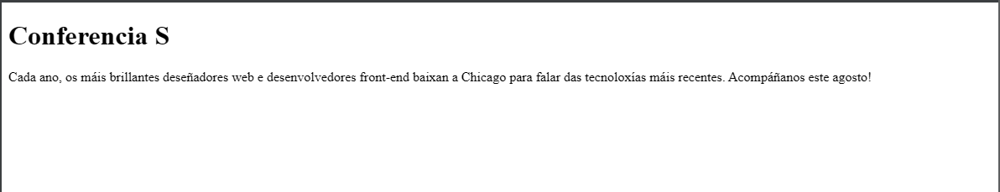
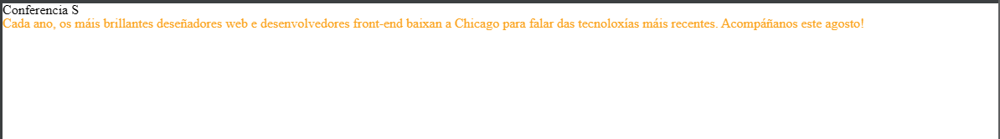

# Creando a túa primeira páxina web

Se podes, imaxina un tempo antes da invención de Internet. Os sitios web non existían e os libros, impresos en papel e ben encadernados, eran a túa principal fonte de información. Foi necesario un esforzo considerable -e ler- para rastrexar a información exacta que buscabas.

Hoxe pode abrir un navegador web, ir ao motor de busca que prefire e buscar. Calquera pouco de información imaxinable está ao teu alcance. E é probable que alguén nalgún lugar construíu un sitio web coa túa busca exacta en mente.

Dentro deste libro vouche mostrar como crear os teus propios sitios web usando os dous linguaxes informáticos máis dominantes: HTML e CSS.

Antes de comezar a nosa viaxe para aprender a crear sitios web con HTML e CSS, é importante comprender as diferenzas entre as dúas linguas, a sintaxe de cada lingua e algunha terminoloxía común.

## Que son HTML e CSS?

*HTML* , HyperText Markup Language, dá estrutura e significado ao contido ao definir ese contido como, por exemplo, títulos, parágrafos ou imaxes. *CSS* , ou Follas de estilo en cascada, é unha linguaxe de presentación creada para estilizar a aparencia do contido, utilizando, por exemplo, fontes ou cores.

Os dous idiomas, HTML e CSS, son independentes un do outro e deberían seguir sendo así. CSS non debe escribirse dentro dun documento HTML e viceversa. Por regra xeral, HTML sempre representará o contido e CSS sempre representará a aparencia dese contido.

Con esta comprensión da diferenza entre HTML e CSS, imos mergullarnos en HTML con máis detalle.

## Comprensión dos termos HTML comúns

Mentres comezas co HTML, é probable que atopes [termos](http://www.scriptingmaster.com/html/HTML-terms-glossary.asp) novos, e moitas veces estraños. Co paso do tempo irás familiarizándote cada vez máis con todos eles, pero os tres termos HTML comúns cos que deberías comezar son: ***elemento*, *etiqueta* e *atributo***.

### Elemento

Os elementos son designadores que **definen a estrutura e o contido dos obxectos dentro dunha páxina**. Algúns dos elementos máis utilizados inclúen varios niveis de títulos (identificados cos elementos `<h1>` ata  `<h6>`) e parágrafos (identificados co elemento `<p>`); a lista continúa incluíndo os elementos `<a>`, `<div>`, `<span>`, `<strong>` e `<em>` e moitos máis.

**Os elementos identifícanse mediante o uso de corchetes angulares, `< >`, que rodean o nome do elemento**. Así, un elemento terá o seguinte aspecto:

```html
<a>        
```

### Etiqueta

O uso de corchetes angulares *menor-que* &lt; , e *maior-que* &gt;, que rodean un elemento crea o que se coñece como ***etiqueta***. As etiquetas adoitan aparecer en parellas de etiquetas de apertura e peche.

Unha ***etiqueta de apertura*** marca o inicio dun elemento. Consiste nun signo &lt; seguido do nome dun elemento e, a continuación, remata cun signo &gt;; por exemplo, `<div>`.

Unha ***etiqueta de peche*** marca o final dun elemento. Consiste nun signo &lt; seguido dunha barra inclinada / e do nome do elemento, e despois remata cun signo  &gt; ; por exemplo, `</div>`.

**O contido que se sitúa entre as etiquetas de apertura e peche é o contido dese elemento**. Unha ligazón de ancoraxe, por exemplo, terá unha etiqueta de apertura `<a>` e unha etiqueta de peche `</a>`. O que se sitúa entre estas dúas etiquetas será o contido da ligazón de ancoraxe que visualizará o usuario.

Entón, as etiquetas de ancoraxe terán un aspecto similar ao seguinte:

```html
<a>...</a> 
```

### Atributo

Os **atributos** son propiedades que **se usan para proporcionar información adicional sobre un elemento**. Os atributos máis comúns inclúen o atributo `id`, que identifica un elemento; o atributo `class`, que *clasifica* un elemento; o atributo `src`, que especifica unha fonte para o contido a incluír; e o atributo `href`, que proporciona unha referencia de hiperligazón a un recurso enlazado.

**Os atributos defínense dentro da etiqueta de apertura, despois do nome dun elemento**. Xeralmente os atributos inclúen un nome e un valor. O formato destes atributos consiste no nome do atributo seguido dun signo de igual e despois dun valor de atributo citado. Por exemplo, un elemento `<a>` que inclúa un atributo `href` sería o seguinte:

```html
<a href="http://shayhowe.com/">Shay Howe</a>
```

#### Demostración de termos HTML comúns

O código anterior mostrará o texto "Shay Howe" na páxina web e levará aos usuarios a http://shayhowe.com/ ao facer clic no texto "Shay Howe". O elemento de áncora declárase coas etiquetas de apertura `<a>` e peche `</a>` que abranguen o texto, e o atributo e o valor de referencia da hiperligazón    `href="http://shayhowe.com"`  decláranse na etiqueta de apertura.


**Figura 1:** *Esquema de sintaxe HTML que inclúe un elemento, un atributo e unha etiqueta.*

Agora que sabes cales son os elementos, as etiquetas e os atributos HTML, vexamos a creación da nosa primeira páxina web. Se algo parece novo aquí, non te preocupes, descifrarémolo a medida que avancemos.

## Configurar a estrutura do documento HTML

Os documentos HTML son documentos de texto sinxelo gardados cunha extensión de arquivo `.html` en lugar de cunha extensión de arquivo `.txt`. Para comezar a escribir HTML, primeiro necesitas un editor de texto sinxelo que che guste usar. Desafortunadamente, isto non inclúe Microsoft Word, Libre Office ou Pages, xa que son editores de texto enriquecido. Dous dos editores de texto sinxelo máis populares para escribir HTML e CSS son VSCode e Sublime Text. As alternativas, gratuítas, tamén inclúen Phoenix Code, Notepad++,… ou TextWrangler(Mac).

Todos os documentos HTML teñen unha estrutura obrigatoria que inclúe a seguinte declaración e elementos: `<!DOCTYPE html>`, `<html>`, `<head>` e `<body>`.

A declaración de tipo de documento, ou `<!DOCTYPE html>`, informa aos navegadores web cal é a versión de HTML que se está a utilizar e sitúase ao principio do documento HTML. Como usaremos a versión máis recente de HTML, a nosa declaración de tipo de documento é simplemente `<!DOCTYPE html>`. Despois da declaración do tipo de documento, o elemento `<html>` significa o inicio do documento.

Dentro do elemento `<html>`, o elemento `<head>` identifica a parte superior do documento, incluíndo os metadatos (información que se acompaña sobre a páxina). O contido do elemento `<head>` non se mostra na propia páxina web. Pola contra, pode incluír o título do documento (que se mostra na barra de título da xanela do navegador), ligazóns a calquera arquivo externo ou calquera outro metadato beneficioso.

Todo o contido visible dentro da páxina web estará dentro do `<body>`elemento. Un desglose dunha estrutura de documento HTML típica é o seguinte:

```html
<!DOCTYPE html>
<html lang="gl">
  <head>
    <meta charset="utf-8">
    <title>Ola Mundo!</title>
  </head>
  <body>
    <h1>Ola Mundo!</h1>
    <p>Isto é unha páxina web.</p>
  </body>
</html>    
```

#### Demostración da estrutura do documento HTML

O código anterior mostra o documento que comeza coa declaración de tipo de documento, `<!DOCTYPE html>`, seguido directamente do elemento `<html>`. Dentro do elemento `<html>` veñen os elementos `<head>` e `<body>`. O elemento `<head>` inclúe a codificación de caracteres da páxina mediante a etiqueta `<meta charset="utf-8">` e o título do documento mediante o elemento `<title>`. O elemento `<body>` inclúe un título a través do elemento `<h1>` e un parágrafo a través do elemento `<p>`. Dado que tanto o título como o parágrafo están aniñados dentro do elemento `<body>`, son visibles na páxina web.

:information_source: *Como os espazos en branco entre etiquetas non afecta ao código, mentres escribes o código da túa páxina, cando un elemento se coloca dentro doutro elemento - aniñado de etiquetas-, é unha boa idea sangrar - indentar- ese elemento aniñado para manter a estrutura do documento ben organizada e lexible. No código anterior, tanto os elementos `<head>` como `<body>` están aniñados -e sangrados- dentro do elemento `<html>`. O patrón de sangría dos elementos continúa a medida que se engaden novos elementos dentro dos elementos `<head>` e `<body>`.*

#### Elementos de autopeche

No exemplo anterior, o elemento `<meta>` só ten a etiqueta de apertura e non inclúe a etiqueta de peche. Non te asustes, isto é intencionado. **Non todos os elementos teñen etiquetas de apertura e peche**. Algúns elementos simplemente reciben o seu contido ou comportamento a través dos atributos incluídos dentro dunha única etiqueta. O elemento `<meta>` é un deses elementos. O contido do elemento `<meta>` anterior asígnase co uso do atributo `charset`- conxunto de caracteres- e o seu valor asignado - `"utf-8"`. Outros elementos comúns de peche automático e que non precisan etiqueta de peche serían:

- `<br>`
- `<embed>`
- `<hr>`
- ``
- `<input>`
- `<link>`
- `<meta>`
- `<param>`
- `<source>`
- `<wbr>`

A estrutura descrita aquí, facendo uso do tipo de documento `<!DOCTYPE html>` e elementos `<html>`, `<head>`, e `<body>`, é bastante común. Quereremos manter esta estrutura do documento a man, xa que a empregaremos a miúdo mentres creamos novos documentos HTML.

#### Validación de código

Non importa o coidado que teñamos ao escribir o noso código, **inevitablemente cometeremos erros**. Afortunadamente, ao escribir HTML e CSS temos **validadores** para comprobar o noso traballo. O W3C construíu validadores [HTML](http://validator.w3.org/) e [CSS](http://jigsaw.w3.org/css-validator/) que analizarán o código en busca de erros. Validar o noso código non só axuda a renderizarse correctamente en todos os navegadores, senón que tamén nos axuda a ensinarnos as mellores prácticas para escribir código.

## Na Práctica

Como deseñadores web e desenvolvedores front-end, temos o luxo de asistir a unha serie de grandes conferencias dedicadas ao noso oficio. Crearemos a nosa propia conferencia, Conferencia Estilo, e crearemos un sitio web para ela. Imos alo!

1. Abramos o noso editor de texto, creemos un novo arquivo chamado `index.html`, e gárdeo nun lugar que non esqueceremos. Vou crear un cartafol no meu escritorio chamado “styles-conference” e gardarei este arquivo alí; non dubides en facer o mesmo.

2. Dentro do arquivo index.html, imos engadir a estrutura do documento, incluíndo o `<!DOCTYPE html>`tipo de documento e os elementos `<html>`, `<head>` e `<body>`.

   ```html
   <!DOCTYPE html>
   <html lang="en">
     <head>
     </head>
     <body>
     </body>
   </html>        
   ```

3. Dentro do elemento `<head>`, imos engadir elementos `<meta> `e `<title>`. O elemento `<meta>` debe incluír o atributo e o valor do conxunto de caracteres adecuados, mentres que o elemento `<title>` debe conter o título da páxina, digamos "Conferencia S".

   ```html
   <head>
     <meta charset="utf-8">
     <title>Conferencia S</title>
   </head>          
   ```

4. Dentro do `<body>`elemento, imos engadir `<h1>`e `<p>`elementos. O `<h1>`elemento debería incluír o título que queremos incluír—empreguemos de novo “Conferencia S”—e o `<p>`elemento debería incluír un parágrafo sinxelo para presentar a nosa conferencia.

   ```html
   <body>
     <h1>Conferencia S</h1>
     <p>Every year the brightest web designers and front-end developers descend on Chicago to discuss the latest technologies. Join us this August!</p>
   </body>         
   ```

5. Agora toca ver como o fixemos! Imos buscar o noso arquivo index.html (acórdate onde o gardaches!). Facendo dobre clic neste arquivo ou arrastrándoo a un navegador web abrirao para que o revisemos.



**Figura 2**: *Os nosos primeiros pasos para construír o noso sitio web de Conferencia S*

Cambiamos un pouco a marcha, afastándonos do HTML e botamos unha ollada ao CSS. Lembra que o HTML definirá o contido e a estrutura das nosas páxinas web, mentres que CSS definirá o estilo visual e o aspecto das nosas páxinas web.

## Comprensión dos termos comúns de CSS

Ademais dos termos HTML, hai algúns [termos CSS](http://www.impressivewebs.com/css-terms-definitions/) comúns cos que quererá familiarizarse. Estes termos inclúen *selectores* , *propiedades* e *valores* . Do mesmo xeito que coa terminoloxía HTML, canto máis traballes con CSS, máis estes termos se converterán en segunda natureza.

### Selectores

A medida que se engaden elementos a unha páxina web, pódense crear estilos mediante CSS. Un *selector* designa exactamente a que elemento ou elementos do noso HTML queremos orientar e aplicar estilos (como a cor, o tamaño e a posición). Os selectores poden incluír unha combinación de diferentes cualificadores para seleccionar elementos únicos, todo dependendo do que queremos ser específicos. Por exemplo, é posible que queiramos seleccionar todos os parágrafos dunha páxina ou só queremos seleccionar un parágrafo específico nunha páxina.

Os selectores xeralmente apuntan a un valor de atributo, como un valor `id`ou `class`, ou apuntan ao tipo de elemento, como `<h1>` ou `<p>`.

Dentro de CSS, os selectores van seguidos de corchetes, `{}`, que engloban os estilos que se aplicarán ao elemento seleccionado. O selector aquí está dirixido a todos os elementos `<p>`.

```css
p { ... }  
```

### Propiedades

Unha vez seleccionado un elemento, unha propiedade determina os estilos que se aplicarán a ese elemento. Os nomes das propiedades van despois dun selector, entre corchetes, `{}`e inmediatamente antes dos dous puntos, `:`. Hai numerosas propiedades que podemos usar, como `background`, `color`, `font-size`, `height`e `width`, e moitas veces engádense novas propiedades. No seguinte código, estamos definindo as propiedades `color`e `font-size`que se aplicarán a todos `<p>`os elementos.

```css
p {
  color: ...;
  font-size: ...;
}
```

### Valores

Ata agora seleccionamos un elemento cun selector e determinamos que estilo queremos aplicar cunha propiedade. Agora podemos determinar o comportamento desa propiedade cun valor. Os valores pódense identificar como o texto entre os dous puntos, `:`, e o punto e coma, `;`. Aquí estamos seleccionando todos os elementos `<p>` e configurando a propiedade `color`  co valor `orange` e o valor da propiedade `font-size` en `16` píxeles.

```css
p {
  color: orange;
  font-size: 16px;
}         
```

Para revisar, en CSS o noso conxunto de regras comeza co selector, que vai seguido inmediatamente de corchetes. Dentro destes corchetes hai declaracións que consisten en pares de propiedades e valores. Cada declaración comeza cunha propiedade, que vai seguida de dous puntos, o valor da propiedade e, finalmente, dun punto e coma.

:information_source: *É unha práctica común sangrar os pares de propiedades e valores dentro dos corchetes. Do mesmo xeito que co HTML, estas sangrías axudan a manter o noso código organizado e lexible.*


**Figura 3:** *Esquema de sintaxe CSS que inclúe un selector, propiedades e valores*

Coñecer algúns termos comúns e a sintaxe xeral de CSS é un gran comezo, pero temos algúns elementos máis que aprender antes de afondar demasiado. Especificamente, necesitamos analizar máis de cerca como funcionan os selectores dentro de CSS.

## Traballar con selectores

Os selectores, como se mencionou anteriormente, indican cales son os elementos HTML que se están a estilizar. É importante comprender completamente como usar os selectores e como se poden aproveitar. O primeiro paso é familiarizarse cos distintos tipos de selectores. Comezaremos cos selectores máis comúns: **selectores *de tipo*, *clase*** e **ID** .

### Selectores de tipo

**Os selectores de tipo apuntan aos elementos polo seu tipo de elemento**. Por exemplo, se queremos apuntar a todos os elementos de división, `<div>`, usaríamos o selector de tipo `div`. O seguinte código mostra un selector de tipo para elementos de división, así como o HTML correspondente que selecciona.

###### CSS

```css
div { ... }
```

###### HTML

```html
<div>...</div>          
<div>...</div>
```

### Seleccionadores de clases

**Os selectores de clases permiten seleccionar un elemento en función do valor do atributo `class` do elemento**. Os selectores de clases son un pouco **máis específicos** que os de tipo, xa que **seleccionan un grupo particular de elementos** en lugar de todos os elementos dun tipo.

Os selectores de clases permiten aplicar os mesmos estilos a diferentes elementos á vez usando o mesmo valor de atributo `class` en varios elementos.

Dentro de CSS, as clases denotanse cun punto inicial, `.`, seguido do valor do atributo `class`, o nome arbitrario que se lle da a esa clase. Aquí o selector de clases seleccionará calquera elemento que conteña o valor de atributo `class` de `abraiante`, incluíndo elementos de división e de parágrafo.

###### CSS

```css
.abraiante { ... }
```

###### HTML

```html
<div class="abraiante">...</div>
<p class="abraiante">...</p>
```

### Selectores de ID

*Os selectores de ID* son aínda máis precisos que os selectores de clases, xa que só teñen como obxectivo un elemento único á vez. Do mesmo xeito que os selectores de clase usan o valor de atributo `class` dun elemento como selector, os selectores de ID usan o valor de atributo `id` dun elemento como selector.

Independentemente do tipo de elemento no que aparezan, os valores dos atributos `id` só se poden usar unha vez por páxina. Se se usan, deberían reservarse para elementos significativos.

Dentro de CSS, os selectores de ID denotados cun signo hash inicial, `#`, seguido do valor do atributo `id`. Aquí o selector de ID só seleccionará o elemento que contén o valor do atributo `id`,  `shayhowe`.

###### CSS

```css
#shayhowe { ... }
```

###### HTML

```html
<div id="shayhowe">...</div>
```

### Selectores adicionais

Os selectores son extremadamente poderosos e os selectores que aquí se indican son os máis comúns cos que atoparemos. Estes selectores tamén son só o comezo. Existen moitos [selectores máis avanzados](https://learn.shayhowe.com/advanced-html-css/complex-selectors/) e están dispoñibles. Cando te sintas cómodo con estes selectores, non teñas medo de buscar algúns dos selectores máis avanzados.

Está ben, todo comeza a xuntarse. Engadimos elementos a unha páxina dentro do noso HTML, e despois podemos seleccionar eses elementos e aplicarlles estilos usando CSS. Agora imos conectar os puntos entre o noso HTML e CSS, e conseguir que estes dous idiomas funcionen xuntos.

## Referencia CSS

Para que o noso CSS fale co noso HTML, necesitamos facer referencia ao noso arquivo CSS dentro do noso HTML. A mellor práctica para facer referencia ao noso CSS é incluír todos os nosos estilos nunha única folla de estilo externa, á que se fai referencia dende o elemento `<head>` do noso documento HTML. Usar unha única folla de estilo externa permítenos usar os mesmos estilos en todo un sitio web e facer cambios rapidamente en todo o sitio.

#### Outras opcións para engadir CSS

Outras opcións para facer referencia a CSS inclúen o uso de estilos internos e en liña. Podes atopar estas opcións en estado salvaxe, pero xeralmente están mal vistos, xa que fan que a actualización dos sitios web sexa complicada e difícil de manexar.

Para crear a nosa folla de estilo CSS externa, quereremos usar o noso editor de texto preferido de novo para crear un novo arquivo de texto simple cunha extensión de arquivo `.css`. O noso arquivo CSS debe gardarse dentro do mesmo cartafol, ou nun subcartafol, onde se atopa o noso arquivo HTML.

Dentro do elemento `<head>` do documento HTML, o elemento `<link>` úsase para definir a relación entre o arquivo HTML e o arquivo CSS. Como estamos enlazando a CSS, usamos o atributo `rel` cun valor  `stylesheet` para especificar a súa relación. Ademais, o atributo `href` (ou referencia de hiperligazón) úsase para identificar a localización ou ruta do arquivo CSS.

Considera o seguinte exemplo dun elemento `<head>` de documento HTML que fai referencia a unha única folla de estilo externa.

```html
<head>
  <link rel="stylesheet" href="main.css">
</head>   
```

Para que o CSS se represente correctamente, a ruta do valor do atributo `href` debe correlacionarse directamente co lugar onde se garda o noso arquivo CSS. No exemplo anterior, o arquivo `main.css` gárdase na mesma localización que o arquivo HTML, tamén coñecido como directorio raíz.

Se o noso arquivo CSS está nun subdirectorio ou subcartafol, o valor do atributo `href` debe correlacionarse con este camiño en consecuencia. Por exemplo, se o noso arquivo `main.css` estivese almacenado nun subdirectorio chamado `css`, o valor do atributo `href` sería `css/main.css`, usando unha barra inclinada para indicar o movemento a un subdirectorio.

Neste momento, as nosas páxinas comezan a cobrar vida, de forma lenta pero segura. Non afondamos demasiado no CSS, pero quizais teñas notado que algúns elementos teñen estilos predeterminados que non declaramos no noso CSS. Ese é o navegador que impoñen os seus propios estilos CSS preferidos para eses elementos. Afortunadamente, podemos sobrescribir estes estilos con bastante facilidade, que é o que faremos a continuación mediante o restablecemento CSS - *css reset*-.

## Usando CSS resets

Cada navegador web ten os seus propios estilos predeterminados para diferentes elementos. Como Google Chrome representa títulos, parágrafos, listas, etc. pode ser diferente de como o fai Internet Explorer. Para garantir a compatibilidade entre navegadores, os restablecementos CSS foron moi utilizados.

Os restablecementos CSS toman todos os elementos HTML comúns cun estilo predefinido e proporcionan un estilo unificado para todos os navegadores. Estes restablecementos implican xeralmente eliminar calquera tamaño, marxes, recheos ou estilos adicionais e diminuír estes valores. Debido a que CSS cae en cascada de arriba a abaixo, máis sobre iso pronto, o noso restablecemento debe estar na parte superior da nosa folla de estilo. Ao facelo, garante que eses estilos se len primeiro e que todos os diferentes navegadores web funcionan desde unha liña de base común.

Hai unha morea de diferentes reinicios dispoñibles para usar, todos eles teñen os seus propios puntos fortes. Un dos resets máis populares é [o reset de Eric Meyer](http://meyerweb.com/eric/tools/css/reset/), que foi adaptado para incluír estilos para os novos elementos HTML5.

Se te sentes un pouco máis aventureiro, tamén está [Normalize.css](http://necolas.github.io/normalize.css/), creado por Nicolas Gallagher. Normalize.css céntrase non en usar un restablecemento completo para todos os elementos comúns, senón en establecer estilos comúns para estes elementos. Require un coñecemento máis profundo de CSS, así como conciencia do que che gustaría que fosen os teus estilos.

#### Compatibilidade e probas entre navegadores

Como se mencionou anteriormente, os diferentes navegadores representan elementos de diferentes xeitos. É importante recoñecer o valor da compatibilidade e das probas entre navegadores. Os sitios web non teñen que ter o mesmo aspecto en todos os navegadores, pero deberían estar próximos. Que navegadores desexas admitir, e en que grao, é unha decisión que deberás tomar en función do que sexa mellor para o teu sitio web.

En total, hai un puñado de cousas ás que debes estar atento ao escribir CSS. A boa noticia é que todo é posible, e cun pouco de paciencia resolverémolo todo.

## Na Práctica

Retomando onde o deixamos por última vez no sitio web da nosa conferencia, a ver se podemos engadir un pouco de CSS.

1. Dentro do noso cartafol "conferencia-s", creamos un novo cartafol chamado "css". Gardaremos as nosas follas de estilo aí. Tamén podes crear un cartafol "img" para reunir todas as imaxes que usarás no sitio. 

2. Usando o teu editor de texto, crea un novo arquivo co nome `main.css` e gárdao dentro do cartafol "css" que acabamos de crear.

3. Se ves o teu arquivo `index.html` nun navegador web, podes ver que os elementos `<h1>` e  `<p>` teñen estilos CSS predeterminados. En concreto, cada un ten un tamaño de letra e un espazo únicos ao seu redor. Usando o reinicio de Eric Meyer, podemos baixar o ton destes estilos, permitindo que cada un deles se dea a partir da mesma base. Para facelo, vai ao [sitio web de Eric](http://meyerweb.com/eric/tools/css/reset/), copia o seu reinicio e pégao na parte superior do noso teu arquivo `main.css`.

   ```css
   /* http://meyerweb.com/eric/tools/css/reset/ 
      v2.0 | 20110126
      License: none (public domain)
   */
   
   html, body, div, span, applet, object, iframe,
   h1, h2, h3, h4, h5, h6, p, blockquote, pre,
   a, abbr, acronym, address, big, cite, code,
   del, dfn, em, img, ins, kbd, q, s, samp,
   small, strike, strong, sub, sup, tt, var,
   b, u, i, center,
   dl, dt, dd, ol, ul, li,
   fieldset, form, label, legend,
   table, caption, tbody, tfoot, thead, tr, th, td,
   article, aside, canvas, details, embed, 
   figure, figcaption, footer, header, hgroup, 
   menu, nav, output, ruby, section, summary,
   time, mark, audio, video {
   	margin: 0;
   	padding: 0;
   	border: 0;
   	font-size: 100%;
   	font: inherit;
   	vertical-align: baseline;
   }
   /* HTML5 display-role reset for older browsers */
   article, aside, details, figcaption, figure, 
   footer, header, hgroup, menu, nav, section {
   	display: block;
   }
   body {
   	line-height: 1;
   }
   ol, ul {
   	list-style: none;
   }
   blockquote, q {
   	quotes: none;
   }
   blockquote:before, blockquote:after,
   q:before, q:after {
   	content: '';
   	content: none;
   }
   table {
   	border-collapse: collapse;
   	border-spacing: 0;
   }
   
                     
   ```

4. Co arquivo `main.css` comezando a tomar forma, conectéo ao arquivo `index.html`. Abrir o arquivo `index.html` no editor de texto, e engadir o elemento `<link>` dentro do elemento `<head>`, xusto despois do elemento `<title>`.

5. Dado que faremos referencia a unha folla de estilo dentro do elemento `<link>`, imos engadir o atributo de relación, `rel`, cun valor de `stylesheet`.

6. Tamén queremos incluír unha referencia de hiperenlace, utilizando o atributo `href`, ao arquivo `main.css`. Lembra que o arquivo `main.css` gárdase dentro do cartafol "css". Polo tanto, o valor do atributo `href`, que é o camiño ao arquivo `main.css`, debe ser `css/main.css`.

   ```html
   <head>
     <meta charset="utf-8">
     <title>Conferencia S</title>
     <link rel="stylesheet" href="css/main.css">
   </head>
   ```

É hora de comprobar o noso traballo e ver se o noso HTML e CSS están a levar ben. Agora abrir o arquivo `index.html` (ou actualizar a páxina se xa está aberta) nun navegador web debería mostrar resultados lixeiramente diferentes aos anteriores.



**Figura 4:** *O noso sitio web de Conferencia S cun restablecemento de CSS*

### Demo e código fonte

A continuación podes ver o sitio web de Conferencia S no seu estado actual, así como descargar o código fonte do sitio web no seu estado actual.

[Código fonte ](https://bitsolto/exercicios/00_conferencia.zip)(arquivo zip)

## Resumo

Demos algúns pasos importantes nesta pequena guía!

Pensa, agora coñeces os conceptos básicos de HTML e CSS. A medida que segas e pases máis tempo escribindo HTML e CSS, estarás moito máis cómodo cas dúas linguaxes.

Para recapitular, ata agora vimos:

- A diferenza entre HTML e CSS
- Familiarizarse cos elementos, etiquetas e atributos HTML
- Configurar a estrutura da túa primeira páxina web
- Familiarizarse cos selectores, propiedades e valores CSS
- Traballar con selectores CSS
- Facer referencia a CSS dende o teu HTML
- O valor do restablecemento CSS - *css reset*-

---

## Recursos e ligazóns

- [Termos HTML comúns](http://www.scriptingmaster.com/html/HTML-terms-glossary.asp) a través de Scripting Master
- [Termos e definicións de CSS](http://www.impressivewebs.com/css-terms-definitions/) a través de Impressive Webs
- [Ferramentas CSS: restablece CSS](http://meyerweb.com/eric/tools/css/reset/) a través de Eric Meyer
- [Normalize.css](http://necolas.github.io/normalize.css/) a través de Nicolas Gallagher
- [Unha introdución a HTML e CSS](http://www.shayhowe.com/web-design/intro-to-html-css/) a través de Shay Howe

---

*_ref:* 

- https://learn.shayhowe.com/html-css/building-your-first-web-page/
- http://www.dontfeartheinternet.com/

---

DAW 2025