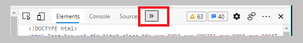
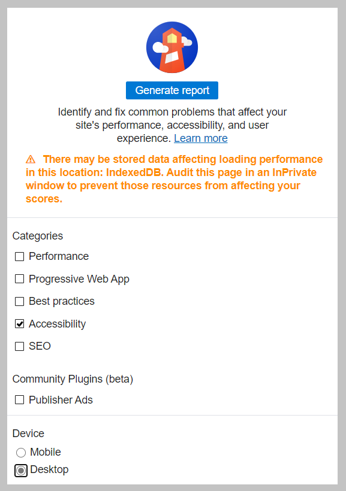
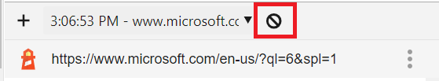

# {{ $frontmatter.title }}

- [Garantir que as páxinas web sexan accesibles para todos](https://learn.microsoft.com/en-us/training/modules/web-development-101-accessibility/1-introduction) 1 minuto
- [Navegar pola web con máis dun navegador](https://learn.microsoft.com/en-us/training/modules/web-development-101-accessibility/2-client-tools) 2 minuto
- [Garantir a accesibilidade con ferramentas para desenvolvedores](https://learn.microsoft.com/en-us/training/modules/web-development-101-accessibility/3-developer-tools) 2 minuto
- [Garantir que os enlaces e as imaxes sexan accesibles](https://learn.microsoft.com/en-us/training/modules/web-development-101-accessibility/4-links-images) 4 minuto
- [Deseño para a accesibilidade](https://learn.microsoft.com/en-us/training/modules/web-development-101-accessibility/5-accessibility-design-concepts) 3 minuto
- [Comprobación de coñecementos](https://learn.microsoft.com/en-us/training/modules/web-development-101-accessibility/6-knowledge-check) 2 minuto
- [Resumo](https://learn.microsoft.com/en-us/training/modules/web-development-101-accessibility/7-summary) 1 minuto

Hai varias ferramentas e informes a túa disposición que poden salientar os problemas que deben abordarse. Tamén hai estándares como as etiquetas `ARIA` que farán que a túa aplicación sexa utilizable por todos.

## Garantir que as páxinas web sexan accesibles para todos

Garantir que túa páxina web sexa accesible para todos os usuarios e todos os clientes é fundamental. Como Tim Berners-Lee, o creador da World Wide Web, dixo unha vez: *"O poder da Web está na súa universalidade. O acceso de todos, independentemente da súa discapacidade, é un aspecto esencial"*.

Como desenvolvedor web florecente, ti crees que aprender a garantir que túas páxinas sexan accesibles desde o principio é importante. Sempre é más fácil crear unha páxina para que sexa accesible que adaptala máis tarde. Si aprendes estas habilidades cando comezas o camiño, as medidas que has de tomar se volverán naturais. A continuación, poderás crear páxinas accesibles e detectar posibles dificultades.

Neste módulo, aprenderás sobre:

- Ferramentas que os usuarios utilizan para navegar polas páxinas web.
- Ferramentas que os desenvolvedores utilizan para garantir a accesibilidade.
- Habilidades para garantir que as túas páxinas sexan accesibles.

## Navegar pola web con máis dun navegador

Probablemente esteas moi familiarizado co uso do teu navegador favorito, como *cliente* para navegar pola web. Cando pensas en deseñar páxinas web, podes imaxinar a experiencia do usuario con este *cliente* porque tes experiencia persoal con el. Pero non tódolos usuarios empregan o navegador da mesma maneira, ou usan o mesmo navegador ca ti, ou saben usar un navegador. Para crear experiencias para tódolos usuarios, debes comprender as diversas ferramentas que as persoas poden usar cando navegan pola web.

### Lectores de pantalla

Unha das ferramentas de accesibilidade máis coñecidas é un [lector de pantalla](https://en.wikipedia.org/wiki/Screen_reader). Os lectores de pantalla son clientes de uso común para persoas con discapacidades visuais. Están integrados na maioría dos sistemas operativos. A medida que dedicamos tempo a asegurarnos de que un navegador transmite correctamente a información que queremos compartir, tamén debemos asegurarnos de que un lector de pantalla faga o mesmo.

Na súa forma máis básica, un lector de pantalla lee unha páxina de arriba a abaixo de forma audible. Si a túa páxina é todo texto, o lector transmite a información de maneira similar a un navegador. Por suposto, as páxinas web rara vez son puramente texto. Conteñen enlaces, gráficos, cor e outras compoñentes visuais. Se debe ter coidado e **asegurarse de que un lector de pantalla poida ler correctamente toda esta información**.

Algúns navegadores tamén teñen ferramentas e extensións integradas que poden ler texto en voz alta e incluso proporcionar algunhas funcións básicas de navegación, como [as ferramentas do navegador Edge centradas na accesibilidade](https://support.microsoft.com/help/4000734/microsoft-edge-accessibility-features). Estas ferramentas de navegador tamén son ferramentas de accesibilidade importantes, pero funcionan de maneira diferente aos lectores de pantalla. Non deben confundirse con ferramentas de proba de lectores de pantalla.

**Nota:** Proba cun lector de pantalla e un lector de texto do navegador. En Windows, [Narrator](https://support.microsoft.com/windows/complete-guide-to-narrator-e4397a0d-ef4f-b386-d8ae-c172f109bdb1) se inclúe de forma predeterminada. [JAWS](https://webaim.org/articles/jaws/) e [NVDA](https://www.nvaccess.org/about-nvda/) tamén se poden instalar en Windows. En macOS e iOS, [VoiceOver](https://support.apple.com/guide/voiceover/welcome/10) se instala de forma predeterminada.

### Zoom

Outra ferramenta que as persoas con discapacidades visuais usan comunmente é o zoom. O tipo máis básico de zoom é o zoom estático, que se controla a través do atallo de teclado *Ctrl + signo más (+)* ou diminuíndo a resolución de pantalla. Este tipo de zoom cambia o tamaño de toda a páxina. O uso [dun deseño adaptable](https://developer.mozilla.org/docs/Learn/CSS/CSS_layout/Responsive_Design), onde os elementos cambian en función da [xanela gráfica (viewport)](https://developer.mozilla.org/docs/Web/CSS/Viewport_concepts), é importante para proporcionar unha boa experiencia de usuario a maiores niveis de zoom.

É probable que o teu sistema operativo teña capacidades de zoom integradas que te permitan ampliar partes da pantalla, ao igual que usar unha lupa real. [A lupa](https://support.microsoft.com/windows/use-magnifier-to-make-things-on-the-screen-easier-to-see-414948ba-8b1c-d3bd-8615-0e5e32204198) está integrada en Windows, mentres que [ZoomText](https://www.freedomscientific.com/training/zoomtext/getting-started/) está dispoñible como un complemento máis completo e popular. Tanto macOS como iOS teñen unha ferramenta de ampliación incorporada chamada [Zoom](https://www.apple.com/accessibility/mac/vision/).


## Garantir a accesibilidade con ferramentas para desenvolvedores

Probar a túa páxina web en varios clientes e vistas é tan importante como probala en varios navegadores. É posible que esta proba non sexa práctica en todos os escenarios e pode pasar por alto situacións nas que os usuarios usan un navegador pero poden ter outra discapacidade. Afortunadamente, hai ferramentas que podes usar como desenvolvedor para medir a accesibilidade da túa páxina.

### Comprobadores de contraste

Alguén que é daltónico podería non ser capaz de diferenciar entre cores, ou podería ter dificultades para traballar con cores que son similares entre si. O World Wide Web Consortium (W3C), a organización de estándares para a web, estableceu un sistema de [clasificación para contraste da cor](https://www.w3.org/TR/UNDERSTANDING-WCAG20/visual-audio-contrast-contrast.html).

Elixir as colores correctos para garantir que a túa páxina sexa accesible para todos pode ser difícil de facer a man. Podes usar as seguintes ferramentas para xerar as cores adecuadas e probar o sitio para garantir o cumprimento coas normas de accesibilidade pertinentes:

- Ferramentas de xeración de paletas:
  - [Adobe Color](https://color.adobe.com/create/color-accessibility), unha ferramenta interactiva para probar combinacións de cores
  - [Color Safe](http://colorsafe.co/), unha ferramenta para xerar cores de texto baseados nunha cor de fondo seleccionado
- Comprobadores de cumprimento:
  - Extensións do navegador para probar unha páxina:
    - [Edge: Comprobador de contraste de cor WCAG](https://microsoftedge.microsoft.com/addons/detail/wcag-color-contrast-check/idahaggnlnekelhgplklhfpchbfdmkjp)
    - [Firefox: Comprobador de contraste WCAG](https://addons.mozilla.org/firefox/addon/wcag-contrast-checker/)
    - [Chrome: Comprobador de contraste de cor](https://chrome.google.com/webstore/detail/colour-contrast-checker/nmmjeclfkgjdomacpcflgdkgpphpmnfe)
  - Aplicacións:
    - [Analizador de contraste de cor (CCA)](https://www.tpgi.com/color-contrast-checker/)

### Lighthouse

Lighthouse é unha ferramenta que Google creou para analizar sitios web. Volveuse tan popular que está incluída nas ferramentas de desenvolvemento de moitos navegadores. Lighthouse pode examinar a optimización de motores de busca (SEO) dunha páxina, o rendemento de carga e outras prácticas recomendadas. Lighthouse tamén pode analizar unha páxina e proporcionar unha puntuación para súa accesibilidade actual.

**Nota:** Ao igual que con calquera ferramenta automatizada, non podes limitarte a confiar na puntuación que proporciona Lighthouse como a única indicación da accesibilidade dunha páxina. Pero si proporciona un bo punto de partida para identificar e remediar problemas.

#### Exercicio: Xerar a puntuación de accesibilidade de Lighthouse dunha páxina

Proba Lighthouse no teu navegador. As seguintes capturas de pantalla usan [Edge](https://www.microsoft.com/edge), pero podes seguir os mesmos pasos en Chrome e outros moitos outros navegadores.

1. Abre o teu navegador e vai á [páxina web principal de Microsoft](https://microsoft.com/).

2. Selecciona a clave para abrir as ferramentas de desenvolvemento.F12

3. Na parte superior, selecciona a icona de comiñas angulares (**>>**) para abrir a lista de lapelas ocultas.

   

4. Selecciona **Lighthouse** da lista.

5. En **Categorías**, borra tódolos elementos excepto **Accesibilidade**.

6. En **Dispositivo**, selecciona **Escritorio**.

   

7. Selecciona **Xerar informe**.

8. Observa a puntuación e a información asociada sobre a páxina.

9. Podes probar outras páxinas seleccionando **Borrar todo** en Lighthouse, e indo a unha páxina diferente e, a continuación, seleccionar **Xerar informe**.

   

Agora que xa viches como usar Lighthouse, xunto coa información de accesibilidade que a ferramenta pode proporcionar.


## Garantir que os enlaces e as imaxes sexan accesibles

Dúas das compoñentes máis comúns en calquera páxina web son os enlaces e as imaxes. Estes elementos teñen un profundo impacto na accesibilidade. Garantir un bo texto de enlace e texto alternativo é un dos primeiros pasos que podes tomar para mellorar as túas páxinas para tódolos usuarios.

### Texto do enlace

Os hipervínculos son fundamentais para navegar pola web. Asegurarse de que un lector de pantalla poida ler correctamente os enlaces permite a tódolos usuarios navegar polo teu sitio.

Considera os dous vínculos no seguinte texto de exemplo:

- "O pequeno pingüiño, ás veces coñecido coma o pingüiño das fadas, é o pingüiño máis pequeno do mundo. [Faga clic aquí](https://en.wikipedia.org/wiki/Little_penguin) para obter máis información."
- "O pequeno pingüiño, ás veces coñecido coma o pingüiño das fadas, é o pingüiño máis pequeno do mundo. Visite https://en.wikipedia.org/wiki/Little_penguin para obter máis información".

**Nota:** Os dous exemplos demostran o que *non* debes usar como desenvolvedor web.

Aínda que estes enlaces poden parecer axeitados para alguén con visión completa, non funcionarán como cabería esperar cun lector de pantalla. Lembra, os lectores de pantalla leen o texto. Si aparece unha URL no texto, o lector de pantalla lerá a URL. En xeral, a URL non transmite información significativa e pode soar molesta. É posible que teñas experimentado este problema se o teu teléfono algunha vez leu de forma audible unha mensaxe de texto cunha URL.

Os lectores de pantalla tamén teñen a capacidade de ler só os hipervínculos nunha páxina, da mesma maneira que unha persoa vidente escanearía unha páxina en busca de enlaces. Se o texto do enlace é sempre "faga clic aquí", todo o que o usuario escoitará é "faga clic aquí, faga clic aquí, faga clic aquí, faga clic aquí, faga clic aquí, ..." Tódolos enlaces agora son indistinguibles entre si, o cal é unha experiencia frustrante.

A palabra "clic" tamén é un problema, porque non todos os usuarios farán clic. Os usuarios do teléfono tocarán o teclado, os usuarios do teclado poderán seleccionar a tecla *Intro* ou a barra espazadora, e outros clientes utilizarán outros medios.

Necesitamos usar sempre un texto de enlace significativo. Un bo texto de enlace describe brevemente o que hai ao outro lado do enlace. No exemplo anterior sobre pequenos pingüiños, o enlace vai á páxina de Wikipedia sobre a especie. A frase *pequenos pingüiños* sería o texto de enlace perfecto porque deixa claro o que alguén aprenderá si selecciona o enlace:

- "O pequeno pingüiño, as veces coñecido coma o pingüiño das fadas, é o [pingüiño máis pequeno](https://en.wikipedia.org/wiki/Little_penguin) do mundo".

**Nota:** Como beneficio adicional para garantir que o teu sitio sexa accesible para todos, tamén axudará aos motores de busca a navegar a través de teu sitio. Os motores de busca utilizan o texto do enlace para revisar os temas das páxinas. Así que usar un bo texto de enlace axuda a todos!

### Atributos de ARIA

Imaxina a seguinte páxina de produto:

| Produto      | Descrición           | Pedido         |
| :----------- | :------------------- | :------------- |
| Widget       | `[Description]('#')` | `[Order]('#')` |
| Super widget | `[Description]('#')` | `[Order]('#')` |

Este é un deseño común para unha páxina que mostra información sobre varios elementos dunha táboa, con vínculos á descrición e o pedido. Duplicar o texto da descrición e o pedido ten sentido para alguén que está usando un navegador. Sen embargo, alguén que usa un lector de pantalla só escoitaría as palabras *descrición* e *orde* repetidas sen contexto algún.

Para admitir estes tipos de escenarios, HTML admite un conxunto de atributos coñecidos como [aplicacións de Internet accesibles enriquecidas (ARIA).](https://developer.mozilla.org/docs/Web/Accessibility/ARIA) Podes empregar estes atributos para proporcionar máis información aos lectores de pantalla.

Por exemplo, podes usar `aria`para describir un enlace cando o formato da páxina no lo permita. A descrición do *widget* se pode establecer como: `aria-label`

.HTML

```html
<a href="#" aria-label="Widget description">descrición</a>
```

ARIA ten numerosos usos máis alá de agregar texto para que os lectores de pantalla lean os enlaces. Podes usalo para describir os roles que desempeñan certos elementos cando o HTML semántico non está dispoñible. Ao crear un árbore, por exemplo, podes usar roles ARIA para describir a interface dun lector de pantalla:

.HTML

```html
<h2 id="tree-label">File Viewer</h2>
<div role="tree" aria-labelledby="tree-label">
  <div role="treeitem" aria-expanded="false" tabindex="0">Uploads</div>
</div>
```

**Importante:** O uso de marcado semántico e bo texto de enlace como se describiu anteriormente xeralmente reempraza o uso de ARIA. **Os navegadores e os lectores de pantalla non son os únicos clientes que un usuario pode usar, e deseñar a túa páxina para que funcione ben para todos os clientes e usuarios debe ser o obxectivo principal**.

### Texto alternativo para as imaxes

Como regra xeral, os lectores de pantalla non poden ler o contido dunha imaxe. Aínda que algúns poden usar intelixencia artificial, os resultados xerados poden non ser contextualmente precisos. Afortunadamente, garantir que as imaxes sexan accesibles non require moito traballo, diso se trata o atributo `alt`. Tódalas imaxes significativas deben ter un atributo `alt` (coñecido casualmente como *texto alternativo*) para describir o que son ou a información que están tratando de transmitir.

As imaxes que son puramente decorativas deben ter o seu atributo `alt` establecido nunha cadea baleira: `alt=""`. Esta configuración evita que os lectores de pantalla anuncien innecesariamente a imaxe decorativa.

**Nota:** Como é de esperar, os motores de busca non poden entender o que hai nunha imaxe. Se basean no texto alternativo. Entón, unha vez máis, asegurarse de que a túa páxina sexa accesible proporciona bonificacións!


## Deseño para a accesibilidade

A accesibilidade é un tema relativamente amplo. Non podemos cubrilo completamente neste módulo de introdución. Non óbstante, hai algúns principios básicos que quererás empregar en cada páxina que crees. Deseñar unha páxina accesible dende o principio sempre é máis fácil que volver a unha páxina existente para facela accesible.

### Usar HTML da forma na que foi deseñado

HTML proporciona moitos elementos que podes utilizar para crear unha páxina, incluídos botóns, vínculos e controis de formulario. Cada un deses elementos ten un conxunto de funcionalidades integradas, como facer clic, vincular ou aceptar o foco.

**Nota:** *Focus* é un termo de desenvolvemento web que significa que un control pode aceptar entradas de teclado. Un botón pode aceptar o foco, permitindo que alguén o active ou "faga clic" seleccionando a barra espazadora.

Con CSS e JavaScript, é posible facer que calquera elemento se pareza a calquera tipo de control. Por exemplo, podes utilizar  `<span>` para crear un elemento `<button>`, e `<b>`pode converterse en `<a>`. Aínda que esta capacidade proporciona algúns accesos directos para aplicar estilos ou deseñar a páxina, elimina a funcionalidade integrada. Ferramentas como un lector de pantalla non poderán entender que `<span>` se está utilizando como `<a>`. Alguén que navegue cun teclado non poderá enfocarse nun elemento `<div>` que foi programado para simular un elemento `<button>`.

Outro elemento HTML que a miúdo se omite son os encabezados ( de `<h1>` a `<h6>` ). Desde un punto de vista visual, as etiquetas de encabezado comezan desde o tamaño de texto máis grande ata o máis pequeno. Esta convención leva a moitos desenvolvedores a renunciar aos elementos de encabezado e no seu lugar estilizar un `<div>` ou outros elementos xenéricos.

Desafortunadamente, os elementos xenéricos estilizados transmiten só información visual en lugar de estrutural. Os usuarios de lectores de pantalla [dependen en gran medida dos encabezados](https://webaim.org/projects/screenreadersurvey8/#finding) para atopar información e navegar por unha páxina. Escribir contido de encabezado descritivo e usar etiquetas de encabezado semántico son importantes para crear un sitio facilmente navegable para os usuarios de lectores de pantalla.

Como práctica recomendada, sempre se debe usar o HTML axeitado ao crear controis nunha páxina. Se desexas un hipervínculo, utiliza `<a>` ou utiliza `<button>` para un botón.

### Usa boas sinais visuais

Os desenvolvedores a miúdo pensan nos lectores de pantalla como a única ferramenta de accesibilidade. Non óbstante, os usuarios poden usar moitas outras ferramentas, ou poden non usar ferramentas en absoluto. Os usuarios que utilizan o navegador dependerán de certas sinais visuais para comprender como interactuar coa túa páxina.

Unha das grandes características de CSS é que proporciona un control completo sobre como mostrar unha páxina, incluída a eliminación de certos elementos de visualización. Por exemplo, podes quitar o contorno dun cadro de texto ou quitar o subliñado dun hipervínculo. Desafortunadamente, eliminar ese tipo de sinais pode facer que sexa máis difícil para alguén que depende delas recoñecer o tipo de control que se lle presenta.

### Considera o teclado

Algúns usuarios non poden usar un rato ou trackpad/touchpad. En cambio, estes usuarios confían nas interaccións do teclado para pasar dun elemento a outro. É importante que as túas páxinas presenten o seu contido nunha orde lóxica para que un usuario de teclado poida acceder a cada elemento interactivo a medida que se move cara abaixo na páxina.

Cando un usuario se move por unha páxina mediante tabulacións, o foco se move dun control ao seguinte en función da orde na que se enumeran os controis no código fonte HTML. Os controis da páxina deben aparecer no código fonte HTML na orde na que se espera que se examine a páxina, mentres se confía en CSS para deseñar a páxina visualmente para os usuarios.

Por exemplo, imaxina crear un formulario con dúas columnas. Quererás considerar cal é o fluxo natural para alguén que completa o formulario e, a continuación, enumerar os controis nesa orde. A continuación, podes utilizar CSS para crear as columnas e mostrar os controles nas súas posicións axeitadas.

A navegación por teclado depende en gran medida do HTML semántico. Certos controis (como os botóns) aceptan o enfoque, mentres que os elementos `div` non. Si estás recreando controis que xa existen en HTML, estás dificultando que alguén use a túa páxina cun teclado.

**Importante:** A navegación por teclado debe probarse manualmente, e debes facelo en cada páxina que crees. [WebAIM](https://webaim.org/techniques/keyboard/) ten máis información sobre as estratexias de navegación de teclado.

## Resumo

Neste módulo, exploramos os conceptos de accesibilidade web. E ti aprendiches sobre:

- Ferramentas que os usuarios utilizan para navegar polas páxinas web.
- Ferramentas que os desenvolvedores utilizan para garantir a accesibilidade.
- Habilidades para garantir que as túas páxinas sexan accesibles.

### Desafío

A mellor maneira de entender como facer que as páxinas sexan accesibles, e o impacto das decisións que tomas ao crear HTML, é utilizar algunhas das ferramentas que os usuarios utilizan para navegar pola web.

Desprázate por un par de páxinas utilizando un lector de pantalla. Abre un sitio web que teña un formulario e usa só o teclado para completalo. Esta actividade darache unha idea do que algúns usuarios experimentan a diario cando utilizan a web, e a importancia de asegurarte de que as túas páxinas sexan accesibles.

---

_\_ref:_
- [Training | Microsoft Learn](https://learn.microsoft.com/en-us/training/modules/web-development-101-accessibility/)