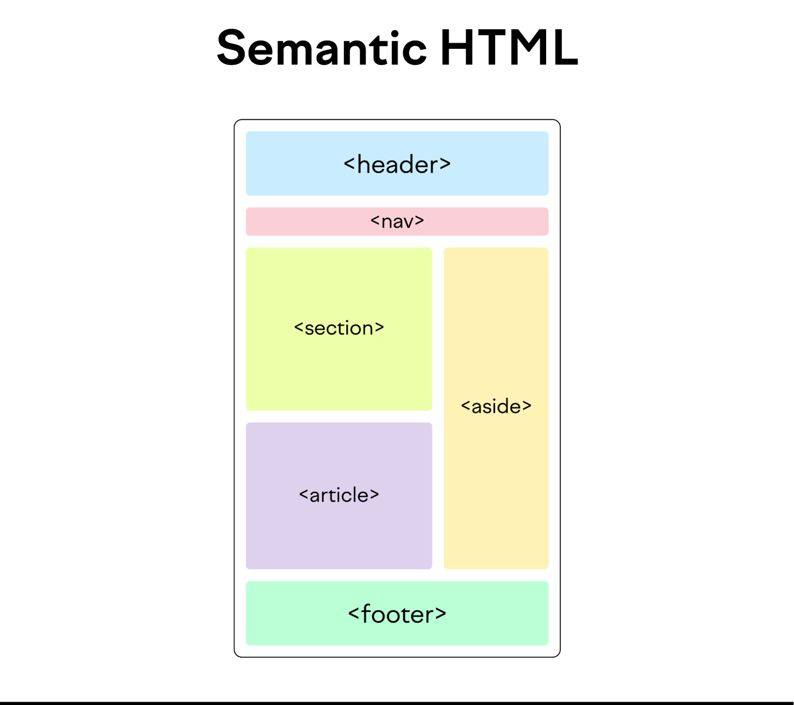

# {{ $frontmatter.title }}

O HTML semántico, tamén coñecido como marcado semántico, fai referencia ao uso de [etiquetas HTML](https://www.semrush.com/blog/viewport-meta-tag/) que transmiten o significado —ou a semántica— do contido contido nelas.

Ao engadir etiquetas HTML semánticas ás túas páxinas, proporcionas información adicional que axuda a definir os roles e a importancia relativa das diferentes partes da páxina.

En oposición ao HTML non semántico, que usa etiquetas que non transmiten significado directamente.

***Nota:** HTML é unha linguaxe que se usa para estruturar un sitio web. Esta guía supón unha comprensión básica de HTML. Se es un principiante total, consultar unha [guía de introdución HTML](https://www.w3schools.com/html/html_intro.asp) será útil.*

## Que son as etiquetas HTML semánticas?

As etiquetas HTML semánticas son etiquetas que definen o significado do contido que conteñen. 

Por exemplo, etiquetas como **``<header>``** , **``<article>``** e **``<footer>``** son etiquetas HTML semánticas. Indican claramente o papel do contido que conteñen.

Por outra banda, etiquetas como **``
``** e **````** son exemplos típicos de elementos HTML non semánticos. Só serven como separadores de contido, pero non dan ningunha indicación sobre o tipo de contido que conteñen ou o papel que desempeña ese contido na páxina.

## Por que necesito usar etiquetas HTML semánticas?

Ademais da razón obvia de que as etiquetas HTML semánticas son máis fáciles de ler e comprender, por exemplo, por parte dos desenvolvedores web que revisan o código, hai dúas razóns máis específicas polas que debes usar sempre etiquetas semánticas.

### Accesibilidade

Para os usuarios videntes, é fácil identificar as distintas partes dunha páxina web. Os encabezados, os pés de páxina e o contido principal aparecen visualmente inmediatamente. 

Non obstante, non é tan sinxelo para os usuarios **cegos ou con discapacidade visual** que deben confíar nos lectores de pantalla. 

O uso axeitado das etiquetas semánticas HTML permitirá que estes lectores comprendan mellor o teu contido xa que os seus lectores de pantalla comunicarán o teu contido con máis precisión.

### SEO

As etiquetas HTML semánticas son importantes para [o SEO](https://www.semrush.com/blog/what-is-seo/) (optimización de buscadores) porque indican o papel do contido dentro das etiquetas. 

Esa información proporciona [aos rastrexadores dos buscadores](https://www.semrush.com/blog/site-crawler/) , como Googlebot, unha mellor comprensión do teu contido. Isto aumenta as posibilidades de que o teu contido sexa seleccionado como candidato para a clasificación na páxina de resultados do motor de busca (SERP) para palabras clave relevantes.

En palabras sinxelas, as páxinas con HTML semántico correctamente implementado teñen unha vantaxe no SEO sobre as que non o teñen. 

Podes usar unha ferramenta como [Site Audit](https://www.semrush.com/siteaudit/) para atopar problemas de etiquetas HTML que poidan estar afectando o teu SEO.

Introduce o teu dominio na ferramenta e [configura a túa configuración de rastrexo](https://www.semrush.com/kb/539-configuring-site-audit) .

Vai á pestana " **Problemas** ".

E busca " **etiqueta** " na caixa "Buscar por verificación".

Fai clic en " **Por que e como solucionalo** " para obter máis información sobre cada problema do sitio.

## Tipos de etiquetas semánticas HTML

As etiquetas semánticas poden definir diferentes partes dunha páxina web. 

Vexamos os elementos HTML semánticos máis comúns, divididos en dúas categorías segundo o seu uso:

- Etiquetas semánticas HTML para estrutura
- Etiquetas semánticas HTML para texto

### Etiquetas semánticas HTML para estrutura

Moitas etiquetas HTML semánticas comunican o deseño dunha páxina. 

Estas etiquetas "estruturais" introducíronse cando HTML4 se actualizou a HTML5. É por iso que tamén se lles coñece habitualmente como etiquetas HTML5 semánticas ou elementos HTML5 semánticos.

Aquí tes unha lista completa: 

- **``<header>``** : a etiqueta de cabeceira define o contido que debe considerarse a información introdutoria dunha páxina ou sección
- **``<nav>``** : a etiqueta de navegación úsase para as ligazóns de navegación. Pódese aniñar dentro da etiqueta ``<header>``, pero as etiquetas de navegación secundaria ``<nav>`` tamén se usan habitualmente noutros lugares da páxina.
- **``<main>``** : esta etiqueta contén o contido principal (tamén chamado corpo) dunha páxina. Só debería haber unha etiqueta por páxina.
- **``<article>``** : a etiqueta do artigo define o contido que podería estar independente da páxina ou sitio no que se atopa. Non significa necesariamente unha "publicación de blog". Pense nel máis como "unha peza de roupa", un artigo autónomo que se pode usar en varios contextos.
- **``<section>``** : usar ``<section>`` é unha forma de agrupar contido próximo dun tema similar. Unha etiqueta de sección difire dunha etiqueta de artigo. Non é necesariamente autónomo, pero forma parte doutra cousa. 
- **``<aside>``** : un elemento aparte define o contido que é menos importante. Adoita usarse para barras laterais, áreas que engaden información complementaria pero non esencial.
- **``<footer>``** : usa ``<footer>`` na parte inferior dunha páxina. Normalmente inclúe información de contacto, información de copyright e algunha navegación do sitio.

### Etiquetas semánticas HTML para texto

As etiquetas HTML semánticas para o texto son etiquetas HTML que, ademais do formato, tamén transmiten a función semántica do texto que conteñen.

Estes son algúns dos exemplos máis comúns:

- **``<h1>``** (título): a [etiqueta H1](https://www.semrush.com/blog/h1-tag/) marca o título de nivel superior. Normalmente só hai un título H1 por páxina.
- **``<h2>``** a **``<h6>``** (subtítulos): os subtítulos de varios niveis de importancia. Pode haber varios títulos do mesmo nivel nunha única páxina. 
- **``
``** (parágrafo): un parágrafo de texto autónomo.
- **``<a>``** (áncora): Úsase para marcar un hipervínculo dunha páxina a outra.
- **``<ol>``** (lista ordenada): unha lista de elementos que se amosan nunha orde determinada, comezando por viñetas. Unha etiqueta ``<li>`` (elemento da lista) contén un único elemento na lista.
- **``<ul>``** (lista sen orde): unha lista de elementos que non precisan mostrarse nunha orde determinada, comezando por números ordinais. Unha etiqueta ``<li>`` (elemento da lista) contén un único elemento da lista. 
- **``<q>``** / ``<blockquote>``: unha cita do texto. Use ``<blockquote>`` para citas longas con varias liñas e ``<q>`` para citas en liña máis curtas.
- **``<em>``** (énfase): Úsase para texto que se debe enfatizar.
- **``<strong>``** (énfase forte): úsase para texto que se debe enfatizar moito.
- **``<code>``** : un bloque de código informático.

_**Nota:** só enumeramos algunhas das etiquetas HTML semánticas máis comúns. Podes usar moitas outras, como *``
``, ``<time>``, ``<address>``, ``<video>``*, etc.- para facilitar a comprensión do contido do teu sitio web. Para descubrir máis elementos semánticos HTML, consulta a [lista de todas as etiquetas HTML](https://www.w3schools.com/TAGS/default.asp) de W3Schools._*_

## Consellos e boas prácticas de HTML semántico

Finalmente, imos cubrir algúns consellos de implementación de HTML baseados nos erros comúns que cometen a xente ao usar etiquetas HTML semánticas. 

### Non use etiquetas HTML semánticas para estilizar

Aínda que os navegadores web aplican estilos a moitas etiquetas semánticas (por exemplo, o texto dentro dunha etiqueta ``<a>`` adoita ser azul e subliñado), iso non significa que se supoña que as etiquetas HTML se utilicen para darlle estilo ao texto.

Noutras palabras, do mesmo xeito que non usarías unha etiqueta ``<a>`` para un texto "non ligazón" só para facelo azul e subliñado, non deberías usar outras etiquetas semánticas con fins puramente estilísticos.

Estes son algúns exemplos típicos de uso incorrecto de etiquetas semánticas:

- Usar unha etiqueta ``<h1>`` a ``<h6>`` para texto que non sexa un título co propósito de cambiar o seu tamaño de letra
- Usando ``<blockquote>`` só para sangrar texto que non sexa unha cita
- Usa ``<strong>`` ou ``<em>`` só para engadir negriña ou cursiva ao texto que non precisa énfase.

Para fins de estilo, usa sempre CSS.

### Aniña as etiquetas de título tendo en conta a semántica

Ordena sempre os elementos da cabeceira por importancia.

Por exemplo, todos os títulos H3 que seguen un determinado título H2 deberían ser subtemas dese H2. 

Deste xeito, a estrutura dos títulos crea unha xerarquía lóxica dos temas dentro do teu contido e axuda tanto aos lectores como aos motores de busca a comprender e navegar mellor polo texto.

***Consello: usa unha ferramenta** [de auditoría do sitio](https://www.semrush.com/features/site-audit/) para identificar problemas cos títulos H1, outros HTML e erros de SEO na páxina que pode sufrir o teu sitio.* 

O mesmo consello (aniñar as etiquetas polo seu significado) aplícase a todas as outras etiquetas HTML semánticas. 

O que nos leva ao seguinte consello: 

### Non copies só o deseño visual

O teu código e estrutura HTML non debería ser un simple duplicado do deseño visual. Pola contra, debería seguir a estrutura semántica da páxina.

Vexamos este exemplo: 

O uso das etiquetas HTML no lado esquerdo é incorrecto porque indica que a páxina contén catro temas diferentes, en lugar dun tema e tres subtemas, como se mostra á dereita.

No lado dereito, temos unha páxina correctamente construída usando HTML semántico. Aínda que hai catro seccións separadas no deseño visual da páxina, as etiquetas HTML están aniñadas segundo a semántica do contido.

---

*Tradución do artigo de [Vlado Pavlik](https://www.semrush.com/blog/user/202752481/) para [Semrush](https://www.semrush.com/blog/semantic-html5-guide/)*