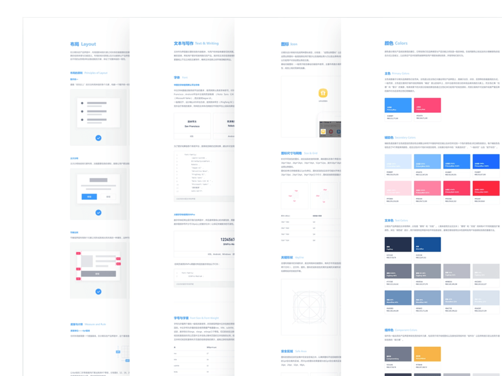
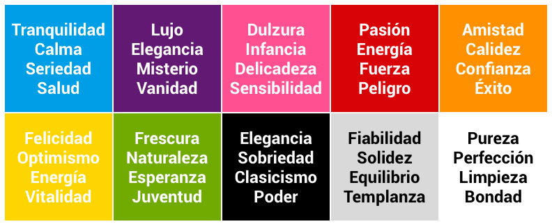
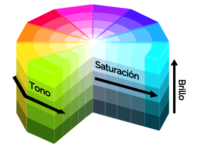
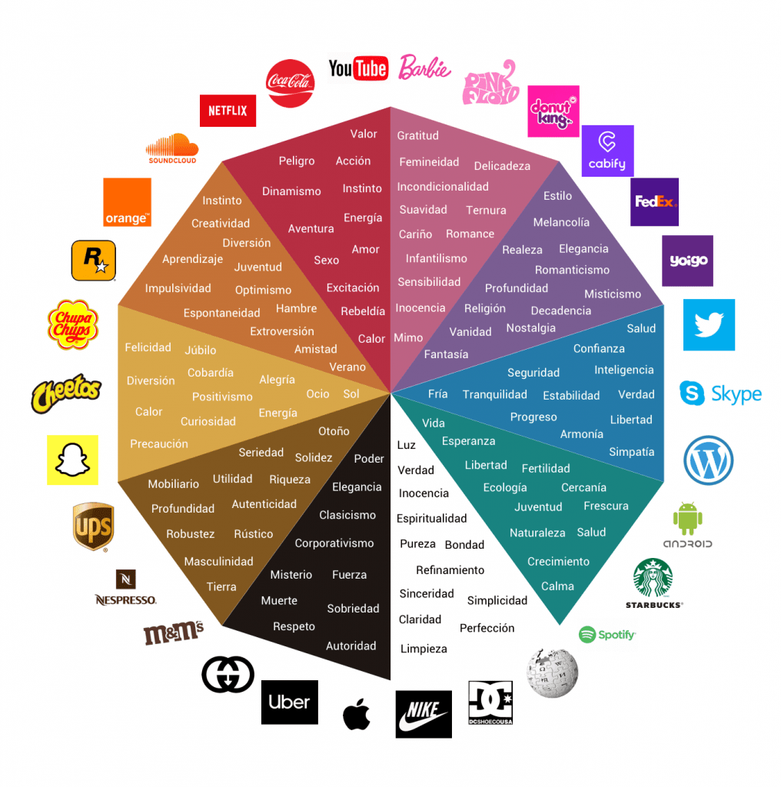
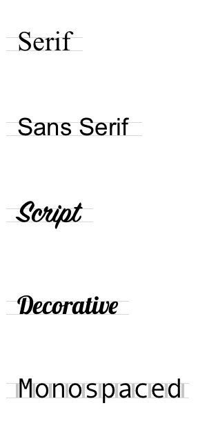
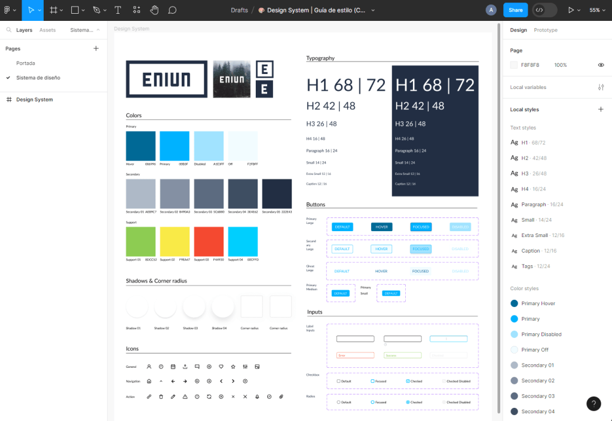

# {{ $frontmatter.title }}

Unha **guía de estilo** é un documento que establece **pautas para o deseño e presentación** de contidos nunha marca ou proxecto. O seu obxectivo é garantir a coherencia e uniformidade no uso de elementos visuais, como cores, fontes, imaxes e outros elementos gráficos.

## 1. Guía de estilo, importancia no deseño de interfaces web

Para garantir a coherencia das **interfaces gráficas** dun sitio web , é fundamental recoller as **pautas de estilo** nunha guía que o equipo de desenvolvemento (programadores, analistas, deseñadores gráficos, etc.) pode seguir durante o proceso de desenvolvemento do sitio. Estas guías chámanse **guías de estilo** ou guías de "***aspecto e sensación\***".

As guías de estilo recollen os criterios e estándares que **deben seguir os desenvolvedores** de sitios web para que teña un **aspecto uniforme e atractivo para o usuario** .

Desde o punto de vista dos programadores e deseñadores, estas guías de estilo son fundamentais para **favorecer o desenvolvemento dunha páxina web, tanto no deseño como no seu posterior mantemento**. Este aspecto é moi importante xa que o mantemento pode ser realizado por unha persoa distinta seguindo as referencias establecidas.

As guías de estilo recollen datos como a **gama de cores** utilizadas, **as iconas** , **a tipografía** , **o tamaño das letras** , etc. A continuación móstrase un exemplo dunha guía de estilo que detalla cores, fontes, botóns e iconas de referencia..

​                                                     

**Figura 9.1**. Guía de estilo.                         

## 1.1. Como podo crear unha guía de estilo para un sitio web?

Vexamos os pasos a seguir para crear unha guía de estilo para un sitio web:

1. **Define a túa identidade de marca**: antes de comezar a crear unha guía de estilo, é importante ter unha idea clara da túa identidade de marca e dos valores que queres transmitir a través do sitio web. Isto axudarache a tomar decisións sobre o estilo visual e o ton de voz que debes usar.
2. **Escolle unha paleta de cores**: é importante escoller unha paleta de cores que reflicta a túa identidade de marca e sexa coherente co resto dos teus elementos visuais. Asegúrate de incluír información sobre as cores primarias e secundarias, así como sobre como deben usarse en diferentes elementos do sitio.
3. **Seleccionar fontes**: elixe fontes lexibles e acordes coa identidade da túa marca. Inclúe información sobre fontes primarias e secundarias, así como sobre como deberían usarse en diferentes elementos do sitio, como títulos, subtítulos e texto do corpo.
4. **Establecer pautas para o uso de imaxes**: é importante establecer pautas claras sobre como se deben usar as imaxes. Inclúe información sobre o tipo de imaxes a utilizar, como deben editarse e como deben presentarse no sitio.
5. **Definir o ton e o estilo de escritura**: Establecer pautas claras sobre o ton e o estilo que deben seguir os textos, incluíndo aspectos como o uso da voz activa ou pasiva, o nivel de formalidade e o uso de xerga ou termos técnicos.
6. **Seleccione iconas**: as iconas son elementos gráficos que poden axudar a mellorar a navegación e a comprensión do contido. Ao crear a túa guía de estilo, é importante establecer directrices claras sobre o uso das iconas, incluíndo información sobre o estilo e o tamaño das iconas, así como como deberían usarse en diferentes partes do sitio.
7. **Deseñar botóns, formularios e outros compoñentes**: é importante establecer directrices claras para o deseño e o uso destes compoñentes, incluíndo información sobre o tamaño, a cor, a forma e o estilo dos botóns e os formularios, así como a forma en que deben usarse en diferentes partes do sitio. Asegúrate de deseñar compoñentes que sexan coherentes coa identidade visual da túa marca e sexan fáciles de usar para os teus usuarios.

Unha vez que definas todos estes elementos, podes compilalos nun documento para crear a túa guía de estilo. Asegúrate de presentar a información de forma clara e concisa, utilizando exemplos visuais para ilustrar as túas pautas. Ademais, ten en conta que unha guía de estilo é un documento vivo que pode evolucionar co paso do tempo a medida que cambian as necesidades e preferencias da túa marca e do teu público.

## 1.2. Guía de estilo: Cores

A cor é unha calidade da materia e da luz, pero tamén é un factor expresivo xa que ten o poder de **comunicar e espertar sentimentos** . Por iso, o deseñador estuda as dimensións e os valores da cor para utilizala como **ferramenta de comunicación** .

### 1.2.1. Teoría da cor

A teoría da cor é un conxunto de principios e directrices que poden axudar aos deseñadores a escoller e combinar cores de forma eficaz nos seus proxectos, incluído o deseño web.

A teoría da cor pode ser unha ferramenta útil para os deseñadores web á hora de escoller e combinar cores para os seus proxectos. Non obstante, tamén é importante ter en conta outros factores como a identidade da marca, o público e as preferencias persoais á hora de tomar decisións de cor.

Algúns conceptos importantes da teoría da cor que poden ser útiles para o deseño web inclúen:

- **A roda de cores**: a roda de cores é unha representación visual das cores primarias, secundarias e terciarias, dispostas nun círculo. As cores opostas na roda de cores chámanse cores complementarias e poden crear combinacións de alto contraste e harmonía visual.
- **Harmonía de cores**: a harmonía de cores refírese á combinación de cores dun xeito que resulte visualmente atractivo e equilibrado. Existen varias formas de lograr a harmonía de cores, como usar cores análogas (cores adxacentes na roda de cores), cores complementarias (cores opostas na roda de cores) ou unha paleta monocromática (diferentes tons da mesma cor).
- **Contraste**: o contraste refírese á diferenza visual entre dous ou máis elementos. No deseño web, o contraste é importante para mellorar a lexibilidade e chamar a atención sobre elementos importantes. O contraste pódese conseguir usando cores opostas na roda de cores, como branco e negro ou azul e laranxa.
- **Psicoloxía da cor**: as cores poden ter diferentes significados e connotacións emocionais para diferentes persoas. A psicoloxía da cor estuda como as cores poden influír nas emocións, percepcións e accións das persoas. Ao elixir cores para un sitio web, é importante ter en conta o seu potencial impacto psicolóxico nos usuarios.

### 1.2.2. A roda de cores

A **roda de cores** é unha ferramenta útil no deseño web para **escoller e combinar cores de forma eficaz** . A roda de cores é unha representación visual das cores primarias, secundarias e terciarias, dispostas nun círculo. As cores opostas na roda de cores chámanse cores complementarias e poden crear combinacións de alto contraste e harmonía visual.

Os deseñadores web poden usar a roda de cores para escoller combinacións de cores harmoniosas para os seus proxectos. Por exemplo, poden usar **cores análogas** (cores adxacentes na roda de cores) para crear unha paleta de cores suave e cohesionada, ou cores **complementarias** (cores opostas na roda de cores) para crear combinacións de alto **contraste** e visualmente atractivas.

Ademais, a roda de cores tamén pode ser útil para axustar as tonalidades e a saturación das cores para lograr o equilibrio visual no deseño.

### 1.2.3. Harmonía de cores

A harmonía de cores refírese á combinación de cores dun xeito que resulte visualmente atractivo e equilibrado. Existen varias formas de conseguir a harmonía de cores no deseño web, como usar cores análogas, cores complementarias ou unha paleta monocromática.

- **Cores análogas**: as cores análogas son as que están adxacentes na roda de cores, como o vermello, o laranxa e o amarelo. Estas cores comparten un ton común e poden crear combinacións suaves e coherentes.
- **Cores complementarias**: as cores complementarias son aquelas que están opostas na roda de cores, como o vermello e o verde ou o azul e o laranxa. Estas cores crean un alto contraste e pódense usar para chamar a atención sobre elementos importantes do deseño.
- **Paleta monocromática**: unha paleta monocromática utiliza diferentes tons da mesma cor para crear unha combinación harmoniosa. Por exemplo, unha paleta de azul monocromática pode incluír tons claros, medios e escuros da mesma cor.

Ao elixir cores para un sitio web, é importante ter en conta a harmonía das cores para crear combinacións atractivas e equilibradas. A teoría da cor e a roda de cores poden ser ferramentas útiles para lograr a harmonía das cores no deseño web.

### 1.2.4. Contraste

O contraste é un elemento importante no deseño web que fai referencia á diferenza visual entre dous ou máis elementos. O contraste pódese conseguir usando cores, formas, tamaños e outros elementos visuais para crear unha distinción clara entre as diferentes partes do deseño.

No deseño web, o contraste é importante por varias razóns. En primeiro lugar, o contraste pode **mellorar a lexibilidade do contido** creando unha distinción clara entre texto e fondo. Por exemplo, usar unha cor de texto escura sobre un fondo claro pode mellorar a lexibilidade do texto.

En segundo lugar, o contraste pode axudar a chamar a atención sobre elementos importantes do deseño. Por exemplo, usar un botón de cores brillantes sobre un fondo neutro pode chamar a atención do usuario e animalo a facer clic no botón.

En terceiro lugar, o contraste pode axudar a mellorar a xerarquía visual do contido creando unha distinción clara entre os diferentes niveis de información. Por exemplo, usar tamaños de letra máis grandes para os títulos e outros máis pequenos para o texto do corpo pode axudar a establecer unha xerarquía visual clara no teu contido.

### 1.2.5. Psicoloxía da cor 

A cor é un elemento esencial no deseño de páxinas web xa que a través dela pódense definir os elementos representados.

Grazas á psicoloxía da cor, sabemos que as cores son capaces de **transmitir emocións e provocar así reaccións no noso cerebro** . De feito, demostrouse que a cor inflúe no estado de ánimo e no comportamento das persoas. Por este motivo, a cor é moi utilizada para vincular aos usuarios cos produtos anunciados. A continuación, podes ver as cores máis utilizadas e os seus significados.

​             

**Figura 9.2**. As cores e o seu significado.                         

Para **facilitar a interpretación das funcionalidades, mellorar a navegación e transmitir continuidade** é importante gardar certa coherencia no uso da cor de cada elemento web.

### 1.2.6. Propiedades das cores

As cores teñen tres propiedades que nos permiten diferencialas: **matiz** **,** **saturación** e **brillo** .

- **Ton**: **o ton ou matiz** é ***a\*** propiedade que nos permite **diferenciar unhas cores doutras** . No círculo cromático de tons ou matices pódense distinguir cores complementarias cando están enfrontadas.
- **Saturación**: **a saturación** é a propiedade que define a intensidade dunha cor e ***varía\*** **segundo o nivel de gris que teña** . Canto maior sexa o nivel de gris dunha cor, menos saturada e menos intensa será.
- **Brillo**: **O brillo** é a propiedade que define **o escura ou clara que é unha cor e varía dependendo do nivel de branco ou negro** ***que\*** teña en relación coa cor pura. No deseño gráfico, canto máis brillante é unha cor, máis preto parece estar.

**Figura 1.3**. Matiz, saturación e brillo.

### 1.2.7. As cores fundamentais

Nas contornas dixitais hai tres cores fundamentais, **vermello, verde e azul**. Un ordenador representa todas as cores combinando estas tres cores fundamentais mediante o sistema **RGB** ("red, green, blue" en inglés). Así, definindo a cantidade de cada unha das cores teremos a paleta completa.

### 1.2.8. Sistema RGB

O sistema RGB é un modelo co que é posible representar unha cor  mesturando as tres cores de luz primarias, tamén chamadas cores  fundamentais.

No sistema RGB a intensidade de cada compoñente (vermello, verde e azul) exprésase como un número [hexadecimal](https://es.wikipedia.org/wiki/Sistema_hexadecimal) ou mediante o sistema de numeración decimal (de 0 a 255). Vexamos varios exemplos na seguinte táboa.

| Cor      | HEX     | rgb         |
| -------- | ------- | ----------- |
| Negro    | #000000 | 0,0,0       |
| Branco   | #ffffff | 255,255,255 |
| Vermello | #ff0000 | 255,0,0     |
| Verde    | #00ff00 | 0,255,0     |
| Azul     | #0000ff | 0,0,255     |
| Amarelo  | #ffff00 | 255,255,0   |
| Gris     | #808080 | 128,128,128 |

Máis exemplos de cores expresadas en hexadecimal e en RGB              

### 1.2.9. Propiedades da cor

As cores teñen tres propiedades que nos permiten diferencialas: **matiz** , **saturación** **e** **brillo** .

- **Hue (Ton)**: Refírese á cor pura, é dicir, ao matiz que percibimos (como vermello, verde, azul, etc.). O **matiz ou tonalidade** (***hue\*** en inglés) é o atributo que **nos permite diferenciar unha cor doutra** no espectro visible. Cando no círculo cromático de tons ou matices hai dúas cores enfrontadas se dí que ditas cores sos complementarias.
- **Saturation (Saturación)**: Indica a pureza ou intensidade dunha cor. Unha saturación alta significa que a cor é viva e intensa, mentres que unha saturación baixa fai que a cor pareza máis agrisada ou  apagada. Canto maior sexa o nivel de gris dunha cor, menos saturada será e daquela menos intensa.
- **Brightness (Brillo)**: Refírese á claridade ou escureza dunha cor. Un brillo alto fai que a cor pareza máis clara (próxima ao branco), mentres que un brillo baixo fai que pareza máis escura (próxima ao negro).

​           <!--   **Figura 1.3**. Matiz, saturación e brillo.    -->                     

### 1.2.10. Paleta de cores

Como se mencionou, definir a **gama de cores** a utilizar nun sitio web é fundamental porque pode condicionar a **experiencia do usuario** . Esta gama de cores pódese crear mediante unha **paleta de cores** que nos proporciona un conxunto de matices e tons que nos axudan a **marcar a diferenza entre un deseño alegre, elegante, fiable, sobrio, etc.**

Unha opción para definir a gama de cores é facer unha **composición monocromática** , que consiste en seleccionar unha única cor do círculo cromático e crear os seus matices engadindo branco ou negro.

Outra opción é seleccionar as **cores veciñas da roda de cores** , xa que son harmoniosas e ofrecen estabilidade ao deseño. As cores veciñas son aquelas dentro dun rango de 90 graos na roda de cores.

En Internet podemos atopar diferentes **xeradores de paletas de cores** que nos permiten seleccionar os matices ou cores ideais que queremos  utilizar: cores brillantes, pastel, apagadas, agrisadas, etc. Algúns dos xeradores de paletas de cores son os seguintes:

- **Selector de cores**: htmlcolorcodes.com
- **Color Wheel de Adobe**: color.adobe.com
- **Paletton**: paletton.com
- **Colourlovers**: colourlovers.com/palettes/add

### 1.2.11. As marcas e a súa relación coas cores

A continuación móstrase  **o significado das cores**  e a súa relación con algunhas das marcas máis famosas actuais.

​                                                     **Figura 1.4**. cores e marcas                         

### 1.2.12. Como elixir a cor dun sitio web

Aquí tes algúns consellos para escoller as cores do sitio web:

1. **Considere a súa identidade de marca**: as cores que escolla para o seu sitio web deben reflectir a identidade e os valores da súa marca. Se xa tes unha paleta de cores establecida para a túa marca, asegúrate de usar esas cores en todo o teu sitio web para manter a coherencia.
2. **Pensa na túa audiencia**: as cores poden ter diferentes significados e connotacións para diferentes persoas, polo que é importante que teñas en conta a túa audiencia ao elixir as cores da aplicación web. Considere factores como a idade, o sexo, a cultura e as preferencias persoais dos usuarios ao elixir as cores.
3. **Use a teoría da cor**: a teoría da cor é un conxunto de principios que poden axudarche a escoller combinacións de cores harmoniosas e atractivas. Familiarícese con conceptos como a roda de cores, a harmonía de cores e o contraste para tomar decisións informadas sobre as cores das aplicacións web.
4. **Considere a lexibilidade**: as cores que escollas para o teu sitio web deberían permitir unha boa lexibilidade do contido. Asegúrate de escoller combinacións de cores que proporcionen un bo contraste entre o texto e o fondo para facilitar a lectura.
5. **Proba**: non teñas medo de probar con diferentes combinacións de cores e probar con usuarios reais para ver o que funciona mellor. Use ferramentas como as probas A/B para comparar diferentes opcións e escoller a combinación de cores que mellor funcione para o seu sitio web.

## 1.3. Tipografía

Os **textos son a base da maioría das webs** xa que o máis normal é transmitir a información a través de cartas. Por este motivo, debemos prestar moita atención a facer a elección correcta das fontes para o noso sitio web.

Á hora de escoller un tipo de letra, é moi importante verificar se se pode **mostrar correctamente en diferentes navegadores e non abusar da negra, cursiva e subliñado** .

Inicialmente, utilizáronse os tipos de letra típicos que os usuarios tiñan instalados nos seus dispositivos. Actualmente, grazas a que os navegadores admiten a directiva , é posible utilizar case calquera tipo de fonte sen necesidade de que estea instalada no dispositivo. Pronto veremos como se poden converter fontes *TruType* e *OpenTYPE* [**noutros formatos**](https://www-eniun-com.translate.goog/formatos-fuentes-css-repositorios/?_x_tr_sl=auto&_x_tr_tl=gl&_x_tr_hl=gl) e como podemos utilizar **[fontes aloxadas en repositorios externos](https://www-eniun-com.translate.goog/formatos-fuentes-css-repositorios/?_x_tr_sl=auto&_x_tr_tl=gl&_x_tr_hl=gl)**. *`@font-face`*

### 1.3.1 Recomendacións para a elección da tipografía dun sitio web

A continuación, podes ver algunhas recomendacións que hai que ter en conta á hora de escoller a fonte dun sitio web:

1. **Non uses máis de dous ou tres** tipos de letra diferentes.
2. Usa **fontes lexibles** .
3. Escolle un **bo contraste entre o fondo e a letra** .
4. Establece un **interliñado de 1,5 puntos para o tamaño** da letra.
5. **Non abuses dos subliñados** xa que adoitan usarse para hipervínculos.
6. **Nunca escribas en maiúsculas** porque ralentiza a lectura. Debe usarse só para resaltar mensaxes curtas como títulos, subtítulos ou conceptos importantes.
7. Os **espazos en branco entre parágrafos** axudan a descansar a mirada e mellorar a concentración grazas a unha mellor comprensión da separación entre eles. Polo tanto, é necesario engadir un pouco máis de espazo entre parágrafos e non deixar a mesma separación que co interliña.
8. A **lonxitude recomendada para un parágrafo é de entre 45 e 75 caracteres** . (aínda que isto pode depender do tamaño da pantalla).
9. É recomendable **non utilizar textos inferiores a 12px** .

### 1.3.2. Tipos de letras

Aínda que hai moitos tipos de letras, as máis destacadas veranse a continuación.

​                                            

- **SERIF** . A **tipografía Serif** inclúe unha lixeira proxección que remata os trazos das formas de letras (chamada Serif). É tradicional, serio, respectable, institucional ou corporativo.

- **SANS SERIF** . A **tipografía Sans Serif** non inclúe ningunha proxección ao final dos trazos das formas de letras. Transmite modernidade, seguridade, alegría e, en determinadas ocasións, neutralidade ou minimalismo.

- **GUIÓN** . **As tipografías de guión** baséanse en trazos fluídos semellantes á escritura a man. As versións máis formais transmiten elegancia, mentres que as máis casual úsanse para conceptos creativos.

- **DECORATIVO** . Son **tipografías deseñadas para propósitos específicos** , con pouca atención á lexibilidade. Teñen unha gran carga expresiva, son atractivos e teñen moita personalidade.

- **MONOESPAZADO** . Nas **tipografías monoespazado,** cada letra ocupa a mesma cantidade de espazo horizontal na pantalla. Adoitan usarse para a representación de código informático ou texto escrito nunha máquina de escribir.

::: tip
> Demostrouse que só se le o 25% do contido completo dun sitio web
> ÚSAO BEN!
:::

### 1.3.3. Páxinas para descargar fontes

Hai moitos sitios web que ofrecen fontes gratuítas e de pago para descargar e usar en proxectos de deseño, incluído o deseño web. Algúns sitios populares para descargar fontes son:

- **Creative Fabrica: inclúe** [fontes gratuítas](https://www.creativefabrica.com/es/freebies/free-fonts/) incribles para descargar. Hai máis de 4600 fontes gratuítas e máis de 150.000 fontes en total.
- [**Google Fonts**](https://google.com/fonts): biblioteca de fontes gratuíta e de código aberto que ofrece unha gran variedade de fontes para descargar e usar en proxectos de deseño.
- [**DaFont**](https://www.dafont.com/es/): ofrece unha ampla selección de fontes gratuítas e de pago para descargar. As fontes están organizadas en categorías, polo que é fácil atopar a fonte adecuada para o seu proxecto.
- [**Font Squirrel**](https://www.fontsquirrel.com/): ofrece unha ampla selección de fontes gratuítas de alta calidade para descargar. Todas as fontes de Font Squirrel son gratuítas para uso comercial, polo que son ideais para proxectos de deseño web.
- [**Adobe Fonts**](https://fonts.adobe.com/): Adobe Fonts (anteriormente coñecido como Typekit) é un servizo de subscrición que ofrece unha ampla selección de fontes de alta calidade para descargar e usar en proxectos de deseño. Adobe Fonts está incluído na túa subscrición a Creative Cloud, polo que se xa estás subscrito, podes acceder a todas as fontes sen custo adicional.
- [**Font Awesome**](https://fontawesome.com/): Biblioteca de fontes e iconas vectoriales que ofrece unha ampla selección de iconas para usar en proxectos de deseño web. As iconas están dispoñibles en diferentes estilos e pódense personalizar facilmente para adaptarse ás necesidades do teu proxecto.

- [**1001freefonts**](https://www.1001freefonts.com/es/)

  

## 1.4. Guía de estilo: iconas

As **iconas** dos sitios web **representan accións e evitan o uso excesivo de textos** . Elixir correctamente as iconas é necesario para que os usuarios poidan  interpretar facilmente o seu significado e así aforrar tempo á hora de  visualizar o sitio web.

É importante respectar un aspecto similar entre todas as iconas para ter unha boa harmonía e navegabilidade.

### 1.4.1. Formatos de iconas

As iconas pódense atopar en diferentes formatos:

- **Mapa de bits**: PNG, GIF e JPG.
- **Imaxe vectorizada**: SVG.
- **Fontes tipográficas**: as fontes de texto poden proporcionar iconas sinxelas para representar elementos da interface.

### 1.4.2. Consellos para escoller e usar iconas

As iconas son elementos gráficos que poden axudar a mellorar a navegación e a comprensión do contido dun sitio web. Ao crear unha guía de estilo para un sitio web, é importante **establecer directrices claras sobre o uso das iconas** , incluída información sobre o estilo e o tamaño das iconas, así como sobre como deben usarse en diferentes partes do sitio. Tamén hai que ter en conta factores como a accesibilidade para crear unha experiencia de usuario coherente e atractiva para todos.

Vexamos algúns consellos para escoller e usar iconas nunha guía de estilo:

1. **Escolle un estilo coherente**: asegúrate de escoller iconas que sexan coherentes coa identidade visual da túa marca e co resto dos teus elementos gráficos. Por exemplo, se a túa marca usa un estilo minimalista e moderno, elixe iconas que reflictan ese estilo.
2. **Considere a lexibilidade**: as iconas deben ser fáciles de entender e recoñecer para os usuarios. Asegúrate de escoller iconas claras e lexibles, mesmo en tamaños pequenos.
3. **Use un tamaño consistente**: use un tamaño consistente para todas as iconas do seu sitio web para manter a coherencia visual. Se usas diferentes tamaños de iconas en diferentes partes do teu sitio, asegúrate de establecer pautas claras sobre cando usar cada tamaño.
4. **Proporciona alternativas de texto**: asegúrate de proporcionar alternativas de texto para todas as iconas do teu sitio web para mellorar a accesibilidade. As alternativas de texto deben describir o propósito ou a función da icona para os usuarios que non poden ver as iconas.

### 1.4.3. Páxinas para descargar iconas

Hai moitos sitios web que ofrecen iconas gratuítas e de pago para descargar e usar en proxectos de deseño, incluído o deseño web. Algúns sitios populares para descargar iconas son:

- **[Font Awesome](https://fontawesome.com/)**: Biblioteca de fontes e iconas vectoriales que ofrece unha ampla selección de iconas para usar en proxectos de deseño web.

- **[Flaticon](https://www.flaticon.es/)**: ofrece unha ampla selección de iconas gratuítas e de pago para descargar. As iconas organízanse en categorías, polo que é fácil atopar a icona adecuada para o seu proxecto.

- **[Iconfinder](https://www.iconfinder.com/free_icons)**: ofrece unha ampla selección de iconas gratuítas e de pago para descargar. As iconas están dispoñibles en diferentes formatos e tamaños, polo que son ideais para proxectos de deseño web.

- **[Iconas de fontes de Google](https://fonts.google.com/icons)**: biblioteca de iconas creada por Google que segue os principios do deseño de materiais. As iconas están dispoñibles en diferentes estilos e pódense personalizar facilmente para adaptarse ás necesidades do teu proxecto.

- **[Freepik](https://www.freepik.es/iconos-populares)**: ofrece unha ampla selección de recursos gráficos gratuítos e de pago para descargar, incluíndo iconas, ilustracións, fotos e moito máis. Os recursos están dispoñibles en diferentes formatos e pódense personalizar facilmente para adaptarse ás necesidades do seu proxecto.

  

## 1.5. Extensións de utilidade

As extensións son ferramentas que poden mellorar e optimizar o fluxo de traballo dos deseñadores e desenvolvedores. Hai moitas extensións dispoñibles que poden axudar a aumentar a produtividade e a eficiencia no traballo diario. A continuación móstranse algunhas extensións útiles para deseñadores e desenvolvedores.

- **ColorZilla**: permite aos usuarios seleccionar e copiar cores desde calquera páxina web. Tamén inclúe ferramentas para xerar degradados e paletas de cores.
- **Fire Shot ou Captura de pantalla completa**: son extensións do navegador que permiten aos usuarios capturar capturas de pantalla de páxinas web enteiras. As capturas de pantalla pódense gardar en diferentes formatos e pódense editar e anotar antes de gardalas.
- **Visor receptivo**: permite aos usuarios ver como se verá unha páxina web en diferentes dispositivos e resolucións de pantalla. Isto pode ser útil para probar a capacidade de resposta dun sitio web.
- **Page Ruler Redux**: Permite aos usuarios medir elementos nunha páxina web. Os usuarios poden debuxar unha regra na pantalla para medir o tamaño e a posición dos elementos.
- **Resaltar H1, H2, H3 e resaltar nofollow**: permite aos usuarios resaltar diferentes elementos nunha páxina web, como títulos e ligazóns nofollow. Isto pode ser útil para analizar a estrutura e o SEO dun sitio web.
- **WhatFont**: permite aos usuarios identificar as fontes utilizadas nunha páxina web. Os usuarios poden pasar o rato sobre o texto para ver información sobre a fonte, como o nome e o tamaño.
- **WebDeveloper**: ofrece unha gran variedade de ferramentas e funcións para desenvolvedores web. Inclúe ferramentas para editar CSS, validar HTML, depurar JavaScript e moito máis.

## 1.6. Como crear unha guía de estilo con Figma

Para crear unha guía de estilo en Figma seguiremos os mesmos pasos que cando creamos un *wireframe* , como se pode ver no [**titorial de Figma**](https://www-eniun-com.translate.goog/tutorial-figma/?_x_tr_sl=auto&_x_tr_tl=gl&_x_tr_hl=gl) .

Outra opción moi interesante para coller confianza coa ferramenta é editar un modelo xa definido por un deseñador e modificalo ao noso gusto. A continuación móstrase un exemplo dunha guía de estilo que se pode editar en Figma (botón Abrir en Figma) e que se pode usar para crear a súa primeira guía de estilo. Ten en conta que a versión gratuíta só che permite traballar con 3 proxectos á vez.

Exemplo dunha guía de estilo en Figma: [figma.com/community/file/1262521864453665328/](https://www.figma.com/community/file/1262521864453665328/%F0%9F%8E%A8-Design-System-%7C-Gu%C3%ADa-de-estilo)

**Figura 1.6.** . Guía de estilo en Figma

Nas próximas unidades veremos máis contido relacionado coa experiencia do usuario. Se estás interesado neste tema, podes comezar a ler algunhas [**regras e principios de usabilidade**](https://www-eniun-com.translate.goog/usabilidad-diseno-aplicaciones-reglas-principios/?_x_tr_sl=auto&_x_tr_tl=gl&_x_tr_hl=gl) agora .

[Ver máis ferramentas](https://ciberninjas.com/extensiones-front-end-chrome/)

En futuras unidades veremos máis contido relacionado coa experiencia do usuario. Se estás interesado neste tema, podes comezar a ler algunhas regras e principios de usabilidade.

## 1.7. Exemplos de guías de estilo 

Exemplos de guías de estilo:

- [Material Design](https://material.io/design/)
- [Youtube](https://www.youtube.com/intl/es/yt/about/brand-resources/%23logos-icons-colors)
- [Apple](https://developer.apple.com/design/human-interface-guidelines/)
- [UPV](http://www.upv.es/entidades/ASIC/manuales/guia_estilos_upv.pdf)
- [50 guías de estilo](https://www.canva.com/es_mx/aprende/50-guias-estilo-que-debes-ver-antes-lanzar-tu-startup/)