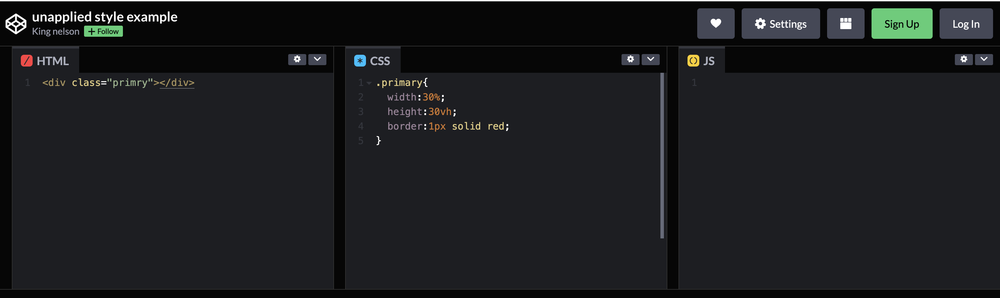
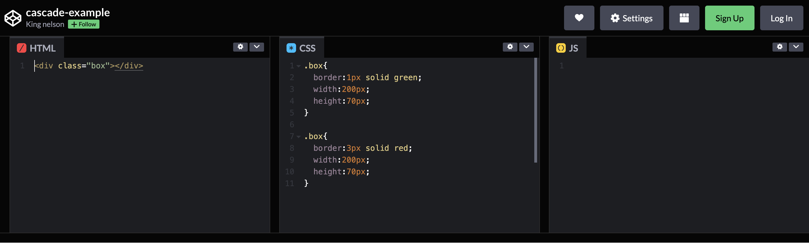
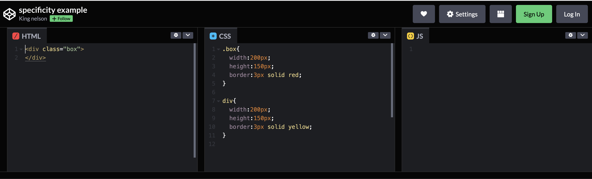
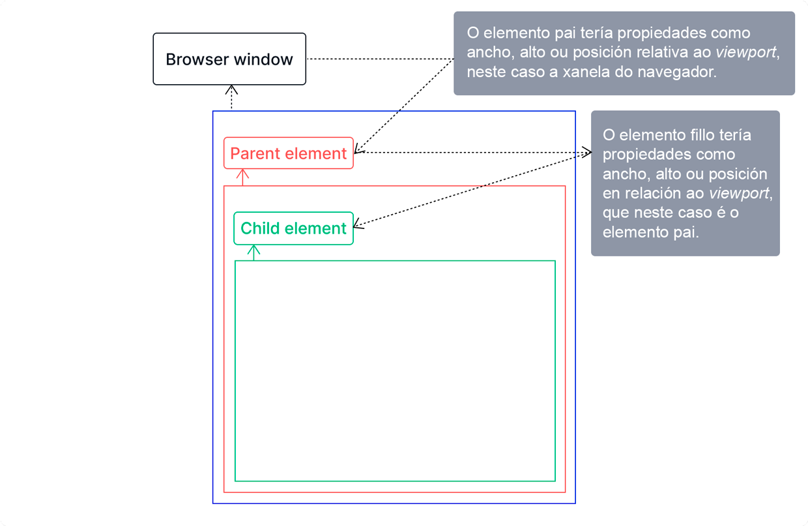
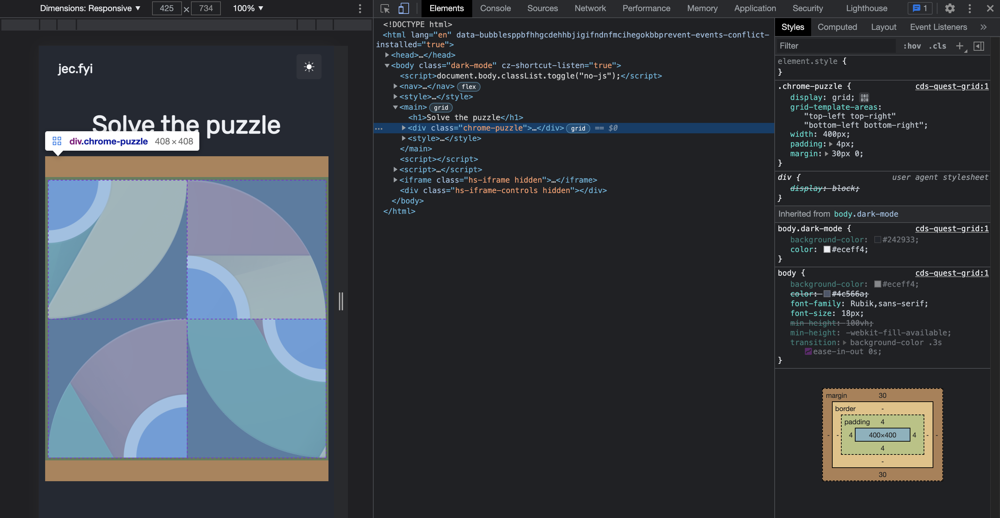

# {{ $frontmatter.title }}

Buscar e corrixir erros forma parte do noso traballo como programadores, polo que debemos buscar unha solución por moi difícil que pareza a tarefa. Claro que poderiamos evitar moitos destes problemas se tivésemos un coñecemento axeitado da ferramenta ou linguaxe de programación que estamos a usar. Aínda así os erros son parte do noso día a día. As veces cometeralos ti, outras veces alguén do equipo, e outras pode que a sorte nos enfronte con algún posible bug ou inconsistencia. E a saída sempre será buscar unha solución.

Aínda que CSS pode parecer inocuo a primeira vista, a relación entre o programador e a ferramenta pode deteriorarse rapidamente se non o aprendes e non o entendes correctamente. Isto pode provocar que vaias cara atrás e te sintas frustrado mentres traballas con el.

Este artigo explorará algúns conceptos fundamentais de CSS para axudarche a evitar algúns erros comúns e saber que buscar cando atopes erros de CSS. Aquí tes o que imos tratar:

- Manexo de marcas
- Comprensión da fervenza, especificidade e herdanza CSS
- Relación pais e fillos
- Posición
- Unidades absolutas vs relativas
- Por que a regra ``!important`` pode facer máis mal que ben
- Consultas de medios
- Contornas de depuración (ferramentas de desenvolvemento de Chrome)
- Consellos e trucos

Imos alo.

## Manexo de marcado

Moitos desenvolvedores non recoñecen o HTML como unha posible causa dun erro CSS e, como resultado, moitas veces o pasan por alto e perden o tempo buscando o problema incorrecto. Aínda que o HTML é moi tolerante, ás veces pode ser a fonte dun problema común de CSS, como un nome de clase ou un selector de ID mal escritos, que podes tardar horas en solucionar. Vexamos algúns problemas comúns co noso marcado e como solucionalos:

- **Selectores de clases ou de identificación mal escritos:** un dos erros máis comúns no noso marcado é ter os nomes dos selectores mal escritos, e esta é unha das primeiras cousas a ter en conta; os selectores mal escritos significan que temos estilos que non se aplican a ningún elemento da páxina; isto pódese solucionar simplemente garantindo que os selectores teñan a ortografía exacta na nosa marca e folla de estilo.

Vexamos un [exemplo](https://codepen.io/D_kingnelson/pen/gORozde):



Bótalle un ollo ao CodePen anterior, observa que o nome da clase no elemento div se escribe como " **primry** " mentres que o selector da folla de estilo está escrito correctamente como "**primary** ", isto significa que o noso elemento non terá ningún estilo aplicado. Este erro pódese evitar con só **comprobar os nomes dos nosos selectores de clases ou IDs**.

- **Eliminar o marcado con HTML semántico:** unha vantaxe de usar HTML semántico é que limpa o noso marcado; en lugar de ter etiquetas ``div`` por todas partes, podemos usar etiquetas semánticas específicas que transmiten significado. Dado que as nosas follas de estilo adoitan seguir a mesma xerarquía que a nosa marca, ten sentido facelos lexibles; isto axuda ao estilo proporcionando unha xerarquía visual clara á que respectar.

Ademais, unha base de código máis limpa reduce a probabilidade de erros.

## Comprensión da cascada, especificidade e herdanza CSS

Como calquera outra ferramenta ou linguaxe de programación, CSS ten o seu propio conxunto de regras ou pautas que che ensinan como funciona; entendelas pode axudarche a evitar que se produzan erros - aínda que é inevitable que cometamos erros :P-. 

Vexamos algunhas das regras importantes para CSS:

### A Cascada

CSS segue unha orde de arriba a abaixo, como indica o nome *en cascada*. Isto significa que a orde das regras CSS é esencial. Cando dúas regras aplicadas a un elemento teñen a mesma especificidade, aplícase sempre a que está ao final da lista.

Aquí tes un [exemplo](https://codepen.io/D_kingnelson/pen/KKqQxvB):



No exemplo anterior, temos dous estilos que están sendo declarados, e ambos teñen a mesma especificidade, pero será a regra que aparece en último lugar a que se aplicará ao elemento. Ademais, os estilos cunha puntuación de especificidade máis alta aplicaranse sempre a un elemento, independentemente da súa orde na folla de estilos.

### Especificidade

Cando un elemento ten varios selectores, o navegador usa a especificidade para determinar que regra de estilo se debe aplicar. Aplícanse ao elemento as regras de estilo dun selector cunha puntuación específica máis alta.

Os selectores de ID teñen unha puntuación específica máis alta porque seleccionan só un elemento en todo o marcado, logo seguen os nomes de clase, mentres que os selectores de nomes de etiqueta son os menos específicos. Considera o seguinte [exemplo](https://codepen.io/D_kingnelson/pen/dyRdLGy):



No exemplo, ter en conta que aínda que o selector de nome de etiqueta ``div`` aparece en último lugar na orde, as súas regras de estilo se ignoran porque ten unha puntuación específica máis baixa que o selector de clases.

### Herdanza

Moita xente loita co concepto de herdanza; asumimos que todo, desde o tamaño dun elemento ata a súa posición, é relativo á vista, pero non sempre é así.

Os elementos poden herdar propiedades, como a cor, o tamaño da fonte, a familia de fontes, o cursor, etc., dos seus elementos principais a non ser que estes elementos teñan as súas propias regras de estilo aplicadas explícitamente. Saber que estas características poden ser herdadas pode axudarnos a evitar erros. Aquí tes un exemplo:

```html
<div>
  <p>Ola, eu herdaría a propiedade de estilo do meu pai</p>
</div>
```


E na nosa folla de estilo:

```css
div{
   color: blue;
   font-size: 12px;
}
```


Aínda que non declaramos ningunha regra de estilo para o elemento `p` no exemplo anterior, aínda seguiría herdando as regras de estilo do elemento `div`.

Cando non sabe por que un elemento se comporta dun xeito determinado ou por que se lle aplican regras de estilo que non parecen estar aínda definidas, pode ser porque herde as propiedades de estilo do seu elemento pai. Aquí tes unha [lista completa](https://www.w3.org/TR/CSS21/propidx.html) das propiedades que se poden herdar en CSS.

Comprender os conceptos de **fervenza**, **especificidade** e **herdanza** pode axudarnos a evitar erros CSS e aforrarnos unha cantidade significativa de tempo na depuración. 

Vaiamos agora á relación entre pais e fillos, onde veremos o concepto de herdanza en acción.

## Relación pais e fillos

A relación entre pais e fillos é outro concepto que che axudará a evitar erros CSS. As propiedades como o ancho, o alto ou a posición dun elemento son sempre relativas á súa xanela, e a xanela non sempre é a xanela do navegador. Vexamos a seguinte imaxe:



A imaxe de arriba representa o concepto de relación entre pais e fillos, que explica como o elemento principal pode influír no ancho, lonxitude ou posición dun elemento. Para explicar máis este concepto, imos facer un pouco de matemáticas usando a porcentaxe relativa da unidade.

Digamos que a xanela do noso navegador ten un ancho de visualización de 1600px: o elemento do corpo, que é o elemento principal global, ocupará o 100% dese ancho, dándolle tamén un ancho de 1600px. Aquí tes como: 

> 100/100 * 1600 = 1600 píxeles.

Agora digamos que temos dous elementos ``div`` dentro da nosa etiqueta `body`, un ``div`` pai e outro ``div`` aniñado como elemento fillo:

```html
 <body>
  <div class="parent">
    <div class="child"></div>
  </div>
</body>
```

segundo o escenario que pintamos anteriormente, esta sería a nosa folla de estilo:

```css
body{
    Width: 1600px; /* porque ocupa o 100% do ancho da xanela gráfica. */
  }

.parent{
    width:80%;
  }

.child{
    width:60%;
  }
```

Imos repasar o código, o ``div`` ao que se aplica a clase ``.parent`` ten un ancho do 80% e que se traduce en:

> 80/100 * 1600 = 1280 píxeles 

o que significa que o ``div`` ao que se aplica a clase ``.parent`` ten agora un ancho de 1280px. Agora o ``div`` coa clase ``.child`` que é un elemento fillo do ``div`` ``.parent`` ten un ancho do 60% e isto tradúcese en:

> 60/100 * 1280 = 768 píxeles 

este valor está en relación co seu elemento pai que ten un ancho de 1280px

O exemplo anterior explica o concepto da relación pais e fillos; cando cheguemos á sección de posición absoluta, veremos como afecta este concepto á posición do elemento. O seguinte que miraríamos é a propiedade de posición.

## Posición

A propiedade de posición permítenos colocar elementos onde queiramos nunha páxina web; tamén se adhire á relación pais e fillos cando se usan unidades relativas como %.
Hai cinco valores de propiedade de posición: relativo, absoluto, fixo, adhesivo e estático. Neste artigo, só explicaríamos o absoluto xa que pode ser unha das principais causas dos erros CSS.

A propiedade ``position:absolute;`` elimina un elemento do fluxo da páxina por completo, o que implica que o documento trátao como se estivese flotando fóra do fluxo da páxina sen interromper o fluxo normal da mesma. Aínda que isto pode ser extremadamente poderoso, ás veces tamén pode ser un pesadelo de depuración. Cando un elemento ten unha posición absoluta, trátase como un elemento fillo do elemento `body`, independentemente de onde estea no marcado. Intentar manipular a súa posición provocaría un cambio de posición en relación ao elemento `body`. Pero e se iso non é o que queremos?

Aínda podemos ter un elemento absolutamente posicionado que é relativo ao seu elemento pai orixinal mantendo o seu [absolutismo](https://birdeatsbug.com/blog/introduction-to-css-container-queries).

```html
 <body>
  <div class="parent">
    <div class="child"></div>
  </div>
</body>
```
```css
.parent{
  width: 200px;
  height: 150px;
  position: relative;
}

.child{
  width: 50px;
  height: 50px; 
  position: absolute;
  top: 50%;
}
```

Simplemente dándolle ao elemento ``.parent`` unha posición relativa, permitimos que o noso elemento ``.child`` posicionado absolutamente sexa eliminado do fluxo da páxina pero aínda así se coloque dentro do seu elemento pai.

## Unidades absolutas vs relativas

CSS ten dous tipos de unidades: absolutas e relativas.

As unidades físicas como píxeles, polgadas e centímetros son exemplos de unidades absolutas. Estas unidades teñen sempre o mesmo tamaño en relación á vista e non se ven afectadas polas lonxitudes do seu recipiente ou elemento principal. Isto significa que unha propiedade cun valor unitario absoluto sempre terá o mesmo tamaño independentemente do tamaño da pantalla. Así, 200px nunha pantalla móbil corresponde a 200px nunha pantalla de portátil.

Por outra banda, as unidades relativas vense afectadas pola lonxitude doutro elemento, principalmente o elemento pai. Vimos un exemplo dunha unidade relativa, a porcentaxe, na sección Posición. As unidades relativas son excelentes porque garanten que o tamaño dos elementos se pode escalar nunha variedade de tamaños de pantalla.

As unidades relativas son preferibles ás unidades absolutas ao crear un sitio web porque axudan á capacidade de resposta. As unidades absolutas, como px, non se escalan nos tamaños de pantalla, o que provoca un desbordamento na páxina web e unha aparencia confusa.

Ver [aquí](https://www.w3schools.com/cssref/css_units.asp) unha lista de unidades absolutas e relativas.

## Por que a regra ``!important`` pode facer máis mal que ben

A palabra clave ``!important`` garante que se aplique unha regra de estilo a un elemento independentemente da especificidade ou da cascada. É unha forma de dar ás propiedades do estilo unha puntuación de especificidade máis alta da que teñen en realidade. Pero isto é só unha gratificación instantánea porque interrompe a fervenza natural da folla de estilo. Vexamos un exemplo que mostra as implicacións desta palabra clave.

```html
<p>Ola, estou a piques de asumir unha gran responsabilidade.</p>
```

Agora imos dar estilo a este elemento p.

```css
p{
  font-size: 40px;
  font-weight: 700 !important;
  color: blue !important;
}
```

Imaxina un escenario no que deixaches de traballar neste proxecto durante moito tempo pero despois volveches a el e decidiches cambiar o grosor e a cor da fonte. Probemos iso:

```css
p{
  font-weight: 400;
  color: pink; 
}
```

Defines novos valores para o peso da fonte e a propiedade da cor, pero non ten efecto. Isto débese a que a palabra clave ``!important`` rompeu a fervenza natural e impediu que se anulasen os valores antigos. Se esta fose unha base de código máis grande, estarías atrapado tentando corrixir este erro que se puido evitar dende o principio.
A palabra clave ``!important`` fai que o teu código sexa máis difícil de manter e evita que os estilos sexan substituídos. En lugar de usar a palabra clave ``!important``, considera comprender e utilizar a fervenza no teu beneficio.

## Consultas de medios

As consultas multimedia permítennos definir regras de estilo para que a nosa páxina web se vexa ben en todos os tamaños de pantalla. Traballan con puntos de interrupción que indican en que punto entraría en vigor unha determinada regra de estilo.

```css
@media screen and (min-width: 600px){
  body{
    background-color: black;
  }
}
```

O bloque de código anterior é un exemplo dunha consulta multimedia que di que cando o ancho da xanela gráfica chega a 600px ou máis, o corpo debería ter unha cor de fondo negro.

Xeralmente, as consultas multimedia anulan unha regra de estilo xa definida ou establecen novas regras de estilo nun elemento nun determinado punto de interrupción. Consulta este exemplo:

```html
 <div>
  <p>Media queries are great!</p>
</div>
```
```css
div{
  width: 150px;
  height: 200px;
  background-color: blue;
}

@media screen and (min-width: 600px){
  div{
    width: 500px;
    height: 400px;
  }
}
```

No exemplo anterior, observa que só definimos novas regras de estilo para as propiedades de ancho e alto, pero non a cor de fondo. Isto significa que a cor de fondo do ``div`` aínda sería azul. Con este efecto vemos que os conceptos de herdanza e fervenza traballan xuntos.

Cando unha regra de estilo non está definida nunha consulta multimedia, aínda mantén a súa regra de estilo orixinal, ás veces quedámonos a preguntar por que un elemento se comporta dun xeito determinado. Isto é porque nalgúns casos está herdando unha regra de estilo predefinida. Un exemplo perfecto sería centrar un elemento usando propiedades de posición e transformación.

```css
/* isto centraría o elemento no seu recipiente pai. */
div{
  position:relative;
  top:50%;
  left: 50%;
  transform: translate(-50%, -50%);
}
```

Agora digamos que xa non queremos centrar este elemento e só queremos movelo un pouco á esquerda, nun determinado punto de interrupción.

```css
@media screen and (min-width: 600px){
  div{
    left: 30%;
  }
}
```

Se executas o exemplo anterior notarás que non funcionaría, porque temos unha propiedade de transformación que impide que se aplique esa regra. Nalgúns casos, necesitamos restablecer as propiedades para que funcionen.

Como solucionamos o problema anterior? Simplemente podemos establecer a propiedade ``transform`` a 0. 

``transform: translate(0);``

Agora podemos mover o elemento como queiramos.

Comprender como funcionan a herdanza e a fervenza en relación coas consultas de medios pode evitar que teñamos moitos problemas de resposta. Ademais, lembra que algunhas regras de estilo existentes deben restablecerse ao utilizar consultas multimedia antes de que se poidan definir outras novas.

## Entorno de depuración (ferramentas de desenvolvemento de Chrome, ou outros navegadores modernos)

O navegador Chrome ofrece unha gran variedade de ferramentas para engadir á nosa caixa de ferramentas de depuración. As *Ferramentas de desenvolvemento* permítennos depurar calquera cousa, desde propiedades de estilo de elementos ata corrixir propiedades de deseño, como **``grid``** ou **``flex``**.



### Propiedades de depuración

Hai casos nos que non entendemos por que unha regra de estilo non se aplica ou non funciona. As ferramentas de desenvolvemento de Chrome ofrécennos unha excelente forma de ver o que funciona baixo o capó.

Ao facer clic co botón dereito nun elemento que se quere depurar e facendo clic en Inspeccionar elemento, obtense acceso aos estilos dese elemento. Todo, desde as súas propiedades de estilo ata os seus estilos de consulta de medios ata o seu modelo de caixa.

Cando un elemento ten estilos sen aplicar, se pode comprobar rapidamente para ver por que. Na pestana de estilos, isto aparece mediante unha anulación na propiedade do estilo.

### Depuración de esquemas

As ferramentas de desenvolvemento de Chrome tamén nos ofrecen un xeito sinxelo de depurar problemas de deseño. Aquí tes un [artigo](https://developers.google.com/codelabs/devtools-debug-css-grid#0) que mostra como depurar esquemas de cuadrícula. Ademais, aquí tes un gran [artigo](https://developer.mozilla.org/en-US/docs/Tools/Page_Inspector/How_to/Examine_Flexbox_layouts) de *MDN Docs* que mostra como usar o depurador flexible nas ferramentas de desenvolvemento de Chrome.

## Consellos e trucos

Unha estratexia para usar cando se tratan problemas de deseño é darlle un esquema aos elementos con:

```css
.parent-element{
  outline: 1px solid #fabada;
}
```

Deste xeito, podes saber se os elementos colocados dentro dese recipiente están onde queres que estean. Podes dar un paso máis alá simplemente dando un esquema a todos os elementos da páxina web:

```css
*{
  outline: 1px solid red;
}
```

Deste xeito, todos os elementos da páxina terían un esquema. Pero quizais non estea moi claro se todos os elementos da páxina teñen unha contorna de cor. Entón, como te aseguras de que os elementos teñan cores diferentes? Aquí tes como:

```js
;[].forEach.call($$("*"), function(a) {
  a.style.outline = "1px solid #" + (~~(Math.random() * (1 << 24))).toString(16)
})
```

Facendo clic co botón dereito do rato, fai clic en calquera lugar da páxina na que estás a traballar e selecciona *Inspeccionar o elemento* para mostrar as Ferramentas de desenvolvemento. Introduce o código anterior na xanela da consola despois de facer clic na pestana "*Consola*". Se fas isto, cada elemento da páxina terá a súa propia cor diferente de contorna, o que facilita a identificación de calquera problema no deseño.

## Conclusión

CSS pode ser complicado, e descubrir que facer e que buscar cando tes erros pode ser extremadamente difícil. Revisáronse algúns conceptos fundamentais de CSS e consellos e trucos nesta titoría para axudarche a afrontar con avantaxes a depuración de calquera erro.

#### Ligazóns útiles

- [Buscar e corrixir un desbordamento corporal non desexado: trucos CSS](https://css-tricks.com/findingfixing-unintended-body-overflow/)
- [Problemas comúns de CSS para o proxecto frontend: revista smashing](https://www.smashingmagazine.com/2018/12/common-css-issues-front-end-projects/)
- [15 erros comúns de CSS e as súas correccións](https://www.sanwebe.com/2015/03/15-common-css-bugs-and-their-easy-fixes)
- [Depuración de documentos CSS - MDN](https://developer.mozilla.org/en-US/docs/Learn/CSS/Building_blocks/Debugging_CSS)

---

*Tradución do artigo publicado por Nelson Michael o 22 de novembro de 2021 en [Birdeatsbug](https://birdeatsbug.com/blog/how-to-effectively-debug-css)*

---

DAW🧊2025