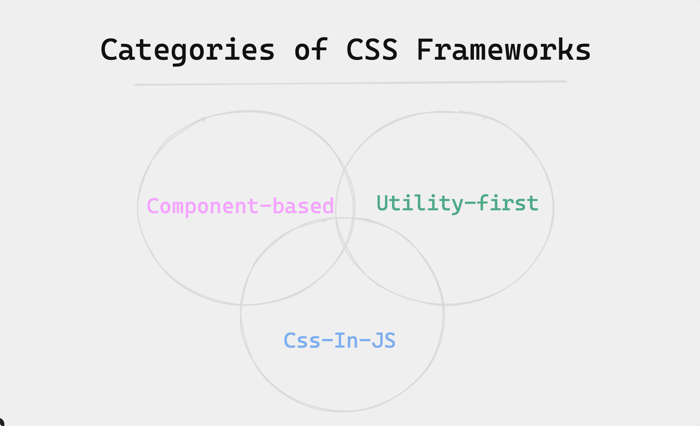
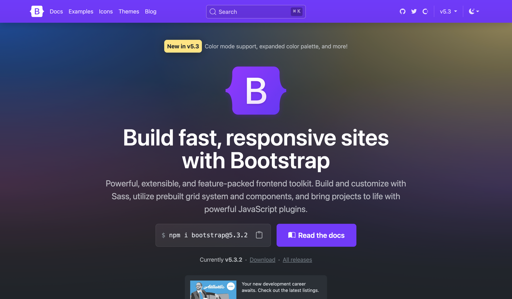
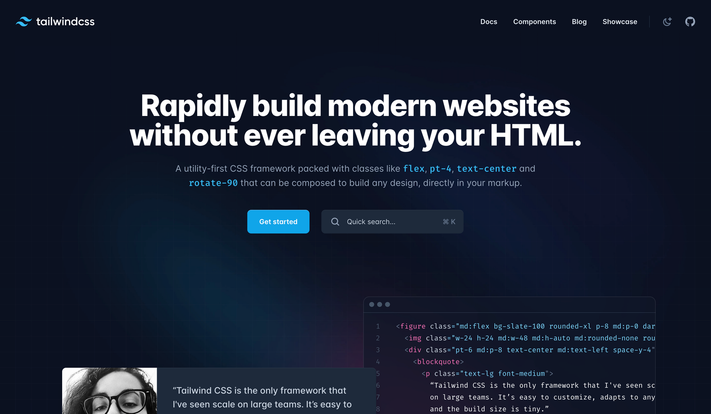
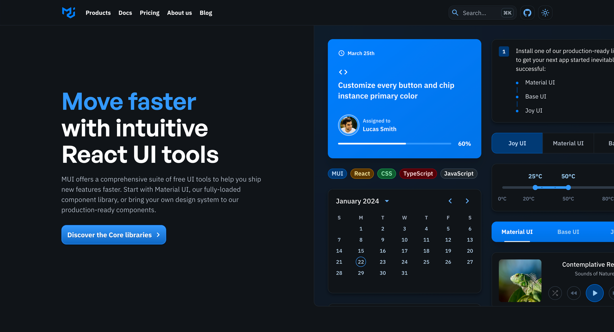

# Marcos CSS

CSS percorreu un longo camiño nos últimos anos. No pasado, usaba CSS para crear aplicacións web de aspecto sinxelo que se basean en táboas HTML e flotantes CSS como sistemas de deseño. E agora podes crear interfaces de usuario interactivas complexas que resulten atractivas con deseños elegantes.

Pero tan avanzado como se fixo CSS, escribir estilos CSS desde cero para aplicacións web extensas pode levar moito tempo. Tamén pode provocar a repetición de estilos, arquivos CSS máis longos, erros de compatibilidade entre navegadores e, en xeral, unha base de código máis complexa.

Para resolver este desafío, xurdiron os frameworks CSS como solución. Os marcos CSS introduciron un medio para que os desenvolvedores adopten un conxunto de estilos e compoñentes CSS predefinidos e estandarizados para crear interfaces de usuario coherentes, atractivas e sensibles.

Pero con tantos marcos CSS para escoller, pode ser difícil decidir sobre o marco axeitado para a túa aplicación. Quererás realizar unha comparación axeitada que teña en conta as características xerais de cada marco CSS, para poder escoller a opción máis axeitada que mellor se adapte ás túas necesidades.

Neste resumo, exploraremos que son os frameworks CSS, os seus beneficios e limitacións e como podes comezar a utilizalos. Tamén veremos os frameworks CSS máis destacados e usados que debes coñecer.

Ao final, terás unha boa idea de como funcionan os frameworks CSS e cales usar para satisfacer as necesidades do teu proxecto.

## Que son os marcos CSS?

Os marcos CSS son un conxunto de estilos e follas de estilo CSS preescritos e listos para usar que proporcionan un conxunto de estilos e compoñentes para o marcado de estilos. Axilizan o proceso de desenvolvemento ofrecendo unha base de estilos CSS reutilizables para elementos e deseños comúns.

Os marcos CSS úsanse para crear interfaces de usuario familiares e consistentes, simplificar o deseño receptivo e mellorar a colaboración entre os equipos de desenvolvemento.

## Por que deberías usar marcos CSS?

Os marcos CSS ofrecen numerosos beneficios que os converten en ferramentas indispensables para o desenvolvemento web. Aquí tes algunhas vantaxes que proporcionan os frameworks CSS:

**Tempo de desenvolvemento máis rápido** : os frameworks CSS veñen con compoñentes e estilos preconstruídos, o que elimina a necesidade de escribir todo desde cero. Isto acelera o proceso de desenvolvemento e permite aos desenvolvedores centrarse en personalizar e afinar aspectos específicos dos seus proxectos en lugar de construír desde cero.

**Estilo e deseño consistentes** : os cadros CSS axudan a proporcionar un aspecto coherente e coherente en diferentes compoñentes e páxinas. Aseguran que todos os estilos, elementos da IU, botóns e tipografía manteñan unha linguaxe de deseño unificada, evitando que os desenvolvedores dediquen tempo excesivo ao estilo e garantindo unha mellor experiencia de usuario.

**Mellora a colaboración e o mantemento** : os marcos CSS adoitan ofrecer bibliotecas ben documentadas e convencións establecidas, o que facilita aos desenvolvedores a colaboración e o mantemento das bases de código. Cun código base común e unha ampla documentación, os desenvolvedores poden comprender e traballar facilmente co código do outro.

## Tipos de marcos CSS

Os marcos CSS non son un único. Ven en diferentes formas, e cada categoría ten o seu propio foco e vantaxes. Coñecer as categorías nas que poden encaixar os frameworks CSS será útil para saber que esperar de cada cadro.

Vexamos agora os principais tipos de frameworks CSS.

### Marcos baseados en compoñentes

Esta é a orixe dos frameworks CSS. Os cadros baseados en compoñentes ofrecen un conxunto de compoñentes de IU preconstruídos que os desenvolvedores poden conectar ás súas aplicacións para montar interfaces rapidamente. O obxectivo é proporcionar un sistema de deseño modular e reutilizable que che axude a crear aplicacións web consistentes e visualmente atractivas sen comezar de cero cada vez.

### Utility-First Frameworks

A idea detrás dos cadros de utilidade é que CSS non debe ser descritivo e non debe depender moito do teu marcado (por exemplo, unha clase ".header" que significa unha barra de navegación ou o encabezado do sitio web), senón que debería basearse na funcionalidade (por exemplo, ".text-align-center").

En lugar de limitar o deseño da súa aplicación só ao que proporciona o marco, os marcos de utilidade primeiro ofrecen estilos e clases CSS que só fan unha cousa (ou un pequeno conxunto de cousas) como bloques de construción para estender e personalizar o deseño da súa aplicación máis aló das limitacións dun marco baseado en compoñentes.

### CSS-en-JS

Co aumento das bibliotecas de JavaScript como React, creáronse marcos CSS-in-JS para permitir aos desenvolvedores manipular estilos directamente en JavaScript, incluíndo CSS no seu marcado JavaScript.

CSS-in-JS utiliza a natureza dinámica de JavaScript para proporcionar unha forma de escribir estilos CSS interactivos que sexan eficaces e baseados nos datos e interaccións do usuario.

Hai máis tipos de marcos CSS dispoñibles, pero estas tres categorías cobren os grupos máis notables.

Teña en conta que non hai unha liña fina que separe estas preocupacións. A maioría dos marcos CSS poden solaparse en varias categorías; por exemplo, un marco baseado en compoñentes pode darche utilidades e un marco baseado en utilidades tamén pode darche compoñentes.



*Un diagrama que mostra algunhas categorías de frameworks CSS e como se entrelazan entre si*

Por exemplo, considera o diagrama anterior que mostra como se poden entrelazar as tres categorías de marcos CSS.

## 9 marcos CSS que debes coñecer

Agora que tes unha comprensión clara do que son os cadros CSS e os seus diferentes tipos, vexamos algúns dos cadros CSS máis destacados e máis utilizados que deberías coñecer.

## Bootstrap

Bootstrap comezou como unha ferramenta interna en X (anteriormente, Twitter) para manter un aspecto consistente en toda a plataforma. Despois foi de código aberto en 2011 para que o use a comunidade de desenvolvemento web máis ampla. [Bootstrap](https://getbootstrap.com/) é un dos marcos CSS máis utilizados, con foco no deseño web receptivo e orientado a móbiles.

Bootstrap ofrece unha colección sólida de compoñentes CSS e JavaScript, como o seu sistema de grade e compoñentes de IU sensibles como botóns, menús de navegación e formularios, que simplifican o proceso de creación de deseños web limpos e consistentes.

Bootstrap ten un gran soporte comunitario e máis de cen mil estrelas de GitHub. E aínda que poida parecer voluminoso en comparación coas opcións modernas, aínda é un dos marcos CSS máis utilizados que podes usar para crear aplicacións web atractivas e temáticamente coherentes sen necesidade de ser un experto en CSS e deseño web.



*Unha imaxe do sitio web oficial do framework Bootstrap*

### Como usar Bootstrap

Para comezar con Bootstrap, cómpre incorporar os seus ficheiros fonte ao proxecto. Nun marco de JavaScript como React, podes instalar Bootstrap no teu proxecto usando un xestor de paquetes como npm.

```bash
npm install bootstrap
```

A continuación, importe o CSS de Bootstrap na parte superior do ficheiro de entrada principal da aplicación, normalmente `src/index.js`:

```javascript
import 'bootstrap/dist/css/bootstrap.min.css';
```

Isto importará Bootstrap CSS e facelo dispoñible para o seu uso en toda a súa aplicación. Agora podes usar os compoñentes de Bootstrap na túa aplicación deste xeito:

```javascript
import React from 'react';
function App() {
  return (
    <div className="container">
      <h1>Hello, Bootstrap in React!</h1>
      <button className="btn btn-primary">Click Me</button>
    </div>
  );
}

export default App;
```

Para obter máis información sobre Bootstrap, consulte a [documentación oficial de Bootstrap](https://getbootstrap.com/docs/5.0/getting-started/introduction/) para obter orientación detallada, exemplos e recursos adicionais.

## Tailwind CSS

[Tailwind CSS](https://github.com/tailwindlabs/tailwindcss) é un framework CSS de utilidade que che permite construír rapidamente interfaces de usuario personalizadas directamente en ficheiros de marcado.

Como un marco de utilidade en primeiro lugar, Tailwind abstrae das restricións dun marco baseado en compoñentes, por exemplo, Bootstrap.

Aínda que os cadros baseados en compoñentes como Bootstrap destacan por axilizar o proceso de construción de deseños web proporcionando compoñentes de IU predefinidos, opinan que estás limitado ao sistema de deseño e ao ecosistema actual do marco. Tentar estender ou personalizar o deseño da súa aplicación máis aló do que ofrece o marco pode resultar unha solución.

Tailwind ofrece un sistema robusto de clases de utilidade e axudantes como bloques de construción que se poden crear para construír calquera deseño directamente no teu marcado. Coa [clasificación de Tailwind como o segundo marco máis utilizado na enquisa do Estado de CSS 2023 cun 76 % aproximadamente](https://2023.stateofcss.com/en-US/css-frameworks/) , é a mellor opción para prototipar rapidamente e acelerar o proceso de desenvolvemento de acordo cos estándares web modernos.



*Unha imaxe do sitio web oficial do framework CSS de Tailwind*

### Como usar Tailwind CSS

Instala `tailwindcss`a través dun xestor de paquetes e crea o teu `tailwind.config.js`ficheiro para configurar e personalizar Tailwind CSS para a túa aplicación.

```bash
npm install -D tailwindcss
npx tailwindcss init
```

Engade os camiños a todos os teus ficheiros de modelos e marcas no teu `tailwind.config.js`ficheiro, así como a outras configuracións.

```javascript
/** @type {import('tailwindcss').Config} */
module.exports = {
  content: ["./src/**/*.{html,js,jsx,ts,tsx}"],
  theme: {
    extend: {},
  },
  plugins: [],
}
```

Engade as `@tailwind`directivas para cada unha das capas de Tailwind ao teu ficheiro CSS principal e asegúrate de importar o ficheiro CSS ao ficheiro de entrada principal da túa aplicación.

```css
@tailwind base;
@tailwind components;
@tailwind utilities;
```

Agora podes aplicar clases de utilidade directamente no teu marcado HTML para dar estilo aos teus compoñentes.

```javascript
function Button({children}) {
  return (
      <button className="bg-green-500 hover:bg-green-700 text-white font-bold py-2 px-4 rounded">
        {children}
      </button>
  );
}

export default Button;
```

Podes obter máis información sobre como configurar e usar Tailwind CSS en función do teu ambiente de proxecto e do uso avanzado consultando a [documentación oficial de Tailwind CSS](https://tailwindcss.com/docs/installation/framework-guides) .

## Material IU

Material UI é un marco CSS baseado en compoñentes para crear interfaces de usuario en aplicacións React. Está baseado no sistema de deseño de código aberto de Google, [Material Design](https://m3.material.io/) , e ofrece unha rica colección de compoñentes e estilos predefinidos.

Como unha das [comunidades de IU máis grandes](https://github.com/mui/material-ui) do ecosistema React, Material UI ofrece un sistema de deseño moderno e visualmente atractivo. Presenta un conxunto de opcións de personalización que facilitan aos desenvolvedores a implementación de sistemas de deseño personalizados na parte superior da biblioteca, polo que é unha opción popular para crear interfaces de usuario consistentes en aplicacións React.



*Unha imaxe do sitio web oficial do kit MUI*

### Como usar Material UI

Instala o paquete principal de Material UI e as [dependencias adicionais](https://mui.com/material-ui/getting-started/installation/) que necesites.

```bash
npm install @mui/material @emotion/react @emotion/styled
```

Agora podes importar calquera compoñente da IU de material nos teus compoñentes de React e usalos no teu código JSX.

```javascript
import Button from '@mui/material/Button';

export default function ButtonUsage() {
  return <Button variant="contained">Hello world</Button>;
}
```

Consulta [a documentación da IU do material](https://mui.com/) para obter pautas de uso detalladas, referencias de API e exemplos

## Styled Components

[styled-components](https://styled-components.com/) é unha das bibliotecas CSS-in-JS máis destacadas. Ofrece un xeito sinxelo de crear e xestionar estilos CSS dentro de ficheiros e compoñentes JavaScript.

Aínda que orixinalmente foi deseñado específicamente para o ecosistema React, os compoñentes con estilo avanzaron para que agora poidas usalo con JavaScript vainilla ou outros frameworks JavaScript como Vue.

Como a [biblioteca CSS-in-JS máis popular das estrelas de GitHub e das descargas semanais de NPM](https://2023.stateofcss.com/en-US/css-in-js/) , styled-components ofrece un enfoque moi flexible e intuitivo para o estilo, o que facilita a creación de compoñentes de IU reutilizables e autónomos.


*Unha imaxe do sitio web oficial de Styled-components*

### Como usar compoñentes de estilo

Instale o paquete de compoñentes de estilo mediante `npm` ou `yarn`.

```bash
npm install styled-component
```

Agora, pode definir os seus compoñentes con estilo importando a función de estilo e usándoa para crear versións con estilo de elementos HTML ou compoñentes personalizados.

```javascript
import styled, { css } from 'styled-components'
const Title = styled.h1`
  font-size: 1.5em;
  text-align: center;
  color: #BF4F74;
`;

render(
  <div>
    <Title>
      Hello World!
    </Title>
  </div>
);
```

Consulte a [documentación oficial dos compoñentes con estilo](https://styled-components.com/) para obter guías completas, exemplos e funcións avanzadas.

## Fundation

[Foundation](https://get.foundation/) é a alternativa máis próxima a Bootstrap. Non é só un marco CSS, senón un conxunto de ferramentas completo para [crear estilos de aplicacións web](https://get.foundation/sites.html) , crear [modelos de correo electrónico](https://get.foundation/emails.html) , que se sabe que son moi difíciles, e [integrarse coa IU de Motion de ZURB](https://zurb.com/playground/motion-ui) para crear animacións CSS avanzadas.

Inclúe compoñentes comúns da IU como Bootstrap, pero está máis centrado nas utilidades e ofrece aos desenvolvedores máis opcións para personalizar compoñentes. Con case demasiadas funcións, pode ser considerablemente máis complexo e difícil comprender completamente como funciona todo en comparación con outros frameworks.


*Unha imaxe do sitio web oficial do framework da Fundación*

### Como usar Foundation

Podes instalar Foundation no teu proxecto cun xestor de paquetes.

```bash
npm install foundation-sites
```

Agora podes usar os seus estilos e compoñentes na túa aplicación.

```html
<div class="card" style="width: 300px;">
  <div class="card-divider">
    This is a header
  </div>
  
  <div class="card-section">
    <h4>This is a card.</h4>
    <p>It has an easy to override visual style.</p>
  </div>
</div>
```

Consulta [a documentación oficial da Fundación](https://get.foundation/frameworks-docs.html) para obter instrucións detalladas, exemplos e recursos adicionais.

## IU Chakra

A creación do desenvolvedor nixeriano Segun Adebayo, [Chakra UI](https://chakra-ui.com/) cae na mesma categoría que MUI como biblioteca de compoñentes e marco CSS para aplicacións React. Destaca a accesibilidade, a ergonomía do programador e un sistema de deseño personalizable.

Chakra UI ofrece unha colección de compoñentes ben deseñados e accesibles que se poden personalizar facilmente para que coincidan coa marca e o estilo do teu proxecto.


*Unha imaxe do sitio web oficial do framework Chakra CSS*

### Como usar Chakra UI

Para comezar, instale o paquete Chakra UI mediante un xestor de paquetes.

```bash
npm i @chakra-ui/react @emotion/react @emotion/styled framer-motion
```

Despois de instalar Chakra UI, debes envolver a túa aplicación ou compoñentes específicos co `ChakraProvider`para que os compoñentes de Chakra UI estean dispoñibles.

```javascript
import * as React from 'react'
// 1. import `ChakraProvider` component
import { ChakraProvider } from '@chakra-ui/react'

function App() {
  // 2. Wrap ChakraProvider at the root of your app
  return (
    <ChakraProvider>
      <TheRestOfYourApplication />
    </ChakraProvider>
  )
}
```

Agora podes usar os compoñentes de Chakra UI no teu código JSX para crear a túa interface de usuario.

```javascript
import { Button} from '@chakra-ui/react'

export default function ButtonUsage() {
  return <Button colorScheme='blue'>Hello world</Button>;
}
```

Para obter máis información, podes consultar a [documentación da IU de Chakra](https://chakra-ui.com/) para obter pautas de uso detalladas, exemplos de compoñentes e opcións de temática.

## Emotion

[Emotion](https://emotion.sh/) está construída a partir dos conceptos de compoñentes de estilo para ser unha biblioteca CSS-in-JS máis eficiente, lixeira e rica en funcións. Faino empregando funcións como mapas de orixe, etiquetas e utilidades de proba.

A emoción é independente do marco e ten unha sintaxe o máis próxima posible a CSS, o que facilita a súa adopción.


*Imaxe da páxina de inicio de Emotion*

### Como usar Emotion

O paquete [@emotion/css](https://www.npmjs.com/package/@emotion/css) é independente de frameworks e é a forma máis sinxela de usar Emotion. Para comezar, instale o paquete a través dun xestor de paquetes.

```bash
npm i @emotion/css
```

Agora podes usar a API CSS de Emotion para xerar e compoñer estilos CSS.

```javascript
import { css } from '@emotion/css'

const color = 'white'
render(
  <div
    className={css`
      padding: 32px;
      background-color: hotpink;
      font-size: 24px;
      border-radius: 4px;
      &:hover {
        color: ${color};
      }
    `}
  >
    Hover to change color.
  </div>
)
```

Consulta a [documentación oficial de Emotion](https://emotion.sh/docs/introduction) para obter instrucións detalladas, exemplos de uso e funcións avanzadas.

## Bulma

[Bulma](https://bulma.io/) é un marco CSS moderno e lixeiro que ofrece un sistema de cuadrícula flexible e unha variedade de estilos e compoñentes CSS. Céntrase na sinxeleza, modularidade e facilidade de uso.

Bulma enfatiza que é "independiente do ambiente", o que significa que é só a capa de estilo enriba da lóxica, polo que se integra con capacidade con calquera ambiente JS.

Bulma é máis unha colección de clases CSS que de compoñentes de IU. Ten unha sintaxe limpa e intuitiva e é menos complexo e máis fácil de entender en comparación con outros marcos baseados en compoñentes como Foundation e Bootstrap. Isto fai que sexa unha opción ideal para principiantes ou desenvolvedores que valoran a sinxeleza e queren construír rapidamente sitios web sensibles.


*Unha imaxe do sitio web oficial de Bulma CSS framework*

### Como usar Bulma

Para comezar, debes descargar Bulma para o teu proxecto.

```bash
npm install bulma
```

A continuación, importa os estilos CSS de Bulma na folla de estilo principal do teu proxecto.

```css
@import 'bulma/css/bulma.css';
```

Agora xa estás preparado para comezar a diseñar o teu proxecto usando as clases e compoñentes de Bulma.

Podes obter máis información sobre a personalización dos estilos de Bulma, a substitución de variables CSS ou a modificación dos ficheiros fonte de Sass desde [a documentación oficial](https://bulma.io/documentation/) .

## Pure CSS

[Pure CSS](https://purecss.io/) é un marco CSS minimalista e lixeiro que ten como obxectivo proporcionar un conxunto de módulos e estilos CSS pequenos e sensibles como punto de partida para diseñar aplicacións web sen impoñer ningunha decisión de deseño. Ten un dos tamaños de paquete máis pequenos de 3,5 KB (comprimido) cando se usan todos os módulos.

Pure CSS é axeitado para proxectos nos que se desexa un deseño mínimo ou cando prefire escribir os seus estilos desde cero.


*Unha imaxe do sitio web oficial de Pure.CSS*

### Como usar Pure CSS

Podes engadir CSS puro á túa páxina a través do CDN jsDelivr gratuíto. Engade o seguinte `<link>`elemento á páxina `<head>`, antes das follas de estilo do teu proxecto.

```html
<link rel="stylesheet" href="https://cdn.jsdelivr.net/npm/purecss@3.0.0/build/pure-min.css" integrity="sha384-X38yfunGUhNzHpBaEBsWLO+A0HDYOQi8ufWDkZ0k9e0eXz/tH3II7uKZ9msv++Ls" crossorigin="anonymous">
```

Consulte a [documentación oficial de Pure CSS](https://purecss.io/) para obter pautas de uso detalladas, exemplos e recursos adicionais.

## Como elixir o marco CSS correcto para o teu proxecto

A medida que as túas aplicacións crecen e se fan máis grandes, adoptar un marco CSS é unha opción inestimable cando se trata de acelerar o teu fluxo de traballo.

Os marcos CSS axúdanche a crear páxinas web atractivas e profesionais mantendo a coherencia no deseño. Pero non todos os marcos se comparan por igual, xa que algúns ofrecen máis beneficios e vantaxes.

Ao elixir o marco CSS ideal para o teu proxecto, é fundamental ter en conta varios factores que poden afectar moito o éxito e eficiencia que terá o traballo co cadro para o teu proxecto.

Algúns aspectos clave a ter en conta son:

- **Personalizabilidade** : o nivel de personalización que ofrece o marco. O cadro permíteche personalizar e ampliar os teus estilos máis aló do sistema de deseño do cadro para atender ás túas necesidades e preferencias específicas? Ou é obstinado e bloqueado polo provedor para que te confinas ao sistema e ao ecosistema de deseño do framework?
- **Curva de aprendizaxe** : Outro factor a ter en conta é a curva de aprendizaxe asociada á implementación do marco. Que fácil é o marco para novos alumnos? Como é a experiencia do programador? Hai suficiente documentación e recursos dispoñibles para que aprendas e utilices os frameworks de forma eficaz?
- **Apoio comunitario** : a dispoñibilidade dunha comunidade activa e solidaria tamén é unha consideración importante. As comunidades dedicadas de desenvolvedores que contribúen activamente ao crecemento dos frameworks e brindan asistencia a outros desenvolvedores (e a ti!) son un gran recurso.
- **Como se adapta ao teu proxecto** : Por último, asegurarte de que o marco CSS que escollas sexa compatible cos obxectivos do teu proxecto e coincida cos requisitos de marca e deseño.

**Táboa de comparación dos diferentes marcos CSS mencionados neste resumo**

|      Marco                 |    Aproximación                                                           |     Tipo                                     |         Personalización                                                      |             Comunidade                         |
| :-------------------- | :----------------------------------------------------------- | :------------------------------------- | :----------------------------------------------------------- | :--------------------------------- |
| **Bootstrap**         | Baseado en compoñentes, utiliza compoñentes predefinidos     | marco CSS                              | Moderado, ofrece variables para a personalización            | Comunidade grande e establecida    |
| **Tailwind CSS** | Primeiro de utilidade, usa clases de utilidade para crear deseños | Marco de utilidade                     | Altamente personalizable, baseado en clases de utilidade     | Comunidade en crecemento           |
| **Material IU** | Baseado en compoñentes, utiliza compoñentes predefinidos     | Marco de interface de usuario de React | Moderado, ofrece variables para a personalización            | Comunidade React forte             |
| **StyledComponents** | CSS-in-JS, permite escribir CSS dentro de JavaScript         | Biblioteca de estilismo                | Enfoque CSS-in-JS altamente personalizable                   | Adopción crecente                  |
| **Fundation**         | Sistema e compoñentes de reixa modulares e personalizables   | marco CSS                              | Os compoñentes altos e modulares permiten unha ampla personalización | Menor en comparación con Bootstrap |
| **Chakra IU**  | Baseado en compoñentes, centrado na accesibilidade           | Marco de interface de usuario de React | Moderado, ofrece variables para a personalización            | Comunidade en crecemento           |
| **Emotion**           | CSS-in-JS, lixeiro e de alto rendemento                      | Biblioteca de estilismo                | Altamente personalizable con CSS-in-JS                       | Aumento da adopción                |
| **Bulma**             | Modular, baseado en Flexbox, sinxelo e flexible              | marco CSS                              | Moderado, ofrece variables para a personalización            | Comunidade de usuarios decente     |
| **Pure CSS**     | Minimalista, pequeno e sensible                              | marco CSS                              | Limitado, fomenta o uso de estilos propios                   | Comunidade máis pequena            |

A táboa anterior ofrece unha visión xeral dos marcos CSS que cubrimos en diferentes aspectos, como o seu enfoque, personalización, curva de aprendizaxe, soporte comunitario, compoñentes dispoñibles e estilos.

## Pensamentos finais

Nos próximos anos, podemos esperar a aparición de novos frameworks CSS e melloras dos existentes. Os marcos CSS que se comentan neste artigo son algúns dos máis notables para usar no teu próximo proxecto.

Todo se reduce a que encaixa cos teus obxectivos e requisitos do proxecto. Ao avaliar e ponderar coidadosamente estes factores, pode tomar unha decisión informada e seleccionar o marco CSS que se axuste perfectamente ás súas necesidades e obxectivos.

Tanto se optas pola versatilidade e flexibilidade de Tailwind CSS como pola sinxeleza de Pure CSS, todos os frameworks ofrecen solucións valiosas que poden axilizar significativamente o teu tempo de desenvolvemento, garantir a coherencia da marca e mellorar o mantemento do código.

Entón, vai adiante e elixe o marco que mellor se adapte ao teu proxecto e embárcate nunha viaxe para crear aplicacións web visualmente impresionantes e altamente funcionais.

---

_ref:_ [*Css Frameworks*](https://www.freecodecamp.org/news/best-css-frameworks-for-frontend-devs)