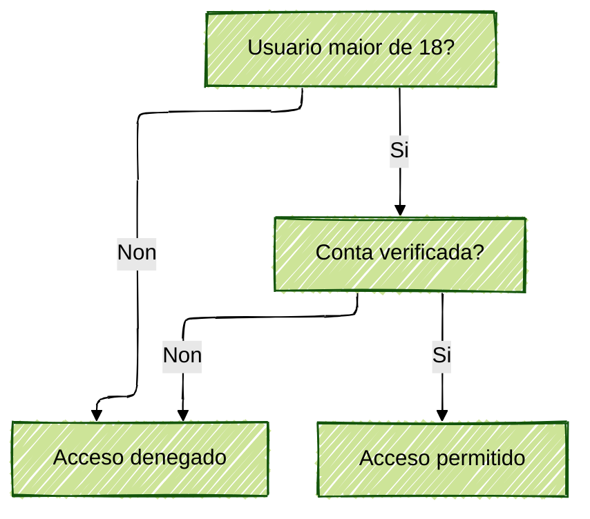
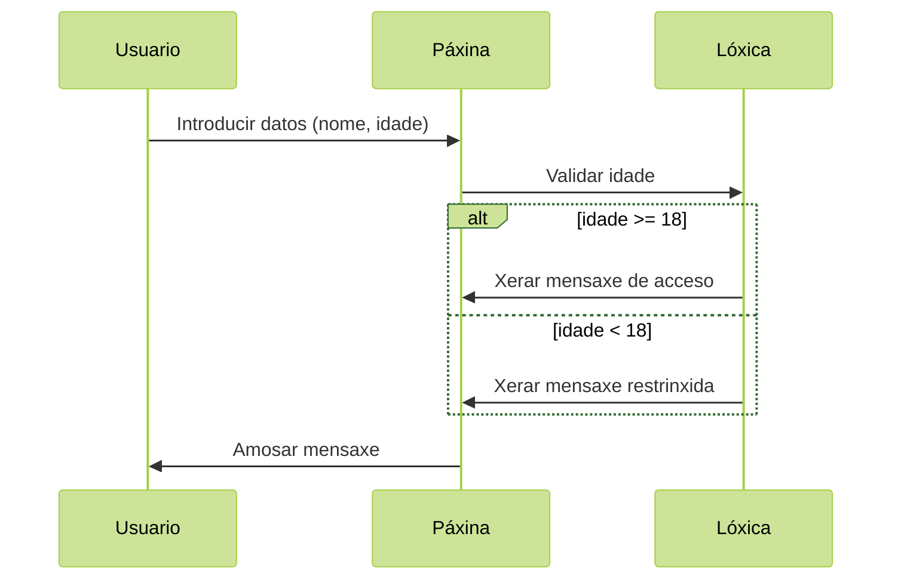

# {{ $frontmatter.title }}


## Lóxica de programación

A lóxica de programación é a base sobre a que construímos calquera aplicación ou script web. Trátase de desenvolver unha forma de pensar estruturada que nos permita resolver problemas mediante algoritmos.

### Descrición e utilización de operacións lóxicas

As operacións lóxicas son fundamentais para tomar decisións nos nosos programas. As principais son:

1. **AND (&&)**: Devolve verdadeiro só se ambas expresións son verdadeiras
   ```javascript
   // Exemplo: Acceso só para maiores de 18 E con conta verificada
   const podeAcceder = idade > 18 && contaVerificada;
   ```

2. **OR (||)**: Devolve verdadeiro se calquera das expresións é verdadeira
   ```javascript
   // Exemplo: Desconto para estudantes OU pensionistas
   const tenDesconto = eEstudante || ePensionista;
   ```

3. **NOT (!)**: Inverte o valor booleano
   ```javascript
   // Exemplo: Contido dispoñible só para usuarios NON rexistrados
   const mostraContido = !usuarioRexistrado;
   ```

**Diagrama de fluxo lóxico (Mermaid):**



### Secuencias e partes dun programa

Un programa básico segue xeralmente esta estrutura:

```plaintext
Entrada → Proceso → Saída
```

1. **Entrada de datos**: Obtención de información
   ```javascript
   // Pseudocódigo
   LEER nomeUsuario
   LEER idadeUsuario
   ```

2. **Procesamento**: Operacións e decisións
   ```javascript
   // Pseudocódigo
   SE idadeUsuario >= 18 ENTONCES
       mensaxe = "Benvido, " + nomeUsuario
   SENON
       mensaxe = "Acceso restrinxido"
   FIN SE
   ```

3. **Saída**: Mostrar resultados
   ```javascript
   // Pseudocódigo
   ESCRIBIR mensaxe
   MOSTRAR mensaxeEnPantalla
   ```

**Exemplo completo en JavaScript:**
```javascript
// 1. Entrada
const nome = prompt("Introduce o teu nome:");
const idade = parseInt(prompt("Introduce a túa idade:"));

// 2. Procesamento
let mensaxe;
if (idade >= 18) {
    mensaxe = `Benvido, ${nome}. Acceso completo.`;
} else {
    mensaxe = `Ola, ${nome}. Necesitas supervisión.`;
}

// 3. Saída
document.getElementById("resultado").textContent = mensaxe;
console.log(mensaxe);
```

**Diagrama de secuencia (Mermaid):**


## Comentarios formativos

1. **Boas prácticas**:
   - Sempre indentar o código para mellor lexibilidade
   - Usar nomes descriptivos para variables (ex: `idadeUsuario` en vez de `i`)
   - Comentar seccións complexas do código

2. **Erros comúns**:
   ```javascript
   // Comparación incorrecta (usando = en vez de == ou ===)
   if (idade = 18) { ... } // Erro!
   
   // Falta de conversión de tipos
   const idade = "18"; // String en vez de número
   if (idade > 17) { ... } // Funciona pero é mala práctica
   ```

3. **Exercicio práctico**:
   Crea un programa que:
   - Pida ao usuario dous números
   - Determine cal é o maior ou se son iguais
   - Mostre o resultado nunha páxina web

   ```javascript
   // Solución proposta
   const num1 = parseFloat(prompt("Primeiro número:"));
   const num2 = parseFloat(prompt("Segundo número:"));
   
   let resultado;
   if (num1 > num2) {
       resultado = `${num1} é maior que ${num2}`;
   } else if (num2 > num1) {
       resultado = `${num2} é maior que ${num1}`;
   } else {
       resultado = "Ambos números son iguais";
   }
   
   document.write("<p>" + resultado + "</p>");
   ```

Esta base de lóxica de programación é esencial antes de avanzar a conceptos máis complexos como bucles, funcións ou manipulación do DOM en JavaScript.