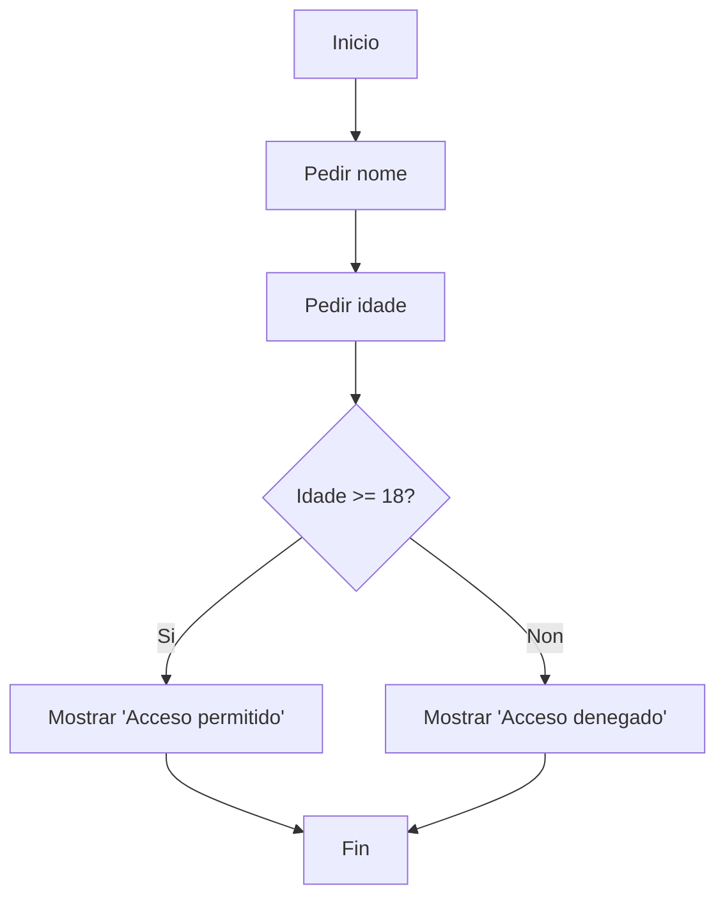
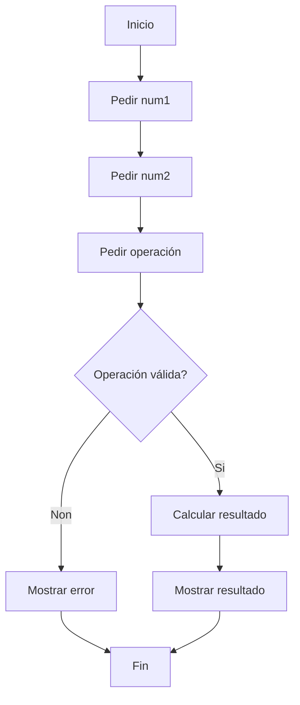
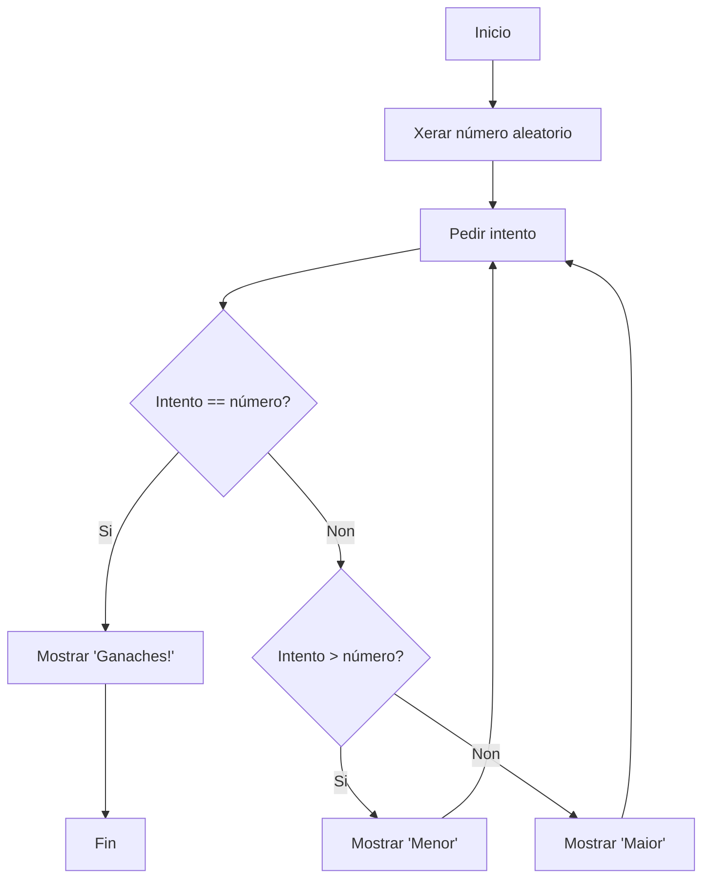

# {{ $frontmatter.title }}

## **1. Descrición dun ordinograma**  

Un **ordinograma** (ou **diagrama de fluxo**) é unha representación gráfica dun algoritmo ou proceso, que emprega símbolos estándar para describir os pasos e decisións necesarias para resolver un problema.  

**Características principais:**  
- **Visual**: Permite ver o fluxo do programa de forma intuitiva.  
- **Universal**: Usa símbolos recoñecidos internacionalmente.  
- **Estructurado**: Axuda a organizar a lóxica antes de programar.  

**Exemplo de uso**:  
> Se queremos programar un sistema de login, o ordinograma axudaríanos a visualizar:  
> - Como se introduce o usuario e contrasinal.  
> - Como se valida.  
> - Que pasa se é correcto ou incorrecto.  

---

## **2. Elementos dun ordinograma**  

Cada parte dun ordinograma represéntase con un símbolo específico:  

| **Símbolo** | **Nome**          | **Descrición**                                                              |
| ----------- | ----------------- | --------------------------------------------------------------------------- |
| **◯**       | **Inicio/Fin**    | Marca o comezo ou final do programa.                                        |
| **▭**       | **Proceso**       | Operacións matemáticas ou asignacións (ex: `suma = num1 + num2`).           |
| **◇**       | **Decisión**      | Condicións (ex: `¿É idade >= 18?`). Saídas: **Si/Non** (ou **True/False**). |
| **▱**       | **Entrada/Saída** | Lectura ou impresión de datos (ex: `pedir nome`, `mostrar resultado`).      |
| **→**       | **Frecha**        | Indica a dirección do fluxo.                                                |

**Exemplo gráfico (Mermaid):**  


---

## **3. Operacións nun programa**  

Os ordinogramas poden representar calquera operación básica en programación:  

### **A) Operacións aritméticas**  
- Suma (`+`), resta (`-`), multiplicación (`*`), división (`/`).  
- **Pseudocódigo**:  
  ```
  resultado = numero1 + numero2
  ```
- **En ordinograma**:  
  ```mermaid
  flowchart LR
      A[▭ Suma = 5 + 3] --> B[▭ Mostrar Suma]
  ```

### **B) Operacións lóxicas**  
- Comparacións (`>`, `<`, `==`), operadores booleanos (`AND`, `OR`, `NOT`).  
- **Pseudocódigo**:  
  ```
  SE idade >= 18 E tenPermiso ENTONCES
      acceso = True
  SENON
      acceso = False
  FIN SE
  ```
- **En ordinograma**:  
  ```mermaid
  flowchart TD
      A[Idade >= 18?] -->|Si| B[Ten permiso?]
      A -->|Non| C[Acceso = False]
      B -->|Si| D[Acceso = True]
      B -->|Non| C
  ```

### **C) Bucles (Repetición)**  
- **Mentres** (while), **Para** (for).  
- **Pseudocódigo**:  
  ```
  CONTADOR = 0
  MENTRES CONTADOR < 5 FACER
      ESCRIBIR "Iteración " + CONTADOR
      CONTADOR = CONTADOR + 1
  FIN MENTRES
  ```
- **En ordinograma**:  
  ```mermaid
  flowchart TD
      A[Inicio] --> B[Contador = 0]
      B --> C{Contador < 5?}
      C -->|Si| D[Mostrar Iteración]
      D --> E[Contador = Contador + 1]
      E --> C
      C -->|Non| F[Fin]
  ```

---

## **4. Implementación de elementos e operacións nun ordinograma**  

### **Exemplo completo: Calculadora básica**  

**Pseudocódigo:**  
```
1. Pedir número 1
2. Pedir número 2
3. Pedir operación (+, -, *, /)
4. SE operación é válida ENTÓN
       calcular resultado
   SENON
       mostrar "Operación inválida"
5. Mostrar resultado
```

**Ordinograma (Mermaid):**  


**Implementación en JavaScript:**  
```javascript
const num1 = parseFloat(prompt("Introduce o primeiro número:"));
const num2 = parseFloat(prompt("Introduce o segundo número:"));
const operacion = prompt("Introduce a operación (+, -, *, /):");

let resultado;
if (operacion === "+") {
    resultado = num1 + num2;
} else if (operacion === "-") {
    resultado = num1 - num2;
} else if (operacion === "*") {
    resultado = num1 * num2;
} else if (operacion === "/") {
    resultado = num1 / num2;
} else {
    alert("Operación inválida!");
}

if (resultado !== undefined) {
    alert("Resultado: " + resultado);
}
```

---

## **Resumo didáctico**  

✅ **Ordinoogramas = Algoritmos visuais**  
✅ **Símbolos estándar (◯ Inicio, ▭ Proceso, ◇ Decisión, ▱ Entrada/Saída)**  
✅ **Úsanse para: Operacións matemáticas, condicións, bucles**  
✅ **Primeiro faise o ordinograma, despois o código**  

**Exercicio práctico:**  
🔹 **Crear un ordinograma para un xogo de adiviñar un número (1-10)**:  
1. Xenera un número aleatorio.  
2. Pide ao usuario que o adiviñe.  
3. Compara e di se é maior, menor ou correcto.  
4. Repite ata acertar.  

*(Pista: Usa un bucle MENTRES no teu diagrama!)*  



**Conclusión**:  
Os ordinogramas son unha ferramenta esencial para planificar a lóxica antes de programar, evitando erros e facilitando a comprensión de algoritmos complexos.