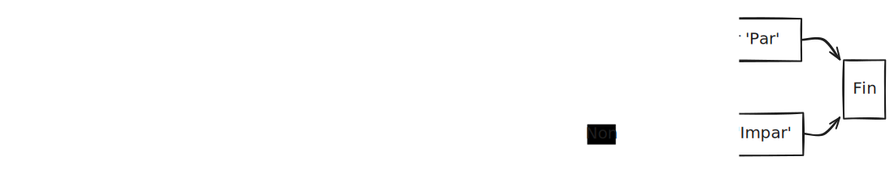
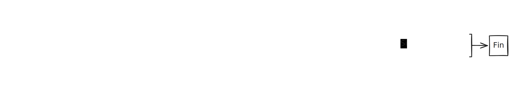

# {{ $frontmatter.title }}

## **1. Descrición de pseudocódigo**  

O **pseudocódigo** é unha forma de escribir algoritmos usando unha linguaxe sinxela, similar ao idioma natural (galego, castelán, inglés...) pero con certas regras estruturais da programación.  

### **Características principais**  
✔ **Non é unha linguaxe real**, pero parece código.  
✔ **É fácil de ler** para calquera, mesmo sen saber programar.  
✔ **Axuda a planificar** antes de escribir o código real.  
✔ **Non ten sintaxe estrita**, pero segue unha estrutura lóxica.  

**Exemplo real**:  
> En vez de escribir en JavaScript:  
> ```javascript
> if (idade >= 18) { console.log("Maior de idade"); }
> ```
> En pseudocódigo sería:  
> ```
> SE idade >= 18 ENTONCES
>  ESCRIBIR "Maior de idade"
> FIN SE
> ```

---

## **2. Creación do pseudocódigo**  

### **A) Regras básicas**  
1. **Usar palabras clave**:  
   - `SE ... ENTONCES ... SENON ... FIN SE` (condicións).  
   - `MENTRES ... FACER ... FIN MENTRES` (bucles).  
   - `REPETIR ... ATA QUE` (bucles con condición final).  
   - `PARA ... FIN PARA` (bucles contados).  

2. **Indentar** (sangrar) para mellor lexibilidade.  
3. **Ser claro e conciso**, evitando linguaxe técnica complexa.  

### **B) Exemplos prácticos**  

#### **Exemplo 1: Verificar se un número é par ou impar**  
**Pseudocódigo:**  
```
1. Pedir número ao usuario
2. SE número % 2 == 0 ENTONCES
3.     ESCRIBIR "O número é par"
4. SENON
5.     ESCRIBIR "O número é impar"
6. FIN SE
```
**Diagrama:**  



#### **Exemplo 2: Sumar números ata que se introduza 0**  
**Pseudocódigo:**  
```
1. suma = 0
2. REPETIR
3.     Pedir número
4.     suma = suma + número
5. ATA QUE número == 0
6. ESCRIBIR "A suma total é: " + suma
```
**Diagrama:**  



---

## **3. Conversión a código real (JavaScript)**  

### **Exemplo 1: Número par/impar (Pseudocódigo → JavaScript)**  
```javascript
const numero = parseInt(prompt("Introduce un número:"));
if (numero % 2 === 0) {
    console.log("O número é par");
} else {
    console.log("O número é impar");
}
```

### **Exemplo 2: Sumar números (Pseudocódigo → JavaScript)**  
```javascript
let suma = 0;
let numero;
do {
    numero = parseFloat(prompt("Introduce un número (0 para terminar):"));
    suma += numero;
} while (numero !== 0);
alert("A suma total é: " + suma);
```

---

## **Resumo didáctico**  

✅ **Pseudocódigo = Algoritmo en linguaxe case natural**  
✅ **Útil para planificar sen preocuparse pola sintaxe exacta**  
✅ **Pódese converter facilmente a calquera linguaxe (JavaScript, Python, etc.)**  
✅ **Estruturas comúns:**  
   - `SE ... ENTONCES ... SENON` → `if ... else`  
   - `MENTRES ... FACER` → `while`  
   - `REPETIR ... ATA QUE` → `do ... while`  

**Exercicio práctico:**  
🔹 **Escribe pseudocódigo para un xogo de adiviñar un número entre 1 e 100**:  
1. O xerador elixe un número aleatorio.  
2. O usuario ten 5 intentos para adiviñalo.  
3. En cada intento, o programa di se o número é maior ou menor.  
4. Se acerta, mostra "Ganaches!"; se non, "Perdeches".  

**Posible solución:**  
```
1. numeroSecreto = NÚMERO_ALEATORIO(1, 100)
2. intentos = 5
3. MENTRES intentos > 0 FACER
4.     Pedir intentoUsuario
5.     SE intentoUsuario == numeroSecreto ENTONCES
6.         ESCRIBIR "Ganaches!"
7.         TERMINAR
8.     SENON SE intentoUsuario < numeroSecreto ENTONCES
9.         ESCRIBIR "Maior"
10.    SENON
11.        ESCRIBIR "Menor"
12.    FIN SE
13.    intentos = intentos - 1
14. FIN MENTRES
15. ESCRIBIR "Perdeches. O número era " + numeroSecreto
```

**Conclusión**:  
O pseudocódigo é unha ferramenta fundamental para **aprender a pensar como programador**, permitindo resolver problemas de forma estruturada antes de mergullarse na sintaxe dunha linguaxe específica.

---

**Sabe máis:**
- [Qué es el Pseudocódigo y Cómo Puede Mejorar tu Programación?](https://kinsta.com/es/base-de-conocimiento/que-es-pseudocodigo/)
- [Qué es pseudocódigo y por qué es esencial en programación](https://openwebinars.net/blog/que-es-pseudocodigo/)
- [Pseudocódigo](https://www.freecodecamp.org/news/what-is-pseudocode-in-programming/)


---

DAW🧊2025