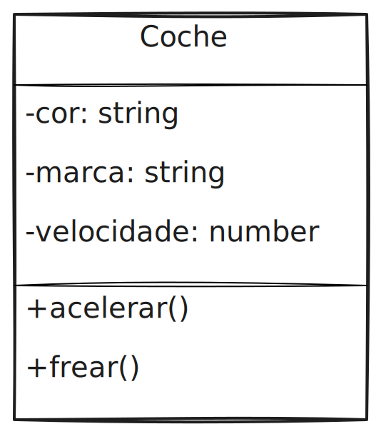
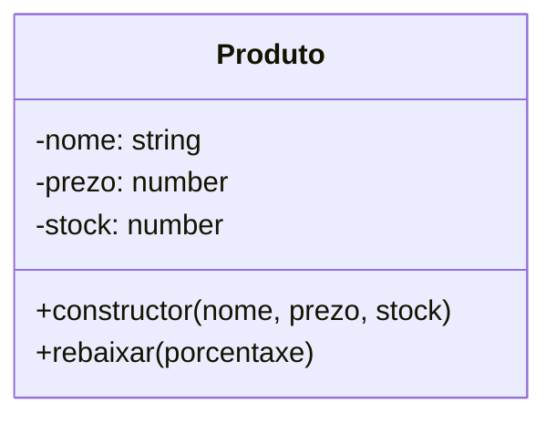

# {{ $frontmatter.title }}

## **1. Descrición de obxectos**

### **Concepto fundamental**
Un obxecto en programación é unha entidade que combina **datos (atributos)** e **accións (métodos)** relacionados. Pódese entender como unha "cousa" con características e comportamentos.

**Analoxía do mundo real:**
Imaxina un **coche** como obxecto:
- **Atributos**: cor (vermello), marca (Seat), velocidade (120km/h)
- **Métodos**: acelerar(), frear(), cambiarMarcha()

**Exemplo en JavaScript:**
```javascript
const coche = {
    cor: "vermello",
    marca: "Seat",
    velocidade: 0,
    acelerar: function() { this.velocidade += 10; },
    frear: function() { this.velocidade -= 5; }
};
```

**Diagrama de obxecto:**


```mmd
classDiagram
    class Coche {
        -cor: string
        -marca: string
        -velocidade: number
        +acelerar()
        +frear()
    }
```

## **2. Funcións dos obxectos**

### **Por que usamos obxectos?**
1. **Organización**: Agrupan datos e funcións relacionadas
2. **Reutilización**: Poden crearse múltiples instancias
3. **Abstracción**: Ocultan detalles complexos
4. **Modelado**: Representan entidades do mundo real

**Exemplo práctico:**
```javascript
// Sen obxectos (desorganizado)
let usuarioNome = "Ana";
let usuarioEdade = 25;
function saludarUsuario() { console.log("Ola " + usuarioNome); }

// Con obxectos (organizado)
const usuario = {
    nome: "Ana",
    edade: 25,
    saludar: function() { console.log("Ola " + this.nome); }
};
```

## **3. Comportamentos dos obxectos (Métodos)**

### **Definición**
Son **funcións** asociadas a un obxecto que definen o que pode facer.

**Características:**
- Acceden aos atributos do obxecto mediante `this`
- Poden recibir parámetros
- Modifican o estado do obxecto

**Exemplo ampliado:**
```javascript
const contaBancaria = {
    saldo: 1000,
    depositar: function(cantidade) {
        this.saldo += cantidade;
        console.log(`Depositados ${cantidade}€. Novo saldo: ${this.saldo}€`);
    },
    retirar: function(cantidade) {
        if (cantidade <= this.saldo) {
            this.saldo -= cantidade;
            console.log(`Retirados ${cantidade}€. Novo saldo: ${this.saldo}€`);
        } else {
            console.log("Saldo insuficiente");
        }
    }
};
```

**Pseudocódigo equivalente:**
```
OBXECTO contaBancaria
    ATRIBUTOS:
        saldo: 1000
    MÉTODOS:
        depositar(cantidade)
            saldo = saldo + cantidade
            ESCRIBIR "Depositados " + cantidade + "€"
        
        retirar(cantidade)
            SE cantidade <= saldo ENTÓN
                saldo = saldo - cantidade
                ESCRIBIR "Retirados " + cantidade + "€"
            SENÓN
                ESCRIBIR "Saldo insuficiente"
            FIN SE
FIN OBXECTO
```

## **4. Atributos dos obxectos**

### **Tipos de propiedades**
1. **Datos primitivos**: números, strings, booleanos
2. **Outros obxectos**: composición de obxectos
3. **Arrays**: coleccións de valores

**Exemplo avanzado:**
```javascript
const libro = {
    titulo: "Aprendendo JavaScript",
    autor: {
        nome: "Maria",
        apelidos: "Pérez López"
    },
    temas: ["programación", "web", "obxectos"],
    dispoñible: true
};
```

**Acceso a atributos:**
```javascript
console.log(libro.titulo); // "Aprendendo JavaScript"
console.log(libro.autor.nome); // "Maria"
console.log(libro.temas[1]); // "web"
```

## **5. Creación de obxectos**

### **Métodos de creación en JavaScript**

**1. Notación literal (para obxectos simples):**
```javascript
const produto = {
    nome: "Teclado",
    prezo: 29.99,
    stock: 45
};
```

**2. Función construtora (para múltiples instancias):**
```javascript
function Produto(nome, prezo, stock) {
    this.nome = nome;
    this.prezo = prezo;
    this.stock = stock;
    this.rebaixar = function(porcentaxe) {
        this.prezo *= (1 - porcentaxe/100);
    };
}

const teclado = new Produto("Teclado", 29.99, 45);
const raton = new Produto("Rato", 19.99, 30);
```

**3. Clases ES6 (recomendado para organización complexa):**
```javascript
class Produto {
    constructor(nome, prezo, stock) {
        this.nome = nome;
        this.prezo = prezo;
        this.stock = stock;
    }

    rebaixar(porcentaxe) {
        this.prezo *= (1 - porcentaxe/100);
    }
}

const tablet = new Produto("Tablet", 199.99, 10);
```

**Diagrama de clases (Mermaid):**


## **Exercicio práctico**

**Implementa un obxecto "Alumno" con:**
1. Atributos: nome, apelidos, idade, notas (array)
2. Métodos:
   - calcularMedia()
   - engadirNota(nota)
   - mostrarDatos()

**Posible solución:**
```javascript
const alumno = {
    nome: "Xoán",
    apelidos: "Gómez Sánchez",
    idade: 20,
    notas: [7, 8, 6],
    
    engadirNota: function(nota) {
        this.notas.push(nota);
    },
    
    calcularMedia: function() {
        const suma = this.notas.reduce((total, nota) => total + nota, 0);
        return suma / this.notas.length;
    },
    
    mostrarDatos: function() {
        console.log(`${this.nome} ${this.apelidos}`);
        console.log(`Idade: ${this.idade}`);
        console.log(`Notas: ${this.notas.join(", ")}`);
        console.log(`Media: ${this.calcularMedia().toFixed(2)}`);
    }
};

// Probamos os métodos
alumno.engadirNota(9);
alumno.mostrarDatos();
```

**Pseudocódigo equivalente:**
```
OBXECTO Alumno
    ATRIBUTOS:
        nome: "Xoán"
        apelidos: "Gómez Sánchez"
        idade: 20
        notas: [7, 8, 6]
    
    MÉTODOS:
        engadirNota(nota)
            notas.engadir(nota)
        
        calcularMedia()
            suma = 0
            PARA cada nota EN notas FACER
                suma = suma + nota
            FIN PARA
            DEVOLVER suma / notas.longitude
        
        mostrarDatos()
            ESCRIBIR nome + " " + apelidos
            ESCRIBIR "Idade: " + idade
            ESCRIBIR "Notas: " + notas.unir(", ")
            ESCRIBIR "Media: " + calcularMedia()
FIN OBXECTO
```

## **Conclusión didáctica**

Os obxectos son **pezas fundamentais** na programación moderna porque:
- **Estruturan** o código de forma lóxica
- **Modularizan** a aplicación en compoñentes
- **Permiten reutilización** mediante instancias
- **Mellan a complexidade** mediante abstracción

**Boas prácticas:**
✔ Usar nomes descritivos para atributos e métodos  
✔ Encapsular datos privados cando sexa necesario  
✔ Documentar a finalidade do obxecto con comentarios  
✔ Seguir o principio de responsabilidade única (cada obxecto debe facer unha cousa ben)


---

DAW🧊2026