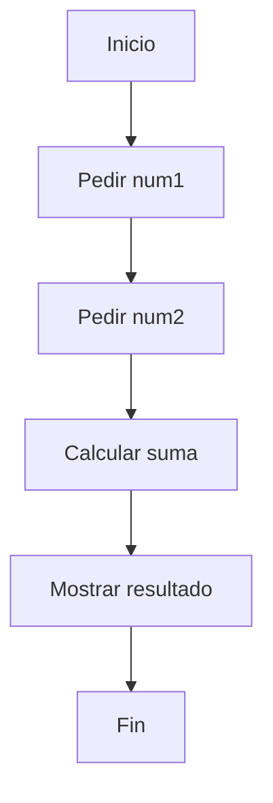
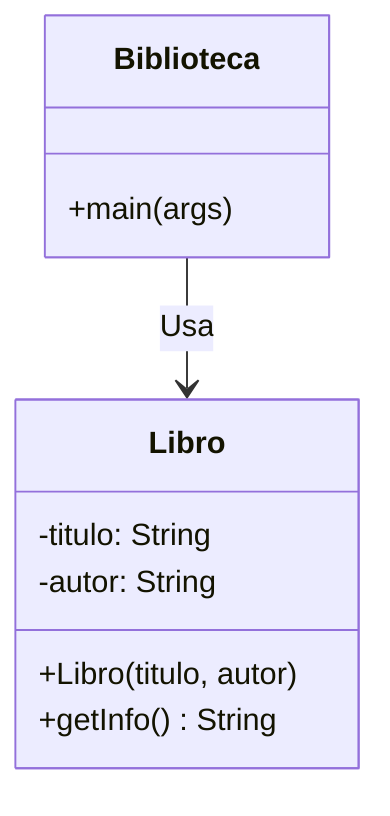

# {{ $frontmatter.title }}

## **1. Códigos en linguaxes estruturais**

### **Características principais**
- **Programación lineal**: Fluxo de execución secuencial
- **Uso de estruturas básicas**: secuencias, condicións e bucles
- **Non usa obxectos** ou conceptos avanzados de abstracción

**Exemplo en C (suma de números):**
```c
#include <stdio.h>

int main() {
    int num1, num2, suma;
    
    printf("Introduce o primeiro número: ");
    scanf("%d", &num1);
    
    printf("Introduce o segundo número: ");
    scanf("%d", &num2);
    
    suma = num1 + num2;
    printf("A suma é: %d\n", suma);
    
    return 0;
}
```

**Pseudocódigo equivalente:**
```
INICIO
    ESCRIBIR "Introduce o primeiro número: "
    LER num1
    ESCRIBIR "Introduce o segundo número: "
    LER num2
    suma = num1 + num2
    ESCRIBIR "A suma é: " + suma
FIN
```

**Diagrama de fluxo (Mermaid):**


---

## **2. Códigos en linguaxes de script**

### **Características principais**
- **Interpretadas** (non compiladas)
- **Tipado dinámico**
- **Ideal para automatización** e tarefas rápidas

**Exemplo en Python (xestor de tarefas):**
```python
tarefas = []

while True:
    print("\n1. Engadir tarefa")
    print("2. Ver tarefas")
    print("3. Saír")
    opcion = input("Elige unha opción: ")
    
    if opcion == "1":
        tarefa = input("Introduce a tarefa: ")
        tarefas.append(tarefa)
    elif opcion == "2":
        print("\n--- Tarefas ---")
        for i, tarefa in enumerate(tarefas, 1):
            print(f"{i}. {tarefa}")
    elif opcion == "3":
        break
    else:
        print("Opción non válida")
```

**Exemplo en JavaScript (manipulación DOM):**
```javascript
document.getElementById("btn").addEventListener("click", function() {
    const texto = document.getElementById("input").value;
    const elemento = document.createElement("p");
    elemento.textContent = texto;
    document.body.appendChild(elemento);
});
```

**Comparativa en pseudocódigo:**
```
INICIO
    tarefas = []
    REPETIR
        MOSTRAR menú
        LER opción
        SE opción == 1 ENTÓN
            LER tarefa
            tarefas.engadir(tarefa)
        SENÓN SE opción == 2 ENTÓN
            PARA cada tarefa EN tarefas FACER
                MOSTRAR tarefa
            FIN PARA
        FIN SE
    ATA QUE opción == 3
FIN
```

---

## **3. Códigos en linguaxes orientados a obxectos**

### **Características principais**
- **Abstracción** mediante clases e obxectos
- **Encapsulación**, herdanza e polimorfismo
- **Reutilización** de código

**Exemplo en Java (sistema de biblioteca):**
```java
class Libro {
    private String titulo;
    private String autor;
    
    public Libro(String titulo, String autor) {
        this.titulo = titulo;
        this.autor = autor;
    }
    
    public String getInfo() {
        return titulo + " por " + autor;
    }
}

public class Biblioteca {
    public static void main(String[] args) {
        Libro libro1 = new Libro("O Hobbit", "J.R.R. Tolkien");
        System.out.println(libro1.getInfo());
    }
}
```

**Exemplo en PHP (formulario web):**
```php
class Formulario {
    private $campos = [];
    
    public function engadirCampo($nome, $tipo) {
        $this->campos[] = [
            'nome' => $nome,
            'tipo' => $tipo
        ];
    }
    
    public function mostrar() {
        echo '<form>';
        foreach ($this->campos as $campo) {
            echo '<label>'.ucfirst($campo['nome']).'</label>';
            echo '<input type="'.$campo['tipo'].'" name="'.$campo['nome'].'">';
        }
        echo '</form>';
    }
}

$form = new Formulario();
$form->engadirCampo('nome', 'text');
$form->engadirCampo('email', 'email');
$form->mostrar();
```

**Diagrama de clases (Mermaid) para Java:**


---

## **Comparativa entre paradigmas**

| **Característica** | **Estruturada**    | **Script**           | **Orientada a Obxectos**  |
| ------------------ | ------------------ | -------------------- | ------------------------- |
| **Complexidade**   | Baixa              | Media                | Alta                      |
| **Velocidade**     | Rápida (compilada) | Media (interpretada) | Depende da implementación |
| **Reutilización**  | Limitada           | Moderada             | Alta                      |
| **Uso típico**     | Sistemas embebidos | Automatización/web   | Aplicacións complexas     |
| **Exemplos**       | C, Pascal          | Python, JavaScript   | Java, C#, PHP OO          |

---

## **Exercicio práctico multilingüe**

**Problema: Calculadora básica en 3 paradigmas**

### **1. Versión estruturada (C)**
```c
#include <stdio.h>

int main() {
    float a, b;
    char operador;
    
    printf("Introduce a operación (ex: 5 + 3): ");
    scanf("%f %c %f", &a, &operador, &b);
    
    switch(operador) {
        case '+': printf("Resultado: %.2f", a+b); break;
        case '-': printf("Resultado: %.2f", a-b); break;
        case '*': printf("Resultado: %.2f", a*b); break;
        case '/': printf("Resultado: %.2f", a/b); break;
        default: printf("Operador non válido");
    }
    
    return 0;
}
```

### **2. Versión script (Python)**
```python
def calculadora():
    expresion = input("Introduce a operación (ex: 5 + 3): ")
    a, operador, b = expresion.split()
    a = float(a)
    b = float(b)
    
    if operador == '+':
        print(f"Resultado: {a+b}")
    elif operador == '-':
        print(f"Resultado: {a-b}")
    elif operador == '*':
        print(f"Resultado: {a*b}")
    elif operador == '/':
        print(f"Resultado: {a/b}")
    else:
        print("Operador non válido")

calculadora()
```

### **3. Versión OO (Java)**
```java
class Calculadora {
    private double a;
    private double b;
    
    public Calculadora(double a, double b) {
        this.a = a;
        this.b = b;
    }
    
    public double operar(char operador) {
        switch(operador) {
            case '+': return a + b;
            case '-': return a - b;
            case '*': return a * b;
            case '/': return a / b;
            default: throw new IllegalArgumentException("Operador non válido");
        }
    }
}

public class Main {
    public static void main(String[] args) {
        Calculadora calc = new Calculadora(5, 3);
        System.out.println("Resultado: " + calc.operar('+'));
    }
}
```

---

## **Conclusión didáctica**

✅ **Estruturada**: Ideal para aprendizaxe inicial e sistemas simples  
✅ **Script**: Perfecta para prototipado rápido e tarefas web  
✅ **OO**: Escalable para proxectos complexos e equipo  

**Recomendación final**:  
Comeza con exemplos estruturais para entender a lóxica básica, experimenta con scripts para ver resultados rápidos, e finalmente mergúllate na OO para desenvolver aplicacións profesionais.