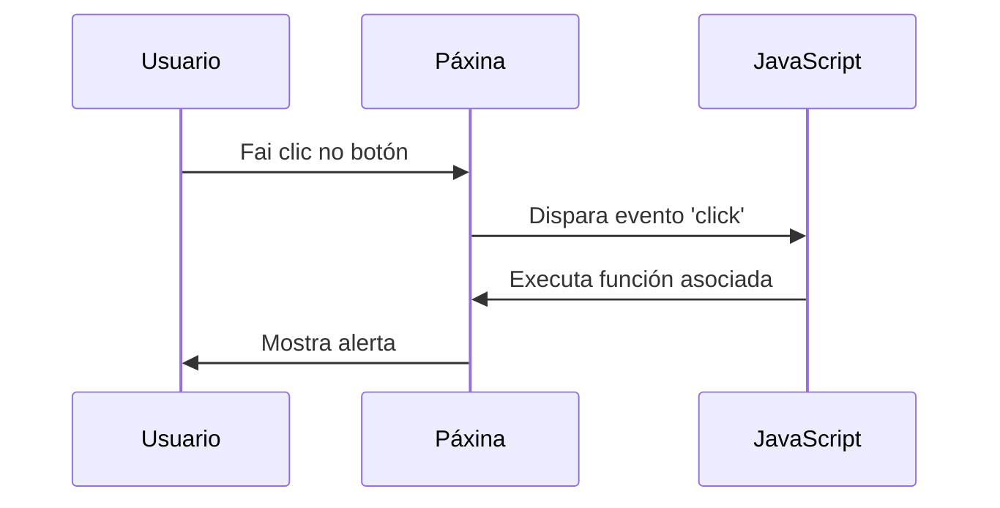
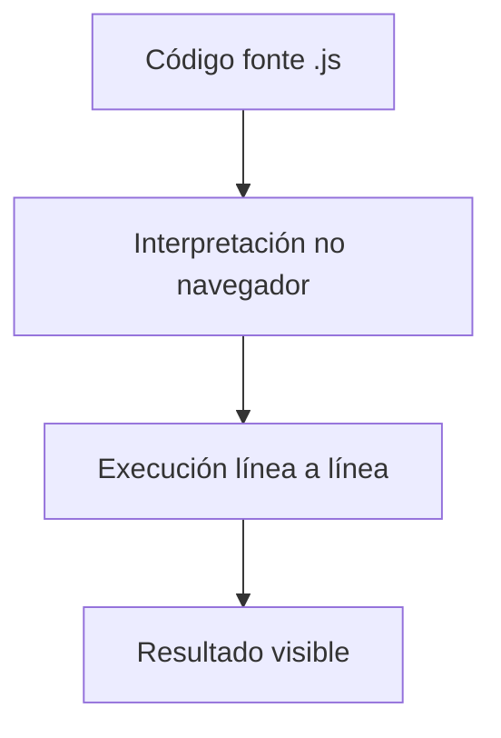
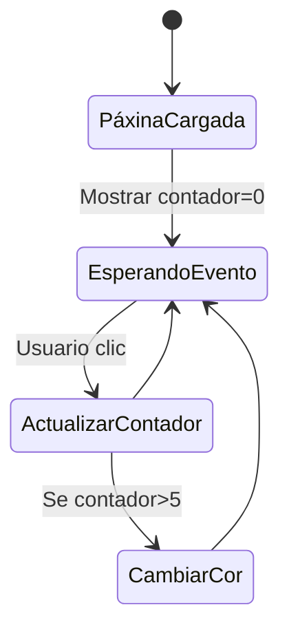

# {{ $frontmatter.title }}

## **1. Características da linguaxe de guión**

### **1.1. Descrición da linguaxe orientada a eventos**

As linguaxes de guión web como JavaScript están **deseñadas para responder a eventos**, o que permite crear páxinas interactivas.

**Principais eventos:**
- `onclick` (clic do rato)
- `onload` (carga da páxina)
- `onkeypress` (pulsación de tecla)
- `onmouseover` (rato sobre elemento)

**Exemplo práctico:**
```javascript
document.getElementById("meuBoton").addEventListener("click", function() {
    alert("Botón pulsado!");
});
```

**Fluxo de eventos (Mermaid):**


**Pseudocódigo:**
```
Cando se produza EVENTO_CLIC no elemento "meuBoton":
    Executar función mostrarAlerta()
Fin cando
```

### **1.2. Descrición da linguaxe interpretada**

As linguaxes de guión **non se compilan**, senón que son interpretadas en tempo de execución polo navegador.

**Vantaxes:**
- Desenvolvemento rápido (sen etapa de compilación)
- Depuración inmediata
- Compatibilidade entre navegadores

**Proceso de execución:**


**Exemplo interpretado vs compilado:**
```javascript
// JavaScript (interpretado)
function suma(a, b) {
    return a + b; // O navegador interpreta isto en execución
}

// Java (compilado)
/*
public class Main {
    public static void main(String[] args) {
        System.out.println(suma(2,3)); // Require compilación previa
    }
}
*/
```

### **1.3. A interactividade da linguaxe de guión**

Permite **modificación dinámica** do DOM (Document Object Model) para crear experiencias de usuario ricas.

**Técnicas clave:**
1. **Manipulación DOM:**
   ```javascript
   document.getElementById("titulo").textContent = "Novo título";
   ```

2. **Validación de formularios:**
   ```javascript
   document.forms["meuForm"].addEventListener("submit", function(e) {
       if(!validarDatos()) {
           e.preventDefault(); // Evita o envío
           alert("Erro nos datos!");
       }
   });
   ```

3. **Comunicación asíncrona (AJAX/fetch):**
   ```javascript
   fetch('datos.json')
       .then(response => response.json())
       .then(data => mostrarDatos(data));
   ```

**Exemplo interactivo completo:**
```html
<!DOCTYPE html>
<html>
<body>
    <h2 id="contador">0</h2>
    <button id="incrementar">+1</button>
    
    <script>
        let contador = 0;
        document.getElementById("incrementar").onclick = function() {
            contador++;
            document.getElementById("contador").textContent = contador;
            
            if(contador > 5) {
                this.style.backgroundColor = "red";
            }
        };
    </script>
</body>
</html>
```

**Diagrama de interacción (Mermaid):**


## **2. Comparativa con outras tecnoloxías**

| **Característica**       | **Linguaxes compiladas**        | **Linguaxes de guión**      |
| ------------------------ | ------------------------------- | --------------------------- |
| **Velocidade execución** | Máis rápida                     | Máis lenta                  |
| **Depuración**           | Complexa (erros en compilación) | Simple (erros en execución) |
| **Portabilidade**        | Dependente de plataforma        | Multiplataforma             |
| **Uso típico**           | Aplicacións complexas           | Interactividade web         |

## **3. Exercicio práctico: Xogo de adiviñar números**

**Requisitos:**
- Xenera un número aleatorio entre 1-100
- Permite intentos ata acertar
- Da pistas ("maior/menor")
- Conta intentos

**Solución:**
```javascript
const numeroObxectivo = Math.floor(Math.random() * 100) + 1;
let intentos = 0;

function comprobarAdiviña() {
    const intentoUsuario = parseInt(document.getElementById("adiviña").value);
    intentos++;
    
    if(intentoUsuario === numeroObxectivo) {
        alert(`Acertaches en ${intentos} intentos!`);
    } else if(intentoUsuario < numeroObxectivo) {
        alert("O número é maior");
    } else {
        alert("O número é menor");
    }
}
```

**Pseudocódigo didáctico:**
```
INICIO
    numeroObxectivo = ALEATORIO(1,100)
    intentos = 0
    
    REPETIR
        LER intentoUsuario
        intentos = intentos + 1
        
        SE intentoUsuario == numeroObxectivo ENTÓN
            ESCRIBIR "Acertaches en " + intentos + " intentos!"
            TERMINAR
        SENÓN SE intentoUsuario < numeroObxectivo ENTÓN
            ESCRIBIR "Maior"
        SENÓN
            ESCRIBIR "Menor"
        FIN SE
    ATA QUE acertado
FIN
```

## **Conclusión didáctica**

✅ **Orientación a eventos**: Resposta a accións do usuario  
✅ **Interpretación**: Execución directa sen compilación  
✅ **Interactividade**: Modificación dinámica da páxina  

**Boas prácticas:**  
✔ Usar `addEventListener` no canto de atributos HTML `onclick`  
✔ Separar o JavaScript do HTML (arquitectura limpa)  
✔ Validar sempre datos de entrada do usuario  

**Para profundizar:**  
- Explorar `Promises` e `async/await` para operacións asíncronas  
- Aprender a manipular o DOM con eficiencia  
- Investigar frameworks modernos como React ou Vue que amplían estas capacidades


---

DAW🧊2026