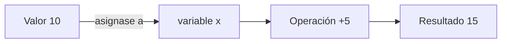
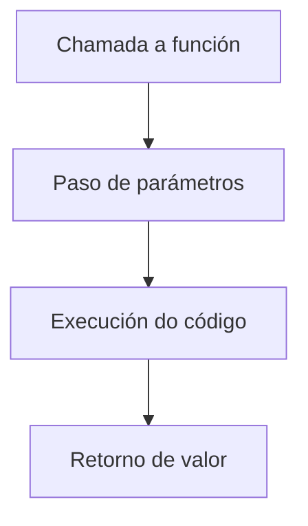

# {{ $frontmatter.title }}

## **1. Etiquetas identificativas dentro da linguaxe de marcas**

Para incluír JavaScript nun documento HTML, usamos estas etiquetas:

```html
<script>
  // Código JavaScript aquí
</script>

<!-- Ou en arquivo externo -->
<script src="ruta/arquivo.js"></script>
```

**Boas prácticas:**
- Colocar os `<script>` ao final do `<body>` para mellor rendemento
- Usar atributos `async` ou `defer` para scripts externos
- Separar o JavaScript en arquivos externos para maior mantibilidade

## **2. Especificacións e características das instrucións**

### **Principais características**
- **Case sensitive**: `variable` ≠ `Variable`
- **Tipado dinámico**: As variables non declaran tipo
- **Punto e coma opcional** (pero recomendable)
- **Comentarios**:
  ```javascript
  // Comentario dunha liña
  /* Comentario
     multi-liña */
  ```

## **3. Elementos da linguaxe de guión**

### **3.1. Variables**
Formas de declaración:
```javascript
var antiga = "obsoleta"; // Ámbito de función
let moderna = "actual";  // Ámbito de bloque
const CONSTANTE = "fixa"; // Non se pode reasignar
```

**Exemplo práctico:**
```javascript
let usuario = "Ana";
const EDADE_MINIMA = 18;
var contador = 0; // Non recomendado en código moderno
```

### **3.2. Operadores**
**Aritméticos**:
```javascript
let suma = 5 + 3;    // 8
let resto = 10 % 3;  // 1 (módulo)
```

**Lóxicos**:
```javascript
let acceso = idade >= 18 && tenPermiso; // AND
let oferta = eEstudante || eDesempregado; // OR
let inverso = !activado; // NOT
```

### **3.3. Comparacións**
```javascript
// Igualdade estrita (recomendado)
5 === '5'; // false (diferente tipo)

// Igualdade non estrita (evitar)
5 == '5';  // true (conversión de tipo)

// Desigualdades
10 !== '10'; // true
15 > 10;     // true
```

### **3.4. Asignacións**
```javascript
let x = 10;
x += 5;   // Equivalente a x = x + 5
x *= 2;   // Multiplica por 2
```

**Diagrama de asignación (Mermaid):**


## **4. Obxectos da linguaxe de guión**

### **4.1. Métodos**
Funcións asociadas a obxectos:
```javascript
const coche = {
    marca: "Seat",
    acelerar: function() {
        console.log("Acelerando!");
    }
};

coche.acelerar(); // Chamada ao método
```

### **4.2. Eventos**
Accións que poden ser detectadas:
```javascript
document.getElementById("btn").addEventListener("click", function() {
    alert("Botón pulsado!");
});
```

**Eventos comúns:**
- `click`, `mouseover`, `mouseout`
- `keydown`, `keyup`
- `load`, `scroll`

### **4.3. Atributos**
Propiedades dos obxectos:
```javascript
const persoa = {
    nome: "Carlos",  // Atributo
    idade: 30,
    saudar: function() {  // Método
        return `Ola, son ${this.nome}`;
    }
};
```

### **4.4. Funcións**
Bloques de código reutilizables:
```javascript
// Declaración
function sumar(a, b) {
    return a + b;
}

// Expresión
const multiplicar = function(x, y) {
    return x * y;
};

// Arrow function (ES6+)
const dividir = (n1, n2) => n1 / n2;
```

**Diagrama de función (Mermaid):**


## **5. Exemplo integrado**

```html
<!DOCTYPE html>
<html>
<body>
    <h1 id="titulo">Sintaxe JavaScript</h1>
    <button id="cambiar">Cambiar texto</button>
    <p id="contador">0</p>

    <script>
        // Variables
        let contador = 0;
        const TEXTO_INICIAL = "Sintaxe JavaScript";

        // Función
        function incrementar() {
            contador++;
            document.getElementById("contador").textContent = contador;
            
            if(contador > 5) {
                alert("Superaches 5 clics!");
            }
        }

        // Obxecto e evento
        const boton = document.getElementById("cambiar");
        boton.addEventListener("click", function() {
            document.getElementById("titulo").textContent = "Texto cambiado!";
            incrementar();
        });
    </script>
</body>
</html>
```

**Pseudocódigo equivalente:**
```
INICIO
    DECLARAR contador = 0
    DECLARAR CONSTANTE TEXTO_INICIAL = "Sintaxe JavaScript"
    
    FUNCIÓN incrementar:
        contador = contador + 1
        ACTUALIZAR elemento contador co novo valor
        SE contador > 5 ENTÓN
            MOSTRAR alerta
        FIN SE
    
    OBTENER referencia ao botón
    ASOCIAR evento click ao botón:
        CAMBIAR texto do título
        CHAMAR a incrementar
FIN
```

## **Conclusión didáctica**

✅ **Variables**: `let` e `const` para datos variables e constantes  
✅ **Operadores**: Aritméticos, lóxicos e de comparación  
✅ **Funcións**: Reutilización de código lóxico  
✅ **Obxectos**: Combinan datos (atributos) e accións (métodos)  

**Boas prácticas:**  
✔ Usar `===` en comparacións para evitar conversións de tipo  
✔ Declarar variables no ámbito máis reducido posible  
✔ Usar `const` por defecto, e `let` só cando se necesite reasignación  

**Exercicio práctico:**  
Crear un conversor de temperatura que:  
1. Permita introducir graos Celsius  
2. Converta a Fahrenheit (F = C * 9/5 + 32)  
3. Mostre o resultado dinamicamente  
4. Inclúa un botón para resetear o formulario  

```javascript
// Solución proposta
document.getElementById("converter").addEventListener("click", function() {
    const celsius = parseFloat(document.getElementById("celsius").value);
    const fahrenheit = (celsius * 9/5) + 32;
    document.getElementById("resultado").textContent = 
        `${celsius}°C = ${fahrenheit.toFixed(1)}°F`;
});

document.getElementById("reset").addEventListener("click", function() {
    document.getElementById("celsius").value = "";
    document.getElementById("resultado").textContent = "";
});
```