# {{ $frontmatter.title }}

## **1. Tipos de scripts**

### **1.1. Scripts inmediatos**
Execútanse automaticamente ao cargar a páxina, na orde en que aparecen.

**Exemplo no corpo:**
```html
<body>
    <p>Texto previo</p>
    
    <script>
        alert("Script inmediato executado!");
        document.write("<p>Engadido durante a carga</p>");
    </script>
    
    <p>Texto posterior</p>
</body>
```

**Características:**
- Bloquean a renderización ata completarse
- Acceden ao DOM só dos elementos cargados previamente

### **1.2. Scripts diferidos**
Usan o atributo `defer` para executarse despois de parsear o HTML.

**Exemplo no encabezado:**
```html
<head>
    <script src="script.js" defer></script>
</head>
```

**Diagrama de carga (Mermaid):**


### **1.3. Scripts híbridos**
Combinan carga inmediata e execución por eventos.

**Exemplo:**
```html
<script>
    function iniciar() {
        console.log("Executado despois da carga");
    }
    window.addEventListener('load', iniciar);
</script>
```

## **2. Localización de scripts**

### **2.1. No corpo do documento**
**Executables ao abrir a páxina:**
```html
<body>
    <script>
        const data = new Date();
        console.log("Data actual: " + data);
    </script>
</body>
```

**Executables por evento:**
```html
<button onclick="alert('Clic recibido!')">Púlsame</button>
```

### **2.2. No encabezado**
```html
<head>
    <script>
        function validarForm() {
            // Lóxica de validación
        }
    </script>
</head>
<body>
    <form onsubmit="return validarForm()">
        <!-- Campos do formulario -->
    </form>
</body>
```

## **3. Execución de scripts**

### **3.1. Execución ao cargar a páxina**
```html
<script>
    // Execútase inmediatamente
    document.addEventListener('DOMContentLoaded', function() {
        console.log("DOM completamente cargado");
    });
</script>
```

### **3.2. Execución por eventos**
```javascript
document.getElementById('boton').addEventListener('click', function() {
    console.log("Evento click disparado");
});
```

**Tipos de eventos comúns:**
- `click`, `dblclick`
- `mouseenter`, `mouseleave`
- `keydown`, `keyup`
- `submit`, `change`

### **3.3. Execución de procedementos**
```javascript
function calcularIVA(prezo) {
    return prezo * 0.21;
}

// Chamada explícita necesaria
const total = calcularIVA(100);
```

### **3.4. Tempos de execución**

```mermaid
gantt
    title Tempos de execución
    dateFormat  HH:mm:ss
    section Carga
    Parseo HTML      :a1, 00:00:00, 00:00:02
    Descarga scripts :a2, after a1, 00:00:01
    section Execución
    Scripts inmediatos :a3, after a1, 00:00:01
    DOMContentLoaded :a4, after a1, 00:00:00
    Window Load :a5, after a2, 00:00:00
```


### **3.5. Erros de execución**
**Manexo básico:**
```javascript
try {
    // Código que pode fallar
    const resultado = operacionRiesgo();
} catch (error) {
    console.error("Produciuse un erro:", error.message);
} finally {
    console.log("Execución finalizada");
}
```

**Erros comúns:**
1. **ReferenceError**: Variable non definida
2. **TypeError**: Operación inválida sobre tipo
3. **SyntaxError**: Erro na sintaxe
4. **NetworkError**: Fallo en carga de recurso

## **4. Boas prácticas**

### **Recomendacións de colocación**
```html
<!DOCTYPE html>
<html>
<head>
    <!-- Scripts de configuración/inicialización -->
    <script src="config.js" defer></script>
</head>
<body>
    <!-- Contido principal -->
    
    <!-- Scripts de execución -->
    <script src="app.js"></script>
</body>
</html>
```

### **Patrón de execución recomendado**
```javascript
document.addEventListener('DOMContentLoaded', function() {
    // Todo o código que interactúa co DOM
    iniciarAplicacion();
});

function iniciarAplicacion() {
    // Inicialización de compoñentes
    const boton = document.getElementById('accion');
    boton.addEventListener('click', manexadorClick);
}

function manexadorClick() {
    // Lóxica do evento
}
```

## **Exercicio práctico**

**Implementar un sistema de comentarios con:**
1. Carga inicial de comentarios existentes (simulado)
2. Formulario para engadir novos comentarios
3. Validación do input
4. Actualización dinámica da lista

**Solución:**
```html
<div id="comentarios">
    <h2>Comentarios</h2>
    <ul id="lista-comentarios"></ul>
    <form id="form-comentario">
        <textarea id="texto-comentario" required></textarea>
        <button type="submit">Publicar</button>
    </form>
</div>

<script>
document.addEventListener('DOMContentLoaded', function() {
    // Carga inicial (simulada)
    const comentarios = ["Primeiro comentario", "Outro comentario"];
    actualizarLista(comentarios);
    
    // Xestión do formulario
    document.getElementById('form-comentario').addEventListener('submit', function(e) {
        e.preventDefault();
        const texto = document.getElementById('texto-comentario').value.trim();
        
        if(texto) {
            comentarios.push(texto);
            actualizarLista(comentarios);
            this.reset();
        } else {
            alert("O comentario non pode estar baleiro");
        }
    });
});

function actualizarLista(comentarios) {
    const lista = document.getElementById('lista-comentarios');
    lista.innerHTML = '';
    
    comentarios.forEach(comentario => {
        const li = document.createElement('li');
        li.textContent = comentario;
        lista.appendChild(li);
    });
}
</script>
```

**Pseudocódigo:**
```
CANDO se cargue o DOM:
    INICIALIZAR lista de comentarios
    MOSTRAR comentarios existentes
    
    CANDO se envíe o formulario:
        OBTENER texto do comentario
        SE texto é válido ENTÓN
            ENGADIR á lista
            ACTUALIZAR visualización
            LIMPAR formulario
        SENÓN
            MOSTRAR erro
        FIN SE
FIN
```


---

DAW🧊2026