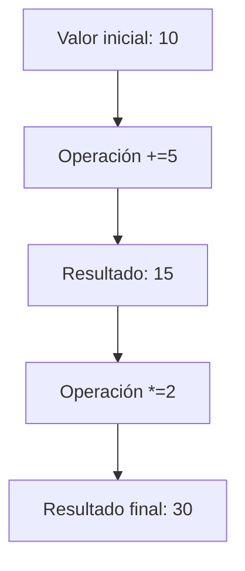

# {{ $frontmatter.title }}

## **1. Variables e Identificadores**

### **1.1. Conceptos fundamentais**
Unha **variable** é un contedor para almacenar datos, mentres que un **identificador** é o nome que lle damos.

**Características dos identificadores:**
- Distinguen entre maiúsculas e minúsculas (`edad` ≠ `EDAD`)
- Deben comezar por letra, `$` ou `_`
- Non poden ser palabras reservadas (`if`, `function`, etc.)

**Exemplos válidos/inválidos:**
```javascript
// Válidos
let nombreUsuario;
const _precioTotal;
var $elemento;

// Inválidos
let 2valor;          // Non pode comezar por número
var nombre-usuario;  // Non permite guións
const function;      // Palabra reservada
```

## **2. Declaración de Variables**

### **2.1. Formas de declaración**
JavaScript ofrece tres formas para declarar variables:

| **Palabra clave** | **Ámbito** | **Reasignable** | **Recomendación**       |
| ----------------- | ---------- | --------------- | ----------------------- |
| `var`             | Función    | Si              | Obsoleto (evitar)       |
| `let`             | Bloque     | Si              | Para variables mutables |
| `const`           | Bloque     | Non             | Valor por defecto       |

**Exemplos:**
```javascript
var antiga = "obsoleta";          // Ámbito de función (non recomendado)
let contador = 0;                 // Pode modificarse
const PI = 3.1416;                // Non se pode reasignar
```

### **2.2. Boas prácticas na declaración**
- Usar `const` por defecto
- Empregar `let` só cando se necesite cambiar o valor
- Evitar `var` en código novo
- Usar nomes descriptivos (camelCase)

**Exemplo didáctico:**
```javascript
// Boas prácticas
const usuario = "Ana";
let intentos = 3;
const MAX_INTENTOS = 5;

// Mala práctica
var x = "Ana"; // Nome non descriptivo
```

## **3. Operacións con Variables**

### **3.1. Operacións básicas**
As variables poden usarse en múltiples operacións:

**Asignación:**
```javascript
let puntuacion = 100;       // Asignación simple
puntuacion = puntuacion + 5; // Modificación
```

**Operacións aritméticas:**
```javascript
let total = 10 + 5;      // Suma: 15
let diferencia = 20 - 8; // Resta: 12
let area = 5 * 4;        // Multiplicación: 20
let media = 15 / 3;      // División: 5
let resto = 10 % 3;      // Módulo: 1
```

**Concatenación:**
```javascript
const nome = "Ana";
const apelido = "Pérez";
const nomeCompleto = nome + " " + apelido; // "Ana Pérez"
```

### **3.2. Operacións combinadas**
JavaScript permite operacións abreviadas:

```javascript
let numero = 10;

numero += 5;  // Equivalente a: numero = numero + 5
numero *= 2;  // Equivalente a: numero = numero * 2
numero++;     // Incremento: numero = numero + 1
```

**Diagrama de operacións (Mermaid):**


### **3.3. Operacións con distintos tipos**
JavaScript realiza conversións automáticas de tipo (coerción):

```javascript
const numero = "10" + 5;    // "105" (concatenación)
const suma = "10" - 5;      // 5 (conversión a número)
const multiplicacion = "10" * "2"; // 20
```

**Boas prácticas:**
- Ser explícito nas conversións:
  ```javascript
  const numero = Number("10") + 5; // 15
  ```

## **4. Exemplo Práctico Integrado**

```html
<script>
    // Declaracións
    const PRECIO_BASE = 100;
    let descuento = 0;
    let precioFinal = 0;
    
    // Cálculos
    function calcularPrecio() {
        const esEstudiante = confirm("¿Es estudiante?");
        const esSocio = confirm("¿Es socio?");
        
        // Operacións lóxicas
        if (esEstudiante || esSocio) {
            descuento = 20;
        }
        
        // Operacións aritméticas
        precioFinal = PRECIO_BASE - (PRECIO_BASE * (descuento / 100));
        
        // Mostrar resultado
        alert(`Precio final: ${precioFinal}€ (${descuento}% de descuento)`);
    }
    
    // Chamada á función
    calcularPrecio();
</script>
```

**Pseudocódigo equivalente:**
```
INICIO
    CONSTANTE PRECIO_BASE = 100
    VARIABLE descuento = 0
    VARIABLE precioFinal = 0
    
    FUNCIÓN calcularPrecio:
        esEstudiante = CONFIRMAR("¿É estudante?")
        esSocio = CONFIRMAR("¿É socio?")
        
        SE esEstudiante OU esSocio ENTÓN
            descuento = 20
        FIN SE
        
        precioFinal = PRECIO_BASE - (PRECIO_BASE * (descuento / 100))
        
        MOSTRAR "Prezo final: " + precioFinal + "€"
    FIN FUNCIÓN
    
    CHAMAR A calcularPrecio
FIN
```

## **5. Erros Comúns e Como Evitalos**

### **Problemas frecuentes:**
1. **Redeclaración con `let`/`const`:**
   ```javascript
   let x = 10;
   let x = 20; // Error: Identifier 'x' has already been declared
   ```

2. **Asignación a constante:**
   ```javascript
   const PI = 3.14;
   PI = 3.1416; // Error: Assignment to constant variable
   ```

3. **Variables non declaradas:**
   ```javascript
   contador = 5; // Crea variable global (mala práctica)
   ```

### **Solucións recomendadas:**
- Usar 'use strict' para evitar erros silenciosos:
  ```javascript
  'use strict';
  contador = 5; // ReferenceError: contador is not defined
  ```
- Verificar existencia de variables:
  ```javascript
  if (typeof variable === 'undefined') {
      // Variable non definida
  }
  ```

## **Conclusión Didáctica**

✅ **`const` para valores fixos**, `let` para variables mutables  
✅ **Nomes descriptivos** melloran a lexibilidade  
✅ **Operacións combinadas** aforran código  
✅ **Evitar conversións implícitas** de tipo  

**Exercicio práctico:**  
Crear un conversor de moedas que:  
1. Pida ao usuario un importe en euros  
2. Pregunte a moeda de destino (dólares, libras)  
3. Mostre o resultado usando:  
   - Variables para os tipos de cambio  
   - Operacións aritméticas para a conversión  

```javascript
// Solución proposta
const cambioUSD = 1.12;
const cambioGBP = 0.85;

const euros = parseFloat(prompt("Introduce o importe en euros:"));
const moeda = prompt("Escolle moeda (USD/GBP):").toUpperCase();

let resultado;
if (moeda === "USD") {
    resultado = euros * cambioUSD;
    alert(`${euros}€ son ${resultado.toFixed(2)} dólares`);
} else if (moeda === "GBP") {
    resultado = euros * cambioGBP;
    alert(`${euros}€ son ${resultado.toFixed(2)} libras`);
} else {
    alert("Moeda non válida");
}
```


---

DAW🧊2026