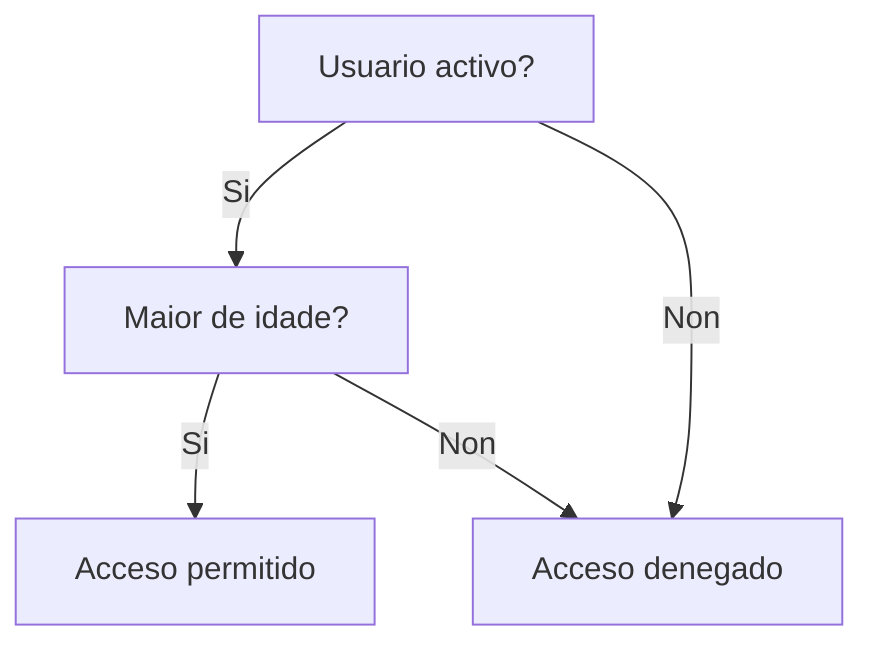
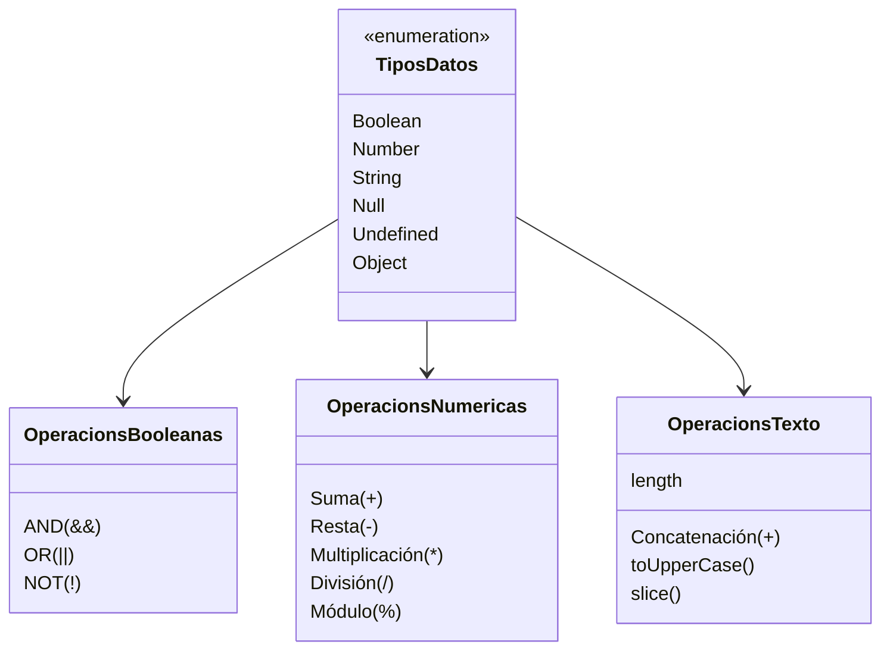

# {{ $frontmatter.title }}

## **1. Tipos de datos básicos**

### **1.1. Datos booleanos**
Representan valores lóxicos `verdadeiro` (true) ou `falso` (false).

**Características:**
- Usados en condicións e operacións lóxicas
- Resultado de comparacións

**Exemplos:**
```javascript
let estaActivo = true;
let esMayor = (idade >= 18); // Devolve true ou false
let tieneDescuento = false;
```

**Operacións lóxicas:**
```javascript
// AND lóxico (&&)
let acceso = estaActivo && esMayor;

// OR lóxico (||)
let mostrarContenido = esPremium || tieneDescuento;

// NOT lóxico (!)
let estaInactivo = !estaActivo;
```

**Diagrama de decisión (Mermaid):**


### **1.2. Datos numéricos**
Inclúen enteiros e decimais. JavaScript usa un só tipo (`Number`).

**Exemplos:**
```javascript
let enteiro = 42;
let decimal = 3.1416;
let notacionCientifica = 2.5e4; // 25000
```

**Operacións numéricas:**
```javascript
let suma = 5 + 3.2;      // 8.2
let resto = 10 % 3;      // 1
let potencia = 2 ** 3;   // 8 (2 elevado a 3)
```

**Funcións útiles:**
```javascript
Math.round(4.7);    // 5 (redondeo)
Math.random();      // Número aleatorio entre 0 e 1
parseInt("10");     // Conversión a enteiro
parseFloat("3.14"); // Conversión a decimal
```

### **1.3. Datos de texto (String)**
Secuencias de caracteres delimitadas por comillas.

**Formas de declaración:**
```javascript
let nome = 'Ana';       // Comiñas simples
let apelidos = "Pérez"; // Comiñas dobres
let enderezo = `Rúa 
Principal`;             // Template literals (multiliña)
```

**Operacións comúns:**
```javascript
let nomeCompleto = nome + " " + apelidos; // Concatenación
let longitud = nomeCompleto.length;       // 10 (Ana Pérez)
let maiusculas = nome.toUpperCase();      // "ANA"
let substring = apelidos.slice(1, 3);     // "ér"
```

**Template literals (ES6+):**
```javascript
let mensaxe = `Ola, ${nome}. 
Tes ${idade} anos.`; // Interpolación de variables
```

### **1.4. Valores nulos e undefined**
- `null`: Valor asignado para indicar ausencia deliberada de valor
- `undefined`: Variable declarada pero sen valor asignado

**Diferenzas clave:**
```javascript
let variableNula = null;      // Asignado explicitamente
let variableNonDefinida;      // undefined (por defecto)

typeof null;       // "object" (erro histórico de JavaScript)
typeof undefined;  // "undefined"
```

**Casos de uso:**
```javascript
// Inicialización explícita a nulo
let resultadoBusqueda = null;

// Función sen return devolve undefined
function senRetorno() {}
console.log(senRetorno()); // undefined
```

## **2. Comprobación de tipos**

### **Operador typeof**
Devolve o tipo de dato como string:
```javascript
typeof true;        // "boolean"
typeof 42;          // "number"
typeof "texto";     // "string"
typeof null;        // "object" (coñecido erro)
typeof undefined;   // "undefined"
```

### **Comparación estrita de tipos**
```javascript
5 === "5";   // false (diferente tipo)
null === undefined; // false (son tipos diferentes)
```

## **3. Conversión entre tipos (coerción)**

### **Conversión implícita**
```javascript
"5" + 2;      // "52" (concatena)
"5" - 2;      // 3 (converte a número)
true + 1;     // 2 (true convértese a 1)
```

### **Conversión explícita**
```javascript
Number("3.14");  // 3.14
String(123);     // "123"
Boolean(0);      // false
Boolean("texto");// true
```

## **4. Exemplo práctico integrado**

**Sistema de validación de formulario:**
```javascript
// Tipos de datos en acción
const formulario = {
    usuario: "",
    contrasinal: null,
    recordar: false,
    intentos: 0,
    errores: []
};

function validarFormulario() {
    // Comprobacións de tipo
    if (typeof formulario.usuario !== "string" || formulario.usuario === "") {
        formulario.erros.push("O usuario debe ser un texto non baleiro");
    }
    
    if (formulario.contrasinal === null) {
        formulario.erros.push("Debe establecer un contrasinal");
    }
    
    // Actualización numérica
    formulario.intentos++;
    
    // Resultado booleano
    return formulario.erros.length === 0;
}

// Uso
formulario.usuario = "admin";
formulario.contrasinal = "1234";
formulario.recordar = true;

if (validarFormulario()) {
    console.log("Formulario válido");
} else {
    console.log("Erros:", formulario.erros.join(", "));
}
```

**Pseudocódigo:**
```
OBXECTO formulario:
    usuario: cadea baleira
    contrasinal: nulo
    recordar: falso
    intentos: 0
    erros: lista baleira

FUNCIÓN validarFormulario:
    SE usuario non é cadea OU está baleira:
        engadir erro
    FIN SE
    
    SE contrasinal é nulo:
        engadir erro
    FIN SE
    
    incrementar intentos
    
    DEVOLVER erros está baleiro
FIN FUNCIÓN
```

## **5. Esquema de tipos (Mermaid)**



## **Conclusión didáctica**

✅ **Booleanos**: `true`/`false` para lóxica e decisións  
✅ **Números**: Enteiros e decimais para cálculos  
✅ **Textos**: Secuencias de caracteres para datos alfabéticos  
✅ **Null/Undefined**: Valores especiais para casos límite  

**Boas prácticas:**  
✔ Usar comparación estrita (`===`) para evitar coerción non desexada  
✔ Declarar variables con valores iniciais axeitados  
✔ Converter explicitamente cando o tipo non está claro  

**Exercicio práctico:**  
Crear unha función que:  
1. Acepte un parámetro de calquera tipo  
2. Determine o tipo de dato recibido  
3. Realice unha operación adecuada segundo o tipo:  
   - Números: calcular o cadrado  
   - Textos: contar as vocais  
   - Booleanos: inverter o valor  
   - Null/Undefined: devolver mensaxe de erro  

```javascript
function procesarDato(dato) {
    const tipo = typeof dato;
    
    switch(tipo) {
        case 'number':
            return dato ** 2;
        case 'string':
            return dato.match(/[aeiouáéíóú]/gi)?.length || 0;
        case 'boolean':
            return !dato;
        default:
            if (dato === null) return "Error: valor nulo";
            return "Tipo de dato non soportado";
    }
}

// Probas
console.log(procesarDato(5));      // 25
console.log(procesarDato("Hola")); // 2
console.log(procesarDato(true));   // false
console.log(procesarDato(null));   // "Error: valor nulo"
```


---

DAW🧊2026