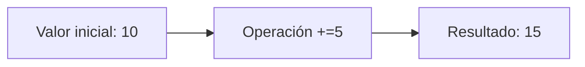
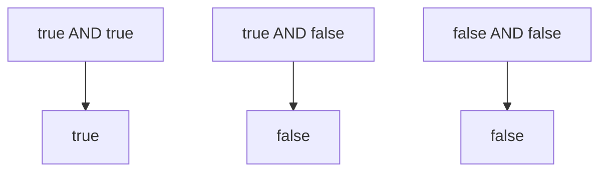

# {{ $frontmatter.title }}

## **1. Operadores de Asignación**

### **Asignación básica**
```javascript
let x = 10; // Asignación simple
```

### **Asignacións compostas**
```javascript
x += 5;  // Equivalente a x = x + 5
x -= 3;  // Equivalente a x = x - 3
x *= 2;  // Equivalente a x = x * 2
x /= 4;  // Equivalente a x = x / 4
x %= 3;  // Equivalente a x = x % 3
```

**Diagrama de asignación (Mermaid):**


## **2. Operadores de Comparación**

### **Comparacións simples**
```javascript
5 == '5'   // true (igualdade de valor)
5 === '5'  // false (igualdade estrita)
10 != '10' // false
10 !== '10' // true
```

### **Comparacións de magnitude**
```javascript
8 > 5   // true
8 < 5   // false
5 >= 5  // true
5 <= 4  // false
```

## **3. Operadores Aritméticos**

| Operador | Descrición     | Exemplo    |
| -------- | -------------- | ---------- |
| +        | Suma           | 5 + 3 → 8  |
| -        | Resta          | 5 - 3 → 2  |
| *        | Multiplicación | 5 * 3 → 15 |
| /        | División       | 15 / 3 → 5 |
| %        | Módulo (resto) | 10 % 3 → 1 |
| **       | Exponenciación | 2 ** 3 → 8 |
| ++       | Incremento     | x++        |
| --       | Decremento     | x--        |

**Exemplo práctico:**
```javascript
let raio = 5;
const PI = 3.1416;
let area = PI * raio ** 2; // 78.54
```

## **4. Operadores sobre Bits**

| Operador | Descrición             | Exemplo     |
| -------- | ---------------------- | ----------- |
| &        | AND bit a bit          | 5 & 3 → 1   |
| \|       | OR bit a bit           | 5 \| 3 → 7  |
| ^        | XOR bit a bit          | 5 ^ 3 → 6   |
| ~        | NOT bit a bit          | ~5 → -6     |
| <<       | Desprazamento esquerda | 5 << 1 → 10 |
| >>       | Desprazamento dereita  | 5 >> 1 → 2  |

**Pseudocódigo bitwise:**
```
5 en binario: 0101
3 en binario: 0011
AND bit a bit: 0001 (1 decimal)
```

## **5. Operadores Lóxicos**

| Operador | Descrición | Exemplo                |
| -------- | ---------- | ---------------------- |
| &&       | AND lóxico | true && false → false  |
| \|\|     | OR lóxico  | true \|\| false → true |
| !        | NOT lóxico | !true → false          |

**Táboa de verdade (Mermaid):**


## **6. Operadores de Cadeas**

### **Concatenación**
```javascript
let nome = "Ana" + " " + "Pérez"; // "Ana Pérez"
```

### **Template literals (ES6+)**
```javascript
let idade = 25;
let mensaxe = `Ola, ${nome}. Tes ${idade} anos.`;
```

## **7. Operadores Especiais**

### **Operador ternario**
```javascript
let acceso = idade >= 18 ? "Permitido" : "Denegado";
```

### **Operador typeof**
```javascript
typeof "texto" // "string"
```

### **Operador de propagación (...)**
```javascript
let nums = [1, 2, 3];
let novosNums = [...nums, 4, 5]; // [1, 2, 3, 4, 5]
```

## **8. Expresións de Cadea**

```javascript
let cadea = "JavaScript";
let subcadea = cadea.substring(0,4); // "Java"
let maiusculas = cadea.toUpperCase(); // "JAVASCRIPT"
let concatenada = `Linguaxe: ${cadea}`; // "Linguaxe: JavaScript"
```

## **9. Expresións Aritméticas**

```javascript
let media = (nota1 + nota2 + nota3) / 3;
let incremento = contador++;
let areaCirculo = Math.PI * radio ** 2;
```

**Diagrama de expresión (Mermaid):**
```mermaid
flowchart TD
    A[nota1] --> B[+]
    C[nota2] --> B
    D[nota3] --> B
    B --> E[/]
    F[3] --> E
    E --> G[media]
```

## **10. Expresións Lóxicas**

```javascript
let acceso = idade >= 18 && tenPermiso;
let ofertaEspecial = esEstudiante || esSocio;
let inverso = !activo;
```

**Pseudocódigo lóxico:**
```
SE idade >= 18 E tenPermiso ENTÓN
    acceso = verdadeiro
SENÓN
    acceso = falso
FIN SE
```

## **11. Expresións de Obxecto**

### **Acceso a propiedades**
```javascript
let persoa = {
    nome: "Carlos",
    idade: 30
};

let nomePersoa = persoa.nome; // Notación de punto
let idadePersoa = persoa["idade"]; // Notación de corchete
```

### **Métodos de obxecto**
```javascript
let calculadora = {
    sumar: function(a, b) {
        return a + b;
    }
};

let resultado = calculadora.sumar(5, 3); // 8
```

## **Exemplo Práctico Integrado**

```javascript
// Calculadora de IMC (Índice de Masa Corporal)
function calcularIMC(peso, altura) {
    // Expresión aritmética
    let imc = peso / (altura ** 2);
    
    // Expresións lóxicas
    let categoria = imc < 18.5 ? "Baixo peso" :
                   imc < 25 ? "Normal" :
                   imc < 30 ? "Sobrepeso" : "Obesidade";
    
    // Expresión de cadea
    return `IMC: ${imc.toFixed(2)} (${categoria})`;
}

// Uso
let resultado = calcularIMC(70, 1.75);
console.log(resultado); // "IMC: 22.86 (Normal)"
```

**Pseudocódigo completo:**
```
FUNCIÓN calcularIMC(peso, altura):
    imc = peso / (altura * altura)
    
    SE imc < 18.5 ENTÓN
        categoria = "Baixo peso"
    SENÓN SE imc < 25 ENTÓN
        categoria = "Normal"
    SENÓN SE imc < 30 ENTÓN
        categoria = "Sobrepeso"
    SENÓN
        categoria = "Obesidade"
    FIN SE
    
    DEVOLVER "IMC: " + imc + " (" + categoria + ")"
FIN FUNCIÓN
```

## **Conclusión Didáctica**

✅ **Operadores** permiten manipular valores e variables  
✅ **Expresións** combinan operandos e operadores para producir resultados  
✅ **Tipos de operadores**: asignación, comparación, aritméticos, lóxicos, etc.  
✅ **Boas prácticas**:  
   - Usar comparacións estritas (`===`, `!==`)  
   - Parentizar expresións complexas para mellor legibilidade  
   - Preferir template literals para concatenación de cadeas  

**Exercicio práctico:**  
Crear unha función que:  
1. Acepte 3 números como parámetros  
2. Calcule a media aritmética  
3. Determine se é aprobado (media ≥ 5)  
4. Devolva un obxecto coa media e o resultado  

```javascript
function avaliarNotas(nota1, nota2, nota3) {
    const media = (nota1 + nota2 + nota3) / 3;
    const aprobado = media >= 5;
    
    return {
        media: media.toFixed(2),
        resultado: aprobado ? "Aprobado" : "Suspenso"
    };
}

// Exemplo de uso
console.log(avaliarNotas(4, 6, 5));
// { media: "5.00", resultado: "Aprobado" }
```