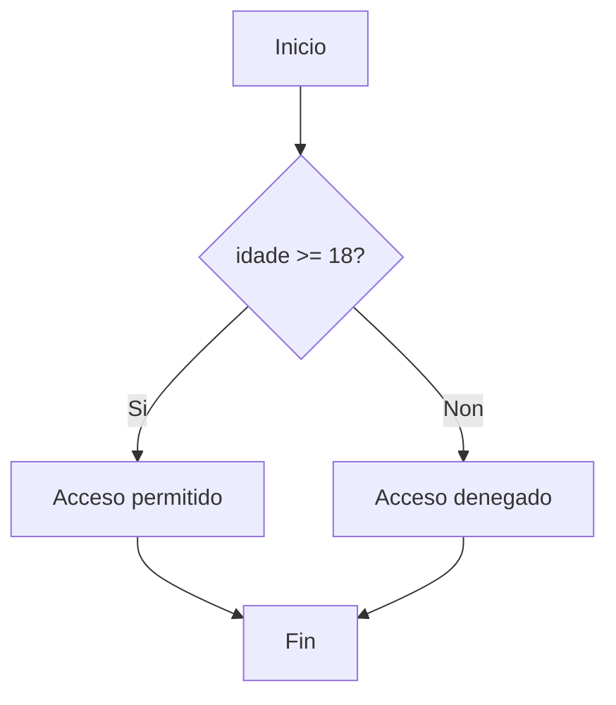
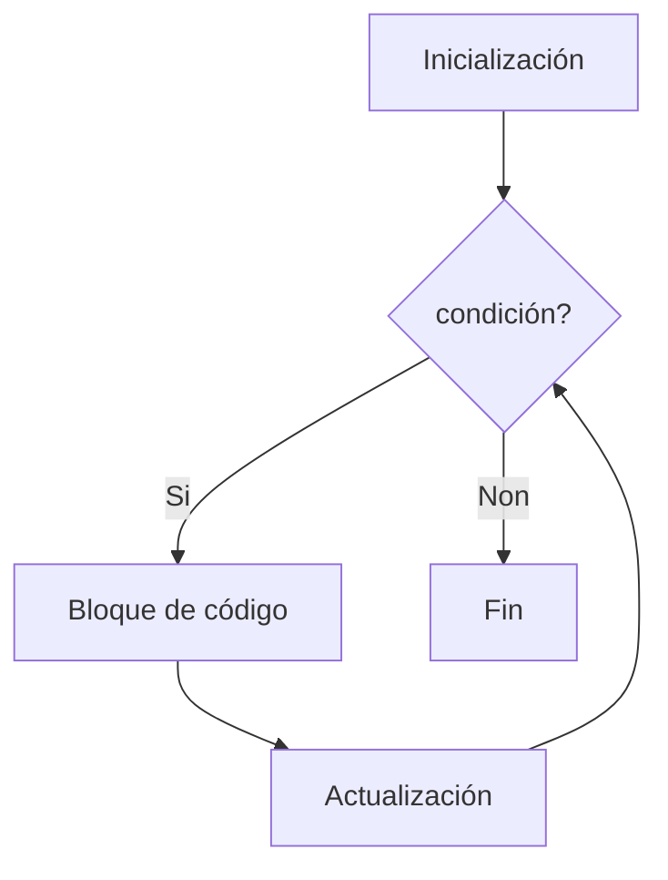
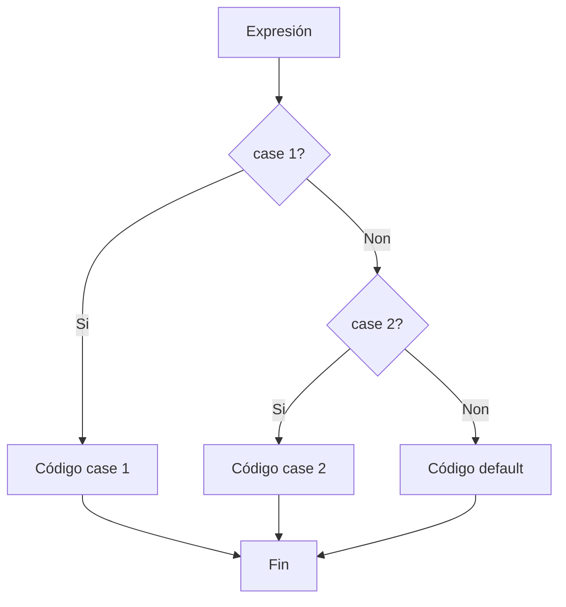

# {{ $frontmatter.title }}

## **1. Sentencia IF (Condicional)**

### **1.1. Forma básica**
```javascript
if (condición) {
    // Código que se executa se a condición é verdadeira
}
```

**Exemplo práctico:**
```javascript
let idade = 20;

if (idade >= 18) {
    console.log("Acceso permitido");
}
```

### **1.2. IF-ELSE**
```javascript
if (condición) {
    // Bloque verdadeiro
} else {
    // Bloque falso
}
```

**Exemplo:**
```javascript
let nota = 4.5;

if (nota >= 5) {
    console.log("Aprobado");
} else {
    console.log("Suspenso");
}
```

### **1.3. IF-ELSE IF**
```javascript
if (condición1) {
    // Bloque 1
} else if (condición2) {
    // Bloque 2
} else {
    // Bloque por defecto
}
```

**Exemplo de clasificación:**
```javascript
let puntuacion = 85;

if (puntuacion >= 90) {
    console.log("Sobresaínte");
} else if (puntuacion >= 70) {
    console.log("Notable");
} else if (puntuacion >= 50) {
    console.log("Aprobado");
} else {
    console.log("Suspenso");
}
```

**Diagrama de fluxo (Mermaid):**


## **2. Sentencia WHILE (Bucle condicional)**

### **2.1. Forma básica**
```javascript
while (condición) {
    // Código que se repite mentres a condición sexa verdadeira
}
```

**Exemplo: Contador regresivo**
```javascript
let contador = 5;

while (contador > 0) {
    console.log(contador);
    contador--;
}
console.log("BOOM!");
```

### **2.2. DO-WHILE**
```javascript
do {
    // Código que se executa polo menos unha vez
} while (condición);
```

**Exemplo: Validación de entrada**
```javascript
let entrada;

do {
    entrada = prompt("Introduce un número maior que 10:");
} while (entrada <= 10);
```

**Pseudocódigo WHILE:**
```
MENTRES condición FACER
    instrucións
FIN MENTRES
```

## **3. Sentencia FOR (Bucle contado)**

### **3.1. Forma estándar**
```javascript
for (inicialización; condición; actualización) {
    // Código a repetir
}
```

**Exemplo: Iteración básica**
```javascript
for (let i = 0; i < 5; i++) {
    console.log("Iteración número " + i);
}
```

### **3.2. FOR para percorrer arrays**
```javascript
let frutas = ["mazá", "laranxa", "plátano"];

for (let i = 0; i < frutas.length; i++) {
    console.log(frutas[i]);
}
```

**Diagrama FOR (Mermaid):**


## **4. Sentencia BREAK**

### **4.1. Interromper bucles**
```javascript
for (let i = 0; i < 10; i++) {
    if (i === 5) {
        break; // Saída inmediata do bucle
    }
    console.log(i);
}
```

### **4.2. Caso práctico: Busca en array**
```javascript
let numeros = [3, 7, 2, 9, 5];
let encontrado = false;

for (let num of numeros) {
    if (num === 9) {
        encontrado = true;
        break;
    }
}
```

## **5. Sentencia CONTINUE**

### **5.1. Saltar iteracións**
```javascript
for (let i = 0; i < 10; i++) {
    if (i % 2 === 0) {
        continue; // Salta números pares
    }
    console.log(i); // Só mostra impares
}
```

### **5.2. Exemplo con validación**
```javascript
let puntuacions = [5, -1, 8, 3, 0, 10];

for (let i = 0; i < puntuacions.length; i++) {
    if (puntuacions[i] <= 0) {
        continue; // Ignora valores non válidos
    }
    console.log("Puntuación válida: " + puntuacions[i]);
}
```

## **6. Sentencia SWITCH (Selección múltiple)**

### **6.1. Estrutura básica**
```javascript
switch (expresión) {
    case valor1:
        // Código para valor1
        break;
    case valor2:
        // Código para valor2
        break;
    default:
        // Código por defecto
}
```

**Exemplo: Conversor de días**
```javascript
let diaSemana = 3;
let nomeDia;

switch (diaSemana) {
    case 1:
        nomeDia = "Luns";
        break;
    case 2:
        nomeDia = "Martes";
        break;
    case 3:
        nomeDia = "Mércores";
        break;
    // ... outros casos
    default:
        nomeDia = "Día non válido";
}
```

### **6.2. Casos agrupados**
```javascript
let mes = "Febreiro";
let estacion;

switch (mes) {
    case "Decembro":
    case "Xaneiro":
    case "Febreiro":
        estacion = "Inverno";
        break;
    case "Marzo":
    case "Abril":
    case "Maio":
        estacion = "Primavera";
        break;
    // ... outros casos
    default:
        estacion = "Mes non válido";
}
```

**Diagrama SWITCH (Mermaid):**


## **Exemplo Práctico Integrado**

**Xogo de adiviñar o número:**
```javascript
const numeroObxectivo = Math.floor(Math.random() * 100) + 1;
let intentos = 0;
let adiviñado = false;

while (!adiviñado) {
    let intento = parseInt(prompt("Adiviña o número (1-100):"));
    intentos++;
    
    if (isNaN(intento)) {
        alert("Introduce un número válido");
        continue;
    }
    
    switch (true) {
        case (intento === numeroObxectivo):
            alert(`Correcto! Adiviñaches en ${intentos} intentos.`);
            adiviñado = true;
            break;
        case (intento < numeroObxectivo):
            alert("O número é maior");
            break;
        default:
            alert("O número é menor");
    }
    
    if (intentos >= 10) {
        alert("Superaches o número máximo de intentos");
        break;
    }
}
```

**Pseudocódigo equivalente:**
```
INICIO
    numeroObxectivo = ALEATORIO(1,100)
    intentos = 0
    adiviñado = falso
    
    MENTRES non adiviñado FACER
        LER intentoUsuario
        intentos = intentos + 1
        
        SE intento non é número ENTÓN
            MOSTRAR "Número non válido"
            CONTINUAR
        FIN SE
        
        SE intento == numeroObxectivo ENTÓN
            MOSTRAR "Correcto!"
            adiviñado = verdadeiro
        SENÓN SE intento < numeroObxectivo ENTÓN
            MOSTRAR "Maior"
        SENÓN
            MOSTRAR "Menor"
        FIN SE
        
        SE intentos >= 10 ENTÓN
            MOSTRAR "Máximo de intentos"
            INTERROMPER
        FIN SE
    FIN MENTRES
FIN
```

## **Conclusión Didáctica**

✅ **IF/ELSE**: Para decisións condicionais  
✅ **WHILE/DO-WHILE**: Para repeticións con condición  
✅ **FOR**: Para repeticións controladas por contador  
✅ **BREAK/CONTINUE**: Para controlar o fluxo de bucles  
✅ **SWITCH**: Para selección múltiple  

**Boas prácticas:**  
✔ Usar bloques `{}` sempre, incluso cando teñan unha soa liña  
✔ Evitar bucles infinitos asegurando que a condición cambie  
✔ Usar `switch` cando hai moitas condicións contra un mesmo valor  

**Exercicio práctico:**  
Crear un programa que:  
1. Pida números ao usuario ata que introduza 0  
2. Contabilice cantos son positivos e cantos negativos  
3. Calcule a media dos números introducidos  
4. Mostre os resultados cando finalice  

```javascript
let positivos = 0;
let negativos = 0;
let suma = 0;
let contador = 0;
let numero;

do {
    numero = parseFloat(prompt("Introduce un número (0 para terminar):"));
    
    if (isNaN(numero)) {
        alert("Non é un número válido");
        continue;
    }
    
    if (numero !== 0) {
        suma += numero;
        contador++;
        
        if (numero > 0) {
            positivos++;
        } else {
            negativos++;
        }
    }
} while (numero !== 0);

const media = contador > 0 ? suma / contador : 0;

alert(`Resultados:
- Positivos: ${positivos}
- Negativos: ${negativos}
- Media: ${media.toFixed(2)}`);
```