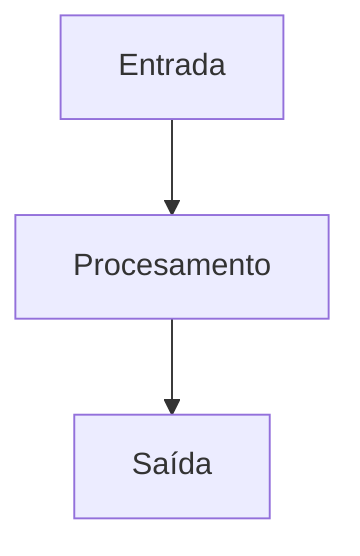
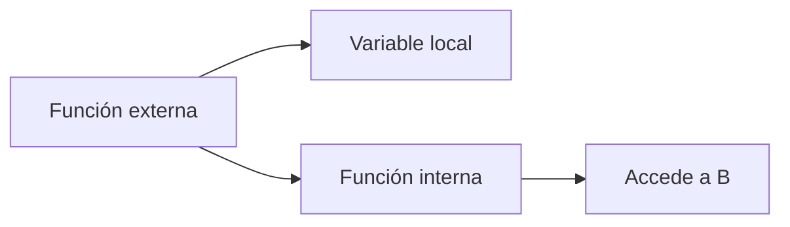

# {{ $frontmatter.title }}

## **1. Definición de Funcións**

### **1.1. Declaración de función**
```javascript
function saudar() {
    console.log("Ola, mundo!");
}
```

### **1.2. Expresión de función**
```javascript
const saudar = function() {
    console.log("Ola, mundo!");
};
```

### **1.3. Arrow function (ES6+)**
```javascript
const saudar = () => {
    console.log("Ola, mundo!");
};
```

**Diagrama de función (Mermaid):**


## **2. Sentencia RETURN**

### **2.1. Devolver valores**
```javascript
function sumar(a, b) {
    return a + b;
}

let resultado = sumar(3, 5); // 8
```

### **2.2. Interrupción de execución**
```javascript
function ePositivo(num) {
    if (num <= 0) return false;
    return true;
}
```

**Pseudocódigo:**
```
FUNCIÓN sumar(a, b)
    DEVOLVER a + b
FIN FUNCIÓN
```

## **3. Propiedades das Funcións**

### **3.1. Parámetros e argumentos**
```javascript
function rexistrarUsuario(nome, idade = 18) { // Parámetro con valor por defecto
    console.log(`Nome: ${nome}, Idade: ${idade}`);
}

rexistrarUsuario("Ana"); // Usa o valor por defecto
```

### **3.2. Objeto arguments**
```javascript
function sumarTodos() {
    let suma = 0;
    for (let i = 0; i < arguments.length; i++) {
        suma += arguments[i];
    }
    return suma;
}
```

## **4. Funcións Predefinidas**

### **4.1. Funcións globais**
```javascript
isNaN("texto"); // true
parseInt("10"); // 10
eval("2 + 2");  // 4 (evitar por seguridade)
```

### **4.2. Funcións de obxecto**
```javascript
Math.random(); // Número aleatorio entre 0 e 1
Array.isArray([]); // true
Object.keys({a: 1}); // ['a']
```

## **5. Creación de Funcións**

### **5.1. Funcións como valores**
```javascript
const operacions = {
    sumar: (a, b) => a + b,
    restar: (a, b) => a - b
};

operacions.sumar(5, 3); // 8
```

### **5.2. Funcións como parámetros**
```javascript
function operar(a, b, operacion) {
    return operacion(a, b);
}

operar(10, 5, (x, y) => x * y); // 50
```

## **6. Particularidades das Funcións**

### **6.1. Hoisting**
```javascript
saudar(); // Funciona grazas ao hoisting

function saudar() {
    console.log("Ola!");
}
```

### **6.2. Closures**
```javascript
function crearContador() {
    let contador = 0;
    return function() {
        return ++contador;
    };
}

const contador = crearContador();
contador(); // 1
contador(); // 2
```

**Diagrama de closure (Mermaid):**


## **Exemplo Práctico Integrado**

**Xestor de tarefas:**
```javascript
const xestorTarefas = (function() {
    const tarefas = [];
    
    function engadirTarefa(tarefa) {
        tarefas.push(tarefa);
        return `Tarefa "${tarefa}" engadida. Total: ${tarefas.length}`;
    }
    
    function listarTarefas() {
        return tarefas.join("\n") || "Non hay tarefas";
    }
    
    return {
        engadir: engadirTarefa,
        listar: listarTarefas
    };
})();

xestorTarefas.engadir("Aprender JavaScript");
console.log(xestorTarefas.listar());
```

**Pseudocódigo:**
```
MODULO xestorTarefas
    VARIABLE PRIVADA tarefas = []
    
    FUNCIÓN engadirTarefa(tarefa)
        tarefas.engadir(tarefa)
        DEVOLVER mensaxe de confirmación
    FIN FUNCIÓN
    
    FUNCIÓN listarTarefas()
        DEVOLVER lista de tarefas ou mensaxe
    FIN FUNCIÓN
    
    EXPORTAR { engadir, listar }
FIN MODULO
```

## **Conclusión Didáctica**

✅ **Funcións** encapsulan código reusable  
✅ **Parámetros** permiten flexibilidade  
✅ **Closures** manteñen estado privado  
✅ **Modularización** mellora a organización  

**Boas prácticas:**  
✔ Nomes descriptivos para funcións  
✔ Funcións pequenas cun único propósito  
✔ Documentar con comentarios  

**Exercicio práctico:**  
Crear unha función `filtrarArray` que:  
1. Acepte un array e unha función de filtro  
2. Devolva novo array cos elementos que cumpren a condición  
3. Incluír exemplos de uso  

```javascript
function filtrarArray(array, filtro) {
    const resultado = [];
    for (const elemento of array) {
        if (filtro(elemento)) {
            resultado.push(elemento);
        }
    }
    return resultado;
}

// Exemplo de uso
const numeros = [1, 2, 3, 4, 5];
const pares = filtrarArray(numeros, num => num % 2 === 0);
console.log(pares); // [2, 4]
```


---

DAW🧊2025