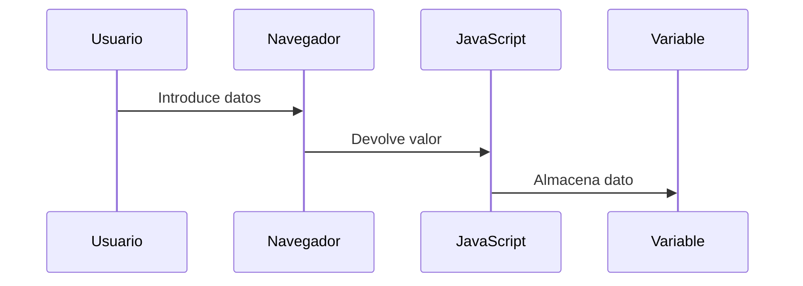

# {{ $frontmatter.title }}

## **1. Descrición e Funcionamento Básico**

### **1.1. Fluxo básico de E/S**


### **1.2. Lectura e almacenamento**
```javascript
// Lectura de teclado
let nome = prompt("Introduce o teu nome:");

// Almacenamento en variable
let idade = parseInt(prompt("Introduce a túa idade:"));

// Procesamento
let anoNacemento = new Date().getFullYear() - idade;

// Saída
console.log(`Ola ${nome}, naciches aproximadamente no ${anoNacemento}`);
```

## **2. Sentencia PROMPT**

### **2.1. Uso básico**
```javascript
let resposta = prompt("Como te chamas?");
```

### **2.2. Con valor por defecto**
```javascript
let lingua = prompt("Cal é a túa lingua preferida?", "galego");
```

### **2.3. Conversión de tipos**
```javascript
// Lectura de número
let cantidade = parseFloat(prompt("Introduce a cantidade:"));

// Lectura de booleano
let acepta = confirm("Aceptas os termos?");
```

**Diagrama de interacción:**


## **3. Sentencia DOCUMENT.WRITE**

### **3.1. Escritura básica**
```javascript
document.write("<h1>Benvido á miña páxina</h1>");
```

### **3.2. Inserción de variables**
```javascript
let usuario = "Ana";
document.write(`<p>Ola, ${usuario}!</p>`);
```

**⚠ Precaucións:**
- Sobrescribe todo o documento se se usa despois da carga
- Non recomendado para aplicacións modernas

## **4. Métodos Modernos de Saída**

### **4.1. Manipulación do DOM**
```javascript
// Selección de elemento
let saida = document.getElementById("resultado");

// Modificación de contido
saida.textContent = "Novo contido";
saida.innerHTML = "<strong>Texto</strong> formatado";
```

### **4.2. Consola do navegador**
```javascript
console.log("Mensaxe informativa");
console.warn("Aviso importante");
console.error("Erro crítico");
```

### **4.3. Caixas de diálogo**
```javascript
alert("Operación completada");
let confirmacion = confirm("Seguro que queres eliminar?");
```

## **5. Exemplo Práctico Integrado**

**Calculadora de IMC:**
```html
<!DOCTYPE html>
<html>
<body>
    <h2>Calculadora de IMC</h2>
    <div id="resultado"></div>
    
    <script>
        // Entrada
        let peso = parseFloat(prompt("Introduce o teu peso en kg:"));
        let altura = parseFloat(prompt("Introduce a túa altura en metros:"));
        
        // Procesamento
        let imc = peso / (altura * altura);
        let categoria;
        
        if (imc < 18.5) categoria = "Baixo peso";
        else if (imc < 25) categoria = "Peso normal";
        else if (imc < 30) categoria = "Sobrepeso";
        else categoria = "Obesidade";
        
        // Saída
        let saida = document.getElementById("resultado");
        saida.innerHTML = `
            <p>IMC: ${imc.toFixed(2)}</p>
            <p>Categoría: ${categoria}</p>
        `;
        
        console.log(`Cálculo de IMC para ${peso}kg/${altura}m: ${imc.toFixed(2)}`);
    </script>
</body>
</html>
```

**Pseudocódigo:**
```
INICIO
    // Entrada
    peso = LER("Introduce peso")
    altura = LER("Introduce altura")
    
    // Procesamento
    imc = peso / (altura^2)
    
    SE imc < 18.5 ENTÓN
        categoria = "Baixo peso"
    SENÓN SE imc < 25 ENTÓN
        categoria = "Normal"
    SENÓN SE imc < 30 ENTÓN
        categoria = "Sobrepeso"
    SENÓN
        categoria = "Obesidade"
    FIN SE
    
    // Saída
    MOSTRAR EN PÁXINA "IMC: " + imc
    MOSTRAR EN PÁXINA "Categoría: " + categoria
    MOSTRAR EN CONSOLA datos do cálculo
FIN
```

## **6. Comparativa de Métodos de Saída**

| Método           | Uso Recomendado      | Ventaxas              | Desvantaxes                 |
| ---------------- | -------------------- | --------------------- | --------------------------- |
| `document.write` | Prototipado rápido   | Sinxelo de usar       | Destrutivo, non profesional |
| `console.log`    | Depuración           | Non afecta á UI       | Non visible para usuarios   |
| `alert`          | Mensaxes importantes | Chama a atención      | Interrompe o fluxo          |
| DOM manipulation | Aplicacións reais    | Flexible, profesional | Require máis código         |

## **Conclusión Didáctica**

✅ **PROMPT** para entrada de datos do usuario  
✅ **Evitar document.write** en código profesional  
✅ **Manipulación do DOM** é o estándar actual  
✅ **Console** esencial para depuración  

**Boas prácticas:**  
✔ Validar sempre os datos de entrada  
✔ Usar métodos modernos de saída (DOM, console)  
✔ Formatear adecuadamente os datos numéricos  

**Exercicio práctico:**  
Crear un programa que:  
1. Pida 3 notas de exames  
2. Calcule a media  
3. Mostre o resultado:  
   - En pantalla cunha cor segundo a nota  
   - Na consola con formato detallado  
   - Usando unha alerta se a nota é <5  

```javascript
// Solución
let nota1 = parseFloat(prompt("Introduce a primeira nota:"));
let nota2 = parseFloat(prompt("Introduce a segunda nota:"));
let nota3 = parseFloat(prompt("Introduce a terceira nota:"));

let media = (nota1 + nota2 + nota3) / 3;
let resultado = document.getElementById("resultado");

// Saída en pantalla
resultado.innerHTML = `<p style="color: ${media >= 5 ? 'green' : 'red'}">
    Media: ${media.toFixed(2)}
</p>`;

// Saída en consola
console.log(`Notas: ${nota1}, ${nota2}, ${nota3} | Media: ${media.toFixed(2)}`);

// Alerta se suspenso
if (media < 5) {
    alert(`Media baixa (${media.toFixed(2)}). Precisa mellorar!`);
}
```


---

DAW🧊2025