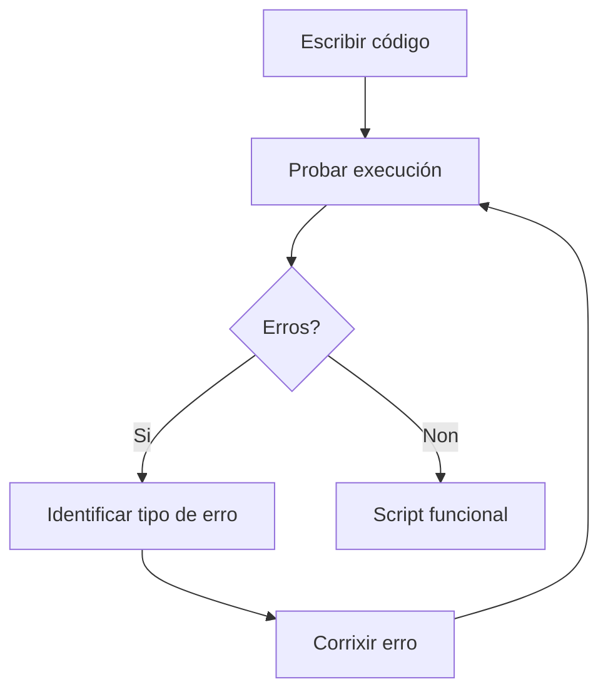

# {{ $frontmatter.title }}

## **1. Ferramentas de Desenvolvemento**

### **1.1. Creación de Scripts con Editores de Texto**

**Editores recomendados:**
- Visual Studio Code (VSCode)
- Sublime Text
- Atom

**Exemplo de configuración básica en VSCode:**
```javascript
// Configuración recomendada en settings.json
{
    "editor.tabSize": 2,
    "editor.wordWrap": "on",
    "files.autoSave": "afterDelay",
    "emmet.includeLanguages": {
        "javascript": "javascriptreact"
    }
}
```

**Extensións útiles:**
- ESLint (análise de código)
- Prettier (formateo automático)
- Live Server (visualización en tempo real)

### **1.2. Creación de Scripts con Aplicacións Web**

**Plataformas online:**
- CodePen (https://codepen.io)
- JSFiddle (https://jsfiddle.net)
- CodeSandbox (https://codesandbox.io)

**Vantaxes:**
- Non require configuración local
- Fácil compartición
- Entorno preconfigurado

### **1.3. Recursos Web para Creación de Scripts**

**Documentación e referencia:**
- MDN Web Docs (https://developer.mozilla.org)
- W3Schools (https://www.w3schools.com/js)

**Comunidades de aprendizaxe:**
- Stack Overflow (https://stackoverflow.com)
- freeCodeCamp (https://www.freecodecamp.org)

## **2. Depuración de Erros**

### **2.1. Tipos de Erros**

| Tipo de Error | Descrición                                 | Exemplo                                         |
| ------------- | ------------------------------------------ | ----------------------------------------------- |
| **Sintaxe**   | Erros na estrutura do código               | `function() { console.log('Ola')` (falta `}`)   |
| **Execución** | Erros durante a execución                  | `let x = y + 5;` (y non definida)               |
| **Lóxica**    | O código execútase pero non fai o esperado | `if (a = b)` (asignación en vez de comparación) |

**Diagrama de fluxo de depuración (Mermaid):**


### **2.2. Proceso de Depuración**

**1. Escritura do programa fonte:**
```javascript
function calcularMedia(a, b) {
    return a + b / 2; // Erro de precedencia
}
```

**2. Compilación/Interpretación:**
- Os erros de sintaxe detéctanse aquí

**3. Execución:**
- Os erros de execución aparecen durante a execución

**4. Corrección:**
```javascript
function calcularMedia(a, b) {
    return (a + b) / 2; // Corrixido
}
```

### **2.3. Uso da Consola do Navegador**

**Acceso:**
- F12 ou Ctrl+Shift+I (Chrome/Edge/Firefox)

**Funcións útiles:**
```javascript
console.log("Mensaxe informativa");
console.warn("Aviso importante");
console.error("Mensaxe de erro");
console.table([{nome: "Ana", idade: 25}]);
```

## **3. Control de Erros**

### **3.1. Try-Catch-Finally**

**Estrutura básica:**
```javascript
try {
    // Código que pode fallar
    let resultado = operacionRiesgosa();
} catch (error) {
    // Manexo do erro
    console.error("Produciuse un erro:", error.message);
} finally {
    // Execútase sempre
    console.log("Finalizado o intento");
}
```

### **3.2. Throw para Erros Personalizados**

**Exemplo:**
```javascript
function dividir(a, b) {
    if (b === 0) {
        throw new Error("Non se pode dividir por cero");
    }
    return a / b;
}

try {
    dividir(10, 0);
} catch (error) {
    alert(error.message);
}
```

### **3.3. Mensaxes de Erro Comúns**

| Mensaxe                                                     | Significado                                         | Solución                           |
| ----------------------------------------------------------- | --------------------------------------------------- | ---------------------------------- |
| `Uncaught TypeError: Cannot read property 'x' of undefined` | Intentando acceder a unha propiedade de `undefined` | Verificar se o obxecto existe      |
| `Uncaught ReferenceError: x is not defined`                 | Variable non declarada                              | Declarar a variable antes de usala |
| `Uncaught SyntaxError: Unexpected token ')'`                | Paréntese non pechado                               | Revisar a sintaxe                  |

## **4. Boas Prácticas de Depuración**

1. **Usar puntos de interrupción (breakpoints)**
2. **Inspeccionar variables paso a paso**
3. **Dividir o código en funcións pequenas**
4. **Probar por partes**
5. **Escribir código limpo e ben comentado**

## **Exemplo Práctico Integrado**

**Depuración dun script de cálculo:**
```html
<script>
    function calcularTotal(prezos) {
        let total = 0;
        
        try {
            // Verificar se é un array
            if (!Array.isArray(prezos)) {
                throw new Error("O parámetro debe ser un array");
            }
            
            // Sumar prezos
            for (let i = 0; i <= prezos.length; i++) { // Erro intencionado
                total += prezos[i];
            }
            
            return total;
        } catch (error) {
            console.error("Erro no cálculo:", error.message);
            return null;
        }
    }
    
    // Proba
    let prezos = [10, 20, 30];
    console.log("Total:", calcularTotal(prezos));
</script>
```

**Proceso de corrección:**
1. Identificar o erro (for usa `<=` en vez de `<`)
2. Corrixir o bucle
3. Engadir máis validacións
4. Probar con diferentes entradas

**Pseudocódigo de depuración:**
```
FUNCIÓN calcularTotal(prezos)
    INTENTAR
        SE prezos non é array ENTÓN
            LANZAR erro
        FIN SE
        
        PARA i DESDE 0 ATA longitud(prezos)-1 FACER
            total = total + prezos[i]
        FIN PARA
        
        DEVOLVER total
    CAPTURAR erro
        REXISTRAR erro
        DEVOLVER nulo
    FIN INTENTAR
FIN FUNCIÓN
```

## **Conclusión Didáctica**

✅ **Ferramentas adecuadas** aforran tempo e melloran a calidade  
✅ **Depuración sistemática** identifica erros eficientemente  
✅ **Manexo de erros** prevén fallos catastróficos  
✅ **Boas prácticas** reducen erros desde o comezo  

**Exercicio práctico:**  
Crear unha función que:  
1. Converta graos Celsius a Fahrenheit  
2. Inclúa manexo de erros para:  
   - Entradas non numéricas  
   - Valores extremos (inferior a -273.15°C)  
3. Probar con casos válidos e inválidos  

```javascript
function celsiusToFahrenheit(celsius) {
    try {
        // Verificar tipo
        if (typeof celsius !== 'number') {
            throw new Error("A entrada debe ser un número");
        }
        
        // Verificar valor mínimo
        if (celsius < -273.15) {
            throw new Error("Non se pode superar o cero absoluto (-273.15°C)");
        }
        
        // Cálculo
        return (celsius * 9/5) + 32;
    } catch (error) {
        console.error("Erro na conversión:", error.message);
        return null;
    }
}

// Probas
console.log("25°C =", celsiusToFahrenheit(25));      // Válido
console.log("Resultado:", celsiusToFahrenheit("abc")); // Inválido
console.log("Resultado:", celsiusToFahrenheit(-300));  // Inválido
```


---

DAW🧊2025