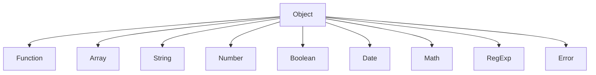
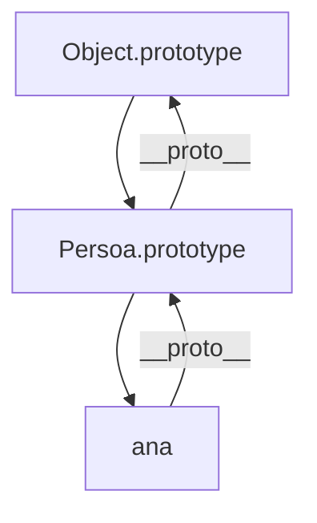
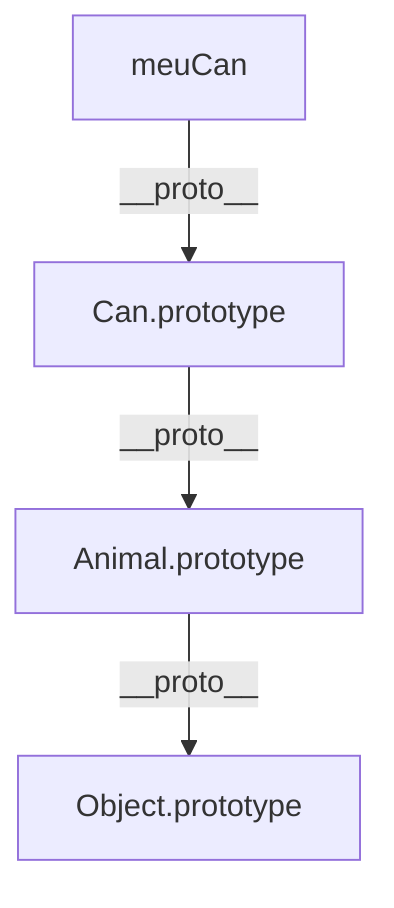

# {{ $frontmatter.title }}

## **1. Xerarquía de Obxectos**

### **1.1. Estrutura Xerárquica Básica**



**Explicación:**
- **Object**: O obxecto base de todos os obxectos en JavaScript
- Os demais obxectos (Function, Array, etc.) herdan de Object

### **1.2. Obxectos Principais**

| Obxecto      | Descrición                  | Exemplo               |
| ------------ | --------------------------- | --------------------- |
| **Object**   | Base para todos os obxectos | `let obj = {}`        |
| **Function** | Obxecto función             | `function f() {}`     |
| **Array**    | Colección ordenada          | `let arr = [1, 2, 3]` |
| **String**   | Cadeas de texto             | `let str = "Ola"`     |
| **Number**   | Valores numéricos           | `let num = 42`        |
| **Boolean**  | Valores lóxicos             | `let bool = true`     |

## **2. Propiedades Compartidas**

### **2.1. Propiedades e Métodos Comúns**

Todos os obxectos herdan propiedades e métodos de Object:

```javascript
let exemplo = { nome: "Ana" };

// Métodos comúns
console.log(exemplo.toString()); // "[object Object]"
console.log(exemplo.hasOwnProperty('nome')); // true
console.log(Object.keys(exemplo)); // ["nome"]
```

### **2.2. Propiedades do Prototype**

```javascript
function Persoa(nome) {
    this.nome = nome;
}

// Engadir método ao prototype
Persoa.prototype.saudar = function() {
    return `Ola, son ${this.nome}`;
};

let ana = new Persoa("Ana");
console.log(ana.saudar()); // "Ola, son Ana"
```

**Diagrama de herencia (Mermaid):**


## **3. Navegación pola Xerarquía**

### **3.1. Acceso ao Prototype**

```javascript
let arr = [1, 2, 3];

// Acceso directo
console.log(arr.__proto__ === Array.prototype); // true

// Método estándar
console.log(Object.getPrototypeOf(arr) === Array.prototype); // true
```

### **3.2. Cadea de Prototipos**

```javascript
let cadea = "texto";

console.log(cadea.__proto__ === String.prototype); // true
console.log(String.prototype.__proto__ === Object.prototype); // true
console.log(Object.prototype.__proto__); // null
```

### **3.3. Comprobación de Instancia**

```javascript
let data = new Date();

console.log(data instanceof Date); // true
console.log(data instanceof Object); // true
console.log(data instanceof Array); // false
```

## **4. Exemplo Práctico: Extensión de Obxectos**

### **4.1. Extender Obxectos Nativos**

```javascript
// Engadir método a String
String.prototype.inverter = function() {
    return this.split('').reverse().join('');
};

console.log("JavaScript".inverter()); // "tpircSavaJ"
```

### **4.2. Herdanza Personalizada**

```javascript
// Clase base
function Animal(nome) {
    this.nome = nome;
}
Animal.prototype.falar = function() {
    return `${this.nome} fai un son`;
};

// Clase derivada
function Can(nome, raza) {
    Animal.call(this, nome);
    this.raza = raza;
}
Can.prototype = Object.create(Animal.prototype);
Can.prototype.constructor = Can;
Can.prototype.falar = function() {
    return `${this.nome} (${this.raza}) di: Guau!`;
};

let meuCan = new Can("Rex", "Pastor Alemán");
console.log(meuCan.falar()); // "Rex (Pastor Alemán) di: Guau!"
```

**Diagrama de herdanza (Mermaid):**


## **5. Boas Prácticas**

1. **Non modificar Object.prototype directamente** (pode causar problemas)
2. **Usar `Object.create()` para herdanza** en vez de `__proto__`
3. **`instanceof` para comprobar tipos** en vez de `typeof`
4. **Prefire composición sobre herdanza** cando sexa posible

## **6. Exemplo Integrado: Sistema de Xestión**

```javascript
// Clase base
function Elemento(nome, tipo) {
    this.nome = nome;
    this.tipo = tipo;
}
Elemento.prototype.mostrar = function() {
    return `${this.tipo}: ${this.nome}`;
};

// Clase derivada
function Tarefa(nome, prioridade) {
    Elemento.call(this, nome, "Tarefa");
    this.prioridade = prioridade || "media";
}
Tarefa.prototype = Object.create(Elemento.prototype);
Tarefa.prototype.constructor = Tarefa;
Tarefa.prototype.mostrar = function() {
    return `${Elemento.prototype.mostrar.call(this)} (${this.prioridade})`;
};

// Uso
let compras = new Tarefa("Facer a compra", "alta");
console.log(compras.mostrar()); // "Tarefa: Facer a compra (alta)"
console.log(compras instanceof Tarefa); // true
console.log(compras instanceof Elemento); // true
```

**Pseudocódigo:**
```
CLASE Elemento
    CONSTRUCTOR(nome, tipo)
        this.nome = nome
        this.tipo = tipo
    
    MÉTODO mostrar()
        DEVOLVER this.tipo + ": " + this.nome
FIN CLASE

CLASE Tarefa HERDA DE Elemento
    CONSTRUCTOR(nome, prioridade)
        CHAMAR SUPER(nome, "Tarefa")
        this.prioridade = prioridade OU "media"
    
    MÉTODO mostrar()
        resultado = SUPER.mostrar()
        DEVOLVER resultado + " (" + this.prioridade + ")"
FIN CLASE
```

## **Conclusión Didáctica**

✅ **Xerarquía de obxectos** organiza o código de forma lóxica  
✅ **Herencia prototípica** permite reutilizar funcionalidade  
✅ **Navegación pola cadea de prototipos** é esencial para depuración  
✅ **Extensión responsable** de obxectos nativos  

**Exercicio práctico:**  
Crear un sistema de xestión de libros que:  
1. Use herdanza (Libro → LibroFisico, LibroDigital)  
2. Inclúa propiedades específicas para cada tipo  
3. Teña un método `mostrar()` polimórfico  
4. Demostre a cadea de prototipos  

```javascript
function Libro(titulo, autor) {
    this.titulo = titulo;
    this.autor = autor;
}
Libro.prototype.mostrar = function() {
    return `"${this.titulo}" por ${this.autor}`;
};

function LibroFisico(titulo, autor, paginas) {
    Libro.call(this, titulo, autor);
    this.paginas = paginas;
}
LibroFisico.prototype = Object.create(Libro.prototype);
LibroFisico.prototype.mostrar = function() {
    return `${Libro.prototype.mostrar.call(this)} (${this.paginas} páxinas)`;
};

// Proba
let libro1 = new LibroFisico("O Hobbit", "J.R.R. Tolkien", 310);
console.log(libro1.mostrar());
console.log(libro1 instanceof Libro);
```


---

DAW🧊2026