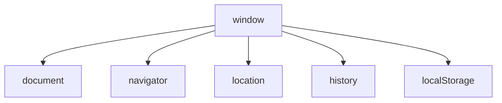

# {{ $frontmatter.title }}

## **1. O Obxecto `window` (Obxecto Superior)**

### **1.1. Propiedades Principais**

```javascript
// Tamaño da ventana
console.log(window.innerWidth);  // Ancho interior
console.log(window.innerHeight); // Alto interior

// Propiedades do sistema
console.log(window.screenX);     // Posición X na pantalla
console.log(window.screenY);     // Posición Y na pantalla
```

### **1.2. Métodos Esenciais**

```javascript
// Aberturas de ventana
let novaVentana = window.open("https://exemplo.com", "_blank");

// Temporización
let timeoutId = window.setTimeout(() => {
    console.log("Executado despois de 2 segundos");
}, 2000);

window.clearTimeout(timeoutId); // Cancelar o timeout
```

**Diagrama de relación (Mermaid):**


## **2. O Obxecto `navigator`**

### **2.1. Información do Navegador**

```javascript
console.log(navigator.userAgent); // Identificación do navegador
console.log(navigator.platform);  // Sistema operativo
console.log(navigator.language);  // Idioma do navegador
```

### **2.2. Funcionalidades Modernas**

```javascript
// Comprobar conexión
console.log(navigator.onLine ? "En liña" : "Sen conexión");

// Xeolocalización
navigator.geolocation.getCurrentPosition(pos => {
    console.log("Latitude:", pos.coords.latitude);
    console.log("Longitude:", pos.coords.longitude);
});
```

## **3. URL Actual (`location`)**

### **3.1. Propiedades de URL**

```javascript
console.log(location.href);     // URL completa
console.log(location.protocol); // Protocolo (http: ou https:)
console.log(location.hostname); // Dominio (exemplo.com)
console.log(location.pathname); // Ruta (/ruta/pagina.html)
console.log(location.search);   // Parámetros (?id=123)
```

### **3.2. Navegación Programática**

```javascript
// Redireccionamento
location.href = "https://novo-destino.com"; 

// Recargar páxina
location.reload();

// Cambiar só parámetros
location.search = "?usuario=ana";
```

## **4. Historial de Navegación (`history`)**

### **4.1. Métodos Principais**

```javascript
// Navegar atrás
history.back();

// Navegar adiante
history.forward();

// Navegar a posición específica
history.go(-2); // Dúas páxinas atrás

// Engadir entrada ao historial
history.pushState({data: "info"}, "", "nueva-ruta");
```

## **5. O Obxecto `document`**

### **5.1. Propiedades Básicas**

```javascript
// Título do documento
document.title = "Novo título";

// Cor de fondo
document.body.style.backgroundColor = "#f0f0f0";

// Formularios
console.log(document.forms.length); // Número de formularios
```

### **5.2. Acceso a Elementos**

```javascript
// Por ID
let cabezallo = document.getElementById("header");

// Por selector CSS
let enlaces = document.querySelectorAll("a.externo");

// Por nome de formulario
let formularioLogin = document.forms["login"];
```

### **5.3. Manipulación de Contido**

```javascript
// Crear elemento
let novoParrafo = document.createElement("p");
novoParrafo.textContent = "Texto engadido dinámicamente";
document.body.appendChild(novoParrafo);

// Modificar atributos
let imaxe = document.querySelector("img");
imaxe.setAttribute("alt", "Descrición da imaxe");
```

## **6. Exemplo Práctico Integrado**

**Analizador de Páxina Web:**
```javascript
// Función para analizar a páxina actual
function analizarPagina() {
    return {
        titulo: document.title,
        url: location.href,
        navegador: navigator.userAgent,
        elementos: {
            enlaces: document.links.length,
            imagenes: document.images.length,
            formularios: document.forms.length
        },
        ultimaModificacion: new Date(document.lastModified)
    };
}

// Mostrar resultados
let infoPagina = analizarPagina();
console.table(infoPagina);

// Modificar dinámicamente
document.body.innerHTML += `
    <div class="info-pagina">
        <h2>Información da Páxina</h2>
        <p><strong>Título:</strong> ${infoPagina.titulo}</p>
        <p><strong>URL:</strong> ${infoPagina.url}</p>
        <p><strong>Navegador:</strong> ${infoPagina.navegador}</p>
    </div>
`;
```

**Pseudocódigo:**
```
FUNCIÓN analizarPagina()
    DEVOLVER OBXECTO CON:
        título = document.title
        url = location.href
        navegador = navigator.userAgent
        elementos = {
            enlaces: número de enlaces
            imaxes: número de imaxes
            formularios: número de formularios
        }
        modificación = data da última modificación
FIN FUNCIÓN

info = analizarPagina()
MODIFICAR document para mostrar info
```

## **7. Boas Prácticas**

1. **Validar sempre** a dispoñibilidade de APIs (`'geolocation' in navigator`)
2. **Usar `document.addEventListener('DOMContentLoaded', ...)`** para manipulación segura do DOM
3. **Minimizar o uso de `document.write`** (pode sobrescribir todo o documento)
4. **Preferir `requestAnimationFrame`** sobre `setTimeout` para animacións

## **Conclusión Didáctica**

✅ **`window`** é o obxecto global e contenedor principal  
✅ **`navigator`** ofrece información sobre o navegador do usuario  
✅ **`location`** permite traballar coa URL actual  
✅ **`document`** é a interface co contido da páxina  

**Exercicio práctico:**  
Crear un script que:  
1. Mostre información básica do navegador  
2. Conte os enlaces externos (que comezan con http)  
3. Engada unha clase CSS a todas as imaxes sen atributo alt  
4. Mostre os resultados nunha lista ordenada  

```javascript
// Solución
document.addEventListener('DOMContentLoaded', function() {
    let infoNavegador = `Navegador: ${navigator.userAgent}<br>Idioma: ${navigator.language}`;
    
    let enlacesExternos = [...document.links].filter(
        link => link.href.startsWith('http')
    ).length;
    
    let imaxesSenAlt = [...document.images].filter(img => !img.alt).length;
    document.querySelectorAll('img:not([alt])').forEach(img => {
        img.classList.add('sen-alt');
    });
    
    let resultados = document.createElement('div');
    resultados.innerHTML = `
        <h2>Informe da Páxina</h2>
        <ol>
            <li>${infoNavegador}</li>
            <li>Enlaces externos: ${enlacesExternos}</li>
            <li>Imaxes sen texto alternativo: ${imaxesSenAlt}</li>
        </ol>
    `;
    
    document.body.appendChild(resultados);
});
```


---

DAW🧊2026