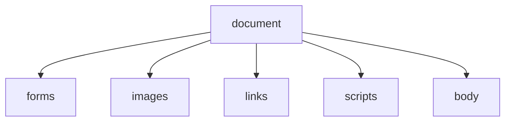
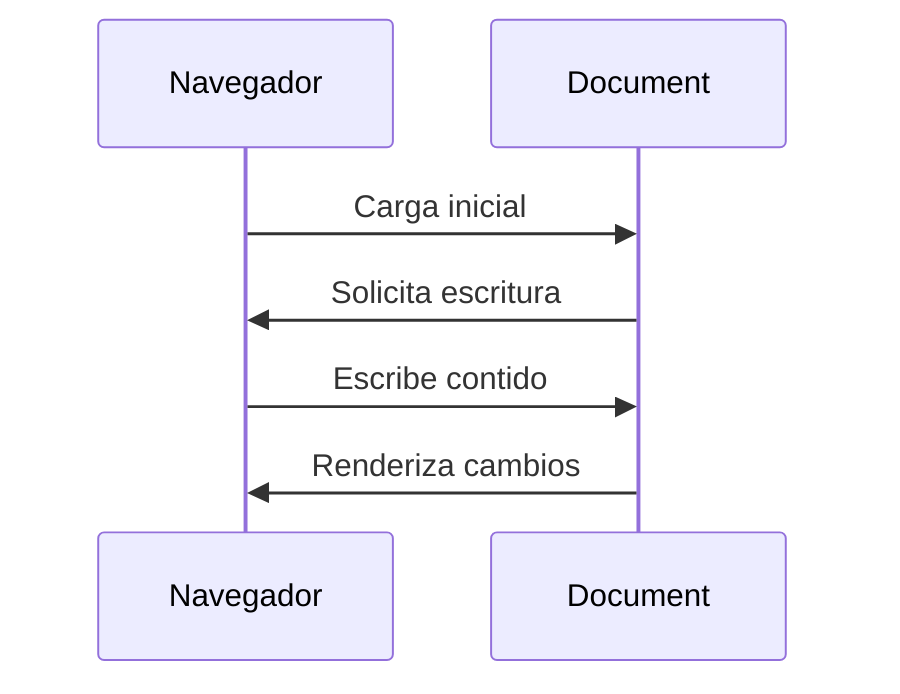

# {{ $frontmatter.title }}

## **1. Propiedades do Obxecto `document`**

### **1.1. Propiedades Básicas**

```javascript
// Acceso a elementos básicos
console.log(document.title);    // Título da páxina
console.log(document.URL);     // URL completa
console.log(document.charset); // Codificación de caracteres
console.log(document.body);    // Referencia ao elemento <body>
```

### **1.2. Coleccións de Elementos**

```javascript
// Coleccións importantes
document.forms    // Todos os formularios
document.images   // Todas as imaxes
document.links    // Todos os enlaces
document.scripts  // Todos os scripts
```

**Diagrama de relación (Mermaid):**


## **2. Exemplos de Propiedades**

### **2.1. Propiedades de Estilo**

```javascript
// Modificar cor de fondo
document.body.style.backgroundColor = "#f0f0f0";

// Cambiar cor de todos os enlaces
Array.from(document.links).forEach(link => {
    link.style.color = "blue";
});
```

### **2.2. Propiedades de Contido**

```javascript
// Obter HTML completo
let htmlCompleto = document.documentElement.outerHTML;

// Obter texto sen etiquetas
let textoSolo = document.body.textContent;
```

## **3. Métodos Principais de `document`**

### **3.1. Selección de Elementos**

```javascript
// Por ID
let cabezallo = document.getElementById("header");

// Por clase
let elementos = document.getElementsByClassName("destacado");

// Por selector CSS
let primeiroParrafo = document.querySelector("p");
let todosParrafos = document.querySelectorAll("p");
```

### **3.2. Creación de Elementos**

```javascript
// Crear novo elemento
let divNovo = document.createElement("div");
divNovo.textContent = "Novo contido";

// Engadir ao documento
document.body.appendChild(divNovo);
```

## **4. Fluxo de Escritura do Documento**

### **4.1. Método `document.write()`**

```javascript
// Escritura básica (só durante carga)
document.write("<h1>Benvido</h1>");

// Escritura condicional
if (novoUsuario) {
    document.write("<p>Benvido por primeira vez!</p>");
}
```

**⚠ Advertencia:**  
`document.write()` sobrescribe todo o documento se se usa despois da carga.

### **4.2. Fluxo de Escritura (Mermaid)**



## **5. Métodos `open()` e `close()`**

### **5.1. `document.open()`**

```javascript
// Abre o documento para escritura
document.open();
document.write("<html><body><h1>Novo documento</h1></body></html>");
document.close();
```

### **5.2. `document.close()`**

```javascript
// Exemplo completo
document.open();
document.write("<h1>Título</h1>");
document.write("<p>Parrafo de contido</p>");
document.close(); // Importante para finalizar
```

**Pseudocódigo do fluxo:**
```
ABRIR documento
ESCRIBIR "<html>"
ESCRIBIR contido dinámico
ESCRIBIR "</html>"
CERRAR documento
```

## **6. Exemplo Práctico Integrado**

**Xerador dinámico de contido:**
```javascript
function xerarInforme(usuarios) {
    // Abrir fluxo de escritura
    let novaVentana = window.open("", "_blank");
    novaVentana.document.open();
    
    // Escribir cabeceira
    novaVentana.document.write(`
        <!DOCTYPE html>
        <html>
        <head>
            <title>Informe de Usuarios</title>
            <style>
                table { border-collapse: collapse; width: 100%; }
                th, td { border: 1px solid #ddd; padding: 8px; }
                tr:nth-child(even) { background-color: #f2f2f2; }
            </style>
        </head>
        <body>
            <h1>Informe de Usuarios</h1>
            <table>
                <tr>
                    <th>ID</th>
                    <th>Nome</th>
                    <th>Email</th>
                </tr>
    `);
    
    // Escribir datos
    usuarios.forEach(usuario => {
        novaVentana.document.write(`
            <tr>
                <td>${usuario.id}</td>
                <td>${usuario.nome}</td>
                <td>${usuario.email}</td>
            </tr>
        `);
    });
    
    // Pechar documento
    novaVentana.document.write(`
            </table>
            <p>Xerado o ${new Date().toLocaleString()}</p>
        </body>
        </html>
    `);
    novaVentana.document.close();
}

// Uso
let usuarios = [
    {id: 1, nome: "Ana", email: "ana@exemplo.com"},
    {id: 2, nome: "Luis", email: "luis@exemplo.com"}
];
xerarInforme(usuarios);
```

## **7. Boas Prácticas**

1. **Evitar `document.write`** en código moderno (usar manipulación DOM)
2. **Sempre pechar** o documento despois de `open()`
3. **Usar `querySelector`** para seleccións complexas
4. **Separar estrutura, estilo e comportamento**

## **Conclusión Didáctica**

✅ **`document`** é a interface principal co DOM  
✅ **Propiedades** acceden a elementos e metadatos  
✅ **Métodos** permiten seleccionar e crear elementos  
✅ **Fluxo de escritura** require `open()`/`close()`  

**Exercicio práctico:**  
Crear un script que:  
1. Xere unha táboa con 5 produtos (nome, prezo, stock)  
2. Use `document.open()`/`write()`/`close()`  
3. Inclúa estilo CSS interno  
4. Mostre a data de xeración no pé  

```javascript
function xerarTaboaProdutos() {
    let produtos = [
        {nome: "Portátil", prezo: 899, stock: 15},
        {nome: "Móbil", prezo: 599, stock: 8},
        {nome: "Tablet", prezo: 299, stock: 12}
    ];
    
    let informe = window.open("", "_blank");
    informe.document.open();
    
    informe.document.write(`
        <!DOCTYPE html>
        <html>
        <head>
            <title>Listaxe de Produtos</title>
            <style>
                body { font-family: Arial, sans-serif; margin: 20px; }
                h1 { color: #333; }
                table { width: 80%; margin: 20px 0; border-collapse: collapse; }
                th { background-color: #4CAF50; color: white; }
                td, th { border: 1px solid #ddd; padding: 8px; text-align: left; }
                tr:nth-child(even) { background-color: #f2f2f2; }
                .baixo-stock { color: red; font-weight: bold; }
            </style>
        </head>
        <body>
            <h1>Listaxe de Produtos</h1>
            <table>
                <tr>
                    <th>Produto</th>
                    <th>Prezo</th>
                    <th>Stock</th>
                </tr>
    `);
    
    produtos.forEach(prod => {
        let claseStock = prod.stock < 10 ? 'class="baixo-stock"' : '';
        informe.document.write(`
            <tr>
                <td>${prod.nome}</td>
                <td>${prod.prezo}€</td>
                <td ${claseStock}>${prod.stock}</td>
            </tr>
        `);
    });
    
    informe.document.write(`
            </table>
            <p>Xerado o ${new Date().toLocaleDateString()}</p>
        </body>
        </html>
    `);
    
    informe.document.close();
}

// Chamar á función
xerarTaboaProdutos();
```