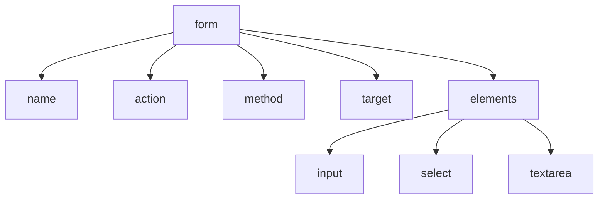

# {{ $frontmatter.title }}

## **1. Propiedades Principais do Obxecto Form**

### **1.1. Propiedades Básicas**

| Propiedade | Descrición                            | Exemplo                               |
| ---------- | ------------------------------------- | ------------------------------------- |
| **name**   | Nome do formulario                    | `formulario.name = "login"`           |
| **action** | URL onde se envía o formulario        | `formulario.action = "/procesar.php"` |
| **method** | Método HTTP (GET/POST)                | `formulario.method = "POST"`          |
| **target** | Onde abrir a resposta (_blank, _self) | `formulario.target = "_blank"`        |

**Exemplo de acceso:**
```javascript
let formulario = document.forms["meuFormulario"];
console.log("Nome do formulario:", formulario.name);
console.log("Acción:", formulario.action);
```

### **1.2. Propiedades de Elementos**

```javascript
// Acceso a elementos do formulario
let elementos = formulario.elements;
let campoUsuario = formulario.elements.usuario; // Por name
```

**Diagrama de relación (Mermaid):**


## **2. Métodos do Obxecto Form**

### **2.1. Métodos Principais**

| Método       | Descrición            | Exemplo               |
| ------------ | --------------------- | --------------------- |
| **submit()** | Envía o formulario    | `formulario.submit()` |
| **reset()**  | Restablece os valores | `formulario.reset()`  |

**Exemplo práctico:**
```javascript
// Envío programático
document.getElementById("btnEnviar").addEventListener("click", function() {
    formulario.submit();
});

// Reset programático
document.getElementById("btnLimpar").addEventListener("click", function() {
    formulario.reset();
});
```

### **2.2. Envío con Fetch (Alternativa Moderna)**

```javascript
formulario.addEventListener("submit", function(e) {
    e.preventDefault(); // Evita o envío tradicional
    
    fetch(formulario.action, {
        method: formulario.method,
        body: new FormData(formulario)
    })
    .then(response => response.json())
    .then(data => console.log("Respuesta:", data));
});
```

## **3. Traballando con Elementos de Formulario**

### **3.1. Acceso e Modificación**

```javascript
// Obter valor
let email = formulario.elements.email.value;

// Modificar valor
formulario.elements.newsletter.checked = true;

// Desactivar campo
formulario.elements.boton.disabled = true;
```

### **3.2. Validación de Campos**

```javascript
function validarForm() {
    let usuario = formulario.elements.usuario.value;
    if (usuario.length < 3) {
        alert("O nome de usuario debe ter polo menos 3 caracteres");
        return false;
    }
    return true;
}

formulario.onsubmit = validarForm;
```

## **4. Exemplo Práctico Integrado**

**Formulario de Contacto Completo:**
```html
<form id="formContacto" name="contacto" action="/enviar.php" method="POST">
    <input type="text" name="nome" placeholder="Nome completo">
    <input type="email" name="email" placeholder="Email">
    <textarea name="mensaxe" placeholder="A túa mensaxe"></textarea>
    <button type="submit">Enviar</button>
    <button type="button" id="btnPreview">Vista previa</button>
</form>

<script>
    const formulario = document.forms.contacto;

    // Vista previa
    document.getElementById("btnPreview").addEventListener("click", function() {
        alert(`Vista previa:\nNome: ${formulario.elements.nome.value}\nEmail: ${formulario.elements.email.value}\nMensaxe: ${formulario.elements.mensaxe.value}`);
    });

    // Envío con validación
    formulario.addEventListener("submit", function(e) {
        e.preventDefault();
        
        if (!formulario.elements.nome.value) {
            alert("Debe introducir un nome");
            return;
        }

        if (!formulario.elements.email.value.includes("@")) {
            alert("Email non válido");
            return;
        }

        // Envío tradicional
        this.submit();
    });
</script>
```

**Pseudocódigo:**
```
OBTER referencia ao formulario "contacto"

CANDO se faga clic en "btnPreview":
    MOSTRAR alerta con valores dos campos

CANDO se envíe o formulario:
    IMPEDIR envío por defecto
    
    SE nome está baleiro ENTÓN
        MOSTRAR erro
        TERMINAR
    FIN SE
    
    SE email non contén "@" ENTÓN
        MOSTRAR erro
        TERMINAR
    FIN SE
    
    ENVIAR formulario
FIN CANDO
```

## **5. Boas Prácticas con Formularios**

1. **Sempre validar no cliente e no servidor**
2. **Usar `preventDefault()` para envíos AJAX**
3. **Proporcionar feedback visual** ao usuario
4. **Usar `FormData`** para envíos modernos
5. **Considerar accesibilidade** (etiquetas `label`, ARIA)

## **6. Diferenzas entre GET e POST**

| Característica   | GET                        | POST                  |
| ---------------- | -------------------------- | --------------------- |
| **Visibilidade** | Datos na URL               | Datos no corpo        |
| **Seguridade**   | Menos seguro               | Máis seguro           |
| **Tamaño**       | Limitado por lonxitude URL | Sen límite práctico   |
| **Cacheable**    | Si                         | Non                   |
| **Usos típicos** | Buscas, filtros            | Login, envío de datos |

**Exemplo de configuración:**
```javascript
// Cambiar a POST para datos sensibles
formulario.method = "POST";

// Configurar enctype para arquivos
formulario.enctype = "multipart/form-data";
```

## **Conclusión Didáctica**

✅ **Propiedades básicas** (`name`, `action`, `method`, `target`)  
✅ **Métodos esenciais** (`submit`, `reset`)  
✅ **Acceso a elementos** a través da colección `elements`  
✅ **Validación cliente** para mellor UX  

**Exercicio práctico:**  
Crear un formulario de rexistro que:  
1. Valide nome (mínimo 3 caracteres)  
2. Valide email (formato correcto)  
3. Valide contrasinal (mínimo 8 caracteres)  
4. Mostre erros específicos  
5. Envíe datos via Fetch se é válido  

```javascript
// Solución
document.forms.registro.addEventListener("submit", function(e) {
    e.preventDefault();
    
    let errores = [];
    let elementos = this.elements;

    // Validacións
    if (elementos.nome.value.length < 3) {
        errores.push("O nome debe ter mínimo 3 caracteres");
    }

    if (!elementos.email.value.includes("@") || !elementos.email.value.includes(".")) {
        errores.push("Introduce un email válido");
    }

    if (elementos.contrasinal.value.length < 8) {
        errores.push("A contrasinal debe ter mínimo 8 caracteres");
    }

    // Mostrar erros ou enviar
    if (errores.length > 0) {
        alert("Erros:\n" + errores.join("\n"));
    } else {
        fetch(this.action, {
            method: this.method,
            body: new FormData(this)
        })
        .then(response => {
            if (response.ok) {
                alert("Rexistro exitoso!");
                this.reset();
            }
        });
    }
});
```