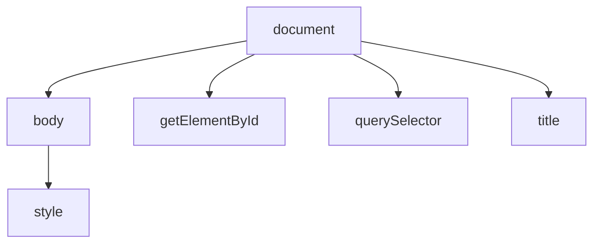
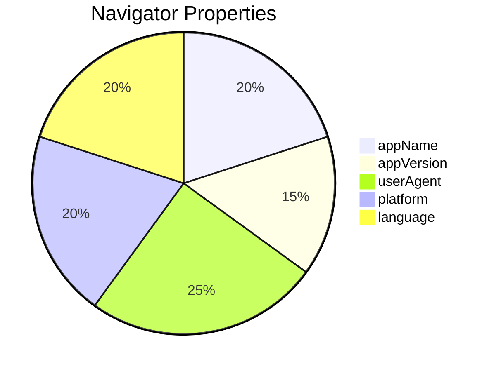

# {{ $frontmatter.title }}

## **1. Obxecto `document`**

### **1.1. Propiedades e Métodos Principais**

#### **Manipulación básica do contido**
```javascript
// Escribir texto no documento
document.write("<h1>Benvido á miña páxina</h1>");

// Cambiar cor de fonte
document.body.style.color = "blue";

// Cambiar cor de fondo
document.body.style.backgroundColor = "#f0f0f0";

// Obter título da páxina e modificalo
let tituloActual = document.title;
document.title = "Novo título - " + tituloActual;
```

#### **Selección de elementos**
```javascript
// Obter elementos por ID
let cabezallo = document.getElementById("header");

// Obter elementos por clase
let elementosDestacados = document.getElementsByClassName("destacado");

// Obter elementos por selector CSS (moderno)
let primeiroParrafo = document.querySelector("p");
let todosParrafos = document.querySelectorAll("p");
```

**Diagrama de relación (Mermaid):**


## **2. Obxecto `window`**

### **2.1. Método `open()`**
```javascript
// Abrir nova ventana
let novaVentana = window.open(
    "https://exemplo.com", 
    "_blank", 
    "width=600,height=400"
);

// Pechar a ventana despois de 5 segundos
setTimeout(() => {
    novaVentana.close();
}, 5000);
```

**Pseudocódigo:**
```
ABRIR nova ventana con URL "https://exemplo.com"
CONFIGURAR tamaño 600x400
ESPERAR 5 segundos
CERRAR ventana
```

## **3. Obxecto `history`**

### **3.1. Método `go()`**
```javascript
// Navegar atrás 2 páxinas
history.go(-2);

// Navegar adiante 1 páxina
history.go(1);

// Recargar a páxina actual (equivalente a F5)
history.go(0);
```

**Exemplo práctico:**
```html
<button onclick="history.go(-1)">Volver</button>
```

## **4. Obxecto `location`**

### **4.1. Propiedades do servidor**
```javascript
console.log("Hostname:", location.hostname); // dominio.com
console.log("Porto:", location.port);       // 8080
console.log("Protocolo:", location.protocol); // http: ou https:
console.log("Ruta completa:", location.href); // URL completa
```

### **4.2. Métodos útiles**
```javascript
// Redireccionar a outra páxina
location.assign("https://novo-sitio.com");

// Recargar a páxina forzando o cache
location.reload(true);
```

## **5. Obxecto `navigator`**

### **5.1. Información do navegador**
```javascript
// Propiedades principais
console.log("Nome do navegador:", navigator.appName);
console.log("Versión:", navigator.appVersion);
console.log("User Agent:", navigator.userAgent);
console.log("Idioma:", navigator.language);
console.log("En liña?", navigator.onLine ? "Si" : "Non");
```

### **5.2. Detalles de plataforma**
```javascript
// Detalles do sistema
console.log("Plataforma:", navigator.platform);
console.log("Cookies activadas?", navigator.cookieEnabled ? "Si" : "Non");

// Capacidades
console.log("Xeolocalización dispoñible?", "geolocation" in navigator);
```

**Diagrama de navegador (Mermaid):**


## **6. Exemplo Práctico Integrado**

**Analizador de Navegador e Páxina:**
```javascript
function analizarSistema() {
    // Recoller datos
    let datos = {
        pagina: {
            titulo: document.title,
            url: location.href,
            protocolo: location.protocol
        },
        navegador: {
            nome: navigator.appName,
            version: navigator.appVersion,
            userAgent: navigator.userAgent,
            idioma: navigator.language,
            cookies: navigator.cookieEnabled ? "Activadas" : "Desactivadas"
        },
        sistema: {
            plataforma: navigator.platform,
            memoria: navigator.deviceMemory || "Descoñecida",
            conexion: navigator.onLine ? "En liña" : "Sen conexión"
        }
    };

    // Mostrar resultados
    let resultado = document.getElementById("resultado");
    resultado.innerHTML = `
        <h2>Información do Sistema</h2>
        <h3>Páxina</h3>
        <p><strong>Título:</strong> ${datos.pagina.titulo}</p>
        <p><strong>URL:</strong> ${datos.pagina.url}</p>
        
        <h3>Navegador</h3>
        <p><strong>Nome:</strong> ${datos.navegador.nome}</p>
        <p><strong>User Agent:</strong> ${datos.navegador.userAgent}</p>
        
        <h3>Sistema</h3>
        <p><strong>Plataforma:</strong> ${datos.sistema.plataforma}</p>
        <p><strong>Conexión:</strong> ${datos.sistema.conexion}</p>
    `;

    // Enviar datos a servidor (opcional)
    fetch('/analytics', {
        method: 'POST',
        body: JSON.stringify(datos)
    });
}

// Executar ao cargar a páxina
window.onload = analizarSistema;
```

**Pseudocódigo:**
```
FUNCIÓN analizarSistema
    RECOLLER:
        datos_páxina: título, URL, protocolo
        datos_navegador: nome, versión, userAgent
        datos_sistema: plataforma, memoria, conexión
    
    MOSTRAR datos en elemento "resultado"
    ENVIAR datos a servidor (opcional)
FIN FUNCIÓN

EXECUTAR analizarSistema AO CARGAR a páxina
```

## **7. Boas Prácticas**

1. **Validar sempre** a dispoñibilidade de APIs antes de usalas
2. **Usar `document.querySelector`** no canto de métodos antigos
3. **Minimizar o uso de `document.write`** (pode sobrescribir todo o documento)
4. **Respetar a privacidade** ao acceder a información do navegador

## **Conclusión Didáctica**

✅ **`document`** para manipulación do contido da páxina  
✅ **`window`** para xestionar ventanas e marcos  
✅ **`history`** para navegación programática  
✅ **`location`** para obter información da URL  
✅ **`navigator`** para detalles do navegador e sistema  

**Exercicio práctico:**  
Crear unha páxina que:  
1. Mostre unha táboa coa información do navegador  
2. Inclúa un botón para abrir unha nova ventana pequena  
3. Teña outro botón para recargar a páxina  
4. Mostre o tempo desde a carga da páxina  

```javascript
// Solución
let tempoInicio = new Date();

function mostrarInfo() {
    let tempoActual = new Date();
    let segundos = Math.floor((tempoActual - tempoInicio) / 1000);
    
    document.getElementById("info").innerHTML = `
        <table border="1">
            <tr><th>Propiedade</th><th>Valor</th></tr>
            <tr><td>Navegador</td><td>${navigator.appName}</td></tr>
            <tr><td>Versión</td><td>${navigator.appVersion}</td></tr>
            <tr><td>Plataforma</td><td>${navigator.platform}</td></tr>
            <tr><td>Tempo carga</td><td>${segundos} segundos</td></tr>
        </table>
    `;
}

document.getElementById("abrirVentana").onclick = function() {
    window.open("", "_blank", "width=300,height=200");
};

document.getElementById("recargar").onclick = function() {
    location.reload();
};

// Actualizar cada segundo
setInterval(mostrarInfo, 1000);
mostrarInfo(); // Chamada inicial
```