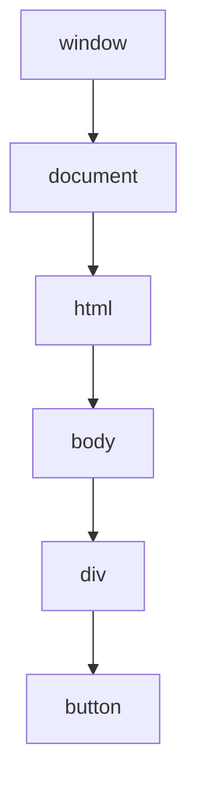

# {{ $frontmatter.title }}

## **1. Definición de Eventos**

### **1.1. Concepto Básico**
Un **evento** é unha acción ou ocorrencia que acontece no navegador e que pode ser detectada e manexada polo código JavaScript.

**Exemplos comúns:**
- Clics do rato (`click`)
- Pulsacións de teclas (`keydown`, `keyup`)
- Carga da páxina (`load`)
- Envío de formularios (`submit`)

```javascript
// Exemplo básico de evento
document.getElementById("meuBoton").addEventListener("click", function() {
    alert("Botón pulsado!");
});
```

## **2. Accións Asociadas a Eventos**

### **2.1. Tipos de Manexadores**
1. **Manexadores inline (HTML):**
   ```html
   <button onclick="alert('Clic recibido')">Púlsame</button>
   ```

2. **Propiedades do DOM:**
   ```javascript
   document.getElementById("meuBoton").onclick = function() {
       console.log("Manexador tradicional");
   };
   ```

3. **`addEventListener` (recomendado):**
   ```javascript
   elemento.addEventListener("click", manexadorClic);
   function manexadorClic() {
       console.log("Manexador moderno");
   }
   ```

### **2.2. Obxecto Event**
Todos os manexadores reciben un obxecto `event` con información sobre o ocorrido:

```javascript
document.addEventListener("click", function(evento) {
    console.log("Posición X:", evento.clientX);
    console.log("Posición Y:", evento.clientY);
    console.log("Elemento clicado:", evento.target);
});
```

**Propiedades importantes:**
- `target`: Elemento que orixinou o evento
- `type`: Tipo de evento ("click", "keydown", etc.)
- `preventDefault()`: Cancela o comportamento por defecto

## **3. Xerarquía de Eventos**

### **3.1. Fluxo de Eventos (Bubbling e Capturing)**


1. **Fase de Capturing** (de window ao elemento)
2. **Fase no Target** (no elemento)
3. **Fase de Bubbling** (do elemento a window)

**Exemplo práctico:**
```javascript
// Capturing (terceiro parámetro true)
document.querySelector("div").addEventListener("click", function() {
    console.log("Capturing: div");
}, true);

// Bubbling (por defecto)
document.querySelector("button").addEventListener("click", function() {
    console.log("Bubbling: button");
});
```

### **3.2. Eventos Comúns na Xerarquía**

| Obxecto       | Eventos Importantes            |
| ------------- | ------------------------------ |
| **window**    | `load`, `resize`, `scroll`     |
| **document**  | `DOMContentLoaded`, `keydown`  |
| **elementos** | `click`, `mouseover`, `submit` |

## **4. Exemplo Práctico Integrado**

**Xestor de Eventos Completo:**
```html
<!DOCTYPE html>
<html>
<body>
    <div id="contedor">
        <button id="boton">Proba eventos</button>
    </div>
    
    <script>
        // 1. Evento de carga da páxina
        window.addEventListener("load", function() {
            console.log("Páxina completamente cargada");
        });

        // 2. Evento de clic con bubbling
        document.getElementById("boton").addEventListener("click", function(e) {
            console.log("Clic no botón");
            e.stopPropagation(); // Evita bubbling
        });

        // 3. Evento de bubbling no contedor
        document.getElementById("contedor").addEventListener("click", function() {
            console.log("Clic no contedor (non se executará se stopPropagation)");
        });

        // 4. Evento de teclado
        document.addEventListener("keydown", function(e) {
            console.log(`Tecla presionada: ${e.key}`);
        });

        // 5. Evento de movemento do rato
        document.addEventListener("mousemove", function(e) {
            console.log(`Rato en: (${e.clientX}, ${e.clientY})`);
        });
    </script>
</body>
</html>
```

**Pseudocódigo:**
```
CANDO a páxina cargue COMPLETAMENTE:
    ESCRIBIR "Páxina cargada"

CANDO se faga CLIC no botón:
    ESCRIBIR "Clic no botón"
    DETENER a propagación do evento

CANDO se faga CLIC no contedor:
    ESCRIBIR "Clic no contedor" (non se executará co stopPropagation)

CANDO se PRESIONE unha tecla:
    ESCRIBIR "Tecla presionada: " + tecla

CANDO se MOVA o rato:
    ESCRIBIR "Posición do rato: (X, Y)"
```

## **5. Boas Prácticas con Eventos**

1. **Usar `addEventListener`** no canto de manexadores inline
2. **Separar a lóxica** do manexador en funcións independentes
3. **Considerar o desempeño** en eventos frecuentes (scroll, mousemove)
4. **Limpar eventos** cando non sexan necesarios:
   ```javascript
   // Eliminar manexador
   elemento.removeEventListener("click", manexador);
   ```

## **6. Eventos Personalizados**

### **6.1. Creación e Disparo**
```javascript
// Crear evento personalizado
let eventoPersonalizado = new CustomEvent("meuEvento", {
    detail: { mensaxe: "Datos personalizados" }
});

// Disparar evento
document.dispatchEvent(eventoPersonalizado);

// Escoitar evento
document.addEventListener("meuEvento", function(e) {
    console.log("Evento personalizado:", e.detail.mensaxe);
});
```

## **Conclusión Didáctica**

✅ **Eventos** permiten interactividade nas páxinas web  
✅ **Tres fases** (capturing, target, bubbling) definen o fluxo  
✅ **`addEventListener`** é o método máis flexible e recomendado  
✅ **Obxecto Event** contén información crucial sobre o ocorrido  

**Exercicio práctico:**  
Crear un xogo simple onde:  
1. O usuario teña que pulsar teclas específicas (WASD)  
2. Mostrar unha alerta cando se complete a secuencia correcta  
3. Rastrexar o movemento do rato para mover un elemento  

```javascript
// Solución
let secuencia = ["w", "a", "s", "d"];
let progreso = 0;

document.addEventListener("keydown", function(e) {
    if (e.key.toLowerCase() === secuencia[progreso]) {
        progreso++;
        if (progreso === secuencia.length) {
            alert("Secuencia correcta!");
            progreso = 0;
        }
    } else {
        progreso = 0;
    }
});

let elemento = document.getElementById("xogo");
document.addEventListener("mousemove", function(e) {
    elemento.style.left = e.clientX + "px";
    elemento.style.top = e.clientY + "px";
});
```