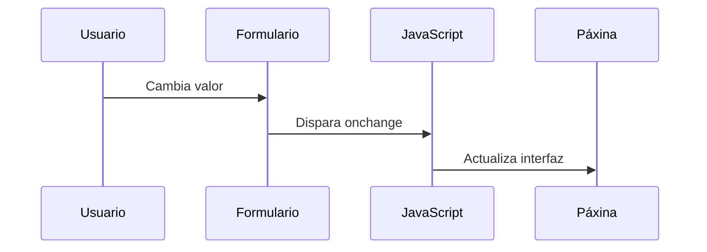
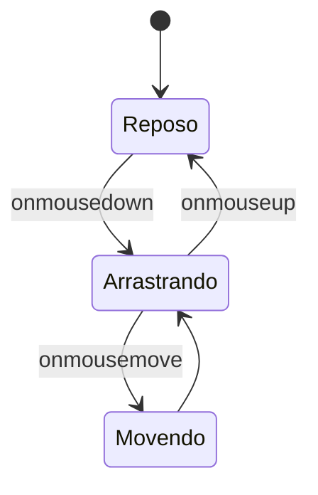

# {{ $frontmatter.title }}

## **1. Eventos en Elementos de Formulario**

### **1.1. Evento `onselect`**
Ocorre cando o usuario selecciona texto nun campo de texto.

**Exemplo práctico:**
```html
<input type="text" onselect="mostrarSeleccion()" value="Proba a seleccionar este texto">

<script>
function mostrarSeleccion() {
    console.log("Texto seleccionado!");
    // Obter texto seleccionado
    let input = document.querySelector("input");
    let texto = input.value.substring(input.selectionStart, input.selectionEnd);
    console.log("Seleccionado:", texto);
}
</script>
```

**Pseudocódigo:**
```
CANDO se SELECCIONE texto nun campo:
    OBTENER texto seleccionado
    MOSTRAR texto seleccionado
```

### **1.2. Evento `onchange`**
Actívase cando cambia o valor dun elemento e se perde o foco.

**Exemplo con `<select>`:**
```html
<select onchange="mostrarOpcion(this)">
    <option value="gal">Galego</option>
    <option value="es">Castelán</option>
    <option value="en">Inglés</option>
</select>

<script>
function mostrarOpcion(select) {
    alert("Idioma seleccionado: " + select.options[select.selectedIndex].text);
}
</script>
```

**Diagrama de fluxo (Mermaid):**


## **2. Eventos de Ratón**

### **2.1. `onmousedown` e `onmouseup`**
```html
<div id="area" 
     onmousedown="console.log('Botón pulsado')" 
     onmouseup="console.log('Botón soltado')">
    Pulsa aquí
</div>
```

**Comportamento:**
1. `onmousedown`: Ao premer calquera botón do rato
2. `onmouseup`: Ao soltar o botón

### **2.2. `onmousemove`**
```javascript
document.addEventListener("mousemove", function(e) {
    document.getElementById("coordenadas").textContent = 
        `X: ${e.clientX}, Y: ${e.clientY}`;
});
```

### **2.3. `onmouseover` e `onmouseout`**
```html

```

**Diferenzas clave:**
- `mouseover`: Entra no elemento ou nos seus fillos
- `mouseenter`: Só ao entrar no propio elemento

## **3. Eventos de Teclado**

### **3.1. Ciclo completo de pulsación**
```javascript
let input = document.querySelector("input");

input.onkeydown = function(e) {
    console.log("Tecla presionada:", e.key);
};

input.onkeypress = function(e) {
    console.log("Tecla mantida:", e.key);
};

input.onkeyup = function(e) {
    console.log("Tecla soltada:", e.key);
};
```

**Orde de execución:**
1. `keydown`
2. `keypress` (repítese mentres se mantén)
3. `keyup`

### **3.2. Exemplo práctico: Contador de caracteres**
```html
<textarea onkeyup="actualizarContador(this)"></textarea>
<span id="contador">0/100</span>

<script>
function actualizarContador(textarea) {
    let contador = document.getElementById("contador");
    contador.textContent = `${textarea.value.length}/100`;
    
    if (textarea.value.length > 100) {
        contador.style.color = "red";
    } else {
        contador.style.color = "black";
    }
}
</script>
```

## **4. Exemplo Integrado Completo**

**Xogo de arrastrar e soltar:**
```html
<div id="obxecto" 
     style="width:100px; height:100px; background:blue; position:absolute;"
     onmousedown="iniciarArrastre(event)"
     onmouseup="terminarArrastre()">
</div>

<script>
let arrastrando = false;
let offsetX, offsetY;

function iniciarArrastre(e) {
    arrastrando = true;
    let obxecto = e.target;
    offsetX = e.clientX - obxecto.offsetLeft;
    offsetY = e.clientY - obxecto.offsetTop;
    
    document.addEventListener("mousemove", moverObxecto);
}

function moverObxecto(e) {
    if (arrastrando) {
        let obxecto = document.getElementById("obxecto");
        obxecto.style.left = (e.clientX - offsetX) + "px";
        obxecto.style.top = (e.clientY - offsetY) + "px";
    }
}

function terminarArrastre() {
    arrastrando = false;
    document.removeEventListener("mousemove", moverObxecto);
}
</script>
```

**Diagrama de estados (Mermaid):**


## **5. Boas Prácticas**

1. **Usar `addEventListener`** no canto de atributos HTML
2. **Debounce para eventos frecuentes** como `mousemove` ou `scroll`
   ```javascript
   function debounce(func, wait) {
       let timeout;
       return function() {
           clearTimeout(timeout);
           timeout = setTimeout(func, wait);
       };
   }
   ```
3. **Considerar accesibilidade** (teclado como alternativa a rato)
4. **Limpar manexadores** cando non sexan necesarios

## **Conclusión Didáctica**

✅ **Eventos de formulario** para interacción avanzada  
✅ **Eventos de ratón** permiten arrastrar, hover e clicks  
✅ **Eventos de teclado** para accesibilidade e atallos  
✅ **Combinación de eventos** para experiencias ricas  

**Exercicio práctico:**  
Crear un editor de texto simple que:  
1. Mostre estatísticas en tempo real (caracteres, palabras)  
2. Cambie de cor cando se pase o rato por riba  
3. Permita gardar co atallo Ctrl+S  
4. Mostre coordenadas do rato mentres se escribe  

```javascript
// Solución
const editor = document.getElementById("editor");
const stats = document.getElementById("stats");

// Estatísticas en tempo real
editor.addEventListener("input", function() {
    let texto = this.value;
    stats.innerHTML = `
        Caracteres: ${texto.length} | 
        Palabras: ${texto.trim() ? texto.trim().split(/\s+/).length : 0}
    `;
});

// Efecto hover
editor.addEventListener("mouseenter", function() {
    this.style.backgroundColor = "#f5f5f5";
});
editor.addEventListener("mouseleave", function() {
    this.style.backgroundColor = "white";
});

// Atallo Ctrl+S
editor.addEventListener("keydown", function(e) {
    if (e.ctrlKey && e.key === "s") {
        e.preventDefault();
        alert("Contido gardado!");
    }
});

// Coordenadas do rato
document.addEventListener("mousemove", function(e) {
    document.getElementById("coordenadas").textContent = 
        `X: ${e.clientX}, Y: ${e.clientY}`;
});
```


---

DAW🧊2025