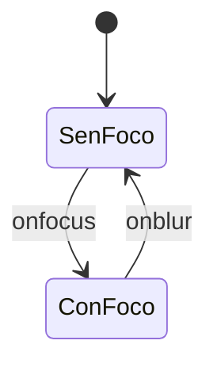
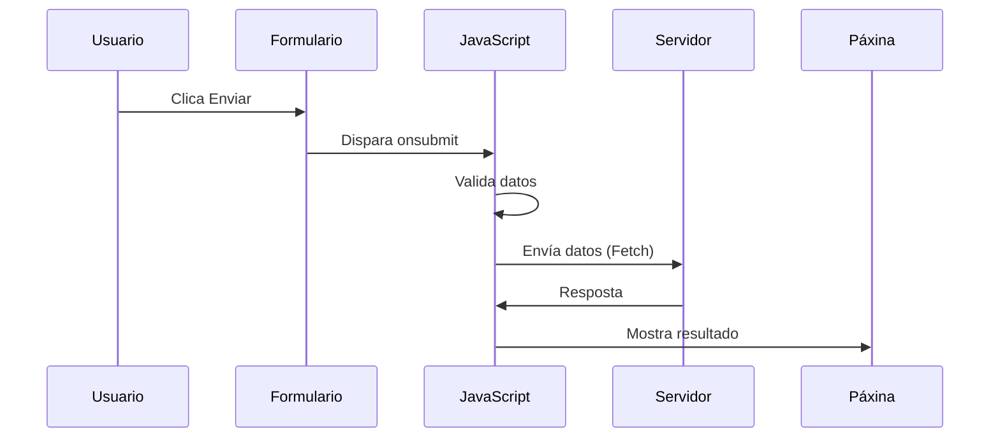

# {{ $frontmatter.title }}

## **1. Eventos de Enfoque**

### **1.1. Evento `onblur`**
Actívase cando un elemento perde o foco.

**Exemplo práctico de validación:**
```html
<input type="text" id="usuario" onblur="validarUsuario()" placeholder="Nome de usuario">

<script>
function validarUsuario() {
    let input = document.getElementById("usuario");
    if (input.value.length < 3) {
        input.style.borderColor = "red";
        alert("O nome de usuario debe ter polo menos 3 caracteres");
    } else {
        input.style.borderColor = "green";
    }
}
</script>
```

**Pseudocódigo:**
```
CANDO o campo USUARIO perda o foco:
    SE o valor ten menos de 3 caracteres ENTÓN
        MOSTRAR erro
    SENÓN
        MOSTRAR éxito
    FIN SE
```

### **1.2. Evento `onfocus`**
Actívase cando un elemento recibe o foco.

**Exemplo de mellora UX:**
```javascript
document.getElementById("busqueda").addEventListener("focus", function() {
    this.placeholder = "Escribe aquí para buscar...";
    this.style.backgroundColor = "#fff8e1";
});

document.getElementById("busqueda").addEventListener("blur", function() {
    this.placeholder = "Buscar...";
    this.style.backgroundColor = "white";
});
```

**Diagrama de estados (Mermaid):**


## **2. Eventos de Formulario**

### **2.1. Evento `onreset`**
Ocorre cando se restablece un formulario.

**Exemplo de confirmación:**
```html
<form id="meuForm" onreset="return confirmarReset()">
    <input type="text" name="nome">
    <button type="reset">Limpar</button>
</form>

<script>
function confirmarReset() {
    return confirm("¿Seguro que queres limpar todos os datos?");
}
</script>
```

### **2.2. Evento `onsubmit`**
Actívase ao enviar un formulario.

**Exemplo de validación avanzada:**
```javascript
document.getElementById("formLogin").addEventListener("submit", function(e) {
    e.preventDefault(); // Evitar envío tradicional
    
    let usuario = this.elements.usuario.value;
    let contrasinal = this.elements.contrasinal.value;
    
    if (!usuario || !contrasinal) {
        alert("Todos os campos son obrigatorios");
        return;
    }
    
    // Envío con Fetch API
    fetch("/login", {
        method: "POST",
        body: new FormData(this)
    })
    .then(response => response.json())
    .then(data => {
        if (data.exito) {
            window.location.href = "/dashboard";
        } else {
            alert("Erro: " + data.mensaxe);
        }
    });
});
```

**Fluxo de envío (Mermaid):**


## **3. Eventos da Xanela**

### **3.1. Evento `onresize`**
Actívase ao redimensionar a ventana.

**Exemplo de deseño adaptable:**
```javascript
window.addEventListener("resize", function() {
    console.log(`Nuevo tamaño: ${window.innerWidth}x${window.innerHeight}`);
    
    if (window.innerWidth < 768) {
        document.body.classList.add("modo-movil");
    } else {
        document.body.classList.remove("modo-movil");
    }
});
```

### **3.2. Evento `onmove`**
Actívase ao mover a ventana (non soportado en todos os navegadores).

**Alternativa compatible:**
```javascript
let posicionAnterior = { x: window.screenX, y: window.screenY };

setInterval(() => {
    if (window.screenX !== posicionAnterior.x || window.screenY !== posicionAnterior.y) {
        console.log(`Ventana movida a: ${window.screenX}, ${window.screenY}`);
        posicionAnterior = { x: window.screenX, y: window.screenY };
    }
}, 500);
```

## **4. Exemplo Integrado Completo**

**Sistema de rexistro con validacións:**
```html
<!DOCTYPE html>
<html>
<head>
    <style>
        .error { border-color: red; }
        .exito { border-color: green; }
        .aviso { color: orange; font-size: 0.8em; }
    </style>
</head>
<body>
    <form id="formRexistro">
        <input type="text" id="nome" placeholder="Nome completo" required>
        <span id="avisoNome" class="aviso"></span>
        
        <input type="email" id="email" placeholder="Email" required>
        <span id="avisoEmail" class="aviso"></span>
        
        <button type="submit">Rexistrarse</button>
        <button type="reset">Limpar</button>
    </form>

    <script>
        // Validación en tempo real
        document.getElementById("nome").addEventListener("blur", function() {
            let aviso = document.getElementById("avisoNome");
            if (this.value.length < 5) {
                this.classList.add("error");
                aviso.textContent = "O nome debe ter polo menos 5 caracteres";
            } else {
                this.classList.remove("error");
                this.classList.add("exito");
                aviso.textContent = "";
            }
        });

        // Validación de email
        document.getElementById("email").addEventListener("blur", function() {
            let aviso = document.getElementById("avisoEmail");
            if (!this.value.includes("@") || !this.value.includes(".")) {
                this.classList.add("error");
                aviso.textContent = "Introduce un email válido";
            } else {
                this.classList.remove("error");
                this.classList.add("exito");
                aviso.textContent = "";
            }
        });

        // Envío do formulario
        document.getElementById("formRexistro").addEventListener("submit", function(e) {
            e.preventDefault();
            
            let errores = document.querySelectorAll(".error");
            if (errores.length > 0) {
                alert("Corrixe os erros antes de enviar");
                return;
            }
            
            alert("Formulario válido! Enviando datos...");
            // Aquí iría o envío real aos servidor
        });

        // Reset personalizado
        document.getElementById("formRexistro").addEventListener("reset", function() {
            if (confirm("¿Seguro que queres limpar todos os campos?")) {
                document.querySelectorAll("input").forEach(input => {
                    input.classList.remove("error", "exito");
                });
                document.querySelectorAll(".aviso").forEach(aviso => {
                    aviso.textContent = "";
                });
            }
        });

        // Adaptación ao tamaño da ventana
        window.addEventListener("resize", function() {
            if (window.innerWidth < 600) {
                document.getElementById("formRexistro").style.padding = "10px";
            } else {
                document.getElementById("formRexistro").style.padding = "20px";
            }
        });
    </script>
</body>
</html>
```

**Pseudocódigo do sistema:**
```
CANDO o campo NOME perda o foco:
    SE nome < 5 caracteres ENTÓN
        MOSTRAR erro
    SENÓN
        MOSTRAR éxito
    FIN SE

CANDO o campo EMAIL perda o foco:
    SE email non válido ENTÓN
        MOSTRAR erro
    SENÓN
        MOSTRAR éxito
    FIN SE

CANDO se ENVÍE o formulario:
    SE hai erros ENTÓN
        PREVIR envío
    SENÓN
        ENVIAR datos
    FIN SE

CANDO se RESETEE o formulario:
    CONFIRMAR acción
    LIMPAR estilos e mensaxes

CANDO se REDIMENSIONE a ventana:
    AXUSTAR deseño segundo tamaño
```

## **5. Boas Prácticas**

1. **Validar tanto en cliente como en servidor** (a validación JS pode desactivarse)
2. **Usar `preventDefault()`** para controlar o comportamento dos eventos
3. **Optimizar os listeners de resize** con debounce:
   ```javascript
   function debounce(func, wait) {
       let timeout;
       return function() {
           clearTimeout(timeout);
           timeout = setTimeout(func, wait);
       };
   }
   
   window.addEventListener('resize', debounce(function() {
       console.log('Redimensionamento finalizado');
   }, 250));
   ```
4. **Considerar accesibilidade** nos eventos de teclado para usuarios que non usan rato

## **Conclusión Didáctica**

✅ **Eventos de enfoque** melloran a experiencia de usuario en formularios  
✅ **Validacións en tempo real** con `blur` e `focus`  
✅ **Control preciso** do envío e reset de formularios  
✅ **Deseño adaptable** con eventos de redimensión  

**Exercicio práctico:**  
Crear un editor de perfil que:  
1. Valide cada campo ao perder o foco  
2. Mostre previsualizacións en tempo real  
3. Garde automaticamente cada 30 segundos  
4. Adapte o layout ao tamaño da ventana  
5. Confirme antes de abandonar a páxina con cambios non gardados  

```javascript
// Solución básica
let cambiosPendientes = false;

// Validacións
document.querySelectorAll("input").forEach(input => {
    input.addEventListener("blur", function() {
        if (!this.value.trim()) {
            this.classList.add("error");
        } else {
            this.classList.remove("error");
            cambiosPendientes = true;
        }
    });
});

// Gardado automático
setInterval(() => {
    if (cambiosPendientes) {
        console.log("Gardando cambios...");
        cambiosPendientes = false;
    }
}, 30000);

// Confirmar antes de saír
window.addEventListener("beforeunload", function(e) {
    if (cambiosPendientes) {
        e.preventDefault();
        return e.returnValue = "Tes cambios sen gardar. ¿Seguro que queres saír?";
    }
});

// Adaptación ao tamaño
window.addEventListener("resize", function() {
    let editor = document.getElementById("editor-perfil");
    editor.style.flexDirection = window.innerWidth < 768 ? "column" : "row";
});
```