# {{ $frontmatter.title }}

## **1. Evento `onunload`**

### **1.1. Definición e Uso**
Ocorre cando o usuario está a piques de abandonar a páxina.

**Exemplo práctico:**
```javascript
window.onunload = function() {
    // Enviar datos de analítica antes de saír
    navigator.sendBeacon("/log-salida", "Usuario saíu da páxina");
};
```

**⚠ Precaucións:**
- Limitado no que se pode facer (non alertas sincrónicas)
- Usar `navigator.sendBeacon` para enviar datos ao servidor

**Pseudocódigo:**
```
CANDO o usuario VAIA SAIR da páxina:
    ENVIAR datos de analítica ao servidor
```

## **2. Evento `onload`**

### **2.1. Carga da Páxina**
```javascript
window.onload = function() {
    console.log("Páxina e recursos completamente cargados");
    document.getElementById("cargando").style.display = "none";
};
```

### **2.2. Carga de Imaxes**
```html

```

**Diagrama de carga (Mermaid):**


## **3. Evento `onclick`**

### **3.1. Uso Básico**
```javascript
document.getElementById("boton").onclick = function(e) {
    console.log("Clic en posición:", e.clientX, e.clientY);
    e.stopPropagation(); // Evitar bubbling
};
```

### **3.2. Diferenza con `addEventListener`**
```javascript
// Mellor práctica (permite múltiples listeners)
document.getElementById("boton").addEventListener("click", manexador1);
document.getElementById("boton").addEventListener("click", manexador2);
```

## **4. Evento `ondragdrop` (Obsoleto)**

### **4.1. Alternativa Moderna (Drag and Drop API)**
```html
<div id="zonaDrop" style="border: 2px dashed #ccc; padding: 20px;">
    Arrastra e solta arquivos aquí
</div>

<script>
    const zonaDrop = document.getElementById("zonaDrop");
    
    // Prevenir comportamentos por defecto
    ['dragenter', 'dragover', 'dragleave', 'drop'].forEach(evento => {
        zonaDrop.addEventListener(evento, prevenirDefault, false);
    });

    function prevenirDefault(e) {
        e.preventDefault();
        e.stopPropagation();
    }

    // Manexar soltado
    zonaDrop.addEventListener('drop', function(e) {
        const arquivos = e.dataTransfer.files;
        console.log("Arquivos soltados:", arquivos);
        // Procesar arquivos...
    });
</script>
```

## **5. Evento `onerror`**

### **5.1. En Imaxes**
```html

```

### **5.2. En Scripts**
```html
<script src="script-fallido.js" onerror="cargarScriptAlternativo()"></script>
```

**Fluxo de erro (Mermaid):**

```mermaid
graph TD
    A[Intento de carga] --> B{Éxito?}
    B -->|Si| C[Dispara onload]
    B -->|No| D[Dispara onerror]
```


## **6. Evento `onabort`**

### **6.1. En Imaxes**
```javascript
let img = new Image();
img.src = "imaxe-grande.jpg";
img.onabort = function() {
    console.log("Carga da imaxe cancelada");
};
img.onload = function() {
    document.body.appendChild(img);
};

// Para probar: img.abort()
```

### **6.2. En Peticións Fetch**
```javascript
const controller = new AbortController();
const signal = controller.signal;

fetch("grande.json", { signal })
    .then(response => response.json())
    .catch(err => {
        if (err.name === 'AbortError') {
            console.log("Petición cancelada");
        }
    });

// Cancelar despois de 5 segundos
setTimeout(() => controller.abort(), 5000);
```

## **7. Exemplo Integrado Completo**

**Xestor de Recursos con Manexo de Erros:**
```html
<!DOCTYPE html>
<html>
<head>
    <title>Xestor de Recursos</title>
    <style>
        .cargando { color: blue; }
        .erro { color: red; }
        .exito { color: green; }
    </style>
</head>
<body>
    <div id="estado">Preparado para cargar</div>
    <button id="cargar">Cargar Recursos</button>
    <button id="cancelar">Cancelar</button>
    <div id="galeria"></div>

    <script>
        let recursos = [
            "imaxe1.jpg",
            "imaxe2.jpg",
            "inexistente.jpg",
            "imaxe3.jpg"
        ];
        let cargando = false;

        document.getElementById("cargar").onclick = function() {
            if (cargando) return;
            
            cargando = true;
            document.getElementById("estado").textContent = "Cargando...";
            document.getElementById("estado").className = "cargando";
            
            recursos.forEach((src, index) => {
                let img = new Image();
                img.onload = function() {
                    this.style.height = "100px";
                    document.getElementById("galeria").appendChild(this);
                    actualizarEstado(`Imaxe ${index+1} cargada`, "exito");
                };
                img.onerror = function() {
                    actualizarEstado(`Erro cargando ${src}`, "erro");
                };
                img.onabort = function() {
                    actualizarEstado(`Carga de ${src} cancelada`, "erro");
                };
                img.src = src;
            });
        };

        document.getElementById("cancelar").onclick = function() {
            if (!cargando) return;
            
            // En un caso real aquí cancelaríase as cargas activas
            actualizarEstado("Carga cancelada polo usuario", "erro");
            cargando = false;
        };

        function actualizarEstado(mensaxe, clase) {
            let estado = document.getElementById("estado");
            estado.textContent = mensaxe;
            estado.className = clase;
        }

        // Confirmar antes de saír con cargas activas
        window.onbeforeunload = function() {
            if (cargando) {
                return "Hay cargas en progreso. ¿Seguro que queres saír?";
            }
        };
    </script>
</body>
</html>
```

**Pseudocódigo do xestor:**
```
VARIABLE cargando = falso

CANDO se faga CLIC en "Cargar":
    SE non cargando ENTÓN
        cargando = verdadeiro
        MOSTRAR "Cargando..."
        
        PARA cada recurso FACER
            CREAR nova Imaxe
            CONFIGURAR onload, onerror, onabort
            INICIAR carga
        FIN PARA
    FIN SE

CANDO se faga CLIC en "Cancelar":
    SE cargando ENTÓN
        MOSTRAR "Carga cancelada"
        cargando = falso
    FIN SE

CANDO se VAIA SAIR da páxina:
    SE cargando ENTÓN
        PREGUNTAR confirmación
    FIN SE
```

## **8. Boas Prácticas**

1. **Usar `addEventListener`** no canto de propiedades `on*` para múltiples listeners
2. **Sempre manexar erros** en cargas de recursos críticos
3. **Optimizar performance** evitando cargas innecesarias
4. **Considerar `onbeforeunload`** para evitar perda de datos
5. **Probar en múltiples navegadores** (soporte de eventos varía)

## **Conclusión Didáctica**

✅ **`onload`/`onerror`** para xestión de recursos  
✅ **`onunload`/`onbeforeunload`** para manexo de saída  
✅ **APIs modernas** como Drag and Drop para substituír obsoletos  
✅ **Manexo adecuado de erros** mellora a experiencia de usuario  

**Exercicio práctico:**  
Crear un cargador de imaxes que:  
1. Permita arrastrar e soltar arquivos  
2. Mostre previsualizacións das imaxes válidas  
3. Alerte sobre erros en arquivos non soportados  
4. Confirme antes de pechar cando hai cargas pendientes  
5. Inclúa un botón para cancelar todas as cargas  

```javascript
// Solución básica
const zonaDrop = document.getElementById("zonaDrop");
const galeria = document.getElementById("galeria");
let cargando = false;

// Configurar Drag and Drop
['dragenter', 'dragover', 'dragleave', 'drop'].forEach(evento => {
    zonaDrop.addEventListener(evento, prevenirDefault, false);
});

zonaDrop.addEventListener('drop', function(e) {
    const arquivos = e.dataTransfer.files;
    cargando = true;
    
    Array.from(arquivos).forEach(arquivo => {
        if (!arquivo.type.match('image.*')) {
            console.error("Arquivo non soportado:", arquivo.name);
            return;
        }
        
        const reader = new FileReader();
        reader.onload = function(e) {
            const img = document.createElement("img");
            img.src = e.target.result;
            img.style.height = "150px";
            galeria.appendChild(img);
        };
        reader.onerror = function() {
            console.error("Erro lendo arquivo:", arquivo.name);
        };
        reader.readAsDataURL(arquivo);
    });
    
    cargando = false;
});

window.addEventListener('beforeunload', function(e) {
    if (cargando) {
        e.preventDefault();
        return e.returnValue = "Tes imaxes cargándose. ¿Seguro que queres saír?";
    }
});
```


---

DAW🧊2026