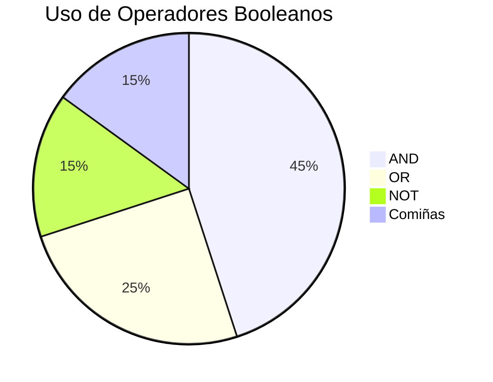
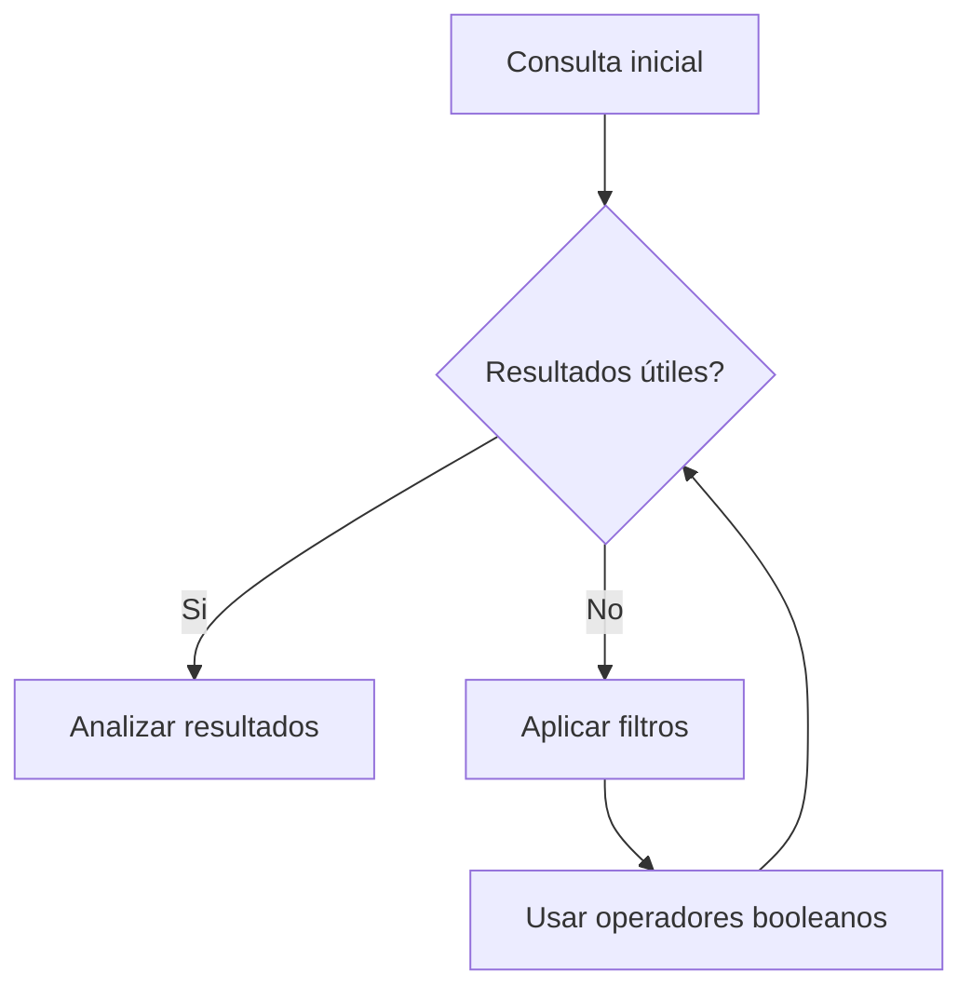

# {{ $frontmatter.title }}
## **1. Busca en sitios especializados**

### **1.1. Principais fontes de scripts**

| Tipo de Recurso      | Exemplos                                                                                    | Características                    |
| -------------------- | ------------------------------------------------------------------------------------------- | ---------------------------------- |
| **Páxinas oficiais** | [MDN Web Docs](https://developer.mozilla.org), [W3Schools](https://www.w3schools.com)       | Documentación fiable e actualizada |
| **Titorías**         | [freeCodeCamp](https://www.freecodecamp.org), [Codecademy](https://www.codecademy.com)      | Guías paso a paso con exemplos     |
| **Foros**            | [Stack Overflow](https://stackoverflow.com), [Reddit](https://www.reddit.com/r/javascript/) | Solucións a problemas específicos  |
| **Librarías**        | [npm](https://www.npmjs.com), [GitHub](https://github.com)                                  | Código reusable e paquetes         |

**Exemplo de busca en MDN:**
```javascript
// Buscar "Array.prototype.map" en MDN devolverá:
Array.prototype.map((elemento, indice) => { ... });
```

## **2. Operadores booleanos**

### **2.1. Operadores Comúns**

| Operador             | Función                       | Exemplo                  |
| -------------------- | ----------------------------- | ------------------------ |
| **AND** (`+`, `AND`) | Ambas palabras deben aparecer | `javascript + eventos`   |
| **OR** (`OR`, `      | `)                            | Unha ou outra palabra    | `canvas OR svg` |
| **NOT** (`-`, `NOT`) | Exclúe resultados             | `javascript -jquery`     |
| **Comiñas** (`" "`)  | Busca exacta                  | `"manexador de eventos"` |

**Diagrama de operadores (Mermaid):**


### **2.2. Uso en buscadores**

**Google:**
```
site:developer.mozilla.org "event listeners" -jQuery
```

**GitHub:**
```
language:javascript drag AND drop NOT library
```

## **3. Técnicas de busca avanzadas**

### **3.1. Expresións regulares na busca**
```javascript
// Buscar patróns específicos en código
// Exemplo: Buscar funcións que comezan por 'get'
/\bget\w+\s*\(/g
```

### **3.2. Especificacións técnicas**
| Técnica                  | Exemplo               | Descrición               |
| ------------------------ | --------------------- | ------------------------ |
| **Extensión de arquivo** | `filetype:js`         | Só arquivos JavaScript   |
| **Intervalo de datas**   | `after:2022-01-01`    | Contido actualizado      |
| **Búsqueda en código**   | `infile:package.json` | Busca dentro de arquivos |

## **4. Refinamento de buscas**

### **4.1. Separadores e filtros**
```
javascript (event OR listener) site:github.com stars:>1000
```

### **4.2. Elementos de unión**
```
(modal OR dialog) AND (vanilla OR pure) -jquery -react
```

**Fluxo de refinamento (Mermaid):**


## **5. Reutilización de scripts**

### **5.1. Fontes de scripts gratuítos**
- **CDNjs**: [https://cdnjs.com](https://cdnjs.com)
- **JSDelivr**: [https://www.jsdelivr.com](https://www.jsdelivr.com)
- **CodePen**: [https://codepen.io](https://codepen.io)

**Exemplo de inclusión:**
```html
<!-- Incluir biblioteca desde CDN -->
<script src="https://cdn.jsdelivr.net/npm/chart.js"></script>
```

### **5.2. Xeneralización de códigos**
**Antes (Específico):**
```javascript
document.getElementById("boton1").addEventListener("click", function() {
    this.style.backgroundColor = "red";
});
```

**Despois (Xeneralizado):**
```javascript
function setupBotones(selector, color) {
    document.querySelectorAll(selector).forEach(boton => {
        boton.addEventListener("click", function() {
            this.style.backgroundColor = color;
        });
    });
}

// Uso:
setupBotones(".boton-importante", "red");
```

## **6. Exemplo práctico integrado**

**Proceso de Busca e Implementación:**
1. **Necesidade**: "Necesito un carrusel de imaxes responsive"
2. **Busca**: `"pure javascript image slider" site:codepen.io stars:>500`
3. **Análise**: 
   ```javascript
   // Revisar licenza
   // Probar compatibilidade
   // Verificar rendemento
   ```
4. **Adaptación**:
   ```javascript
   // Cambiar selectores
   // Axustar estilos
   // Engadir funcionalidades
   ```
5. **Implementación**:
   ```html
   <div class="carrusel">
       <!-- Contido adaptado -->
   </div>
   <script src="carrusel-adaptado.js"></script>
   ```

**Pseudocódigo do proceso:**
```
INICIO
    DEFINIR necesidade: carrusel responsive
    BUSCAR en repositorios confiables
    FILTRAR por licenza, popularidade, mantemento
    ANALIZAR código fonte
    ADAPTAR a miñas necesidades
    IMPLEMENTAR e probar
FIN
```

## **7. Boas Prácticas**

1. **Verificar licenzas** (MIT, GPL, Apache)
2. **Comprobar mantemento** (última actualización, issues abertos)
3. **Probar en ambiente de desenvolvemento**
4. **Documentar cambios** realizados
5. **Optimizar** para o teu caso de uso específico

## **Conclusión Didáctica**

✅ **Fontes especializadas** aforran tempo e ofrecen calidade  
✅ **Operadores booleanos** refinan os resultados  
✅ **Técnicas avanzadas** permiten atopar solucións específicas  
✅ **Reutilización responsable** acelera o desenvolvemento  

**Exercicio práctico:**  
1. Buscar un sistema de validación de formularios vanilla JS  
2. Filtra por:  
   - Sen dependencias  
   - Máis de 100 estrelas en GitHub  
   - Actualizado nos últimos 12 meses  
3. Adaptar para validar:  
   - Email (formato correcto)  
   - Contrasinal (8+ caracteres, 1 número)  
   - Confirmación de contrasinal  

```javascript
// Posible solución baseada en buscas
function validarFormulario(form) {
    let valido = true;
    const email = form.email.value;
    const contrasinal = form.contrasinal.value;
    const confirmacion = form.confirmacion.value;

    // Validar email
    if (!/^[^\s@]+@[^\s@]+\.[^\s@]+$/.test(email)) {
        mostrarError("email", "Email non válido");
        valido = false;
    }

    // Validar contrasinal
    if (contrasinal.length < 8 || !/\d/.test(contrasinal)) {
        mostrarError("contrasinal", "Mínimo 8 caracteres con 1 número");
        valido = false;
    }

    // Confirmar contrasinal
    if (contrasinal !== confirmacion) {
        mostrarError("confirmacion", "As contrasinais non coinciden");
        valido = false;
    }

    return valido;
}

function mostrarError(campo, mensaxe) {
    const elemento = document.querySelector(`[name="${campo}"]`);
    elemento.classList.add("error");
    // Engadir lóxica para mostrar mensaxe ao usuario
}
```

---

DAW🧊2025