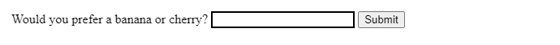
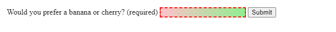
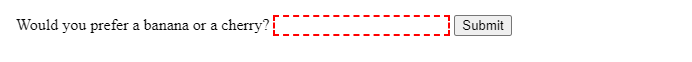
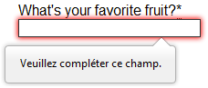

# {{ $frontmatter.title }}

É importante asegurarse de que todos os controis de formulario requiridos estean cubertos, no formato correcto, antes de enviar os datos do formulario introducidos polo usuario ao servidor. Esta **validación do formulario no lado do cliente** axuda a garantir que os datos introducidos coincidan cos requisitos establecidos nos distintos controis do formulario.

Este artigo guíache a través de conceptos básicos e exemplos de validación de formularios no lado do cliente.

| Requisitos previos: | Coñecementos de informática, coñecementos razoables de [HTML](https://developer.mozilla.org/en-US/docs/Learn_web_development/Core/Structuring_content) , [CSS](https://developer.mozilla.org/en-US/docs/Learn_web_development/Core/Styling_basics) e [JavaScript](https://developer.mozilla.org/en-US/docs/Learn_web_development/Core/Scripting) . |
| :------------------ | -------------------------------------------------------------------------------------------------------------------------------------------------------------------------------------------------------------------------------------------------------------------------------------------------------------------------------------------------- |
| Obxectivo:          | Para comprender que é a validación de formularios no lado do cliente, por que é importante e como aplicar varias técnicas para implementala.                                                                                                                                                                                                       |

A validación no lado do cliente é unha comprobación inicial e unha característica importante dunha boa experiencia de usuario; ao detectar datos non válidos no lado do cliente, o usuario pode corrixilos de inmediato. Se chegan ao servidor e logo son rexeitados, prodúcese un atraso notable por unha viaxe de ida e volta ao servidor e despois de volta ao lado do cliente para indicarlle ao usuario que corrixa os seus datos.

Non obstante, a validación no lado do cliente *non debería considerarse* unha medida de seguranza exhaustiva. As túas aplicacións sempre deberían realizar a validación, incluídas as comprobacións de seguranza, en calquera dato enviado a través de formularios, tanto no *lado do servidor* **como** no lado do cliente, porque a validación no lado do cliente é demasiado fácil de eludir, polo que os usuarios maliciosos aínda poden enviar datos incorrectos ao teu servidor.

**Nota:** Consulta [Seguridade do sitio web](https://developer.mozilla.org/en-US/docs/Learn_web_development/Extensions/Server-side/First_steps/Website_security) para ter unha idea do que *podería* ocorrer; a implementación da validación no servidor está un pouco fóra do alcance deste módulo, pero debes telo en conta.

## Que é a validación de formularios?

Vaia a calquera sitio web popular cun formulario de rexistro e verá que lle dan comentarios cando non introduce os seus datos no formato que esperan. Recibirá mensaxes como:

- "Este campo é obrigatorio" (Non podes deixar este campo en branco).
- "Introduza o seu número de teléfono no formato xxx-xxxx" (Requírese un formato de datos específico para que sexa considerado válido).
- "Introduza un enderezo de correo electrónico válido" (os datos que introduciu non teñen o formato correcto).
- "O teu contrasinal debe ter entre 8 e 30 caracteres e conter unha letra maiúscula, un símbolo e un número." (Requírese un formato de datos moi específico para os teus datos).

Isto chámase **validación de formularios** . Cando introduces datos, o navegador (e o servidor web) comprobarán que os datos teñan o formato correcto e que estean dentro das restricións establecidas pola aplicación. A validación realizada no navegador chámase validación **do lado do cliente** , mentres que a validación realizada no servidor chámase validación **do lado do servidor** . Neste capítulo, centrámonos na validación do lado do cliente.

Se a información ten o formato correcto, a aplicación permite que os datos sexan enviados ao servidor e (normalmente) gardados nunha base de datos; se a información non ten o formato correcto, mostra ao usuario unha mensaxe de erro explicando o que cómpre corrixir e permítelle intentalo de novo.

Queremos que completar formularios web sexa o máis sinxelo posible. Entón, por que insistimos en validar os nosos formularios? Hai tres razóns principais:

- **Queremos obter os datos correctos, no formato correcto.** As nosas aplicacións non funcionarán correctamente se os datos dos nosos usuarios se almacenan no formato incorrecto, son incorrectos ou se omiten por completo.

- **Queremos protexer os datos dos nosos usuarios** . Obrigar aos nosos usuarios a introducir contrasinais seguras facilita a protección da información das súas contas.

- **Queremos protexernos** . Hai moitas maneiras polas que os usuarios maliciosos poden facer un mal uso dos formularios desprotexidos para danar a aplicación. Consulta [Seguridade do sitio web](https://developer.mozilla.org/en-US/docs/Learn_web_development/Extensions/Server-side/First_steps/Website_security) .

  **Aviso:** Nunca confíes nos datos que o cliente lle pasa ao teu servidor. Mesmo se o formulario se valida correctamente e impide a entrada de datos incorrectos no lado do cliente, un usuario malicioso aínda pode alterar a solicitude de rede.

## Diferentes tipos de validación do lado do cliente

Hai dous tipos diferentes de validación do lado do cliente que atoparás na web:

- **Validación de formularios HTML** Os atributos de formularios HTML poden definir que controis de formulario son necesarios e en que formato deben estar os datos introducidos polo usuario para ser válidos.
- **Validación de formularios JavaScript** Xeralmente, inclúese JavaScript para mellorar ou personalizar a validación de formularios HTML.

A validación do lado do cliente pódese realizar con pouco ou ningún JavaScript. A validación HTML é máis rápida que JavaScript, pero é menos personalizable que a validación JavaScript. Xeralmente recoméndase comezar os formularios con funcións HTML robustas e, a continuación, mellorar a experiencia do usuario con JavaScript segundo sexa necesario.

## Usando a validación de formularios integrada

Unha das características máis importantes dos [controis de formulario](https://developer.mozilla.org/en-US/docs/Learn_web_development/Extensions/Forms/HTML5_input_types) é a capacidade de validar a maioría dos datos do usuario sen depender de JavaScript. Isto faise mediante o uso de atributos de validación nos elementos do formulario. Xa vimos moitos destes anteriormente no curso, pero para recapitular:

- [`required`](https://developer.mozilla.org/en-US/docs/Web/HTML/Reference/Attributes/required): Especifica se é necesario preencher un campo do formulario antes de que se poida enviar o formulario.
- [`minlength`](https://developer.mozilla.org/en-US/docs/Web/HTML/Reference/Attributes/minlength)e [`maxlength`](https://developer.mozilla.org/en-US/docs/Web/HTML/Reference/Attributes/maxlength): Especifica a lonxitude mínima e máxima dos datos textuais (cadeas de caracteres).
- [`min`](https://developer.mozilla.org/en-US/docs/Web/HTML/Reference/Attributes/min), [`max`](https://developer.mozilla.org/en-US/docs/Web/HTML/Reference/Attributes/max), e [`step`](https://developer.mozilla.org/en-US/docs/Web/HTML/Reference/Attributes/step): Especifica os valores mínimos e máximos dos tipos de entrada numérica e o incremento, ou paso, para os valores, comezando polo mínimo.
- [`type`](https://developer.mozilla.org/en-US/docs/Web/HTML/Reference/Elements/input#input_types): Especifica se os datos deben ser un número, un enderezo de correo electrónico ou algún outro tipo predefinido específico.
- [`pattern`](https://developer.mozilla.org/en-US/docs/Web/HTML/Reference/Attributes/pattern): Especifica unha [expresión regular](https://developer.mozilla.org/en-US/docs/Web/JavaScript/Guide/Regular_expressions) que define un patrón que deben seguir os datos introducidos.

Se os datos introducidos nun campo de formulario seguen todas as regras especificadas polos atributos aplicados ao campo, considéranse válidos. Se non, considéranse inválidos.

Cando un elemento é válido, cúmprense as seguintes cousas:

- O elemento coincide coa pseudoclase CSS [`:valid`](https://developer.mozilla.org/en-US/docs/Web/CSS/:valid), que che permite aplicar un estilo específico a elementos válidos. O control tamén coincidirá [`:user-valid`](https://developer.mozilla.org/en-US/docs/Web/CSS/:user-valid)se o usuario interactuou co control e pode coincidir con outras pseudoclases da IU, como [`:in-range`](https://developer.mozilla.org/en-US/docs/Web/CSS/:in-range), dependendo do tipo de entrada e dos atributos.
- Se o usuario tenta enviar os datos, o navegador enviará o formulario, sempre que non haxa nada máis que o impida (por exemplo, JavaScript).

Cando un elemento non é válido, cúmprense as seguintes condicións:

- O elemento coincide coa pseudoclase CSS [`:invalid`](https://developer.mozilla.org/en-US/docs/Web/CSS/:invalid). Se o usuario interactuou co control, tamén coincide coa [`:user-invalid`](https://developer.mozilla.org/en-US/docs/Web/CSS/:user-invalid)pseudoclase CSS. Outras pseudoclases da IU tamén poden coincidir, como [`:out-of-range`](https://developer.mozilla.org/en-US/docs/Web/CSS/:out-of-range), dependendo do erro. Estas permítenche aplicar un estilo específico a elementos non válidos.
- Se o usuario tenta enviar os datos, o navegador bloqueará o envío do formulario e mostrará unha mensaxe de erro. A mensaxe de erro variará dependendo do tipo de erro. A [API de validación de restricións](https://developer.mozilla.org/en-US/docs/Learn_web_development/Extensions/Forms/Form_validation#the_constraint_validation_api) descríbese a continuación.

## Exemplos de validación de formularios integrados

Nesta sección, probaremos algúns dos atributos que comentamos anteriormente.

### Arquivo de inicio sinxelo

Comecemos cun exemplo sinxelo: unha entrada que che permite escoller se prefires un plátano ou unha cereixa. Este exemplo implica un texto básico [`<input>`](https://developer.mozilla.org/en-US/docs/Web/HTML/Reference/Elements/input) cun  [`<label>`](https://developer.mozilla.org/en-US/docs/Web/HTML/Reference/Elements/label) asociado e un  [`button`](https://developer.mozilla.org/en-US/docs/Web/HTML/Reference/Elements/button) co título `submit`.

```html
<form>
  <label for="choose">Would you prefer a banana or cherry?</label>
  <input id="choose" name="i-like" />
  <button>Submit</button>
</form>
```

Estilo básico:

```css
input:invalid {
  border: 2px dashed red;
}

input:valid {
  border: 2px solid black;
}
```



Para comezar, fai unha copia do arquivo que atopas en GitHub [`fruit-start.html`](https://github.com/mdn/learning-area/blob/main/html/forms/form-validation/fruit-start.html) nun novo directorio do teu disco duro.

### O atributo requirido

Unha característica común de validación HTML é o atributo [`required`](https://developer.mozilla.org/en-US/docs/Web/HTML/Reference/Attributes/required). Engade este atributo a unha entrada para facer que un elemento sexa obrigatorio. Cando se define este atributo, o elemento coincide coa pseudoclase da IU [`:required`](https://developer.mozilla.org/en-US/docs/Web/CSS/:required) e o formulario non se enviará, mostrando unha mensaxe de erro ao enviar se a entrada está baleira. Mentres estea baleira, a entrada tamén se considerará inválida, coincidindo coa pseudoclase da IU  [`:invalid`](https://developer.mozilla.org/en-US/docs/Web/CSS/:invalid).

Se algún botón de opción dun grupo co mesmo nome ten o atributo `required`, un dos botóns de opción dese grupo debe estar marcado para que o grupo sexa válido; a opción marcada non ten por que ser a que teña o atributo definido.

**Nota:** Só se lles require aos usuarios que introduzan os datos que precisan: por exemplo, é realmente necesario saber o xénero ou o título de alguén?

Engade un atributo `required` á túa entrada, como se mostra a continuación.

```html
<form>
  <label for="choose">Would you prefer a banana or cherry? (required)</label>
  <input id="choose" name="i-like" required />
  <button>Submit</button>
</form>
```

Engadimos "(required)" á  [`<label>`](https://developer.mozilla.org/en-US/docs/Web/HTML/Reference/Elements/label) para informar ao usuario que o  [`input`](https://developer.mozilla.org/en-US/docs/Web/HTML/Reference/Elements/input) é obrigatorio. Indicar ao usuario cando os campos do formulario son obrigatorios non só é unha boa experiencia de usuario, senón que tamén é un requisito das directrices [de accesibilidade](https://developer.mozilla.org/en-US/docs/Learn_web_development/Core/Accessibility) das WCAG .

Incluímos estilos CSS que se aplican segundo se o elemento é obrigatorio, válido ou non válido:

```css
input:invalid {
  border: 2px dashed red;
}

input:invalid:required {
  background-image: linear-gradient(to right, pink, lightgreen);
}

input:valid {
  border: 2px solid black;
}
```

Este CSS fai que a entrada teña un bordo vermello discontinuo cando non é válida e un bordo negro sólido máis sutil cando é válida. Tamén engadimos un degradado de fondo cando a entrada é obrigatoria *e* non é válida. Proba o novo comportamento no exemplo seguinte:



Tenta enviar o formulario do [exemplo ](https://mdn.github.io/learning-area/html/forms/form-validation/fruit-required.html)[`required` en directo](https://mdn.github.io/learning-area/html/forms/form-validation/fruit-required.html) sen un valor. Observa como a entrada non válida recibe o foco, aparece unha mensaxe de erro predeterminada ("Enche este campo") e se impide o envío do formulario. Tamén podes ver o [código fonte en GitHub](https://github.com/mdn/learning-area/blob/main/html/forms/form-validation/fruit-required.html) .

### Validación contra unha expresión regular

Outra característica de validación útil é o atributo [`pattern`](https://developer.mozilla.org/en-US/docs/Web/HTML/Reference/Attributes/pattern), que espera unha [expresión regular](https://developer.mozilla.org/en-US/docs/Web/JavaScript/Guide/Regular_expressions) como valor. Unha expresión regular (regexp) é un patrón que se pode usar para atopar combinacións de caracteres en cadeas de texto, polo que as `regexp` son ideais para a validación de formularios e serven para unha variedade doutros usos en JavaScript.

As expresións regulares son bastante complexas e non pretendemos ensinalas exhaustivamente neste artigo. A continuación, amósanse algúns exemplos para ter unha idea básica de como funcionan.

- `a`— Coincide cun carácter que sexa `a`(non `b`, non `aa`, etc.).
- `abc`— Partidos `a`, seguido de `b`, seguido de `c`.
- `ab?c`— Coincidencias `a`, opcionalmente seguidas dun único `b`, seguido de `c`. ( `ac`ou `abc`)
- `ab*c`— Coincide con `a`, opcionalmente seguido de calquera número de `b`s, seguido de `c`. ( `ac`, `abc`, `abbbbbc`, etc.).
- `a|b`— Coincide cun carácter que sexa `a`ou `b`.
- `abc|xyz`— Coincide exactamente `abc`ou exactamente `xyz`(pero non con `abcxyz`ou `a`ou `y`, e así sucesivamente).

Hai moitas máis posibilidades que non tratamos aquí. Para obter unha lista completa e moitos exemplos, consulta a nosa documentación [sobre expresións regulares](https://developer.mozilla.org/en-US/docs/Web/JavaScript/Guide/Regular_expressions) .

Implementemos un exemplo. Actualiza o teu HTML para engadir un atributo [`pattern`](https://developer.mozilla.org/en-US/docs/Web/HTML/Reference/Attributes/pattern) coma este:

```html
<form>
  <label for="choose">Would you prefer a banana or a cherry?</label>
  <input id="choose" name="i-like" required pattern="[Bb]anana|[Cc]herry" />
  <button>Submit</button>
</form>
```

Isto dános a seguinte actualización. Próbaa:



Podes atopar este [exemplo en directo en GitHub](https://mdn.github.io/learning-area/html/forms/form-validation/fruit-pattern.html) xunto co [código fonte](https://github.com/mdn/learning-area/blob/main/html/forms/form-validation/fruit-pattern.html) .

Neste exemplo, o elemento  [`<input>`](https://developer.mozilla.org/en-US/docs/Web/HTML/Reference/Elements/input) acepta un de catro valores posibles: as cadeas "banana", "Banana", "cherry" ou "Cherry". As expresións regulares distinguen entre maiúsculas e minúsculas, pero fixemos que admita versións en maiúsculas e minúsculas usando un patrón "Aa" adicional aniñado dentro de corchetes.

Neste punto, tenta cambiar o valor dentro do atributo [`pattern`](https://developer.mozilla.org/en-US/docs/Web/HTML/Reference/Attributes/pattern) para que sexa igual a algúns dos exemplos que viches antes e observa como iso afecta aos valores que podes introducir para que o valor de entrada sexa válido. Tenta escribir algúns propios e observa como funciona. Fai que estean relacionados coa froita sempre que sexa posible para que os teus exemplos teñan sentido!

Se un valor non baleiro de [`<input>`](https://developer.mozilla.org/en-US/docs/Web/HTML/Reference/Elements/input) non coincide co patrón da expresión regular, `input` coincidirá coa pseudoclase [`:invalid`](https://developer.mozilla.org/en-US/docs/Web/CSS/:invalid). Se está baleiro e o elemento non é obrigatorio, non se considera inválido.

Algúns tipos de elementos  [`<input>`](https://developer.mozilla.org/en-US/docs/Web/HTML/Reference/Elements/input) non precisan dun atributo [`pattern`](https://developer.mozilla.org/en-US/docs/Web/HTML/Reference/Attributes/pattern) para ser validados cunha expresión regular. Por exemplo, ao especificar o  tipo `email`, validase o valor das entradas cun patrón de enderezo de correo electrónico ben formado ou un patrón que coincida cunha lista de enderezos de correo electrónico separados por comas se ten o atributo [`multiple`](https://developer.mozilla.org/en-US/docs/Web/HTML/Reference/Attributes/multiple).

**Nota:** O elemento [`<textarea>`](https://developer.mozilla.org/en-US/docs/Web/HTML/Reference/Elements/textarea) non admite o atributo [`pattern`](https://developer.mozilla.org/en-US/docs/Web/HTML/Reference/Attributes/pattern).

### Limitar a lonxitude das entradas

Podes restrinxir a lonxitude de caracteres de todos os campos de texto creados por [`<input>`](https://developer.mozilla.org/en-US/docs/Web/HTML/Reference/Elements/input)ou [`<textarea>`](https://developer.mozilla.org/en-US/docs/Web/HTML/Reference/Elements/textarea) mediante o uso dos atributos [`minlength`](https://developer.mozilla.org/en-US/docs/Web/HTML/Reference/Attributes/minlength) e [`maxlength`](https://developer.mozilla.org/en-US/docs/Web/HTML/Reference/Attributes/maxlength). Un campo non é válido se ten un valor e ese valor ten menos caracteres que o valor [`minlength`](https://developer.mozilla.org/en-US/docs/Web/HTML/Reference/Attributes/minlength) ou máis que o valor [`maxlength`](https://developer.mozilla.org/en-US/docs/Web/HTML/Reference/Attributes/maxlength).

Os navegadores a miúdo non permiten que o usuario escriba un valor máis longo do esperado nos campos de texto. Unha mellor experiencia de usuario que simplemente usar `maxlength` é proporcionar tamén información sobre o reconto de caracteres dun xeito accesible e permitir que o usuario edite o seu contido para reducilo ao tamaño. Un exemplo disto é o límite de caracteres ao publicar nas redes sociais. JavaScript, incluíndo [solucións que usan `maxlength`](https://github.com/mimo84/bootstrap-maxlength) , pódese usar para proporcionar isto.

**Nota:** As restricións de lonxitude nunca se notifican se o valor se define mediante programación. Só se notifican para a entrada proporcionada polo usuario.

### Restrinxindo os valores das túas entradas

Para campos numéricos, incluíndo [``](https://developer.mozilla.org/en-US/docs/Web/HTML/Reference/Elements/input/number)e os distintos tipos de entrada de data, os atributos [`min`](https://developer.mozilla.org/en-US/docs/Web/HTML/Reference/Attributes/min)e [`max`](https://developer.mozilla.org/en-US/docs/Web/HTML/Reference/Attributes/max)pódense usar para proporcionar un intervalo de valores válidos. Se o campo contén un valor fóra deste intervalo, non será válido.

Vexamos outro exemplo. Crea unha nova copia do arquivo [fruit-start.html](https://github.com/mdn/learning-area/blob/main/html/forms/form-validation/fruit-start.html) .

Agora elimina o contido do `<body>`elemento e substitúeo polo seguinte:

htmlCopiar ao portapapeisxogar

```
<form>
  <div>
    <label for="choose">Would you prefer a banana or a cherry?</label>
    <input
      type="text"
      id="choose"
      name="i-like"
      required
      minlength="6"
      maxlength="6" />
  </div>
  <div>
    <label for="number">How many would you like?</label>
    <input type="number" id="number" name="amount" value="1" min="1" max="10" />
  </div>
  <div>
    <button>Submit</button>
  </div>
</form>
```

- Aquí verás que lle demos ao `text`campo a `minlength`e `maxlength`de seis, que ten a mesma lonxitude que a banana e a cereixa.
- Tamén lle demos ao `number`campo un valor `min`de un e un valor `max`de dez. Os números introducidos fóra deste rango mostraranse como non válidos; os usuarios non poderán usar as frechas de incremento/decremento para mover o valor fóra deste rango. Se o usuario introduce manualmente un número fóra deste rango, os datos non son válidos. O número non é obrigatorio, polo que eliminar o valor dará como resultado un valor válido.

Aquí está o exemplo executándose en directo:

xogar

<iframe class="sample-code-frame" title="Restrición dos valores da mostra de entradas" id="frame_constraining_the_values_of_your_entries" width="100%" height="100" src="https://a3b050fb26a229abdb0b2260088cfc4a8cbe183e.mdnplay.dev/en-US/docs/Learn_web_development/Extensions/Forms/Form_validation/runner.html?state=hZJBb9swDIX%2FCsFzArU77OA52WlDD70Vwy4CAtliaq0S6Umy46Dofx8UR10OK3YRHh8eJX4QX7FPCRt0PE65cTwb7yy8agboJFqKDXwaF7AmDWQhkv2i%2BU2z5rXhg3iSYnfe9C81b9285oKJz463neQsoYH7u3FZM7jBIQePDbZHiWFfwq1180UAtN505OEocaexH0QSadz%2FlMlbOMsEY6QjRTDQGTZsQIruB4rx%2FLVVl%2BZ602X2VQPk80g7jZmWrLGazt48Uk02oSTd1ruXGzvS78lFsrUOjj3xcx52Gj%2F%2FjQWz3NqgVkBVCT9C5Sl0FDXuH%2BQEwfAZTu%2FMZZB%2FwlWq2rwCvVdXEhNk4qwRZuOnYtxrLONXZZai7v4zbDflLLx%2Fmrrgcquu5W2%2BVdcPxQ3%2BKtuGG0yxxwYV8fbHk7LSJ%2FVIJvLhRN3B0kxexkCc1bclEycnnNR3iWE9D5e9M9kJK3z7Aw%3D%3D" data-live-path="/en-US/docs/Learn_web_development/Extensions/Forms/Form_validation/" data-live-id="constraining_the_values_of_your_entries" sandbox="allow-same-origin allow-scripts" loading="lazy" style="box-sizing: initial; border-top: none; border-right: 1px solid rgb(205, 205, 205); border-bottom: 1px solid rgb(205, 205, 205); border-left: 1px solid rgb(205, 205, 205); border-image: none 100% / 1 / 0 stretch; max-width: 100%; width: calc(100% - 2px - 2rem); background: rgb(255, 255, 255); border-radius: 0px 0px 4px 4px; padding: 1rem; margin-top: 0px;"></iframe>

Proba este [exemplo en directo en GitHub](https://mdn.github.io/learning-area/html/forms/form-validation/fruit-length.html) e consulta o [código fonte](https://github.com/mdn/learning-area/blob/main/html/forms/form-validation/fruit-length.html) .

Os tipos de entrada numérica, como `number`, `range`e `date`, tamén poden aceptar o [`step`](https://developer.mozilla.org/en-US/docs/Web/HTML/Reference/Attributes/step)atributo. Este atributo especifica o incremento en que subirá ou baixará o valor cando se usen os controis de entrada (como os botóns numéricos cara arriba e cara abaixo ou o deslizamento do dedo pulgar dos rangos). O `step`atributo omítese no noso exemplo, polo que o valor por defecto é `1`. Isto significa que os números de flotación, como 3.2, tamén se mostrarán como non válidos.

### [Exemplo completo](https://developer.mozilla.org/en-US/docs/Learn_web_development/Extensions/Forms/Form_validation#full_example)

Aquí tes un exemplo completo para mostrar o uso das funcións de validación integradas de HTML. Primeiro, un pouco de HTML:

htmlCopiar ao portapapeisxogar

```
<form>
  <fieldset>
    <legend>
      Do you have a driver's license?<span aria-label="required">*</span>
    </legend>
    <input type="radio" required name="driver" id="r1" value="yes" /><label
      for="r1"
      >Yes</label
    >
    <input type="radio" required name="driver" id="r2" value="no" /><label
      for="r2"
      >No</label
    >
  </fieldset>
  <p>
    <label for="n1">How old are you?</label>
    <input type="number" min="12" max="120" step="1" id="n1" name="age" />
  </p>
  <p>
    <label for="t1"
      >What's your favorite fruit?<span aria-label="required">*</span></label
    >
    <input
      type="text"
      id="t1"
      name="fruit"
      list="l1"
      required
      pattern="[Bb]anana|[Cc]herry|[Aa]pple|[Ss]trawberry|[Ll]emon|[Oo]range" />
    <datalist id="l1">
      <option>Banana</option>
      <option>Cherry</option>
      <option>Apple</option>
      <option>Strawberry</option>
      <option>Lemon</option>
      <option>Orange</option>
    </datalist>
  </p>
  <p>
    <label for="t2">What's your email address?</label>
    <input type="email" id="t2" name="email" />
  </p>
  <p>
    <label for="t3">Leave a short message</label>
    <textarea id="t3" name="msg" maxlength="140" rows="5"></textarea>
  </p>
  <p>
    <button>Submit</button>
  </p>
</form>
```

E agora un pouco de CSS para darlle estilo ao HTML:

cssCopiar ao portapapeisxogar

```
form {
  font: 1em sans-serif;
  max-width: 320px;
}

p > label {
  display: block;
}

input[type="text"],
input[type="email"],
input[type="number"],
textarea,
fieldset {
  width: 100%;
  border: 1px solid #333;
  box-sizing: border-box;
}

input:invalid {
  box-shadow: 0 0 5px 1px red;
}

input:focus:invalid {
  box-shadow: none;
}
```

Isto renderízase do seguinte xeito:

xogar

<iframe class="sample-code-frame" title="Exemplo completo de mostra" id="frame_full_example" width="100%" height="420" src="https://4c09cf43e04122897c837327fa93bf485eafbc53.mdnplay.dev/en-US/docs/Learn_web_development/Extensions/Forms/Form_validation/runner.html?state=pVXbjtMwEP2VkRFCQq3SC7wEN4ireFjBwwohVFerST1tDY4dbKdN2eXfkXPptst2tRIvVWfOjM%2BZi51rtvSepWxlXQHXwgCsrAkpjKkAj8YPPTm1ehWBAuvhTsmwSWE6GZX1K2H%2BCCNMCRlozEm3%2BVL5UuM%2BhVzb5c8%2BSJmyCvOwL2kmWKA6CLYY3HFTgUrf4zdVkZNrgZiKjnAgzEqRlp5CS9spG49GTxu1uXWSXArjsgZvtZLwZDqddlA99Oq3Muu0Cxvmtj5RmiqzxZh0fUjYoLS7FEYwgpdl3ZzrSJ5mreyy8udzjTXUJrAB24RCs5Tx2PksRvK%2BoMYC4JrWZGRnAby3sLcVbHBLgCCd2pJ75kGrJRlPr7kv0QA6hcNmGjPBHP2qlCMpWPacJxHvj05OzuaNeuja7VAqKxj02WCwiP6WUTBQMkaNBYMt6ipCe%2FKCQZLxhrkXvLKuC%2Bw92XfyPDkK%2Bh8BkyMBxp7nnxzxf7b%2F0vPkpPG8PPS%2FWer2FDMWLPtkd2C1BHQUR%2FG6O%2BveIvqlhUKZmWDjqLbAuvk7Egx8oDIafTmRoC8U19SU06orH5AVjpv7bYPhmY%2FKHKxwa50KBCtXqfDI5Tg%2Fmp7j5AL3zkb%2FsZKujIb61quVDzPB9FHgQUNnlxgCudiv%2Bdt8gQYN3szfLRcbcm5%2FM3%2BDi7LUdDO%2F9IvgcJe37gu9oMKam%2FkXu3BojpoHwCUGjMytykh%2BuFDclkFZk71tiHjSmXfhdw37WfhNlHQWvTzoPBtyEcWfRb80Fd2BedKX9ZgdmQh2shvNOwsopSPvH1zi7kXuJjy53dAeeNSOTgXLLqh9tvzGugAFeY%2BxqhPq%2Fm3v6Ka3dIVft9dHk1mHTbw3L%2BIlcnbnZ4K9FCzjSZ9%2BRlJehRAHUuWFCjzpzNtYnnQvMRuwH%2FGTyAbMuyVLWUJm%2BPUykXbpkwtCZ652lF9J2pK2ZUEmJB%2FqQMYra3zy0bqi%2Fb1qvgIYx5awP38B" data-live-path="/en-US/docs/Learn_web_development/Extensions/Forms/Form_validation/" data-live-id="full_example" sandbox="allow-same-origin allow-scripts" loading="lazy" style="box-sizing: initial; border-top: none; border-right: 1px solid rgb(205, 205, 205); border-bottom: 1px solid rgb(205, 205, 205); border-left: 1px solid rgb(205, 205, 205); border-image: none 100% / 1 / 0 stretch; max-width: 100%; width: calc(100% - 2px - 2rem); background: rgb(255, 255, 255); border-radius: 0px 0px 4px 4px; padding: 1rem; margin-top: 0px;"></iframe>

Este [exemplo completo está dispoñible en GitHub](https://mdn.github.io/learning-area/html/forms/form-validation/full-example.html) xunto co [código fonte](https://github.com/mdn/learning-area/blob/main/html/forms/form-validation/full-example.html) .

Consulta [os atributos relacionados coa validación](https://developer.mozilla.org/en-US/docs/Web/HTML/Guides/Constraint_validation#validation-related_attributes) para obter unha lista completa dos atributos que se poden usar para restrinxir os valores de entrada e os tipos de entrada que os admiten.

## [Validación de formularios usando JavaScript](https://developer.mozilla.org/en-US/docs/Learn_web_development/Extensions/Forms/Form_validation#validating_forms_using_javascript)

Se queres cambiar o texto das mensaxes de erro nativas, necesitas JavaScript. Nesta sección, veremos as diferentes maneiras de facelo.

### [A API de validación de restricións](https://developer.mozilla.org/en-US/docs/Learn_web_development/Extensions/Forms/Form_validation#the_constraint_validation_api)

A API de validación de restricións consta dun conxunto de métodos e propiedades dispoñibles nas seguintes interfaces DOM de elementos de formulario:

- [`HTMLButtonElement`](https://developer.mozilla.org/en-US/docs/Web/API/HTMLButtonElement)(representa un [``](https://developer.mozilla.org/en-US/docs/Web/HTML/Reference/Elements/button)elemento)
- [`HTMLFieldSetElement`](https://developer.mozilla.org/en-US/docs/Web/API/HTMLFieldSetElement)(representa un [``](https://developer.mozilla.org/en-US/docs/Web/HTML/Reference/Elements/fieldset)elemento)
- [`HTMLInputElement`](https://developer.mozilla.org/en-US/docs/Web/API/HTMLInputElement)(representa un [``](https://developer.mozilla.org/en-US/docs/Web/HTML/Reference/Elements/input)elemento)
- [`HTMLOutputElement`](https://developer.mozilla.org/en-US/docs/Web/API/HTMLOutputElement)(representa un [``](https://developer.mozilla.org/en-US/docs/Web/HTML/Reference/Elements/output)elemento)
- [`HTMLSelectElement`](https://developer.mozilla.org/en-US/docs/Web/API/HTMLSelectElement)(representa un [``](https://developer.mozilla.org/en-US/docs/Web/HTML/Reference/Elements/select)elemento)
- [`HTMLTextAreaElement`](https://developer.mozilla.org/en-US/docs/Web/API/HTMLTextAreaElement)(representa un [``](https://developer.mozilla.org/en-US/docs/Web/HTML/Reference/Elements/textarea)elemento)

A API de validación de restricións fai que as seguintes propiedades estean dispoñibles nos elementos anteriores.

- `validationMessage`: Devolve unha mensaxe localizada que describe as restricións de validación que o control non cumpre (se as hai). Se o control non é candidato para a validación de restricións ( `willValidate`é `false`) ou o valor do elemento cumpre as súas restricións ( é válido), isto devolverá unha cadea baleira.
- `validity`Devolve un `ValidityState`obxecto que contén varias propiedades que describen o estado de validez do elemento. Podes atopar detalles completos de todas as propiedades dispoñibles na [`ValidityState`](https://developer.mozilla.org/en-US/docs/Web/API/ValidityState)páxina de referencia; a continuación lístanse algunhas das máis comúns:
  - [`patternMismatch`](https://developer.mozilla.org/en-US/docs/Web/API/ValidityState/patternMismatch): Devolve `true`se o valor non coincide co especificado [`pattern`](https://developer.mozilla.org/en-US/docs/Web/HTML/Reference/Elements/input#pattern)e `false`se coincide. Se é verdadeiro, o elemento coincide coa [`:invalid`](https://developer.mozilla.org/en-US/docs/Web/CSS/:invalid)pseudoclase CSS.
  - [`tooLong`](https://developer.mozilla.org/en-US/docs/Web/API/ValidityState/tooLong): Devolve `true`se o valor é maior que a lonxitude máxima especificada polo [`maxlength`](https://developer.mozilla.org/en-US/docs/Web/HTML/Reference/Elements/input#maxlength)atributo ou `false`se é menor ou igual que o máximo. Se é verdadeiro, o elemento coincide coa [`:invalid`](https://developer.mozilla.org/en-US/docs/Web/CSS/:invalid)pseudoclase CSS.
  - [`tooShort`](https://developer.mozilla.org/en-US/docs/Web/API/ValidityState/tooShort): Devolve `true`se o valor é máis curto que a lonxitude mínima especificada polo [`minlength`](https://developer.mozilla.org/en-US/docs/Web/HTML/Reference/Elements/input#minlength)atributo ou `false`se é maior ou igual que o mínimo. Se é verdadeiro, o elemento coincide coa [`:invalid`](https://developer.mozilla.org/en-US/docs/Web/CSS/:invalid)pseudoclase CSS.
  - [`rangeOverflow`](https://developer.mozilla.org/en-US/docs/Web/API/ValidityState/rangeOverflow): Devolve `true`se o valor é maior que o máximo especificado polo [`max`](https://developer.mozilla.org/en-US/docs/Web/HTML/Reference/Elements/input#max)atributo ou `false`se é menor ou igual que o máximo. Se é verdadeiro, o elemento coincide coas [`:invalid`](https://developer.mozilla.org/en-US/docs/Web/CSS/:invalid)pseudoclases [`:out-of-range`](https://developer.mozilla.org/en-US/docs/Web/CSS/:out-of-range)CSS e .
  - [`rangeUnderflow`](https://developer.mozilla.org/en-US/docs/Web/API/ValidityState/rangeUnderflow): Devolve `true`se o valor é menor que o mínimo especificado polo [`min`](https://developer.mozilla.org/en-US/docs/Web/HTML/Reference/Elements/input#min)atributo ou `false`se é maior ou igual que o mínimo. Se é verdadeiro, o elemento coincide coas [`:invalid`](https://developer.mozilla.org/en-US/docs/Web/CSS/:invalid)pseudoclases [`:out-of-range`](https://developer.mozilla.org/en-US/docs/Web/CSS/:out-of-range)CSS e .
  - [`typeMismatch`](https://developer.mozilla.org/en-US/docs/Web/API/ValidityState/typeMismatch): Devolve `true`se o valor non está na sintaxe requirida (cando [`type`](https://developer.mozilla.org/en-US/docs/Web/HTML/Reference/Elements/input#type)é `email`ou `url`), ou `false`se a sintaxe é correcta. Se `true`, o elemento coincide coa [`:invalid`](https://developer.mozilla.org/en-US/docs/Web/CSS/:invalid)pseudoclase CSS.
  - `valid`: Devolve `true`se o elemento cumpre todas as súas restricións de validación e, polo tanto, considérase válido ou `false`se falla algunha restrición. Se é verdadeiro, o elemento coincide coa [`:valid`](https://developer.mozilla.org/en-US/docs/Web/CSS/:valid)pseudoclase CSS; [`:invalid`](https://developer.mozilla.org/en-US/docs/Web/CSS/:invalid)noutro caso, coa pseudoclase CSS.
  - `valueMissing`: Devolve `true`se o elemento ten un [`required`](https://developer.mozilla.org/en-US/docs/Web/HTML/Reference/Elements/input#required)atributo, pero ningún valor ou `false`doutro xeito. Se é verdadeiro, o elemento coincide coa [`:invalid`](https://developer.mozilla.org/en-US/docs/Web/CSS/:invalid)pseudoclase CSS.
- `willValidate`: Devolve `true`se o elemento se validará cando se envíe o formulario; `false`noutro caso.

A API de validación de restricións tamén fai que os seguintes métodos estean dispoñibles nos elementos anteriores e no [`form`](https://developer.mozilla.org/en-US/docs/Web/HTML/Reference/Elements/form)elemento.

- `checkValidity()`: Devolve `true`se o valor do elemento non ten problemas de validez; `false`en caso contrario. Se o elemento non é válido, este método tamén activa un [`invalid`evento](https://developer.mozilla.org/en-US/docs/Web/API/HTMLInputElement/invalid_event) no elemento.
- `reportValidity()`Informa de campos non válidos mediante eventos. Este método é útil en combinación cun `preventDefault()`xestor `onSubmit`de eventos.
- `setCustomValidity(message)`Engade unha mensaxe de erro personalizada ao elemento; se defines unha mensaxe de erro personalizada, o elemento considérase non válido e móstrase o erro especificado. Isto permíteche usar código JavaScript para establecer un fallo de validación distinto dos que ofrecen as restricións de validación HTML estándar. A mensaxe móstrase ao usuario ao informar do problema.

#### Implementación dunha mensaxe de erro personalizada

Como viches nos exemplos de restricións de validación HTML anteriores, cada vez que un usuario tenta enviar un formulario non válido, o navegador mostra unha mensaxe de erro. A forma en que se mostra esta mensaxe depende do navegador.

Estas mensaxes automáticas teñen dous inconvenientes:

- Non hai un xeito estándar de cambiar a súa aparencia con CSS.
- Dependen da configuración rexional do navegador, o que significa que podes ter unha páxina nun idioma pero unha mensaxe de erro mostrada noutro idioma, como se pode ver na seguinte captura de pantalla de Firefox.



A personalización destas mensaxes de erro é un dos casos de uso máis habituais da API de validación de restricións. Vexamos un exemplo de como facelo.

Comezaremos con algo de HTML (podes poñelo nun arquivo HTML en branco; se queres, usa unha copia nova de [fruit-start.html](https://github.com/mdn/learning-area/blob/main/html/forms/form-validation/fruit-start.html) como base):

htmlCopiar ao portapapeis

```
<form>
  <label for="mail">
    I would like you to provide me with an email address:
  </label>
  <input type="email" id="mail" name="mail" />
  <button>Submit</button>
</form>
```

Engade o seguinte JavaScript á páxina:

jsCopiar ao portapapeis

```
const email = document.getElementById("mail");

email.addEventListener("input", (event) => {
  if (email.validity.typeMismatch) {
    email.setCustomValidity("I am expecting an email address!");
  } else {
    email.setCustomValidity("");
  }
});
```

Aquí almacenamos unha referencia á entrada de correo electrónico e, a seguir, engadimos un detector de eventos que executa o código contido cada vez que se cambia o valor da entrada.

Dentro do código contido, comprobamos se a `validity.typeMismatch`propiedade de entrada de correo electrónico devolve `true`, o que significa que o valor contido non coincide co patrón dun enderezo de correo electrónico ben formado. Se é así, chamamos ao [`setCustomValidity()`](https://developer.mozilla.org/en-US/docs/Web/API/HTMLInputElement/setCustomValidity)método cunha mensaxe personalizada. Isto fai que a entrada sexa inválida, de xeito que cando intentas enviar o formulario, o envío falla e se mostra a mensaxe de erro personalizada.

Se a `validity.typeMismatch`propiedade devolve `false`, chamamos ao `setCustomValidity()`método cunha cadea baleira. Isto fai que a entrada sexa válida, polo que o formulario enviarase. Durante a validación, se algún control de formulario ten un `customError`que non é a cadea baleira, o envío do formulario bloquease.

Podes probalo a continuación:

<iframe width="100%" height="120" src="https://mdn.github.io/learning-area/html/forms/form-validation/custom-error-message.html" loading="lazy" style="box-sizing: initial; border-color: rgb(205, 205, 205); border-style: solid; border-width: 1px; border-image: none 100% / 1 / 0 stretch; max-width: 100%; width: calc(100% - 2px - 2rem); background: rgb(255, 255, 255); border-radius: 4px; padding: 1rem;"></iframe>

Podes atopar este exemplo en directo en GitHub como [custom-error-message.html](https://mdn.github.io/learning-area/html/forms/form-validation/custom-error-message.html) , xunto co [código fonte](https://github.com/mdn/learning-area/blob/main/html/forms/form-validation/custom-error-message.html) .

#### Ampliación da validación de formularios integrada

O exemplo anterior mostrou como podes engadir unha mensaxe personalizada para un tipo de erro particular ( `validity.typeMismatch`). Tamén é posible usar toda a validación de formulario integrada e, a seguir, engadir algo usando `setCustomValidity()`.

Aquí demostramos como podes ampliar a [``](https://developer.mozilla.org/en-US/docs/Web/HTML/Reference/Elements/input/email)validación integrada para que só acepte enderezos co `@example.com`dominio. Comezamos co HTML [``](https://developer.mozilla.org/en-US/docs/Web/HTML/Reference/Elements/form)que aparece a continuación.

htmlCopiar ao portapapeis

```
<form>
  <label for="mail">Email address (@example.com only):</label>
  <input type="email" id="mail" />
  <button>Submit</button>
</form>
```

O código de validación móstrase a continuación. No caso de calquera nova entrada, o código primeiro restablece a mensaxe de validez personalizada chamando a `setCustomValidity("")`. Despois, utilízase `email.validity.valid`para comprobar se o enderezo introducido non é válido e, se é así, devolve un valor do xestor de eventos. Isto garante que se executen todas as comprobacións de validación integradas normais mentres o texto introducido non sexa un enderezo de correo electrónico válido.

Unha vez que o enderezo de correo electrónico sexa válido, o código engade unha restrición personalizada, chamando `setCustomValidity()`cunha mensaxe de erro se o enderezo non remata en `@example.com`.

jsCopiar ao portapapeis

```
const email = document.getElementById("mail");

email.addEventListener("input", (event) => {
  // Validate with the built-in constraints
  email.setCustomValidity("");
  if (!email.validity.valid) {
    return;
  }

  // Extend with a custom constraints
  if (!email.value.endsWith("@example.com")) {
    email.setCustomValidity("Please enter an email address of @example.com");
  }
});
```

Podes probar este exemplo na páxina da [ligazón de demostración de mostra en directo](https://developer.mozilla.org/en-US/docs/Learn_web_development/Extensions/Forms/Form_validation#livesample_fullscreen=extending_built-in_form_validation) . Tenta enviar un enderezo de correo electrónico non válido, un enderezo de correo electrónico válido que non remate en `@example.com`e un que si remate en `@example.com`.

#### Un exemplo máis detallado

Agora que vimos un exemplo realmente básico, vexamos como podemos usar esta API para crear unha validación personalizada un pouco máis complexa.

Primeiro, o HTML. De novo, non dubides en construílo xunto con nós:

htmlCopiar ao portapapeis

```
<form novalidate>
  <p>
    <label for="mail">
      <span>Please enter an email address:</span>
      <input type="email" id="mail" name="mail" required minlength="8" />
      <span class="error" aria-live="polite"></span>
    </label>
  </p>
  <button>Submit</button>
</form>
```

Este formulario usa o [`novalidate`](https://developer.mozilla.org/en-US/docs/Web/HTML/Reference/Elements/form#novalidate)atributo para desactivar a validación automática do navegador. Ao definir o `novalidate`atributo no formulario, impide que o formulario mostre as súas propias burbullas de mensaxes de erro e permítenos, no seu lugar, mostrar as mensaxes de erro personalizadas no DOM dalgún xeito que escollamos. Non obstante, isto non desactiva a compatibilidade coa API de validación de restricións nin a aplicación de pseudoclases CSS como [`:valid`](https://developer.mozilla.org/en-US/docs/Web/CSS/:valid), etc. Isto significa que, aínda que o navegador non comprobe automaticamente a validez do formulario antes de enviar os seus datos, podes facelo ti mesmo e aplicarlle o estilo ao formulario en consecuencia.

A nosa entrada para validar é un [``](https://developer.mozilla.org/en-US/docs/Web/HTML/Reference/Elements/input/email), que é `required`, e ten un `minlength`de 8 caracteres. Comprobémolo usando o noso propio código e mostremos unha mensaxe de erro personalizada para cada un.

O noso obxectivo é mostrar as mensaxes de erro dentro dun `<span>`elemento. O [`aria-live`](https://developer.mozilla.org/en-US/docs/Web/Accessibility/ARIA/Guides/Live_regions)atributo establécese niso `<span>`para garantir que a nosa mensaxe de erro personalizada se presente a todo o mundo, incluíndo a lectura aos usuarios de lectores de pantalla.

Agora, imos con algo de CSS básico para mellorar lixeiramente o aspecto do formulario e proporcionar información visual cando os datos de entrada non sexan válidos:

cssCopiar ao portapapeis

```
body {
  font: 1em sans-serif;
  width: 200px;
  padding: 0;
  margin: 0 auto;
}

p * {
  display: block;
}

input[type="email"] {
  appearance: none;

  width: 100%;
  border: 1px solid #333;
  margin: 0;

  font-family: inherit;
  font-size: 90%;

  box-sizing: border-box;
}

/* invalid fields */
input:invalid {
  border-color: #900;
  background-color: #fdd;
}

input:focus:invalid {
  outline: none;
}

/* error message styles */
.error {
  width: 100%;
  padding: 0;

  font-size: 80%;
  color: white;
  background-color: #900;
  border-radius: 0 0 5px 5px;

  box-sizing: border-box;
}

.error.active {
  padding: 0.3em;
}
```

Agora vexamos o JavaScript que implementa a validación de erros personalizada. Hai moitas maneiras de escoller un nodo DOM; aquí obtemos o propio formulario e a caixa de entrada de correo electrónico, así como o elemento span no que colocaremos a mensaxe de erro.

Usando xestores de eventos, comprobamos se os campos do formulario son válidos cada vez que o usuario escribe algo. Se hai un erro, mostrámolo. Se non hai ningún erro, eliminamos calquera mensaxe de erro.

jsCopiar ao portapapeis

```
const form = document.querySelector("form");
const email = document.getElementById("mail");
const emailError = document.querySelector("#mail + span.error");

email.addEventListener("input", (event) => {
  if (email.validity.valid) {
    emailError.textContent = ""; // Remove the message content
    emailError.className = "error"; // Removes the `active` class
  } else {
    // If there is still an error, show the correct error
    showError();
  }
});

form.addEventListener("submit", (event) => {
  // if the email field is invalid
  if (!email.validity.valid) {
    // display an appropriate error message
    showError();
    // prevent form submission
    event.preventDefault();
  }
});

function showError() {
  if (email.validity.valueMissing) {
    // If empty
    emailError.textContent = "You need to enter an email address.";
  } else if (email.validity.typeMismatch) {
    // If it's not an email address,
    emailError.textContent = "Entered value needs to be an email address.";
  } else if (email.validity.tooShort) {
    // If the value is too short,
    emailError.textContent = `Email should be at least ${email.minLength} characters; you entered ${email.value.length}.`;
  }
  // Add the `active` class
  emailError.className = "error active";
}
```

Cada vez que cambiamos o valor da entrada, comprobamos se contén datos válidos. Se é así, eliminamos calquera mensaxe de erro que se mostre. Se os datos non son válidos, executamos `showError()`para mostrar o erro correspondente.

Cada vez que tentamos enviar o formulario, volvemos comprobar se os datos son válidos. Se é así, deixamos que o formulario se envíe. Se non, executamos `showError()`para mostrar o erro correspondente e deter o envío do formulario con [`preventDefault()`](https://developer.mozilla.org/en-US/docs/Web/API/Event/preventDefault).

A `showError()`función usa varias propiedades do `validity`obxecto da entrada para determinar cal é o erro e, a seguir, mostra unha mensaxe de erro segundo corresponda.

Aquí está o resultado en directo:

<iframe width="100%" height="150" src="https://mdn.github.io/learning-area/html/forms/form-validation/detailed-custom-validation.html" loading="lazy" style="box-sizing: initial; border-color: rgb(205, 205, 205); border-style: solid; border-width: 1px; border-image: none 100% / 1 / 0 stretch; max-width: 100%; width: calc(100% - 2px - 2rem); background: rgb(255, 255, 255); border-radius: 4px; padding: 1rem;"></iframe>

Podes atopar este exemplo en directo en GitHub como [detailed-custom-validation.html](https://mdn.github.io/learning-area/html/forms/form-validation/detailed-custom-validation.html) xunto co [código fonte](https://github.com/mdn/learning-area/blob/main/html/forms/form-validation/detailed-custom-validation.html) .

A API de validación de restricións ofréceche unha ferramenta potente para xestionar a validación de formularios, o que che permite ter un enorme control sobre a interface de usuario máis alá do que podes facer só con HTML e CSS.

### [Validación de formularios sen unha API integrada](https://developer.mozilla.org/en-US/docs/Learn_web_development/Extensions/Forms/Form_validation#validating_forms_without_a_built-in_api)

Nalgúns casos, como [os controis personalizados](https://developer.mozilla.org/en-US/docs/Learn_web_development/Extensions/Forms/How_to_build_custom_form_controls) , non poderás ou non quererás usar a API de validación de restricións. Aínda podes usar JavaScript para validar o teu formulario, pero só terás que escribir o teu propio.

Para validar un formulario, fágase algunhas preguntas:

- [Que tipo de validación debo realizar?](https://developer.mozilla.org/en-US/docs/Learn_web_development/Extensions/Forms/Form_validation#what_kind_of_validation_should_i_perform)

  Debes determinar como validar os teus datos: operacións con cadeas de texto, conversión de tipos, expresións regulares, etc. Depende de ti.

- [Que debo facer se o formulario non se valida?](https://developer.mozilla.org/en-US/docs/Learn_web_development/Extensions/Forms/Form_validation#what_should_i_do_if_the_form_doesnt_validate)

  Isto é claramente unha cuestión da interface de usuario. Tes que decidir como se comportará o formulario. O formulario envía os datos de todos os xeitos? Deberías destacar os campos que conteñen erros? Deberías mostrar as mensaxes de erro?

- [Como podo axudar ao usuario a corrixir datos inválidos?](https://developer.mozilla.org/en-US/docs/Learn_web_development/Extensions/Forms/Form_validation#how_can_i_help_the_user_to_correct_invalid_data)

  Para reducir a frustración do usuario, é moi importante proporcionarlle tanta información útil como sexa posible para guialo á hora de corrixir as súas entradas. Debería ofrecer suxestións por adiantado para que saiba o que se espera, así como mensaxes de erro claras. Se quere afondar nos requisitos da interface de usuario de validación de formularios, aquí ten algúns artigos útiles que debería ler:[Axudar aos usuarios a introducir os datos correctos nos formularios](https://web.dev/learn/forms/form-fields)[Validando a entrada](https://www.w3.org/WAI/tutorials/forms/validation/)[Como informar de erros nos formularios: 10 pautas de deseño](https://www.nngroup.com/articles/errors-forms-design-guidelines/)

#### Un exemplo que non usa a API de validación de restricións

Para ilustrar isto, o seguinte é unha versión simplificada do exemplo anterior sen a API de validación de restricións.

O HTML é case o mesmo; só eliminamos as funcións de validación de HTML.

htmlCopiar ao portapapeisxogar

```
<form>
  <p>
    <label for="mail">
      <span>Please enter an email address:</span>
    </label>
    <input type="text" id="mail" name="mail" />
    <span id="error" aria-live="polite"></span>
  </p>
  <button>Submit</button>
</form>
```

Do mesmo xeito, o CSS non precisa cambiar moito; simplemente convertemos a [`:invalid`](https://developer.mozilla.org/en-US/docs/Web/CSS/:invalid)pseudoclase CSS nunha clase real e evitamos usar o selector de atributos.

cssCopiar ao portapapeisxogar

```
body {
  font: 1em sans-serif;
  width: 200px;
  padding: 0;
  margin: 0 auto;
}

form {
  max-width: 200px;
}

p * {
  display: block;
}

input {
  appearance: none;
  width: 100%;
  border: 1px solid #333;
  margin: 0;

  font-family: inherit;
  font-size: 90%;

  box-sizing: border-box;
}

/* invalid fields */
input.invalid {
  border: 2px solid #900;
  background-color: #fdd;
}

input:focus.invalid {
  outline: none;
  /* make sure keyboard-only users see a change when focusing */
  border-style: dashed;
}

/* error messages */
#error {
  width: 100%;
  font-size: 80%;
  color: white;
  background-color: #900;
  border-radius: 0 0 5px 5px;
  box-sizing: border-box;
}

.active {
  padding: 0.3rem;
}
```

Os grandes cambios están no código JavaScript, que necesita facer moito máis traballo.

jsCopiar ao portapapeisxogar

```
const form = document.querySelector("form");
const email = document.getElementById("mail");
const error = document.getElementById("error");

// Regular expression for email validation as per HTML specification
const emailRegExp =
  /^[a-zA-Z0-9.!#$%&'*+/=?^_`{|}~-]+@[a-zA-Z0-9-]+(?:\.[a-zA-Z0-9-]+)*$/;

// Check if the email is valid
const isValidEmail = () => {
  const validity = email.value.length !== 0 && emailRegExp.test(email.value);
  return validity;
};

// Update email input class based on validity
const setEmailClass = (isValid) => {
  email.className = isValid ? "valid" : "invalid";
};

// Update error message and visibility
const updateError = (isValidInput) => {
  if (isValidInput) {
    error.textContent = "";
    error.removeAttribute("class");
  } else {
    error.textContent = "I expect an email, darling!";
    error.setAttribute("class", "active");
  }
};

// Initialize email validity on page load
const initializeValidation = () => {
  const emailInput = isValidEmail();
  setEmailClass(emailInput);
};

// Handle input event to update email validity
const handleInput = () => {
  const emailInput = isValidEmail();
  setEmailClass(emailInput);
  updateError(emailInput);
};

// Handle form submission to show error if email is invalid
const handleSubmit = (event) => {
  event.preventDefault();

  const emailInput = isValidEmail();
  setEmailClass(emailInput);
  updateError(emailInput);
};

// Now we can rebuild our validation constraint
// Because we do not rely on CSS pseudo-class, we have to
// explicitly set the valid/invalid class on our email field
window.addEventListener("load", initializeValidation);
// This defines what happens when the user types in the field
email.addEventListener("input", handleInput);
// This defines what happens when the user tries to submit the data
form.addEventListener("submit", handleSubmit);
```

O resultado ten este aspecto:

xogar

<iframe class="sample-code-frame" title="Un exemplo que non usa a mostra da API de validación de restricións" id="frame_an_example_that_doesnt_use_the_constraint_validation_api" width="100%" height="150" src="https://8d951a0570492c0b9236dcbb78a78c1dc865a0fd.mdnplay.dev/en-US/docs/Learn_web_development/Extensions/Forms/Form_validation/runner.html?state=vVZtb9s2EP4rV6bt7DSynAYDVsVO12YZGqArhqbth01tRokniwtFaiTll2bZbx9ISpYceC0GDPuQ2OQd757n%2BNyZtyQ3hiQkU2wDt6kEKJS0CRxjBYZKExnUvDh1hhVntkzg6XRar%2F1GTRnjcpHA1C8rqhdcJjAF2lh1msq7VKayULoKgSu6ju7F8B41HAYHxk0t6CaBTKj8pjNzWTc2ONC6RqqpzDEBqSQOYR1Pp4%2F8OlOaoU7guF6DUYIzODg5OdlFeOoCB6pRQSsuNglwWaLm9nRrMPwzJvDMhw2B127PMw5JokxtWcSHwOWSunwFR8EMHMYt%2BElnuB3ie9rjezYNFcxofrPQqpEsypVQOoGDgrGdQiSFyhuzG1E1VnA5rEl8CBW9QTCNRrjBTaaoZpGSYgONQW3AIAKFvKRygbAqUYKPy%2BXCw%2B5QRsZuBCbAqCmRDaii1kpDhcbQBQaqB2Hvdt%2BdDOr5XbvVElyV3OI%2Fkd%2FWJYDRlPHGOIFN4dt67f5Ov34xE5pbvsQArJfs5ERjFXzIESltJUhCZk6tZ85xVvsPgJmgGQoolJ6npKJcpKS1AMxMTeXZzwKpQUBpUQOVgM4LKGMajUlmsXdqg8U%2BWrcK0rabGucpsbi2KQHOtnlA0gr7VdwdcwGDny95SoBqTiPBl867VoJbTMnZIPMsDnRmWWOtkmdXTVZxO4vbZSpnccucHJHf3TzIlTQWfPPOgam8qVDayR8N6s0VCsyt0qOUOHtKxqepDP6B%2BuDAAu2FQPf15eaSjTougxNeNF860XIc%2By6MY3iLi0ZQDbiuXYG5ctrVbWrfFdS6TWqgRg2v3v30GkyNOS947i07YN%2Fi4mJdw9x3zadfafT5RfTLNHo2eXDw8NHjbw6fxPPnn65%2Fu%2F3z7q%2Fo45Pve4fo45PR8yRNJztb48OHcQf0vMT8BngBtsQWHjcBYQeBmw9uedGWbTSG%2BVkQarB7Z243MA8BJksqGpwIlAtbwoP5HKbw%2BPGQycSisaOB89i3iEbbaLmN53TfwXxfM2q3AL0ic0GNgYwaZKD6Ux1qg9YjPvducxi1NHr0Ib8P84ZWCPOOKTyHlIQSEEggJe0gS8k%2BSMMhA1QyWHLDMy4GWBrvetGqqENy6Wj0cHhx33IbWslnmLjOO1fSorQwh5R4ML1ZY6WW%2BMJazbPG4iglnliQJMAdoDD45YiXTq2Y2%2B14OAJGteBy8eBeMoN2T6YjSEkYY9usg3JdSm45FfwzDrvAyUZJqF3thKK95rbeH%2Fpm2aM9H8qXq78%2Bf%2B2jgGBHBaPeezy8yVdUMoGtrHDp6mFVe2n3wHb4Sn%2BkS%2FyfwoKhXL4C2Y8%2B4%2BZkmDFWgSnVqhUlL%2FqO7iS8gz9MWEfAsx60hltOau0%2Ff8CCNsKOxu0T43%2Bi%2BEatYIWQUwkas4YLBqrRw%2BHpgWjKpfUHXmJOG4PuEFMglQWNwsvr%2FOoKaoMNU5HX6pHzKekSwSp%2FFNe14Dm3YuNw%2B1no88TdEyYMGyU9hFBU%2F4BK5YpLplYTytiFK9ZrbixKdL87Xs%2FkaK%2BWHdM4hnclN8Cw4BINrErqLqauUZrw3HE43FPI%2F%2Fq6O%2FQ7beIwvvbk9Tp2iQci%2Fbf5NEfj1RQU4gyMWhpeyvuSBsc%2Ba5CWS0uOiNE5SUiMMnp%2FFTOVm%2Fg1Ui2vV5hdM1yiULX7LY0v1halE7KJf1S6Cv%2Bv%2BxuPyd3f" data-live-path="/en-US/docs/Learn_web_development/Extensions/Forms/Form_validation/" data-live-id="an_example_that_doesnt_use_the_constraint_validation_api" sandbox="allow-same-origin allow-scripts" loading="lazy" style="box-sizing: initial; border-top: none; border-right: 1px solid rgb(205, 205, 205); border-bottom: 1px solid rgb(205, 205, 205); border-left: 1px solid rgb(205, 205, 205); border-image: none 100% / 1 / 0 stretch; max-width: 100%; width: calc(100% - 2px - 2rem); background: rgb(255, 255, 255); border-radius: 0px 0px 4px 4px; padding: 1rem; margin-top: 0px;"></iframe>

Como podes ver, non é tan difícil construír un sistema de validación pola túa conta. A parte difícil é facelo o suficientemente xenérico para usalo tanto en plataformas cruzadas como en calquera formulario que poidas crear. Hai moitas bibliotecas dispoñibles para realizar a validación de formularios, como [Validate.js](https://rickharrison.github.io/validate.js/) .

## Pon a proba as túas habilidades!

Chegaches ao final deste artigo, pero podes lembrar a información máis importante? Podes atopar algunhas probas adicionais para verificar que retiveches esta información antes de continuar; consulta  [Pon a proba as túas habilidades: validación de formularios](https://developer.mozilla.org/en-US/docs/Learn_web_development/Extensions/Forms/Test_your_skills/Form_validation) .

## Resumo

A validación de formularios no lado do cliente ás veces require JavaScript se queres personalizar o estilo e as mensaxes de erro, pero *sempre* require que penses coidadosamente no usuario. Lembra sempre axudar aos teus usuarios a corrixir os datos que proporcionan. Para iso, asegúrate de:

- Mostrar mensaxes de erro explícitas.
- Sexa permisivo co formato de entrada.
- Sinala exactamente onde se produce o erro, especialmente en formularios grandes.

Unha vez comprobado que o formulario está correctamente cuberto, pódese enviar. A continuación, explicaremos [o envío dos datos do formulario](https://developer.mozilla.org/en-US/docs/Learn_web_development/Extensions/Forms/Sending_and_retrieving_form_data) .

---

*Tradución do artigo da MDN [Client-side form validation](https://developer.mozilla.org/en-US/docs/Learn_web_development/Extensions/Forms/Form_validation)*