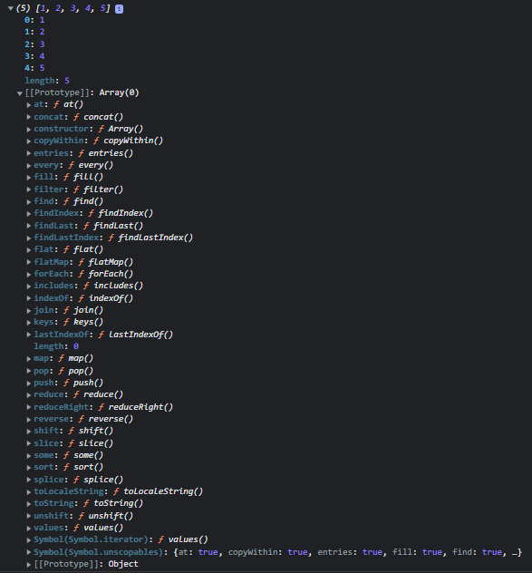

# {{ $frontmatter.title }}

A programación orientada a obxectos é un estilo de programación baseado en clases e obxectos. Estes agrupan datos (propiedades) e métodos (accións) dentro dunha caixa.

A POO foi desenvolvida para facer o código máis flexible e doado de manter.

JavaScript é unha linguaxe procedimental baseada en prototipos, o que significa que admite tanto programación funcional como orientada a obxectos.

# Que son as clases e os obxectos en JavaScript?

## Que é unha clase?

Podes pensar nunha clase como o plano dunha casa. Unha clase non é un obxecto do mundo real, pero podemos crear obxectos a partir dunha clase. É como un modelo para un obxecto.

Podemos crear clases usando a `class`palabra clave, que é unha palabra clave reservada en JavaScript. As clases poden ter as súas propias propiedades e métodos. Estudaremos como crear unha clase en detalle en breve. Esta é só unha visión xeral dun nivel básico dunha clase.

Vexamos un exemplo. A continuación móstrase un plano para unha casa (como unha clase).


*Plano de vivenda (clase)*

## Que é un obxecto?

Un obxecto é unha instancia dunha clase. Agora, coa axuda da clase casa podemos construír unha casa. Podemos construír varias casas coa axuda da mesma clase casa.

### Exemplo de clases e obxectos en acción

Vexamos un exemplo sinxelo para entender como funcionan as clases e os obxectos.

O exemplo de embaixo non ten nada que ver coa sintaxe de JavaScript. Só serve para explicar as clases e os obxectos. Estudaremos a sintaxe da POO en JavaScript nun intre.

Considere unha clase Estudante. A clase Estudante pode ter propiedades como nome, idade, estándar, etc., e funcións como estudar, xogar e facer os deberes.

```javascript
class Student{
 // Data (Properties)
 Name
 Age
 Standard

 // Methods (Action)
 study(){
 // Study
 }

 Play(){
 // Play
 }

 doHomeWork(){
 // Do Home Work
 }

}
```

Coa axuda da clase anterior, podemos ter varios estudantes ou instancias.

**Aquí tes información para** `**Student - 01**`**:**

```javascript
// Student 1
{
Name = "John"
Age = 15
Standard = 9

study(){
 // Study
 }

 Play(){
 // Play
 }

 doHomeWork(){
 // Do Home Work
 }

}
```

**Aquí tes información para** `**Student - 02**`**:**

```javascript
// Student 2
{
Name = "Gorge"
Age = 18
Standard = 12

study(){
 // Study
 }

 Play(){
 // Play
 }

 doHomeWork(){
 // Do Home Work
 }

}
```

# Como deseñamos realmente unha clase?

Non hai unha resposta perfecta a esta pregunta. Pero podemos obter axuda dalgúns principios de POO ao deseñar as nosas clases.

Hai 4 principios básicos na POO, e son:

- Abstracción
- Encapsulación
- Herdanza
- Polimorfismo

Afondaremos nestes conceptos de JavaScript a continuación. Pero primeiro, imos obter unha visión xeral destes conceptos para comprendelos mellor.

## Que significa abstracción en POO?

A abstracción significa ocultar certos detalles que non lle importan ao usuario e mostrar só as características ou funcións esenciais.

Por exemplo, tomemos un teléfono móbil. Non mostramos detalles como `verifyTemperature()`, `verifyVolt()`, `frontCamOn()`, `frontCamOff()`etc. En vez diso, proporcionamos funcións esenciais que son importantes para o usuario, como camera(), volumeBtn() e outras.

## Que significa encapsulación en POO?

A encapsulación significa manter as propiedades e os métodos privados dentro dunha clase, de xeito que non sexan accesibles desde fóra desa clase.

Isto evitará que o código que está fóra da clase manipule accidentalmente métodos e propiedades internas.

## Que significa herdanza en POO?

A herdanza pon todas as propiedades e métodos á disposición dunha clase filla. Isto permítenos reutilizar a lóxica común e modelar relacións do mundo real. Falaremos da herdanza nunha sección posterior deste artigo con exemplos prácticos.

## Que significa polimorfismo en POO?

O polimorfismo significa ter moitas e diferentes formas. Podemos sobrescribir un método herdado dunha clase nai.

```javascript
// Not actual JavaScript syntax
class User{
email 
password

login(providedPassword){
    // Login User
}

checkMessage(){
// Check any new message
}
}
// Not actual JavaScript syntax
class Admin inherit user{
email // Inherited Property
password // Inherited Property
permissions // Own Property

// Inherited Method
login(providedPassword){
    // Different Login User
}

// Inherited Method
checkMessage(){
// Check any new message
}

// Own Method
checkStats(){
// Check Stats
}
}
```

O método de inicio de sesión en Admin é diferente da clase herdada `user`.

# Programación orientada a obxectos en JavaScript

Xa falamos dos conceptos básicos da POO. Mais a POO en JavaScript é un pouco diferente. Temos un obxecto vinculado a un prototipo. Os prototipos conteñen todos os métodos e estes métodos son accesibles para todos os obxectos vinculados a este prototipo. Isto chámase **herdanza prototipal** (ou **delegación prototipal** ).

## Que é a herdanza prototípica en JavaScript?

É probable que xa empregases a herdanza prototipal sen sabelo; por exemplo, se empregaches métodos en matrices como `push()`, `pop()`, `map()`, etc. (que están dispoñibles en todas as matrices).

Se imos á [documentación oficial,](https://developer.mozilla.org/en-US/docs/Web/JavaScript/Reference/Global_Objects/Array/map) veremos `Array.prototype.map()` porque `Array.prototype` é un prototipo de todos os obxectos de matriz que creamos en JavaScript. Este é un exemplo de herdanza prototípica que imos aprender a implementar.

Do mesmo xeito que con `Array.prototype`, crearemos os nosos propios prototipos e isto axudarache a comprender JavaScript de dentro a fóra.



*Prototipo dunha matriz*

## Como implementar a herdanza prototipal en JavaScript

Hai tres xeitos principais de implementar a herdanza prototipal en JavaScript:

### Usando funcións de construtor

Podemos crear obxectos a partir dunha función. Coa axuda dunha función construtora, impleméntanse obxectos integrados como matrices, conxuntos e outros.

En JavaScript, un construtor chámase cando se crea un obxecto usando a palabra clave `new`. O propósito dun construtor é crear un novo obxecto e establecer os seus valores para calquera propiedade do obxecto existente.

### Usando as clases ES6

As clases son unha alternativa á sintaxe da función do construtor para implementar a herdanza prototípica. Tamén chamamos clases `syntactic sugar` - azucre sintáctico-.

Entre bastidores, as clases funcionan exactamente igual que as funcións de construtor. Antes de ES6, JavaScript non tiña conceptos de clases. Para simular unha clase, adoita empregarse o [construtor ou o patrón prototipo](https://www.javascripttutorial.net/javascript-constructor-prototype/) .

### Usando Object.create()

Esta é a maneira máis sinxela de vincular un obxecto a un obxecto prototipo. É un método que se emprega para crear un novo obxecto co obxecto prototipo e as propiedades especificadas.

O método `object.create()` devolve un novo obxecto co prototipo de obxecto e as propiedades especificadas.

Vexámolos agora con máis detalle:

## Como implementar a herdanza prototípica con funcións de construtor en JS

Empregaremos unha función para crear unha herdanza prototípica. Comezaremos implementando unha expresión de función de usuario. Lembra que o nome dunha función de construtor debe comezar sempre con maiúscula (convención estándar).

```javascript
function User(name){
    this.name = name;

    // never create function inside constructor function
    this.printName = function(){
        console.log(this.name);
    }

    console.log(this);
}


let kedar = new User("kedar")
```

**Saída**


*Prototipo usando unha función construtora*

Creamos unha función construtora no exemplo anterior. Pero cal é a palabra clave `new`? Coa axuda da palabra clave `new` podemos crear unha instancia dese construtor.

Cando creamos unha instancia do obxecto construtor, créase un obxecto baleiro (`{}`). Este obxecto baleiro (`{}`) vínculase entón ao prototipo.

Nunca deberiamos crear unha función dentro dunha función construtora. Porque cada vez que se crea unha instancia, créase unha nova función con ela que creamos dentro da función construtora. Isto creará problemas importantes para o rendemento.

A solución a este problema son os prototipos. Podemos definir unha función directamente sobre o prototipo dun obxecto. Así, o obxecto creado usando esa función construtora terá acceso a esa función.

**Exemplo:**

```javascript
function User(name){
    this.name = name;

    console.log(this);
}

User.prototype.printName = function(){
    console.log(this.name)
}


let kedar = new User("kedar")
```


*Prototipo usando unha función construtora*

Na saída anterior, podes ver o método `printName()` no prototipo da función construtora de usuario. Esta é a forma preferida de crear unha función nunha función construtora para optimizar o rendemento.

Entón, agora todos os obxectos creados por esta función de construtor terán acceso á función printName().

Podemos acceder a estas funcións con objectName.functionName() deste xeito:

```javascript
function User(name){
    this.name = name;

    console.log(this);
}

User.prototype.printName = function(){
    console.log(this.name)
}

let kedar = new User("kedar")
kedar.printName()
```

Podemos acceder ao prototipo da función construtora coa seguinte sintaxe:

```javascript
console.log(User.__proto__)
```

O prototipo do obxecto é o mesmo que o prototipo da función construtora. Mira isto:

```javascript
console.log(kedar.__proto__ === User.prototype) 
// True

console.log(User.prototype.isPrototypeOf(kedar))
// True
```

O prototipo de Usuario é o prototipo empregado polo seu obxecto e non pertence a Usuario.

```javascript
console.log(User.prototype.isPrototypeOf(User))
// False
```

Tamén podemos vincular unha variable ao prototipo:

```javascript
User.prototype.species = "Homo Sapiens"
```

Agora esta variable pertence ao prototipo e non ao obxecto. Podemos comprobalo usando `hasOwnProperty()`.

### Herdanza prototípica de obxectos incorporados

Temos moitos métodos dispoñibles para usar en matrices. Como funciona isto?

A resposta é a herdanza prototípica. Cando creamos unha nova matriz, cada vez que a creamos herda de `Array.prototype`. Así é como temos acceso a todos eses métodos diferentes.

```javascript
const arr = [1,2,3,4,5]
console.log(arr)
```


*Prototipo dunha matriz*

Tamén podemos anexar o noso propio método a `Array.prototype` para que cada vez que creemos unha nova matriz teñamos acceso a ese método.

```javascript
const arr = [1,2,4,4,5,5]

Array.prototype.unique = function(){
    return [...new Set(this)]
}

console.log(arr.unique());
```


*Prototipo dun array cun método `unique()` personalizado engadido ao prototipo.*

## Como implementar a herdanza prototípica con clases ES6 en JavaScript

Podemos implementar a POO usando clases, pero entre bastidores usa herdanza prototípica. Este método foi introducido para que tivese sentido para a xente que vén doutras linguaxes como C++ e Java.

Implementaremos as clases de usuario do exemplo anterior:

```javascript
// Class Expression
class User = class{

}

// Class Declaration
class User{

}
```

No exemplo anterior, podemos ver que hai 2 xeitos de implementar unha clase en JavaScript. Podes escoller calquera deles segundo as túas preferencias.

Dentro da clase, o primeiro que temos que facer é engadir un método construtor. O construtor tamén pode aceptar argumentos.

```javascript
class User{
    constructor(name){
        this.name = name
    }

    printName(){
        console.log(this.name);
    }
}

const kedar = new User("kedar")
```


*Prototipo usando a clase ES6*

Lembra que sempre que creamos un obxecto dunha clase, primeiro invócase un construtor. Se non hai ningún construtor, invócase o construtor predeterminado, que non fai nada.

### 3 cousas para lembrar sobre as clases

- As clases non se elevan (se non sabes o que é elevar, [le esta guía](https://www.freecodecamp.org/news/javascript-execution-context-and-hoisting/) )
- As clases son cidadáns de primeira clase (se unha linguaxe de programación ten a capacidade de pasar unha función como argumento, é dicir, tratar as funcións como valores e devolver funcións, dise que a linguaxe ten funcións de primeira clase e esas funcións chámanse cidadáns de primeira clase)
- As clases execútanse en modo estrito. (Se non sabes o que é o modo estrito, [le esta guía](https://developer.mozilla.org/en-US/docs/Web/JavaScript/Reference/Strict_mode) )

### Que son os setters e os getters?

Estes son métodos sinxelos de clases que obteñen e definen un valor. Pero desde fóra parecen métodos sinxelos. Vexamos o exemplo seguinte.

```javascript
class User{
    constructor(name){
        this._name = name
    }

    get getName(){
        console.log(this._name)
    }

    set setName(newName){
        this._name = newName
    }
}

const kedar = new User("kedar")
kedar.setName = "John"
kedar.getName
```

No exemplo anterior, podes ver como o getter `getName`rexistra un nome. Os setters úsanse para definir o valor dunha propiedade existente. Ao definir un nome usando o setter, temos que usar (_) antes do nome da propiedade como convención.

### Como usar métodos estáticos

Os métodos estáticos están vinculados a unha clase e non ás instancias da clase ou ao obxecto da clase. Podemos acceder a métodos estáticos só a través das clases e non a través do obxecto desa clase.

```javascript
class User{
    constructor(name){
        this._name = name
    }

    static anonymous(){
        console.log("anonymous");
    }
}

const kedar = new User("kedar")
kedar.anonymous() // error
User.anonymous() // "anonymous"
```

Podemos crear métodos estáticos directamente dentro das clases usando a palabra clave static antes do nome do método. No exemplo anterior, observa que só podemos chamar o método static nunha clase e non nun obxecto de clase.

Hai outra forma de implementar un método estático:

```c
class User{
    constructor(name){
        this._name = name
    }
}

User.anonymous = function(){
    console.log("anonymous");
}

const kedar = new User("kedar")
kedar.anonymous() // error
User.anonymous() // "anonymous"
```

## Como implementar a herdanza prototípica con Object.create() en JavaScript

[O `Object.create()`método estático crea un novo obxecto, usando un obxecto existente como prototipo do obxecto recentemente creado.](https://developer.mozilla.org/en-US/docs/Web/JavaScript/Reference/Global_Objects/Object/create)

```javascript
const User = {
    init(name){
        this.name = name
    },

    printName(){
        console.log(this.name);
    }
}

let kedar = Object.create(User)
kedar.init("kedar")
kedar.printName()
```

O obxecto recentemente creado herdará todas as propiedades do obxecto prototipo. Podes especificar un segundo parámetro para engadir novas propiedades ao obxecto que o prototipo carecía:

```javascript
const newObject = Object.create(prototype, newProperties)
const User = {

    printName(){
        console.log(this.name);
    }
}

let properties = {
    name: {
        value:"John"
    }

}

let John = Object.create(User,properties)
John.printName()
```

## Como funciona a herdanza en JavaScript

A herdanza permíteche definir unha clase/obxecto que toma toda a funcionalidade dunha clase/obxecto pai e che permite engadir máis. Mediante a herdanza de clases, unha clase/obxecto pode herdar todos os métodos e propiedades doutra clase. É unha característica útil que permite a reutilización do código.

Agora botaremos unha ollada á herdanza na función construtora, nas clases ES6 e en `Object.create()`.

### Función do construtor

Entendamos a herdanza de funcións de construtor cun exemplo. Se non sabes como funciona a herdanza a alto nivel, consulta a sección onde tratamos "Como deseñamos realmente unha clase".

**Exemplo:**

```javascript
const User = function(name, password){

    this.name = name
    this.password = password
}

User.prototype.printName = function(){
    console.log(this.name);
}

const Admin = function(name, password){
    this.name = name
    this.password = password
}

Admin.prototype.Stats = function(){
    console.log("Stats");
}

const kedar = new Admin("kedar", 12345)
kedar.Stats()
```

No código anterior, temos 2 funcións de construtor, e teñen algunhas semellanzas. Aínda así, escribímolo dúas veces, o que viola o principio DRY (Don't Repeat Yourself - Non te repitas). Para evitar repetir o mesmo código, usamos herdanza.

```javascript
const User = function(name, password){

    this.name = name
    this.password = password
}

User.prototype.printName = function(){
    console.log(this.name);
}

const Admin = function(name, password, course){
    User.call(this, name, password)
    this.course = course
}

Admin.prototype = Object.create(User.prototype)

Admin.prototype.Stats = function(){
    console.log("Stats");
}

const kedar = new Admin("kedar", 12345, "JavaScript")
kedar.printName()
```

No código anterior, primeiro na función Admin (fillo) asociamos `this` a User (pai) e chamámola con parámetros. Unha vez feito isto, puidemos acceder aos campos de nome e contrasinal. Pero non puidemos acceder aos métodos da función pai porque necesitamos conectar o prototipo de User e Admin.

Para iso, xusto despois da función filla, apuntamos o prototipo de administrador ao prototipo de usuario, o que nos deu acceso aos métodos da función nai (usuario).

Asegúrate de apuntar o prototipo fillo (Admin) á función pai (Usuario) inmediatamente despois da función filla (Admin). Porque devolve un obxecto baleiro e elimina todos os métodos da función filla (Admin). Polo tanto, crea sempre métodos da función filla (Admin) despois de apuntar o prototipo fillo (Admin) ao prototipo pai (Usuario).

Agora vexamos como queda a nosa cadea prototipo:


*Herdanza de prototipos usando funcións de construtor*

Na parte inferior hai un prototipo de Obxecto. Despois diso podemos ver un prototipo de Usuario e na parte superior vemos un prototipo de Administrador.

### ES6

É moi sinxelo implementar a herdanza usando a sintaxe de ES6. Pero lembra que ES6 usa funcións de construtor para implementar a herdanza entre bastidores.

```javascript
class User{
    constructor(name, password){
        this.name = name
        this.password  =password
    }

    printName(){
        console.log(this.name);
    }
}

class Admin extends User{
    constructor(name, password, course){
        super(name, password)
        this.course = course
    }

    Stats(){
        console.log("Stats");
    }
}

const kedar = new Admin("kedar", 123456, "JavaScript")
kedar.printName()
```

Entón temos 2 clases, Usuario e Administrador. Cando queremos herdar, simplemente engadimos `extends`a clase da que queremos herdar diante da clase filla, de xeito similar á sintaxe que se mostra no código anterior.

Cando rematamos con iso, no construtor da clase filla, chamamos ao `super()`método para pasar un argumento á clase nai que sexa obrigatorio. Así é como podemos implementar a herdanza en JavaScript usando a sintaxe ES6.

Tamén podemos implementar `override`o método pai implementando un método co mesmo nome na clase filla.

```javascript
class User{
    constructor(name, password){
        this.name = name
        this.password  =password
    }

    printName(){
        console.log(this.name);
    }
}

class Admin extends User{
    constructor(name, password, course){
        super(name, password)
        this.course = course
    }

    Stats(){
        console.log("Stats");
    }

    printName(){
        console.log("Child class " + this.name)
    }
}

const kedar = new Admin("kedar", 123456, "JavaScript")
kedar.printName()
```

### Obxecto.crear()

Implementar a herdanza en Object.create() é sinxelo. Consulta o código seguinte:

```javascript
const User = {
    printName(){
        console.log(this.name);
    },

    init(name, password){
        this.name = name
        this.password = password
    }
}

const Admin = Object.create(User)
Admin.init = function(name, password, course){
    User.init.call(this, name, password)
    this.course = course
}

Admin.stats = function(){
    console.log("Stats");
}

const kedar = Object.create(Admin)
kedar.init("kedar", 123456)
kedar.printName()
kedar.stats()
```


*Herdanza de prototipos usando Object.create()*

Primeiro, creamos unha función Usuario. Despois creamos un Admin que apuntaba a Usuario coa axuda de `Object.create()`. Coa axuda do método `Admin.init()`, chamamos ao método `init()` de Usuario e pasamos valores á función nai.

## Como funciona a encapsulación en JavaScript

Arriba, vimos o que significa encapsulación a un nivel moi amplo. Agora veremos un exemplo para explicalo con máis detalle.

A encapsulación pódese definir como *"o empaquetamento de datos e funcións nun compoñente".* Isto tamén se coñece como agrupación ou empaquetado e simplemente significa reunir datos e os métodos que operan sobre os datos. Pode ser unha función, unha clase ou un obxecto.

A encapsulación permite " *controlar o acceso a ese compoñente* ". Cando temos os datos e os métodos relacionados nunha soa unidade, podemos controlar como se accede a eles fóra da unidade. Este proceso chámase encapsulación.

### Propiedades protexidas

```javascript
class User{
    constructor(name, password){
        this._name = name
        this._password = password
    }
}

const kedar = new User("kedar", 123456)
console.log(kedar._password);
```

Un membro protexido é accesible dentro da clase e de calquera obxecto que herde dela. Un valor protexido compártese en todas as capas da cadea de prototipos.

Usamos (_) en `this._name`, que é unha propiedade protexida. Aínda podemos acceder a esta propiedade fóra da clase. Esta é só unha convención que usan os programadores.

Se sabemos que existe un (_) no nome dunha propiedade, non se supón que debamos manipular esa propiedade desde fóra da clase.

```javascript
class User{
    constructor(name, password){
        this._name = name
        this._password = password
    }

    get getName(){
        console.log(this._name)
    }
}

const kedar = new User("kedar", 123456)
kedar.getName
```

### Propiedades privadas

```javascript
class User{
    constructor(name, password){
        this.#name = name
        this._password = password
    }

    get getName(){
        console.log(this._name)
    }
}

const kedar = new User("kedar", 123456)
console.log(kedar.#name);
```

Para implementar unha propiedade verdadeiramente privada en JavaScript temos que usar (#) antes do nome da propiedade ou do método. Estas propiedades e métodos privados non serán accesibles desde fóra da clase, o que os fará verdadeiramente privados.

Isto axudará a restrinxir o acceso ás propiedades desde fóra da clase. Se queremos acceder a propiedades desde fóra, temos que usar o método make que só imprimirá as propiedades sen dar acceso para cambiar o valor desa propiedade.

```javascript
class User{
    #name

    constructor(name, password){
        this.#name = name
        this._password = password
    }

    #printName(){
        console.log(this.#name);
    }

    PrintFromPrivateMethod(){
        this.#printName()
    }
}

const kedar = new User("kedar", 123456)
kedar.PrintFromPrivateMethod()
```

----

